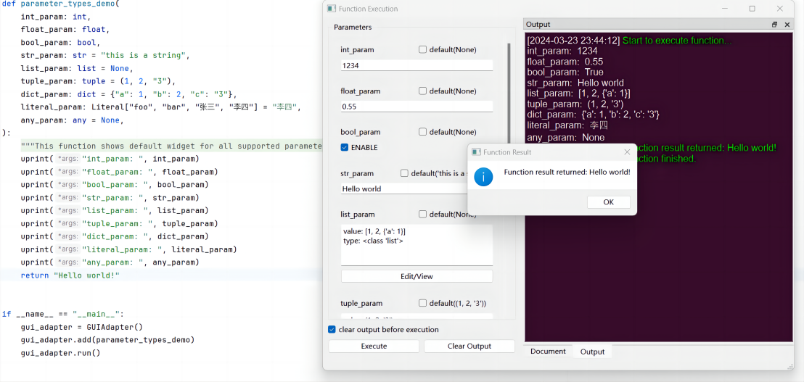
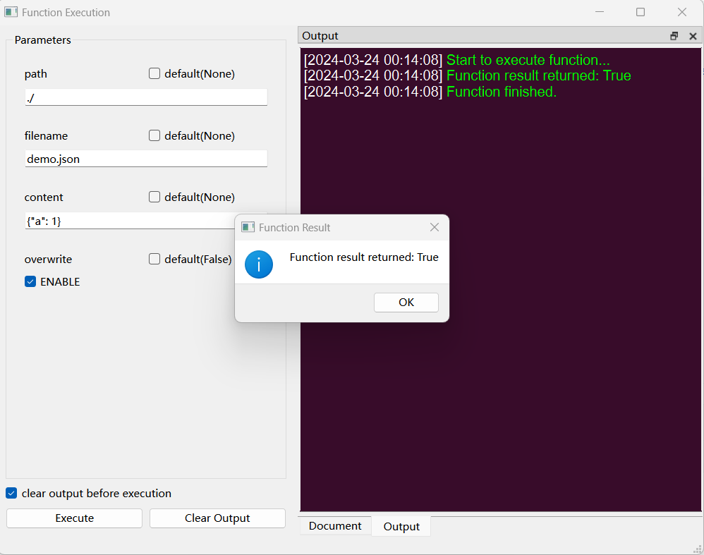

# PyGUIAdapter

---

### [中文](./README_zh.md) | English

A library that makes it easy to convert (almost) any Python functions into a GUI application.



A real world application using this library: [Simple-OTP](https://github.com/zimolab/simple-otp)

---

## 1. Quick Start

### 1.1 Installation

Using pip

```bash
pip install pyguiadapter
```

Using poetry

```bash
poetry add pyguiadapter
```

### 1.2 Simple Usage

Converting your python functions into a GUI application is very easy, 
requiring only a few lines of code.


(1) First of all, make sure your function is type annotated.

For example, you have the following function (just focus on how its parameters are defined):

```python
import os.path


def create_file(path: str, filename: str, content: str, overwrite: bool = False):
    path = os.path.join(path, filename)
    if not os.path.isfile(path) or overwrite:
        with open(path, "w", encoding="utf-8") as f:
            f.write(content)
            return True
    return False
```

(2) Create a GUIAdapter instance and add your function to it:

```python
from pyguiadapter.adapter.adapter import GUIAdapter

gui_adapter = GUIAdapter()
gui_adapter.add(create_file)
```

(3)  call `run()` method to start the GUI application

```python
gui_adapter.run()
```

Complete code looks like：

```python
import os.path


def create_file(path: str, filename: str, content: str, overwrite: bool = False):
    path = os.path.join(path, filename)
    if not os.path.isfile(path) or overwrite:
        with open(path, "w", encoding="utf-8") as f:
            f.write(content)
            return True
    return False


if __name__ == "__main__":
    from pyguiadapter.adapter.adapter import GUIAdapter

    gui_adapter = GUIAdapter()
    gui_adapter.add(create_file)
    gui_adapter.run()
```

The result of the above code looks like:：



In PyGUIAdapter, when a function is added to it, it will automatically analyze the function and create a corresponding 
GUI widget for each parameter of the function according to certain rules. In general, GUIAdapter will determine the type 
of the corresponding GUI widget according to the type of the parameter. For example, in the above `create_file()` 
function, the first three parameters are all string types, so the GUIAdapter creates single-line edit for them, and the 
last parameter is a Boolean type, so the GUIAdapter creates a checkbox for it.

Now, You have learned the basic usage of PyGUIAdapter. It should be noted that PyGUIAdapter is designed with great 
emphasis on flexibility and extensibility and many things can be customized. For example, you can customize the type of 
function parameter widget and its other attributes. You can also customize the icon, title, size, style of the window.
If the built-in parameter widget types don't meet your needs, you can make your own widget types and use them like the 
built-in ones.

---

## 2. Examples and documentation

To demonstrate the usage of PyGUIAdapter, I make some examples. These examples are very simple. Each example just focus 
one feature of PyGUIAdapter. These examples can help you better understand the usage of PyGUIAdapter.


### 2.1 Example Code

Find the examples here：[examples](./examples)

You can run the examples to see the effects.

### 2.2 Documentation

More documentation can be found here: [docs/](./docs)

At present, the document is still not completed. At this stage, please read the examples.

---

## 3. Supported parameter types and some restrictions

As mentioned at the beginning, PyGUIAdapter supports the translation of **Almost** any python functions into a GUI 
application, but there are some limitations.

### 3.1 Positional-Only Argument is unsupported

The parameter list of a function cannot contain a **Positional-Only Argument**.
 **Positional-Only Argument** is introduced in python 3.8 (PEP 570), which looks like this:

```python
def f(positional_argument, /, positional_or_keyword_argument, *, c):
    pass
```

Luckily, **Positional-Only Argument** is not that commonly used.

### 3.3  Built-in functions are not supported

Of course,  generating a GUI interface for a built-in function (for example, `open`) is not common. If you have to do so,
the solution is very simple, just write a function to encapsulate the built-in function.

### 3.4 Types of parameter are limited

Parameter types natively supported by PyGUIAdapter include: `int`, `float`, `bool`, `str`, `list` `tuple` `dict`.

PyGUIAdapter provides a rich set of GUI widgets for these types. For details, see the `function2widgets` library or the 
examples.

> function2widgets is the infrastructure of PyGUIAdapter. it is a separate library I made for the PyGUIAdapter that 
> provides all the built-in parameter widget types

Of course, if you have to support some more complex types, it can also be achieved, and it is not complicated. 

For example, if you need to support a type named `2DPoint`, you can do it through the following steps:

First, you need to create a parameter widget for the `2DPoint` type, such as a widget with two number input edits. 
For the specific implementation, you can refer to the built-in widgets.

Your widget may look like this:

```python
from function2widgets.widget import BaseParameterWidget

class Point2DInput(BaseParameterWidget):
    # implement the abstract methods
    ...

```

Next, you need to register the widget type you created(`Point2DInput`) to the parameter widget factory. 
The code might look like this:

```python
from pyguiadapter.commons import get_param_widget_factory

factory = get_param_widget_factory()
factory.register("Point2DInput", Point2DInput)
```

Finally, let PyGUIAdapter know which parameter should use `Point2DInput` as its widget, 
There are many ways to do this. Here is a brief introduction to one of them, that is, passing the `widget_configs` 
argument to the `add()` method. The code might look like this:

```python
gui_adapter.add(some_func, widget_configs={"position": {"type": "Point2DInput"}})
```

The PyGUIAdapter then creates `Point2DInput` for the parameter `position` .

---

## 4. What it is?

PyGUIAdapter is a library used to convert functions into GUI applications. Sometimes we need to deliver python programs 
to others. One simple way is to make a command line application. But it is undeniable that many times, we also have the 
need to create GUI application interfaces. After all, not everyone is good at command lines.

However, creating GUI applications is a time-consuming and cumbersome process, and for those who are not familiar with 
GUI development, they need to learn a GUI framework, which undoubtedly adds a lot of additional learning costs. 
PyGUIAdapter is designed to make GUI application development as simple as possible, it allows programmers to focus on 
core logic of the program rather than spent time on writing GUI code. When a function is implemented, it basically means 
that the GUI interface has been implemented. 

PyGUIAdapter makes GUI application development as easy as (even easier than) the development of a command-line program.

---

## 5. What does not PyGUIAdapter for?

PyGUIAdapter may not be suitable for scenarios that require complex interactions or where the interface has complex states.

## 6. Underlying

To implement PyGUIAdapter, I created the [function2widgets](https://github.com/zimolab/function2widgets). As its name implies, its core job is to extract 
information from a given function and then, based on certain rules, convert the information into GUI widgets. 

The function2widgets is based on PyQt6.


## 7. TODOS

At present, PyGUIAdapter has implemented most of the core functions. But because this project (and function2widgets) was 
only written in my spare time in a week, many aspects are not perfect , and you may find some bugs. 

Any issue or PR is welcomed.

Here are some features that are not implemented or not fully implemented:
1. i18n
2. More built-in parameter widgets (such as color widget, datetime widget, drag-and-drop widget, and so on)
3. More examples
4. Better documentation
5. More hookable events
6. Enhances access to underlying widgets and windows from user code
7. User-defined menu
8. Optimized layout
9. A stable API
10. ...

## 8. Precautions

As the PyGUIAdapter is still under development, the current API may change.

