# PyGUIAdapter

## 一、简介
pyguiadapter是一个基于qtpy的GUI库，它可以简单、快速地为几乎“任意”python函数创建基于PyQt5/PyQt6/PySide2/PySide6的图形用户界面。

借助pyguiadapter，为命令行程序适配图形用户界面的过程将变得无比简单。开发者只需专注于核心功能的实现，将需要对用户提供的功能封装为普通的python
函数，通过参数列表定义用户输入，然后将这个函数传递给pyguiadapter，pyguiadapter将自动为其生成合适的界面，并在背后处理一切有关GUI的细节。

如下图所示，为一个函数创建了一个GUI界面，并恰当地处理用户输入输出，也许仅仅只需要三行代码：


## 二、特性
* 使用简单，自动识别函数参数，自动生成输入控件，自动处理用户输入输出。
* 丰富的内置控件类型，涵盖几乎所有常见数据类型，包括：int, float, str, bool, list, dict, tuple, Any, Literal, datetime, date, time等。
同时，从内置类型中扩展了许多语义化类型， 如：file_t, directory_t, color_hex_t等，实现了对应的专属控件，方便用户选择文件、目录、颜色等特定对象。
* 高度的可扩展性，支持为复杂数据类型自定义控件类型。
* 高度的灵活性，窗口、控件提供了大量的可配置属性，可以自定义窗口、控件的外观和行为。
* 支持添加多个函数，提供函数选择界面，支持函数分组。
* 支持函数参数分组。
* 支持窗口菜单和工具栏
* 基于qtpy，用户可以自由选择qt的python绑定库，包括PyQt5/PyQt6/PySide2/PySide6

## 三、安装

1. 安装pyguiadapter库本身

```commandline
pip install pyguiadapter
```

2. 由于pyguiadapter并不依赖特定的Qt库，因此需要先选择一个qt的python绑定库，例如PyQt5、PyQt6、PySide2、PySide6等，以PySide2为例：

```commandline
pip install Pyside2
```

## 四、快速入门

### （一）基本使用

1. 准备一个函数，该函数封装了你要提供给用户的功能，其中需要从用户获取的输入，通过参数列表定义，参数的类型决定了控件的类型，因此需要给参数标志
合适的类型注解，假设我们有一个函数，用于将mp3文件编码为ogg文件，它接受3个参数，一个输入文件路径，一个输出文件路径，一个编码质量参数， 那么可以
这样编写这个函数的签名（这里省略该功能的实现，因为这仅仅是一个演示，我们讨论的是如何使用pyguiadapter）：

```python

def encode_mp3(input_file: str, output_dir: str, output_file: str, quality: int):
    pass
```

2. 导入pyguiadapter库，创建GUIAdapter对象，将函数添加到GUIAdapter对象中，并调用run()方法以启动GUI
```python
from pyguiadapter.adapter import GUIAdapter


if __name__ == '__main__':
    adapter = GUIAdapter()
    adapter.add(encode_mp3)
    adapter.run()
```

3. 运行程序，你将看到一个窗口，通过界面输入参数，点击“Execute”按钮即可调用encode_mp3()函数：

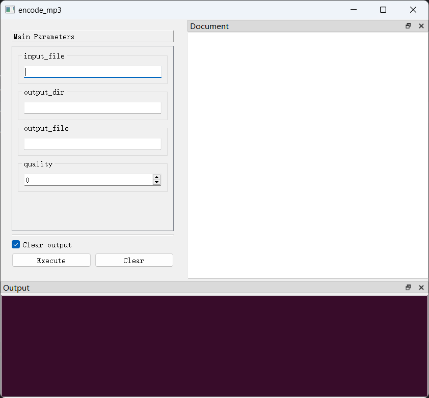

该示例的完整代码如下，你也可以在此处找到：[get_started.py](examples/get_started_1.py)

```python
from pyguiadapter.adapter import GUIAdapter


def encode_mp3(input_file: str, output_dir: str, output_file: str, quality: int):
    pass


if __name__ == "__main__":
    adapter = GUIAdapter()
    adapter.add(encode_mp3)
    adapter.run()
```

### （二）增强用户体验：PyGUIAdapter的进阶用法

#### 1. 使用语义化类型

在上面的示例中，参数`input_file`, `output_dir`, `output_file`的类型均被标注为`str`。对于`str`类型的参数，PyGUIAdapter默认会生成一个
单行文本输入框。虽然这不产生什么根本性的错误，但从语义上看，`input_file`应当代表的是一个文件路径，`output_dir`表示的是一个目录路径，而`output_file`
则代表一个文件名，将这些含义各不相同的统一定义为`str`语义上是不精确的，而且适用于输入通用字符串的单行文本输入框对于输入文件路径、目录路径而言，
并不能为用户带来使用上的便利。考虑到这一点，PyGUIAdapter从一些基本类型扩展出一些更加语义化的类型，并为这些类型实现了更加特定化的控件类型，例如：
针对文件路径，从str扩展了`file_t`，并为其实现文件选择控件；针对目录路径，从str扩展了`directory_t`类型，并实现对应的目录选择控件。一般而言，
使用这些语义化类型，可以大大增强用户体验。

现在，让我们使用这些类型对上面的示例进行一些修改：

首先，导入这些类型，一般而言，这些类型定义在[`pyguiadapter.types`](pyguiadapter/types.py)模块中：

```python
from pyguiadapter.types import file_t, directory_t
```

接着，修改函数签名，使用这些类型标注对应的参数：
```python
def encode_mp3(input_file: file_t, output_dir: directory_t, output_file: str, quality: int):
    pass
```

完整的代码如下，也可以在[这里](examples/get_started_2.py)找到：
```python

from pyguiadapter.adapter import GUIAdapter
from pyguiadapter.types import file_t, directory_t

def encode_mp3(input_file: file_t, output_dir: directory_t, output_file: str, quality: int):
    pass

if __name__ == "__main__":
    adapter = GUIAdapter()
    adapter.add(encode_mp3)
    adapter.run()
```

让我们再次运行程序：

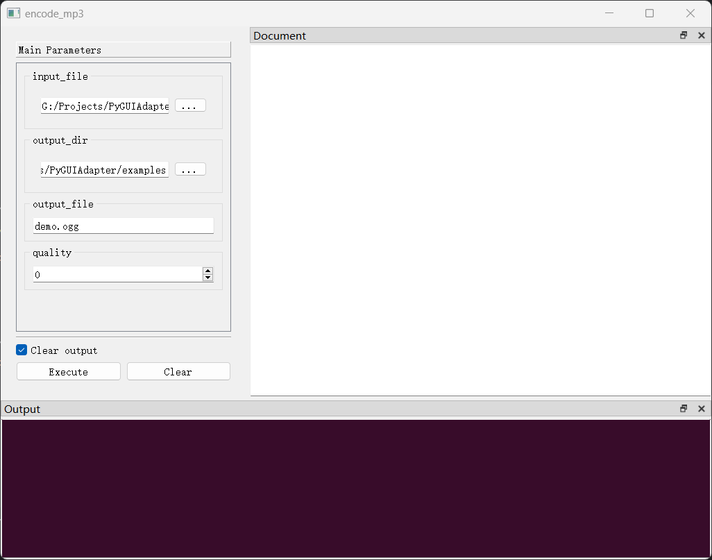

可以看到，参数`input_file`和`output_dir`的控件已经从单行文本输入框变成了文件选择控件（[FileSelect](pyguiadapter/widgets/path/fileselect.py)）
和目录选择控件([DirSelect](pyguiadapter/widgets/path/dirselect.py))。

现在，用户可以通过点击右侧按钮来选择文件和目录，仅仅是改变了参数的类型标注，用户体验就得到了很大的提升。

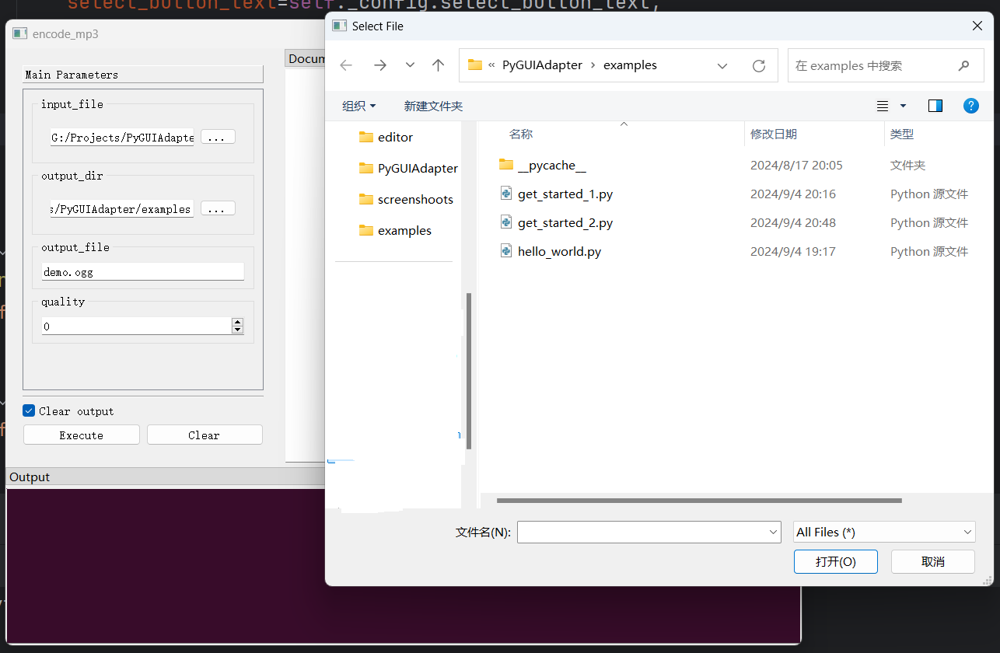

#### 扩展：更多语义化类型
除了`file_t`、`directory_t`，PyGUIAdapter还提供了其他语义化类型，可以查看[`pyguiadapter.types`](pyguiadapter/types.py)模块，获取
这些类型的信息。你也可以自行尝试用这些类型对参数进行标注，然后运行程序，观察不同类型所对应的控件有何不同。 

当然，也可以查看[docs/semantic_types.md](docs/semantic_types.md)，其中，对一些常见的语义化类型做了说明。

### 2. 配置控件属性

一般来说，PyGUIAdapter会根据参数类型自动选择合适的控件，但有时，我们可能希望对生成的控件进行一些配置，以更加精确的控制控件的外观和行为，
比如，我们可能希望改变控件上的文字，添加一些提示信息，或者是限制输入的值的范围。考虑到这一点，PyGUIAdapter提供了一些机制，让我们可以在生成控件前
对控件属性进行配置。

在PyGUIAdapter中，控件的属性由其对应的控件配置类定义，比如对于`int`类型，其默认控件类型为[`IntSpinBox`](pyguiadapter/widgets/basic/intspin.py)，
该类型的控件所具有的属性由其配置类[`IntSpinBoxConfig`](pyguiadapter/widgets/basic/intspin.py)定义：

```python
@dataclasses.dataclass(frozen=True)
class IntSpinBoxConfig(CommonParameterWidgetConfig):
    default_value: int = 0
    min_value: int = -2147483648
    max_value: int = 2147483647
    step: int = 1
    prefix: str = ""
    suffix: str = ""
    display_integer_base: int = 10
```

其他控件也类似，例如，对于[`FloatSpinBox`](pyguiadapter/widgets/basic/floatspin.py)， 其配置类为
[`FloatSpinBoxConfig`](pyguiadapter/widgets/basic/floatspin.py)；[`IntLineEdit`](pyguiadapter/widgets/basic/intedit.py)
的配置类为[`IntLineEditConfig`](pyguiadapter/widgets/basic/intedit.py)......凡此种种，不一一而足。

所有的配置类都应继承自[`BaseParameterWidgetConfig`](pyguiadapter/paramwidget.py)基类，因此所有控件都有以下可配置属性：

```python
DEFAULT_VALUE_DESCRIPTION = "use default value: {}"

@dataclasses.dataclass(frozen=True)
class BaseParameterWidgetConfig(object):
    default_value: Any = None
    group: str | None = None
    label: str | None = None
    description: str | None = None
    default_value_description: str | None = DEFAULT_VALUE_DESCRIPTION
    stylesheet: str | None = None
```

有因为，所有的内置控件都继承自[`CommonParameterWidgetConfig`](pyguiadapter/widgets/common.py)(CommonParameterWidgetConfig是
BaseParameterWidgetConfig)，因此所有内置控件还有以下来自CommonParameterWidgetConfig的属性：

```python
@dataclasses.dataclass(frozen=True)
class CommonParameterWidgetConfig(BaseParameterWidgetConfig):
    set_default_value_on_init: bool = True
    hide_default_value_checkbox: bool = True
```

除了上述公共的属性，不同控件类型还在其配置类中定义了一些独有的属性，对于内置控件配置类定义的属性及其作用，可以查看这篇文档：
[控件及其配置类](docs/widget_config_classes.md)。

现在，我们不必了解每一个属性的作用，我们先来学习一下如何配置这些属性，以及它们是如何影响控件的外观及行为的。

#### 2.1 在文档字符串（docstring）中配置控件属性

PyGUIAdapter充分利用了函数的文档字符串。函数文档字符串中`@params`与`@end`之间的文本块，被用于定义控件的属性。、

还是拿最初的例子进行说明，假设现在我们想要改变`input_file`的控件的标签，并为其添加一些说明文字，那么，我们可以这样做：

```python
def encode_mp3(
    input_file: file_t, output_dir: directory_t, output_file: str, quality: int
):
    """
    @params
    [input_file]
    label = "Input MP3 File"
    description = "select the path of the mp3 file you want to encode."

    @end
    """
```

运行程序，我们发现`input_file`的控件发生了如下的变化：


> 你也许已经注意到，`label`和`description`属性均来自`BaseParameterWidgetConfig`基类，上面的示例说明了基类中定义的这些属性是如何影响控件的。
>
> 特别地，如果不显式地指定`label`属性的值，那么，PyGUIAdapter会自动将参数名称作为控件的标签。
> 

`input_file`控件的类型为[`FileSelect`](pyguiadapter/widgets/path/fileselect.py)，我们可以查看其配置类
[`FileSelectConfihg`](pyguiadapter/widgets/path/fileselect.py)获取其他可定义的属性，
比如，让我们将文件对话框的标题（`dialog_title`）修改为“Select MP3 File”，并将可选的文件类型限制为MP3文件（通过`filters`属性）：

```python
def encode_mp3(
    input_file: file_t, output_dir: directory_t, output_file: str, quality: int
):
    """
    @params
    [input_file]
    label = "Input MP3 File"
    description = "select the path of the mp3 file you want to encode."
    dialog_title = "Select MP3 File"
    filters = "MP3 Files(*.mp3)"

    @end
    """
```

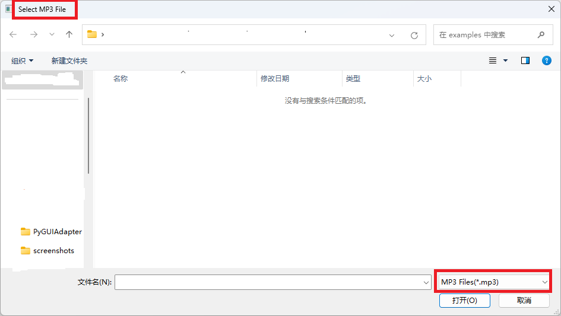

> 如果想要知道一个控件有哪些可配置属性，最快的方法就是查看其所对应的配置类的源码。
> 
> 控件的配置类一般与控件定义在同一个文件中， 你可以在[(pyguiadapter/widgets/](pyguiadapter/widgets)目录下找到所有内置控件及配置类。

让我们按照上述方法，进一步完善示例代码：

```python
from pyguiadapter.adapter import GUIAdapter
from pyguiadapter.types import file_t, directory_t


def encode_mp3(
    input_file: file_t, output_dir: directory_t, output_file: str, quality: int
):
    """
    @params
    [input_file]
    label = "Input MP3 File"
    description = "select the path of the mp3 file you want to encode."
    placeholder = "No input file"
    dialog_title = "Select MP3 File"
    filters = "MP3 Files(*.mp3)"

    [output_dir]
    label = "Output File Directory"
    description = "select the directory of the output file"
    placeholder = "Output directory not specified"
    dialog_title = "Select Output Directory"

    [output_file]
    label = "Output Filename"
    description = "The filename of output file, <b>must endswith .ogg</b>"
    placeholder = "No output filename"

    [quality]
    label = "Encoding Quality"
    default_value = 80
    description = "from 10 to 100, <font color='red'>higher value, better quality, but requires more time to encode</font>"
    min_value = 10
    max_value = 100
    step = 1
    suffix = " %"
    @end
    """
    pass


if __name__ == "__main__":
    adapter = GUIAdapter()
    adapter.add(encode_mp3)
    adapter.run()
```

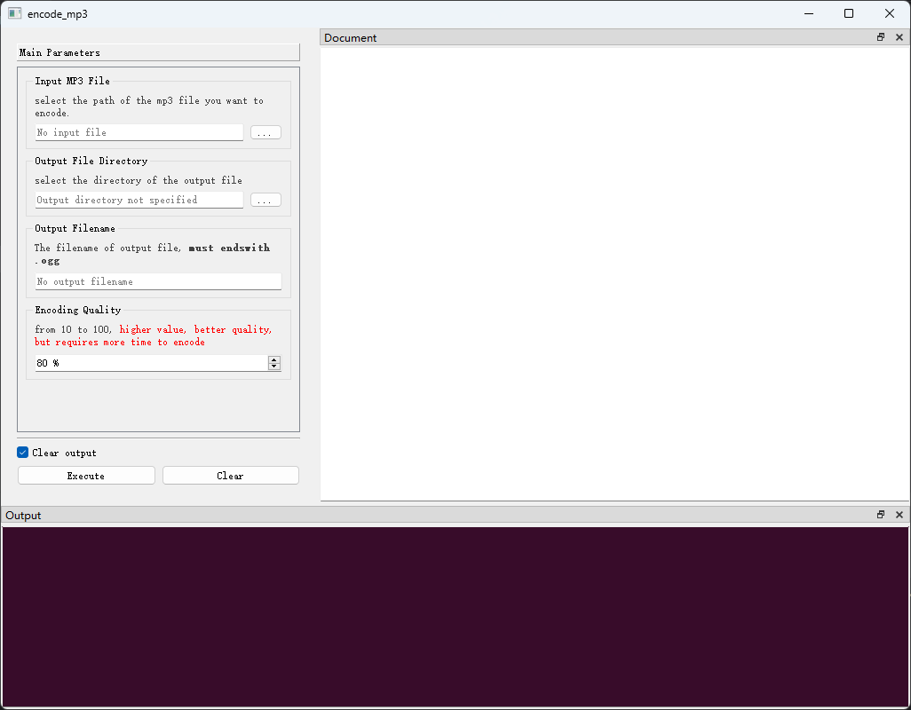

##### 一些说明

（1）关于`description`属性：

除了可以在@params...@end块中定义控件的`description`，PyGUIAdapter还支持从`ReST`、`Google`、`Numpydoc-style`以及`Epydoc`风格的文档中
读取参数的说明文字，并将其作为`description`的值，比如：

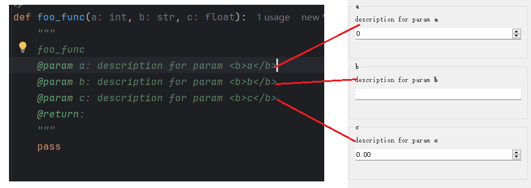


（2）关于`default_value`属性

`default_value`属性除了可以在@params...@end块中定义，PyGUIAdapter还支持直接从函数的签名中获取参数的默认值，比如：

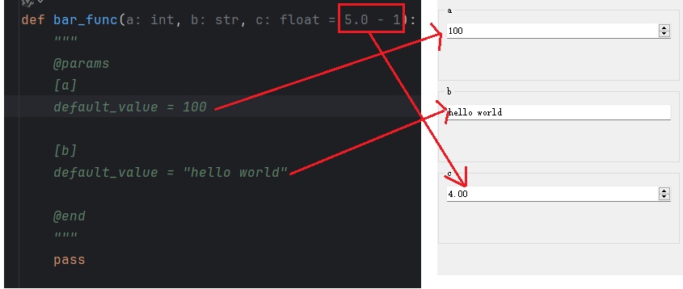

在上面的代码中，参数`a`、`b`的默认值在@params...@end块中定义，而参数`c`的默认值则直接在函数参数列表中定义。


#### 2.2 通过add()函数配置控件属性

除了在文档字符串中配置控件属性，我们还可以通过向`add()`函数传入`widget_configs`来对参数的控件进行配置，比如：

```python
from pyguiadapter.adapter import GUIAdapter
from pyguiadapter.types import file_t, directory_t
from pyguiadapter.widgets import (
    FileSelectConfig,
    DirSelectConfig,
    LineEditConfig,
    IntSpinBoxConfig,
)


def encode_mp3(
    input_file: file_t, output_dir: directory_t, output_file: str, quality: int
):
    """
    encode_mp3
    @param input_file: select the path of the mp3 file you want to encode.
    @param output_dir: select the directory of the output file
    @param output_file: The filename of output file, <b>must endswith .ogg</b>
    @param quality: from 10 to 100, <font color='red'>higher value, better quality, but requires more time to encode</font>
    @return:
    """
    pass


if __name__ == "__main__":

    adapter = GUIAdapter()
    adapter.add(
        encode_mp3,
        widget_configs={
            "input_file": FileSelectConfig(
                label="Input MP3 File",
                placeholder="No input file",
                dialog_title="Select MP3 File",
                filters="MP3 Files(*.mp3)",
            ),
            "output_dir": DirSelectConfig(
                label="Output File Directory",
                placeholder="Output directory not specified",
                dialog_title="Select Output Directory",
            ),
            "output_file": LineEditConfig(
                label="Output Filename", placeholder="No output filename"
            ),
            "quality": IntSpinBoxConfig(
                label="Encoding Quality",
                default_value=80,
                min_value=10,
                max_value=100,
                step=1,
                suffix=" %",
            ),
        },
    )
    adapter.run()
```

在上面这个例子中，除了参数的`description`，其他属性都是通过`add()`函数的`widget_configs`，它的效果与之前的示例一样：

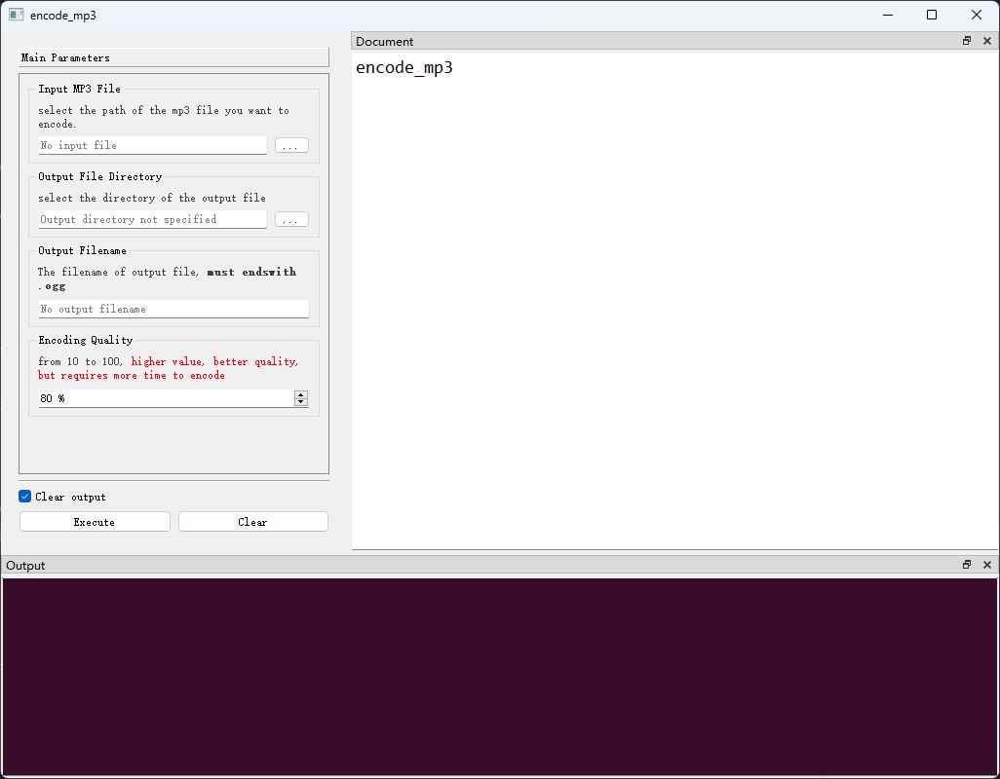

> 有了@params...@end，为什么还要实现另外一种配置参数控件属性的机制？这个问题大概基于以下几点考虑：
> 1. @params...@end之间的文本块本质上是一个TOML格式的字符串，因此其允许的属性的值的类型是受限制的，而PyGUIAdapter并不要求控件配置类中定义的属性
>的值是简单类型，开发者完全可以使用复杂的自定义类型作为控件的配置属性，在这种情况下，就无法在@params...@end块中配置这些属性了，因此，我们需要一种
>更加灵活的方式。当然，@params...@end适用绝大多数情形。
> 2. @params...@end中配置的属性是静态的，无法在运行时针对不同的情形进行调整，而在某些情况下，开发者可能需要根据不同的情况，动态配置控件的属性，
>其中一个最常见的例子就是实现i18n。
> 3. 防止文档字符串过度膨胀的需要。比如，当一个函数的参数比较多时， @params...@end的内容可能会非常长，而有些开发者可能希望保持函数代码的简洁，
>不希望文档字符串的部分占据太多空间。

### 3. 配置窗口属性

除了可以对参数的控件的属性进行配置，PyGUIAdapter还允许开发者对窗口本身进行调整，包括调整窗口的标题、图标、大小、字体尺寸、界面上的文字等等。

具体的方法是向`add()`函数传入一个[FnExecuteWindowConfig](pyguiadapter/windows/fnexec/_window.py)对象。

> 在[FnExecuteWindowConfig](pyguiadapter/windows/fnexec/_window.py)中，有非常多的配置选项，可以尝试调整这些选项，并观察其所产生的效果。

#### 3.1 调整窗口标题

函数执行界面的窗口标题默认为函数的名称，可以通过以下配置项进行调整：

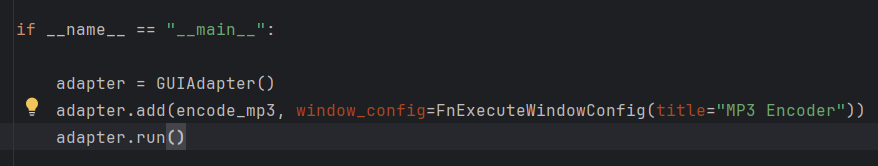

效果如下：

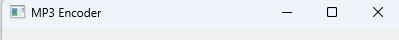

#### 3.2 调整窗口图标

> PyGUIAdapter引入了[qtawesome](https://github.com/spyder-ide/qtawesome)作为内置的图标库，因此，
> 在绝大多数需要传入一个图标对象的地方，都可以直接传入qtawesome支持的图标名称。

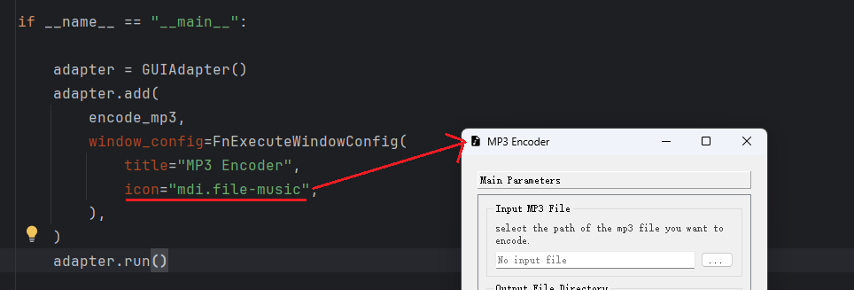

#### 3.3 调整窗口大小

#### 3.4 调整界面上的文字

#### 3.5 显示/隐藏Dock区域

#### 3.6 自定义Document区域内容

##### (1) Document区域默认显示的内容

Document区域通常用于显示函数的说明文档，该区域显示的内容默认来自于函数的文档字符串（@params...@end块会被忽略），格式默认为Markdown。

```python
from pyguiadapter.adapter import GUIAdapter
from pyguiadapter.types import file_t, directory_t
from pyguiadapter.windows import FnExecuteWindowConfig


def encode_mp3(
    input_file: file_t, output_dir: directory_t, output_file: str, quality: int
):
    """
    This function is used to encode a mp3 file into ogg format.

    Note: **The quality parameter will affect the output file size.**

    @params
    [input_file]
    label = "Input MP3 File"
    description = "select the path of the mp3 file you want to encode."
    placeholder = "No input file"
    dialog_title = "Select MP3 File"
    filters = "MP3 Files(*.mp3)"

    [output_dir]
    label = "Output File Directory"
    description = "select the directory of the output file"
    placeholder = "Output directory not specified"
    dialog_title = "Select Output Directory"

    [output_file]
    label = "Output Filename"
    description = "The filename of output file, <b>must endswith .ogg</b>"
    placeholder = "No output filename"

    [quality]
    label = "Encoding Quality"
    default_value = 80
    description = "from 10 to 100, <font color='red'>higher value, better quality, but requires more time to encode</font>"
    min_value = 10
    max_value = 100
    step = 1
    suffix = " %"
    @end
    """
    pass


if __name__ == "__main__":

    adapter = GUIAdapter()
    adapter.add(
        encode_mp3,
        window_config=FnExecuteWindowConfig(
            title="MP3 Encoder",
            icon="mdi.file-music",
        ),
    )
    adapter.run()
```

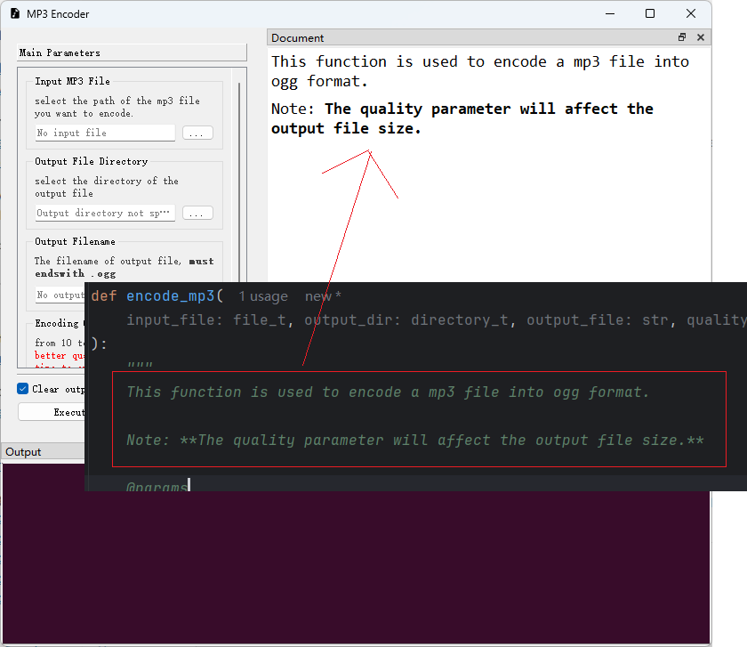

##### （2）调整Document区域显示的内容
可以通过`add()`函数的`document`参数来调整Document区域显示的内容，同时，可以通过`document_format`参数指定`document`的格式，支持以下格式：
"markdown"、"html"、 "plaintext"。

下面的示例演示如何读取html文件内容，并将其显示在Document区域（完整代码见[examples/get_started_7f.py](examples/get_started_7f.py)）:

```python
if __name__ == "__main__":

    fn_doc_path = os.path.join(os.path.dirname(__file__), "fn_doc.html")

    with open(fn_doc_path, "r") as f:
        fn_doc = f.read()

    adapter = GUIAdapter()
    adapter.add(
        encode_mp3,
        document=fn_doc,
        document_format="html",
        window_config=FnExecuteWindowConfig(
            title="Audio Encoder",
            icon="mdi.file-music",
        ),
    )
    adapter.run()
```

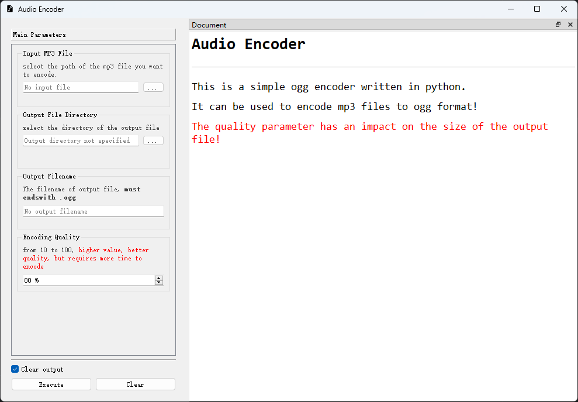

#### 3.7 其他可以调整的属性

## 五、自定义控件类型

TODO

## 六、高级主题

TODO

## 七、打包

TODO

## 八、开源许可

得益于qtpy的对不同的qt绑定库以及不同qt版本的抽象，PyGUIAdapter本身并不依赖与特定的qt绑定库，因此其使用MIT开源许可发布。用户利用PyGUIAdapter
开发应用程序，若用到了Qt的python绑定库，则在遵守本项目的许可协议的同时，还必须遵守其所选择的绑定库的许可协议。

例如，若用户选择使用PySide2，则在遵守本项目的许可协议同时，还必须遵守PySide2的许可协议，即LGPL（具体以PySide2随附的许可协议为准）。

又比如，若用户选择使用PyQt5，则在遵守本项目的许可协议同时，还必须遵守PyQt5的许可协议，即GPL（具体以其随附的许可协议为准）。


