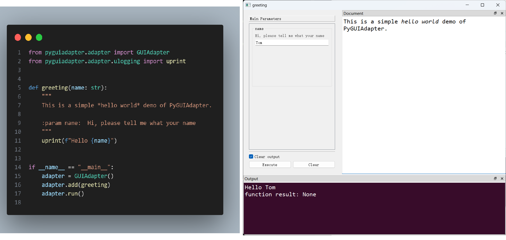
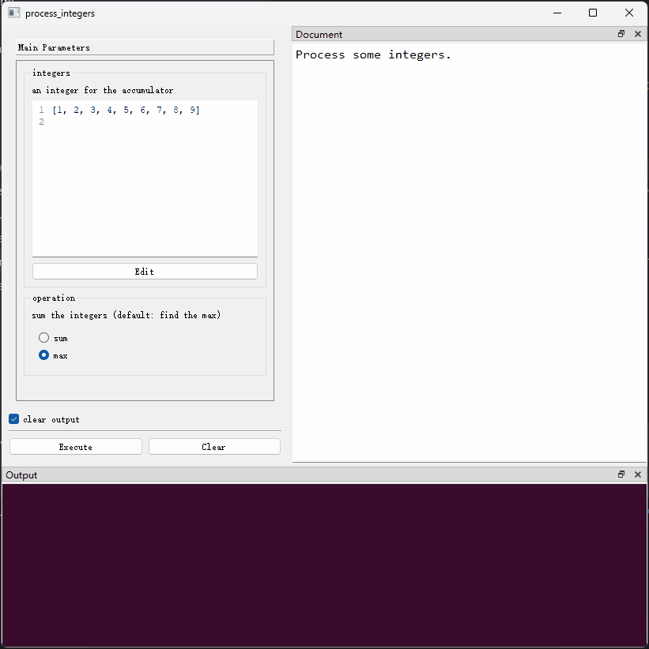
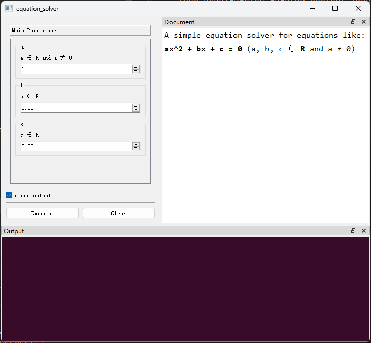
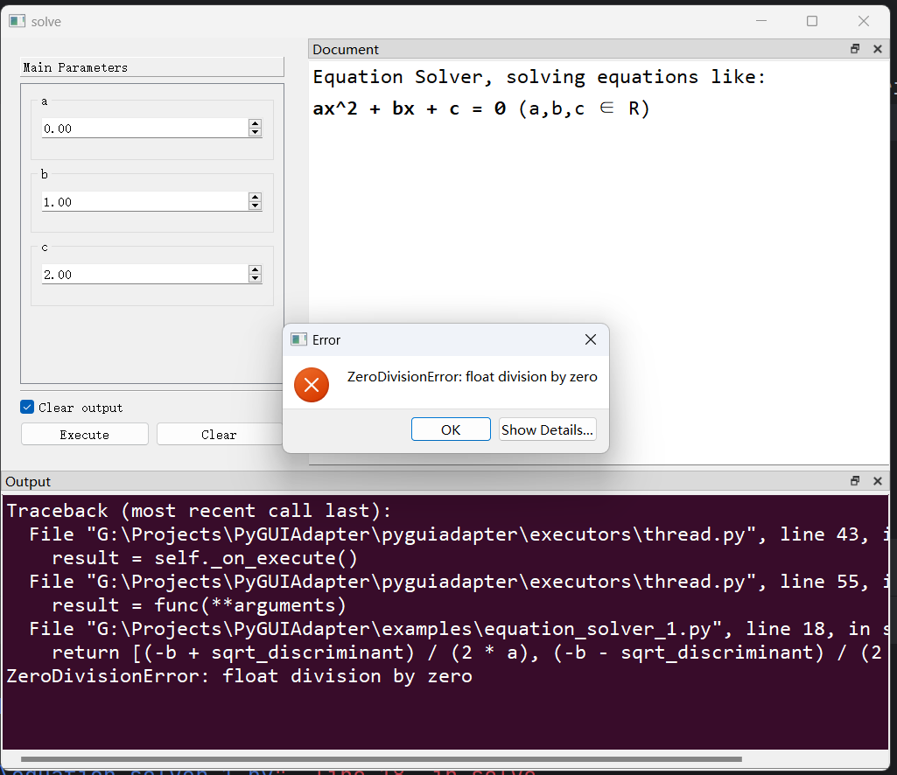
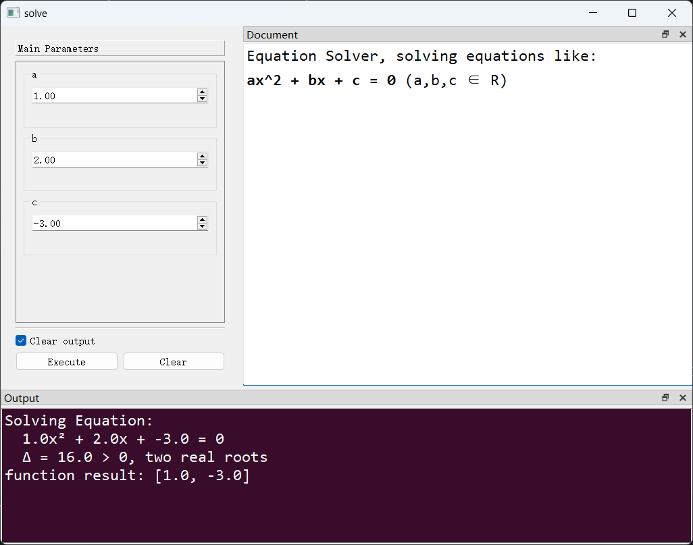
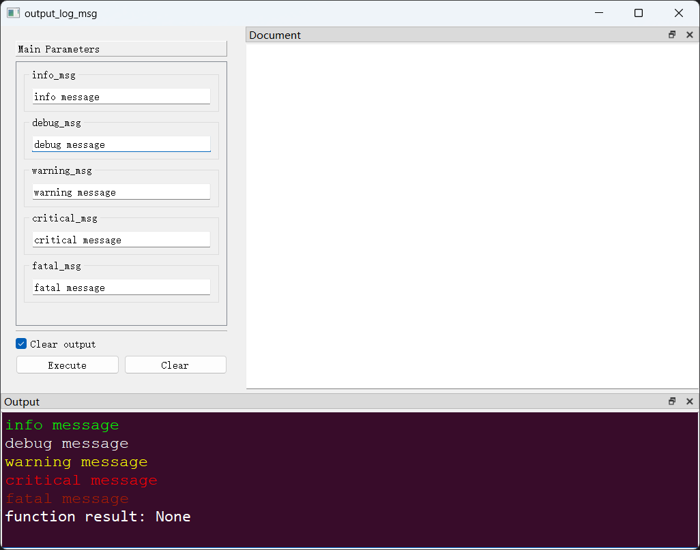
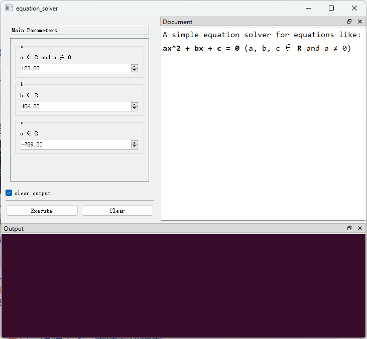
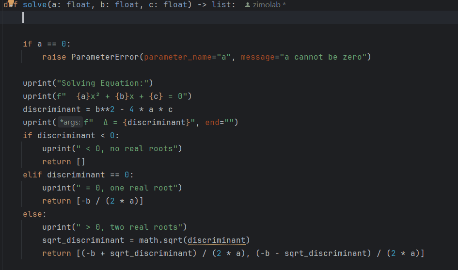
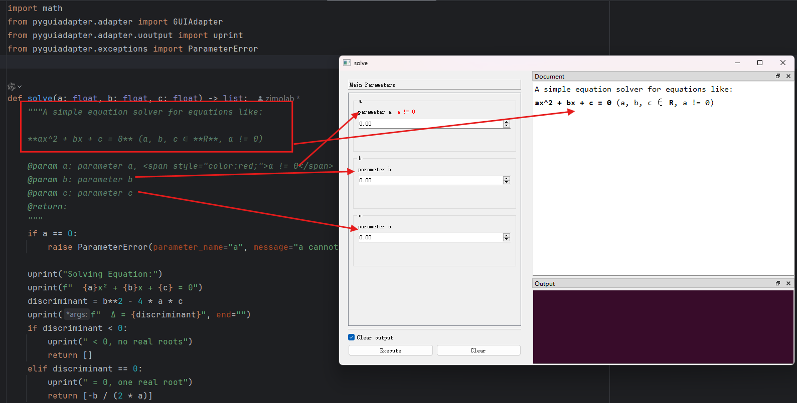
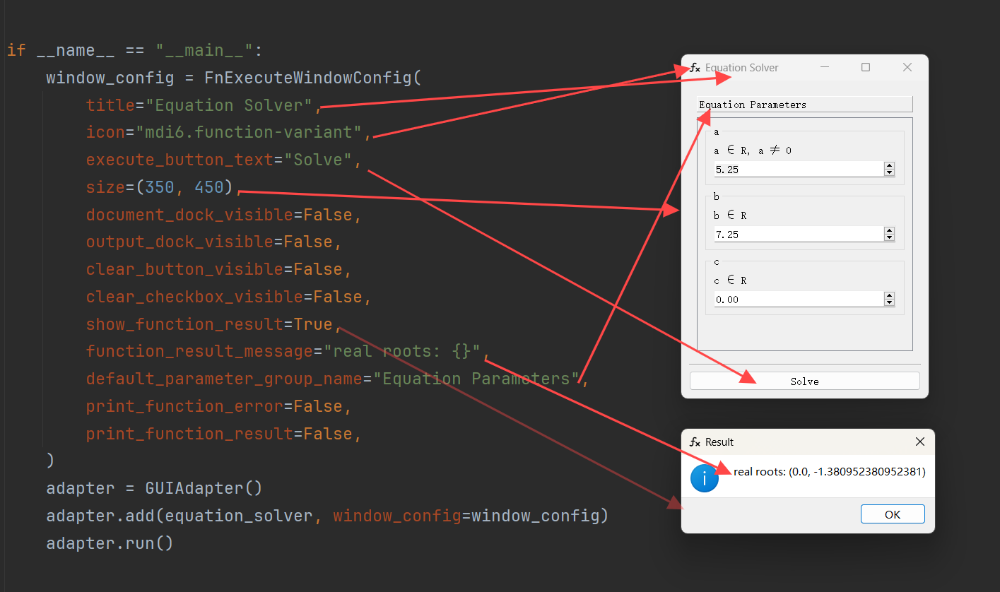

# PyGUIAdapter

## 一、简介

`PyGUIAdapter`是一个用于快速构建图形用户界面的Python库，只需极少的代码，就可以将几乎任意Python函数无缝转化为图形用户界面，大大简化了GUI应用程序的开发过程。`PyGUIAdapter`的核心理念是，以尽可能“无感”和“低侵入性”的方式，帮助开发者建立用户界面，使开发者能够专注于核心功能的实现，而不必将精力分散到复杂、繁琐的GUI编程上，降低了开发者的学习成本和心智负担。


<div style="text-align: center;">
    
</div>


## 二、适用场景

`PyGUIAdapter`与“`输入（Input）-处理（Process）-输出（Output）`”程序设计模式高度契合，特别适合用于：

- **工具类应用程序的开发；**
- **将现有的`CLI`应用快速迁移到`GUI`。**

下面是[Python官方文档](https://docs.python.org/3/library/argparse.html#example)给出的一个使用`argparse`创建命令行的例子：

```python
import argparse
parser = argparse.ArgumentParser(description='Process some integers.')
parser.add_argument('integers', metavar='N', type=int, nargs='+',
                    help='an integer for the accumulator')
parser.add_argument('--sum', dest='accumulate', action='store_const',
                    const=sum, default=max,
                    help='sum the integers (default: find the max)')

args = parser.parse_args()
print(args.accumulate(args.integers))
```

借助`PyGUIAdapter`，开发者可以用极少的代码将其转换成GUI程序。

```python
from typing import List, Literal
from pyguiadapter.adapter import GUIAdapter


def process_integers(
    integers: List[int], operation: Literal["sum", "max"] = "max"
) -> int:
    """
    Process some integers.

    @param integers: an integer for the accumulator
    @param operation: sum the integers (default: find the max)
    """
    func = max if operation == "max" else sum
    return func(integers)


if __name__ == "__main__":
    adapter = GUIAdapter()
    adapter.add(process_integers)
    adapter.run()

```

<div style="text-align:center">
    
</div>


## 三、特性

* 使用简单，开发快速，可以用极少的代码创建图形用户界面，学习成本低，心智负担小。
* 丰富的内置控件类型，近30种内置控件，基本实现开箱即用。Python的基本数据类型均实现了对应输入控件。同时，对基本类型进行了扩展，提供了丰富的语义类型，方便用户输入日期、时间、颜色、文件路径等特殊对象。实现了通用对象输入控件，支持输入`Json对象`和任意`Python字面量对象`（包括`int`、`float`、`bool`、`str`、`bytes`、`list`、`tuple`、`set`、`dict`）。
* 高度可扩展性，提供了自定义控件接口。开发者可以很方便地为自定义数据类型实现专用输入控件。
* 高度灵活性。控件与窗口均定义了大量可配置属性，开发者可以灵活地调整控件及窗口的外观、样式、行为，提升用户体验。
* 支持使用`QSS`，自由定制界面风格，支持接入现有第三方界面美化库。
* 支持自定义窗口菜单栏、工具栏，支持监听窗口事件，支持动态修改控件，为构建复杂应用提供了可能。
* 基于[`qtpy`](https://github.com/spyder-ide/qtpy)抽象层，不依赖特定Qt绑定库，用户可自由选择`PyQt5`、`PyQt6`、`PySide2`、`PySide2`。
* 界面底层使用`Qt`，兼容性好，相比`webview类`方案，系统资源占用更小。
* 纯Python，跨平台，支持主流桌面操作系统，包括`Windows`、`Linux`、`MacOS`等。


## 四、快速开始

### （一）依赖条件

要使用`PyGUIAdapter`开发应用程序，需满足以下条件：

+ `Python 3.8+`
+ 安装`PyGUIAdapter`
+ 安装Qt的绑定库之一，可选`PyQt5`、`PyQt6`、`PySide2`、`PySide6`

### （二）安装依赖

1、安装`PyGUIAdapter`

```shell
pip install PyGUIAdapter
```

2、安装Qt的绑定库之一，这里以`PySide2`为例：

```shell
pip install pyside2
```

> 如果你的环境下同时安装了多个Qt绑定库，`qtpy`默认会使用`PyQt5`(如果存在的话)。或者可以通过环境变量`QT_API`来明确指定要使用的绑定库，可以指定以下值：
>
> + `pyqt5`
> + `pyside2`
> + `pyqt6`
> + `pyside6`
>
> 更多详细信息，可以参见[qtpy官方说明](https://github.com/spyder-ide/qtpy)。

### （三）编写代码

**1、实现业务逻辑，并封装为函数。**

```python
from typing import Optional

from pyguiadapter.adapter.uoutput import uprint
from pyguiadapter.exceptions import ParameterError


def equation_solver(a: float = 1.0, b: float = 0.0, c: float = 0.0) -> Optional[tuple]:
    """A simple equation solver for equations like:

    **ax^2 + bx + c = 0** (a, b, c ∈ **R** and a ≠ 0)

    @param a: a ∈ R and a ≠ 0
    @param b: b ∈ R
    @param c: c ∈ R
    @return:
    """
    if a == 0:
        raise ParameterError(parameter_name="a", message="a cannot be zero!")
    uprint(f"Equation:")
    uprint(f"  {a}x² + {b}x + {c} = 0")
    delta = b**2 - 4 * a * c
    if delta < 0:
        return None
    x1 = (-b + delta**0.5) / (2 * a)
    if delta == 0:
        return x1, x1
    x2 = (-b - delta**0.5) / (2 * a)
    return x1, x2

```

**2、为业务代码适配GUI界面**

```python
from pyguiadapter.adapter import GUIAdapter
...
if __name__ == "__main__":
    adapter = GUIAdapter()
    adapter.add(equation_solver)
    adapter.run()
```

**完整代码如下：**

```python
from typing import Optional

from pyguiadapter.adapter import GUIAdapter
from pyguiadapter.adapter.uoutput import uprint
from pyguiadapter.exceptions import ParameterError


def equation_solver(a: float = 1.0, b: float = 0.0, c: float = 0.0) -> Optional[tuple]:
    """A simple equation solver for equations like:

    **ax^2 + bx + c = 0** (a, b, c ∈ **R** and a ≠ 0)

    @param a: a ∈ R and a ≠ 0
    @param b: b ∈ R
    @param c: c ∈ R
    @return:
    """
    if a == 0:
        raise ParameterError(parameter_name="a", message="a cannot be zero!")
    uprint(f"Equation:")
    uprint(f"  {a}x² + {b}x + {c} = 0")
    delta = b**2 - 4 * a * c
    if delta < 0:
        return None
    x1 = (-b + delta**0.5) / (2 * a)
    if delta == 0:
        return x1, x1
    x2 = (-b - delta**0.5) / (2 * a)
    return x1, x2


if __name__ == "__main__":
    adapter = GUIAdapter()
    adapter.add(equation_solver)
    adapter.run()
```

**界面效果如下：**

<div style="text-align:center">
    
</div>


## 五、原理说明与进阶示例

在`PyGUIAdapter`中，函数是界面的基本单元，一个函数便对应了一个窗口，函数的参数列表则定义了窗口中的控件。`PyGUIAdapter`自动实现了“`输入（Input）-处理（Process）-输出（Output）`”链条中“`输入（Input）`”和“`输出（Output）`”这两个环节，因此，绝大多数情况下，开发者唯一需要关注的就是如何实现“`处理（Process）`”，即程序的核心功能或者说业务逻辑。

GUI创建和管理的过程对于开发者而言是透明的，开发者几乎不会感知到这一过程的存在，因此开发者不会被“如何窗口创建”、“如何控件选择以及布局”、“如何用户输入的数据处理”、“如何事件响应”之类的细枝末节分散注意力，从而将关注点始终聚焦在核心功能的实现上，如果使用传统的GUI编程方法，以上问题是开发者不得不考虑的。将界面与逻辑进行分离被认为是一种好的实践，通过隐藏界面创建的过程，`PyGUIAdapter`实现了界面与逻辑分离的完全形态，从而真正实现了“业务驱动开发”。那么，`PyGUIAdapter`是如何做到这一点的呢？要实现这一效果，实际上并不复杂，也没有用到所谓的“黑魔法”，而是全部基于Python现有的特性，主要包括：

- **类型注解（type hint）**
- **内醒与反射机制**
- **文档字符串（docstring）**

具体而言，在运行时，`PyGUIAdapter`会获取函数参数列表，并根据参数的类型，自动选择合适的控件，例如：对于`int`类型的参数，`PyGUIAdapter`将默认创建一个`IntSpinBox`掌握其输入控件；对于`str`类型的参数，`PyGUIAdapter`将默认创建一个`LineEdit`等。同时，`PyGUIAdapter`还将从函数的签名、文档字符串等其他地方，充分挖掘函数的信息，并基于此自完成窗口创建、界面布局和事件绑定等工作。当用户点击`Execute`按钮，`PyGUIAdapter`将从参数控件中收集用户输入的数据，并对这些数据进行必要的转换和处理，之后将其作为参数调用目标函数，并获取函数调用的结果以及处理可能发生的异常。

> `PyGUIAdapter`充分利用了Python的类型注解机制。在`PyGUIAdapter`中，函数参数的类型注解不是可有可无的，它是生成参数控件的决定因素之一。
> 虽然，并不是说不使用类型注解就完全无法利用`PyGUIAdapter`——`PyGUIAdapter`也允许开发者手动为每一个参数显式地指定控件——但是，这样会在很大程度上失去使用`PyGUIAdapter`的意义。所以，**我们强烈建议开发者对函数参数使用类型注解**。

### （一）异常处理

下面，以前文`equation_solver`程序为例，对`PyGUIAdapter`中的异常处理机制进行说明。

首先，运行程序，并尝试在参数`a`的控件输入`0`，然后点击`Execute`按钮。由于参数`a`将在运算中将作为除数，因此不出意外，函数将发生一个`ZeroDivisionError`，让我们看看`PyGUIAdapter`如何处理函数中`未捕获的异常`：



对于函数中的异常，`PyGUIAdapter`的默认策略是：**捕获它们，弹窗提醒用户，并在程序输出区域打印出异常信息。** 这样的设计主要是**为了增强程序的`健壮性`，防止未捕获的异常导致整个程序崩溃**。

### （二）在函数中打印信息

> 关于这一主题，以下文档作了更为详细的说明：[向窗口输出信息](adapter/output.md)

在程序运行过程中，向用户展示一些信息是一个常见而且重要的需求，开发者一般通过使用`print()`打印消息来做到这一点。然而，通过`print()`打印的信息通常会被输出到`stdout`（一般是控制台），`PyGUIAdapter`目前还没有对`stdout`、`stderr`等进行重定向，为了使开发者能够将信息打印到窗口中，`PyGUIAdapter`提供了`uprint()`函数，其用法与`print()`基本一致，下面演示如何使用该方法。

```python
import math
from pyguiadapter.adapter import GUIAdapter
from pyguiadapter.adapter.uoutput import uprint


def solve(a: float, b: float, c: float) -> list:
    """
    Equation Solver, solving equations like:

    **ax^2 + bx + c = 0** (a,b,c ∈ R)
    """
    uprint("Solving Equation:")
    uprint(f"  {a}x² + {b}x + {c} = 0")
    discriminant = b**2 - 4 * a * c
    uprint(f"  Δ = {discriminant}", end="")
    if discriminant < 0:
        uprint(" < 0, no real roots")
        return []
    elif discriminant == 0:
        uprint(" = 0, one real root")
        return [-b / (2 * a)]
    else:
        uprint(" > 0, two real roots")
        sqrt_discriminant = math.sqrt(discriminant)
        return [(-b + sqrt_discriminant) / (2 * a), (-b - sqrt_discriminant) / (2 * a)]


if __name__ == "__main__":
    adapter = GUIAdapter()
    adapter.add(solve)
    adapter.run()

```


> `uprint()`函数支持输出`html`格式的内容，因此开发者甚至可以将图片输出到`Output`窗口中。不过`Output`浏览器对`html`的支持有限，仅支持`html4`的子集，具体可以参考Qt官方文档的说明：[Supported HTML Subset | Qt GUI 5.15.17](https://doc.qt.io/qt-5/richtext-html-subset.html#table-cell-attributes)。

除了`uprint()`函数，`pyguiadapter.adapter.uoutput`模块中还有许多输出信息的方法，借助这些方法，开发者可以输出格式更加丰富的的信息。

```python
from pyguiadapter.adapter import GUIAdapter, uoutput

def output_log_msg(
    info_msg: str = "info message",
    debug_msg: str = "debug message",
    warning_msg: str = "warning message",
    critical_msg: str = "critical message",
    fatal_msg: str = "fatal message",
):
    uoutput.info(info_msg)
    uoutput.debug(debug_msg)
    uoutput.warning(warning_msg)
    uoutput.critical(critical_msg)
    uoutput.fatal(fatal_msg)


if __name__ == "__main__":
    adapter = GUIAdapter()
    adapter.add(output_log_msg)
    adapter.run()

```



### （三）校验函数参数

虽然`PyGUIAdapter`对程序中的未捕获异常进行了处理，但仍然鼓励开发者尽力预见并避免可能发生的异常，这是提高程序健壮性、稳定性的基础之一。程序中的异常或错误，很多时候都源自于未经检验的用户输入，基于**“永远不要相信用户的输入”**这一共识，开发者应当对函数参数进行必要校验。

对于函数参数的合法性校验，`PyGUIAdapter`提供了一种特殊但非常简单、直接的机制，`PyGUIAdapter`不要求开发者为每个参数提供类似于`Validator`的东西。开发者需要在函数中手动编写参数校验代码，对于非法的参数，开发者可以抛出`ParameterError`，`PyGUIAdapter`在捕获到此类特殊异常时，会做出一些特殊的处理：




**对于函数中抛出的`ParameterError`，`PyGUIAdapter`将进行弹窗提示，并在对应参数控件所在的区域，以醒目的方式提醒用户其输入了一个不合法的值。**

### （四）为参数添加描述信息

为了使参数的含义、用途更加明确，一个好的实践是界面上为参数添加适当的描述信息。在`PyGUIAdapter`中，有多种方法可以做到这一点，其中最简单也最自然的一种方法是在函数的文档字符串（`docstring`）对这些参数进行描述。很多开发者已经习惯于编写函数的`docstring`，而且现在的IDE或代码编辑器也已经足够智能，可以根据函数的签名，自动生成`docstring`模板，比如下面这样：



所以，从降低学习成本，尽量利用现有信息的角度出发，`PyGUIAdapter`会从`docstring`中分析并提取函数参数的描述信息并将其显示在界面上。`PyGUIAdapter`支持多种风格的`docstring`，包括： `ReST`、`Google`、`Numpydoc-style` 、`Epydoc` 。

> 这篇文档对于任何配置函数参数的控件进行了更加详细和深入的说明：[配置函数参数控件](widgets/configure_widget)

除了利用函数`docstring`中对参数的描述，`PyGUIAdapter`还会利用`docstring`对函数本身的描述，默认情况下，会将其作为函数的说明文档，显示在窗口右侧的文档浏览器中。

>当然，`PyGUIAdapter`允许开发者手动设置函数的说明文档，甚至允许开发者将`markdown`、`html`文件的内容作为函数的说明文档显示在文档浏览器中。可以参考这篇文档：[函的数名称、图标、文档及分组](adapter/multiple_functions.md)

了解这些信息后，我们可以进一步完善我们的示例程序：



### （五）配置控件属性

为了提高程序的健壮性或增强用户体验，`PyGUIAdapter`允许开发者对函数参数控件的属性进行配置。比如，在当前示例函数中，参数`a`、`b`、`c`控件的初始值都是`0`，这显然是不合理的。另外，参数`a`、`b`、`c`的控件目前都只能输入小数点后两位数，无法满足输入更高精度数字的需求。下面，我们将通过对参数控件进行配置，来解决这两个问题。

`PyGUIAdapter`提供了一种简单的机制来配置参数控件的属性，该机制同样需要利用函数的`docstring`，只不过，这次开发者需要做一些额外的工作。`PyGUIAdapter`会将函数`docstring`中`@params`...`@end`包裹的区域视为函数参数控件的配置文档（格式为TOML），在运行时会自动提取并解析该区域的内容。

下面，我们通过这一机制来配置参数`a`、`b`、`c`控件的初始值、精度、步进值等属性：

```python
import math
from pyguiadapter.adapter import GUIAdapter
from pyguiadapter.adapter.uoutput import uprint
from pyguiadapter.exceptions import ParameterError


def solve(a: float, b: float, c: float) -> list:
    """A simple equation solver for equations like:

    **ax^2 + bx + c = 0** (a, b, c ∈ **R**, a != 0)

    @param a: parameter a, <span style="color:red;">a != 0</span>
    @param b: parameter b
    @param c: parameter c
    @return:

    @params

    [a]
    default_value = 1.0
    decimals = 5
    step = 0.00005

    [b]
    default_value = 1.0
    decimals = 5
    step = 0.00005

    [c]
    default_value = 0.0
    decimals = 5
    step = 0.00005

    @end

    """
    if a == 0:
        raise ParameterError(parameter_name="a", message="a cannot be zero")

    uprint("Solving Equation:")
    uprint(f"  {a}x² + {b}x + {c} = 0")
    discriminant = b**2 - 4 * a * c
    uprint(f"  Δ = {discriminant}", end="")
    if discriminant < 0:
        uprint(" < 0, no real roots")
        return []
    elif discriminant == 0:
        uprint(" = 0, one real root")
        return [-b / (2 * a)]
    else:
        uprint(" > 0, two real roots")
        sqrt_discriminant = math.sqrt(discriminant)
        return [(-b + sqrt_discriminant) / (2 * a), (-b - sqrt_discriminant) / (2 * a)]


if __name__ == "__main__":
    adapter = GUIAdapter()
    adapter.add(solve)
    adapter.run()
```


在函数的`docstring`中添加`@params`...`@end`块来对函数参数控件的属性进行配置，是一种简单而且直观的方法。这种方法适用于大多数需要对控件属性进行调整的场景，但也并非万能，因此，`PyGUIAdapter`提供了更为强大的配置函数参数控件的方法。这篇文档对如何配置函数参数的控件进行了深入的说明，强烈建议开发者进行阅读。：[配置函数参数控件](widgets/configure_widget)。

在`PyGUIAdapter`中，不同的参数类型往往对应不同的控件类型，而不同类型的控件具有不同的可配置属性，开发者可以阅读这篇文档，来了解`PyGUIAdapter`内置的控件类型和对应的数据类型，以及其可供开发者配置的属性：[内置控件类型一览](widgets/types_and_widgets.md)。

### （六）配置窗口属性——一个“小窗口”模式的简单示例

`PyGUIAdapter`运行开发者对窗口进行配置，调整窗口某些属性。比如下面的示例，实现了所谓的小窗口模式。


```python
from typing import Optional

from pyguiadapter.adapter import GUIAdapter
from pyguiadapter.exceptions import ParameterError
from pyguiadapter.windows.fnexec import FnExecuteWindowConfig


def equation_solver(a: float, b: float, c: float) -> Optional[tuple]:
    """
    Solving Equations: ax^2 + bx + c = 0 (a,b,c ∈ R, a ≠ 0)
    @param a: a ∈ R, a ≠ 0
    @param b: b ∈ R
    @param c: c ∈ R
    @return:
    """
    if a == 0:
        raise ParameterError(parameter_name="a", message="a cannot be zero!")

    delta = b**2 - 4 * a * c
    if delta < 0:
        return None
    x1 = (-b + delta**0.5) / (2 * a)
    if delta == 0:
        return x1, x1
    x2 = (-b - delta**0.5) / (2 * a)
    return x1, x2


if __name__ == "__main__":
    window_config = FnExecuteWindowConfig(
        title="Equation Solver",
        icon="mdi6.function-variant",
        execute_button_text="Solve",
        size=(350, 450),
        document_dock_visible=False,
        output_dock_visible=False,
        clear_button_visible=False,
        clear_checkbox_visible=False,
        show_function_result=True,
        function_result_message="real roots: {}",
        default_parameter_group_name="Equation Parameters",
        print_function_error=False,
        print_function_result=False,
    )
    adapter = GUIAdapter()
    adapter.add(equation_solver, window_config=window_config)
    adapter.run()
```



关于如何配置窗口属性，以下文档进行了更为详细的说明：

- [窗口概述](windows/overview.md)
- [函数选择窗口（FnSelectWindow）](windows/fn_select_window.md)
- [函数执行窗口（FnExecuteWindow）](windows/fn_exec_window.md)

### （七）添加工具栏与菜单

`PyGUIAdapter`允许开发者向窗口添加工具栏和菜单，并为工具栏按钮或菜单项的`动作（Action）`设置事件响应函数。

以下是一个综合性的示例，展示了：

- 如何同时为窗口添加工具栏和菜单栏
- 可勾选的`动作（Action）`类型——`checkable=True`
- 互斥的菜单项
- 子菜单
- 两种动作事件响应函数——`on_triggered`和`on_toggled`
- 如何在事件响应函数中使用`pyguiadapter.utils`包提供的功能与用户进行交互
- ...

> [examples/windows/menu_and_toolbar.py]()

```python
from qtpy.QtWidgets import QAction

from pyguiadapter.action import ActionConfig, Separator
from pyguiadapter.adapter import GUIAdapter
from pyguiadapter.menu import MenuConfig
from pyguiadapter.toolbar import ToolBarConfig
from pyguiadapter.windows.fnexec import FnExecuteWindow
from pyguiadapter.utils import messagebox, filedialog


def on_action_about(window: FnExecuteWindow, action: QAction):
    messagebox.show_info_message(
        parent=window,
        message="This is an example of toolbar and menu with custom actions.",
        title="About",
    )


def on_action_close(window: FnExecuteWindow, action: QAction):
    ret = messagebox.show_question_message(
        window, "Are you sure you want to quit?", buttons=messagebox.Yes | messagebox.No
    )
    if ret == messagebox.Yes:
        window.close()


def on_action_open(window: FnExecuteWindow, action: QAction):
    ret = filedialog.get_open_file(
        window,
        title="Open File",
        start_dir="./",
        filters="JSON files(*.json);;Python files(*.py);;All files(*.*)",
    )
    if not ret:
        return
    messagebox.show_info_message(window, f"File will be opened: {ret}")


def on_action_save(window: FnExecuteWindow, action: QAction):
    ret = filedialog.get_save_file(
        window,
        title="Save File",
        start_dir="./",
        filters="JSON files(*.json);;All files(*.*)",
    )
    if not ret:
        return
    messagebox.show_info_message(window, f"File will be saved: {ret}")


def on_action_auto_theme(window: FnExecuteWindow, action: QAction):
    if action.isChecked():
        messagebox.show_info_message(window, "Auto theme is selected.")


def on_action_light_theme(window: FnExecuteWindow, action: QAction):
    if action.isChecked():
        messagebox.show_info_message(window, "Light theme is selected.")


def on_action_dark_theme(window: FnExecuteWindow, action: QAction):
    if action.isChecked():
        messagebox.show_info_message(window, "Dark theme is selected.")


action_about = ActionConfig(
    text="About",
    icon="fa.info-circle",
    on_triggered=on_action_about,
)

action_open = ActionConfig(
    text="Open",
    icon="fa.folder-open",
    shortcut="Ctrl+O",
    on_triggered=on_action_open,
)

action_save = ActionConfig(
    text="Save",
    icon="fa.save",
    shortcut="Ctrl+S",
    on_triggered=on_action_save,
)

action_close = ActionConfig(
    text="Quit",
    icon="fa.close",
    shortcut="Ctrl+Q",
    on_triggered=on_action_close,
)

action_auto_them = ActionConfig(
    text="Auto",
    checkable=True,
    checked=True,
    on_toggled=on_action_auto_theme,
)

action_light_theme = ActionConfig(
    text="Light",
    checkable=True,
    on_toggled=on_action_light_theme,
)

action_dark_theme = ActionConfig(
    text="Dark",
    checkable=True,
    on_toggled=on_action_dark_theme,
)

submenu_theme = MenuConfig(
    title="Theme",
    actions=[action_auto_them, action_light_theme, action_dark_theme],
    exclusive=True,
)
menu_file = MenuConfig(
    title="File",
    actions=[
        action_open,
        action_save,
        Separator(),
        action_close,
        Separator(),
        submenu_theme,
    ],
)
menu_help = MenuConfig(
    title="Help",
    actions=[action_about],
)


def menu_toolbar_example(arg1: int, arg2: str, arg3: bool):
    """
    This example shows how to add and config toolbar and menus to the window.
    @param arg1:
    @param arg2:
    @param arg3:
    @return:
    """
    pass


if __name__ == "__main__":
    adapter = GUIAdapter()
    adapter.add(
        menu_toolbar_example,
        window_menus=[menu_file, menu_help],
        window_toolbar=ToolBarConfig(
            actions=[action_open, action_save, Separator(), action_close]
        ),
    )
    adapter.run()

```


关于工具栏与菜单栏，以下文档进行了更为详细的说明：

- [为窗口添加工具栏](windows/toolbar.md)
- [为窗口添加菜单栏](windows/menus.md)


## 六、高级主题

### （一）数据类型与控件

#### 1、[配置函数参数控件](widgets/configure_widget)

#### 2、[内置控件类型一览](widgets/types_and_widgets.md)

#### 3、[创建和使用自定义控件](widgets/custom_widget.md)

#### 4、[关于图标](widgets/icons.md)

### （二）`pyguiadapter.adapter.*`

#### 1、[函的数名称、图标、文档及分组](adapter/multiple_functions.md)

#### 2、[用户进行交互：消息对话框与输入对话框](adapter/interact.md)

#### 3、[取消正在执行的函数：协商式线程退出机制](adapter/cancellable_function.md)

#### 4、[使用进度条](adapter/progressbar.md)

#### 5、[界面美化：使用样式表与第三方库](adapter/style.md)


### （三）窗口

在`PyGUIAdapter`中，主要有两类窗口，分别是`函数选择窗口（FnSelectWindow）`和`函数执行窗口（FnExecutWindow）`。

1. `函数选择窗口`：该窗口用于选择要执行的函数，当开发者向`GUIAdapter`实例中添加了超过一个函数时，会自动显示该窗口。开发者也可以在强制显示该窗口（即使实例中只添加了一个函数），方法是在调用`GUIAdapter.run()`时传入`show_select_window=True`。
2. `函数执行窗口`：该窗口用于接受函数的参数，并执行函数。

上述两类窗口均提供了大量的配置选项，开发者可以根据需要自由调整这些配置选项，以实现更加定制化的界面。下面是窗口相关的一些高级用法。

#### 1、[窗口概述](windows/overview.md)

#### 2、[为窗口添加工具栏](windows/toolbar.md)

#### 3、[为窗口添加菜单栏](windows/menus.md)

#### 4、[监听窗口事件](windows/window_event.md)

#### 5、[函数选择窗口（FnSelectWindow）](windows/fn_select_window.md)

#### 6、[函数执行窗口（FnExecuteWindow）](windows/fn_exec_window.md)

### （四）实用工具

> TODO

### （五）打包应用

关于如何将应用打包为二进制文件，可参考以下教程：[应用打包](packaging.md)


## 七、教程

上面的示例代码演示了`PyGUIAdapter`的基本用法。 除此之外，`PyGUIAdapter`为构建更加大型、复杂的应用程序，提供了更多的功能。

下面是一些案例教程，通过逐步构建一个完整的应用程序，开发者可以学到`PyGUIAdapter`的进阶用法。

> TODO


## 六、开源协议

`PyGUIAdapter`使用`MIT`许可协议进行发布。得益于`qtpy`的抽象能力，`PyGUIAdapter`本身并不依赖特定的Qt绑定库。开发者在使用`PyGUIAdapter`开发应用程序时，若依赖特定的Qt绑定库，则在遵守本项目的许可协议的同时，还应当遵守所选绑定库的许可协议。例如：

- 若开发者选择使用`PySide2`，则其须遵守`LGPL`（具体以随附的许可协议为准）。
- 若开发者选择使用`PyQt5`，则其须遵守`GPL`（具体以随附的许可协议为准）。


## 八、贡献

参见：[CONTRIBUTING.md](CONTRIBUTING.md)

## 九、致谢

`PyGUIAdapter`依赖如下开源项目，在此向作者表示感谢。

- `qtpy`
- `qtawesome`
- `docstring-parser`
- `tomli`
- `pyqcodeeditor`
- `yapf`

