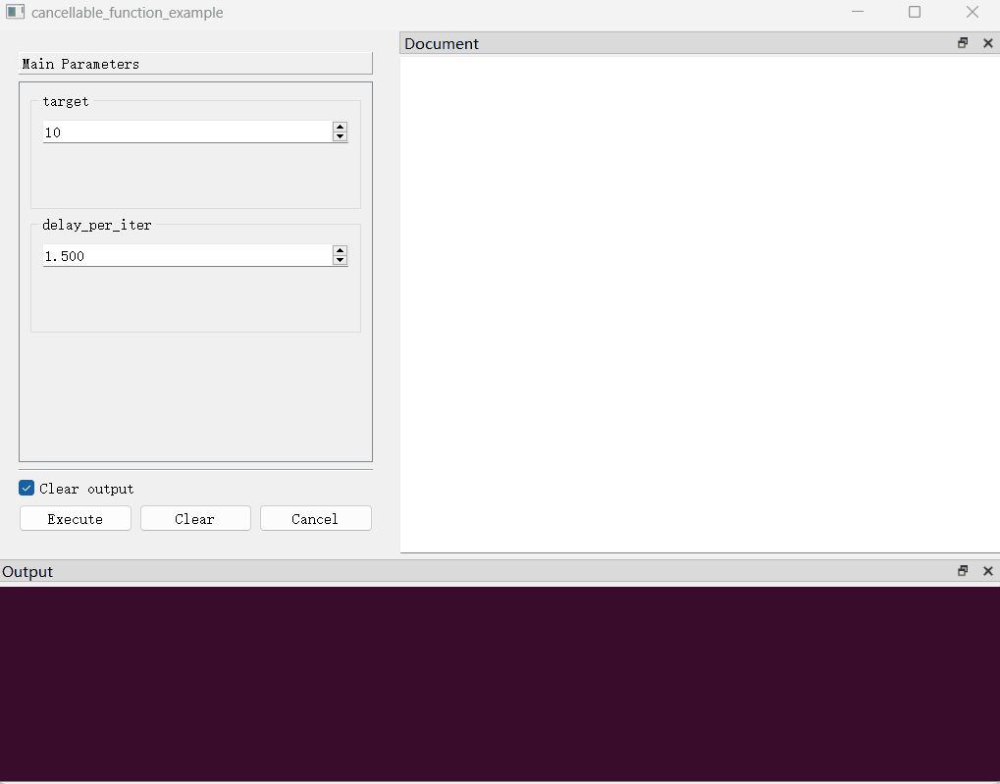

## 取消正在执行的函数：协商式线程退出机制

在`PyGUIAdapter`中，开发者的函数默认运行在单独的一个线程中，这样的设计主要是为了避免函数长时间执行阻塞主线程。对于长时间运行的函数，开发者可能希望让用户具备取消真正执行中的函数的能力。

为了实现取消函数执行的效果，一种简单粗暴的想法是直接终结（terminate）函数运行的那个线程，但是，这种做法存在很大的隐患，这种方法无法确定线程结束时函数运行在那一步，可能会导致数据不一致、资源泄露或其他难以预测的问题。正常的做法是通过轮询检查某个特殊条件，在满足条件时让函数返回，从而达到线程正常接受的效果，`PyGUIAdapter`基于这一思路，实现了一种称之为`协商式取消`的函数执行取消机制。

所谓`“协商式”`，指的是函数的取消并不是必然的，用户取消函数的指令被视为一种`“请求”`，开发者需要在函数中手动处理这种请求，并根据具体的情况做出处理。这里说的做出处理，可以是`“同意请求，立即从函数返回”`，也可以是`“同意请求，执行清理步骤后返回”`，当然也可以是`“不同意请求，继续执行函数”`。换言之，用户具有的是取消函数执行的`“建议权”`，函数实际上取消与否、取消前是否需要执行前置步骤等重要事项的`“决定权”`仍然归于开发者。


要使一个函数可以被取消，首先，需要在向`GUIAdapter`实例添加函数传入`cancellable=True`，此时，函数执行界面将显示一个取消按钮，用户通过按下此按钮来向函数发出取消执行的请求。在函数中，开发者可以通过`ucontext.is_function_cancelled()`函数定期检查用户是否发出了取消请求，并根据实际情况做出处理。

下面是一个简单的示例：

> [examples/adapter/cancellable_function.py]()

```python
import time

from pyguiadapter.adapter import GUIAdapter
from pyguiadapter.adapter.ucontext import uprint, is_function_cancelled


def cancellable_function_example(target: int = 10, delay_per_iter: float = 0.5):
    """
    @params
    [target]
    min_value = 1

    [delay_per_iter]
    min_value = 0.001
    step = 0.5
    decimals = 3

    @end
    """
    for i in range(target):
        if is_function_cancelled():
            break
        uprint("process: ", i)
        time.sleep(delay_per_iter)
    uprint("done!")


if __name__ == "__main__":
    adapter = GUIAdapter()
    adapter.add(cancellable_function_example, cancelable=True)
    adapter.run()

```

