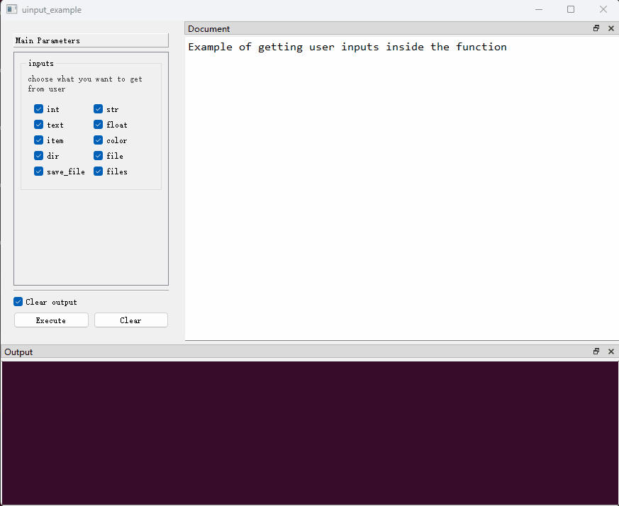

## 在函数中与用户进行交互

`PyGUIAdapter`提供了多种方式，使得开发者可以在其函数允许过程中与用户进行交互。开发者可以在函数运行过程中弹出对话框，向用户展示一些信息，或者请求用户对某些信息进行再次确认，开发者也可以在函数运行过程中弹出输入框，要求用户输入某些数据......

通过合理使用交互手段，开发者可以使整个应用程序更加易用，增强用户体验。


### 一、弹出消息对话框

> 消息对话框相关API定义在[`pyguiadapter.adapter.udialog`]()模块中

#### （一）一般消息对话框

`PyGUIAdapter`提供了四种标准的消息对话框，可以用于展示不同级别的提示信息。

**1、Information消息对话框**

用于提示一般性信息。

```python
def show_info_dialog(
    text: str,
    title: str = "Information",
    buttons: StandardButton | StandardButtons = QMessageBox.Ok,
    default_button: StandardButton = QMessageBox.NoButton,
    **kwargs,
) -> int | StandardButton:
    ...

```


**2、Warning消息对话框**

用于提示警告信息。

```python
def show_warning_dialog(
    text: str,
    title: str = "Warning",
    buttons: StandardButton | StandardButtons = QMessageBox.Ok,
    default_button: StandardButton = QMessageBox.NoButton,
    **kwargs,
) -> int | StandardButton:
    ...
```


**3、Critical消息对话框**

用于提示严重错误信息。

```python
def show_critical_dialog(
    text: str,
    title: str = "Critical",
    buttons: StandardButton | StandardButtons = QMessageBox.Ok,
    default_button: StandardButton = QMessageBox.NoButton,
    **kwargs,
) -> int | StandardButton:
    ...
```


**4、Question对话框**

用于提示问询信息，并且可以从用户处获得问询结果。

```python
def show_question_dialog(
    text: str,
    title: str = "Question",
    buttons: StandardButton | StandardButtons = QMessageBox.Yes | QMessageBox.No,
    default_button: StandardButton = QMessageBox.NoButton,
    **kwargs,
) -> int | StandardButton:
    ...
```


下面，提供一个综合性的示例：


```python
from pyguiadapter.adapter import GUIAdapter
from pyguiadapter.adapter import udialog
from pyguiadapter.adapter.ucontext import uprint
from pyguiadapter.types import text_t


def dialog_example(
    info_message: text_t,
    warning_message: text_t,
    error_message: text_t,
    question_message: text_t,
):
    if info_message:
        udialog.show_info_dialog(
            text=info_message,
            title="Information",
            buttons=udialog.QMessageBox.Ok | udialog.QMessageBox.No,
            default_button=udialog.QMessageBox.Ok,
        )

    if warning_message:
        udialog.show_warning_dialog(
            text=warning_message,
            title="Warning",
            buttons=udialog.QMessageBox.Ok | udialog.QMessageBox.No,
            default_button=udialog.QMessageBox.Ok,
        )

    if error_message:
        udialog.show_critical_dialog(
            text=error_message,
            title="Error",
            buttons=udialog.QMessageBox.Ok | udialog.QMessageBox.No,
            default_button=udialog.QMessageBox.Ok,
        )

    if question_message:
        answer = udialog.show_question_dialog(
            text=question_message,
            title="Question",
            buttons=udialog.QMessageBox.Yes | udialog.QMessageBox.No,
            default_button=udialog.QMessageBox.No,
        )
        if answer == udialog.QMessageBox.Yes:
            uprint("Your Choice: Yes")
            udialog.show_info_dialog("You Choose Yes!", title="Answer")
        else:
            uprint("Your Choice: No")
            udialog.show_info_dialog("You Choose No!", title="Answer")

if __name__ == "__main__":
    adapter = GUIAdapter()
    adapter.add(dialog_example)
    adapter.run()

```


#### （二）特殊消息对话框

除了上述四种标准消息对话框，`PyGUIAdapter`还提供了几种特殊的对话框

**1、展示文本内容**

`PyGUIAdapter`允许开发者通过对话框展示长文本内容，而且支持多种文本格式：

- `markdown`（默认格式）
- `plaintext`
- `html`

> 注意：对于`html`支持有限，仅支持部分html标签，不支持css3和html5。

API如下：

```python
def show_text_content(
    text_content: str,
    text_format: Literal["markdown", "plaintext", "html"] = "markdown",
    size: Tuple[int, int] = None,
    title: str | None = "",
    icon: utils.IconType = None,
    buttons: int | QDialogButtonBox.StandardButtons | None = QDialogButtonBox.Ok,
    resizeable: bool = True,
):
    ...
```

一个简单的实例：

```python
from typing import Literal

from pyguiadapter.adapter import GUIAdapter
from pyguiadapter.adapter import udialog
from pyguiadapter.types import text_t


def show_text_context_example(
    content: text_t, text_format: Literal["markdown", "plaintext", "html"] = "markdown"
):
    if content:
        udialog.show_text_content(
            title="Hello",
            text_content=content,
            text_format=text_format,
            size=(600, 400),
        )


if __name__ == "__main__":
    adapter = GUIAdapter()
    adapter.add(show_text_context_example)
    adapter.run()

```


**2、展示文本文件内容**

`PyGUIAdapter`还允许开发者通过对话框展示文本文件内容。

```python
def show_text_file(
    text_file: str,
    text_format: Literal["markdown", "plaintext", "html"] = "markdown",
    size: Tuple[int, int] = None,
    title: str | None = "",
    icon: utils.IconType = None,
    buttons: int | QDialogButtonBox.StandardButtons | None = QDialogButtonBox.Ok,
    resizeable: bool = True,
):
    ...
```

示例代码如下：

```python
import os.path
from typing import Literal

from pyguiadapter.adapter import GUIAdapter
from pyguiadapter.adapter import udialog
from pyguiadapter.exceptions import ParameterError
from pyguiadapter.types import file_t


def show_text_file_example(
    text_file: file_t,
    text_format: Literal["markdown", "plaintext", "html"] = "markdown",
):
    """
    Show text content of the file

    @param text_file: the path of the text file
    @param text_format: the format of the text file
    @return:

    @params
    [text_file]
    filters = "Text files(*.txt);;Markdown files(*.md);;HTML files(*.html);;All files(*.*)"
    @end
    """
    text_file = text_file.strip()
    if not text_file:
        raise ParameterError("text_file", "text_file is empty!")

    if not os.path.isfile(text_file):
        udialog.show_critical_dialog(text="File not found", title="Error")
        return
    filename = os.path.basename(text_file)
    if text_file:
        udialog.show_text_file(
            text_file=text_file,
            text_format=text_format,
            title=f"View - {filename}",
            size=(600, 400),
        )


if __name__ == "__main__":
    adapter = GUIAdapter()
    adapter.add(show_text_context_example)
    adapter.add(show_text_file_example)
    adapter.run()

```


#### （三）自定义消息对话框

> 为了实现自定义对话框，开发者需要掌握一定`pyqt`或`pyside`

如果`PyGUIAdapter`内置的消息对话框不能满足需要，开发者也可以自定义消息对话框。一般流程如下：


**1、继承`pyguiadater.adapter.BaseCustomDialog`实现自定义对话框类**

开发者需要在自定义对话框类中实现`get_result()`抽象方法，后续，开发者可以在函数中获取该方法的返回值。

**2、调用`udialog.show_custom_dialog()`弹出自定义对话框**

```python
def show_custom_dialog(
    dialog_class: str | Type[BaseCustomDialog], **kwargs
) -> Tuple[int, Any]:
    ...
```

`udialog.show_custom_dialog()`的第一个参数是自定义对话框类，第一个参数之后的关键字参数将作为自定义对话框`__init__()`函数的参数。

`udialog.show_custom_dialog()`将返回一个二元素元组，该元组的第一个元素对话框的返回码，通常用于指示对话框的状态：accepted或rejected，第二个元素则为`get_result()`方法的返回值。


下面给出一个具体示例：

```python
from datetime import date, datetime
from typing import Any
from uuid import uuid1

from qtpy.QtWidgets import QWidget, QVBoxLayout, QLabel, QDialogButtonBox

from pyguiadapter.adapter import GUIAdapter, BaseCustomDialog
from pyguiadapter.adapter import udialog
from pyguiadapter.adapter.ucontext import uprint
from pyguiadapter.exceptions import ParameterError


class UserInfoDialog(BaseCustomDialog):
    def __init__(
        self,
        parent: QWidget,
        username: str,
        nickname: str,
        user_id: str,
        birthdate: date,
        join_time: datetime,
        **kwargs,
    ):
        super().__init__(parent, **kwargs)

        self.setWindowTitle("Confirm")

        self._confirmed = False
        self._user_info = {
            "username": username,
            "nickname": nickname,
            "user_id": user_id,
            "birthdate": birthdate,
            "join_time": join_time,
        }

        self._button_box = QDialogButtonBox(self)
        self._button_box.setStandardButtons(
            QDialogButtonBox.Ok | QDialogButtonBox.Cancel
        )
        self._button_box.accepted.connect(self._on_accepted)
        self._button_box.rejected.connect(self._on_rejected)

        layout = QVBoxLayout()
        username_label = QLabel(self)
        username_label.setText(f"username: {username}")
        layout.addWidget(username_label)
        nickname_label = QLabel(self)
        nickname_label.setText(f"nickname: {nickname}")
        layout.addWidget(nickname_label)
        user_id_label = QLabel(self)
        user_id_label.setText(f"user_id: {user_id}")
        layout.addWidget(user_id_label)
        birthdate_label = QLabel(self)
        birthdate_label.setText(f"birthdate: {birthdate}")
        layout.addWidget(birthdate_label)
        join_time_label = QLabel(self)
        join_time_label.setText(f"join_time: {join_time}")
        layout.addWidget(join_time_label)
        layout.addWidget(self._button_box)
        self.setLayout(layout)

    def get_result(self) -> Any:
        if self._confirmed:
            return self._user_info
        return None

    def _on_accepted(self) -> None:
        self._confirmed = True
        self.accept()

    def _on_rejected(self) -> None:
        self._confirmed = False
        self.reject()


def add_user_example(
    username: str,
    nickname: str,
    user_id: str,
    birth_date: date,
    join_time: datetime,
):
    if not username:
        raise ParameterError("username", "username is empty")

    if not user_id:
        udialog.show_warning_dialog("user_id is empty, a random one will be generated!")
        user_id = uuid1().hex

    _, result = udialog.show_custom_dialog(
        UserInfoDialog,
        username=username,
        nickname=nickname,
        user_id=user_id,
        birthdate=birth_date,
        join_time=join_time,
    )
    if result is not None:
        udialog.show_info_dialog(f"user added!")
        uprint(result)
        return
    udialog.show_info_dialog(f"user not added!")


if __name__ == "__main__":
    adapter = GUIAdapter()
    adapter.add(add_user_example)
    adapter.run()

```


### 二、弹出输入框

> 输入框相关API在[`pyguiadapter.adapter.uinput`]()模块中定义

`PyGUIAdapter`允许开发者在函数运行过程中弹出输入框从而动态地从获取用户输入。

`PyGUIAdapter`内置了多种类型的输入框，开发者可以根据需要用户输入的数据类型灵活选择。

1.**整数输入框**

```python
def get_int(
    title: str = "Input Integer",
    label: str = "",
    value: int = 0,
    min_value: int = -2147483647,
    max_value: int = 2147483647,
    step: int = 1,
) -> int | None:
	...
```

**2、单行文本输入框**

```python
def get_text(
    title: str = "Input Text",
    label: str = "",
    echo: EchoMode | None = None,
    text: str = "",
    ime_hints: InputMethodHint | InputMethodHints | None = None,
) -> str | None:
    ...
```

**3、多行文本输入框**

```python
def get_multiline_text(
    title: str = "Input Text",
    label: str = "",
    text: str = "",
    ime_hints: InputMethodHint | InputMethodHints | None = None,
) -> str | None:
    ...
```

**4、浮点数输入框**

```python
def get_float(
    title: str = "Input Float",
    label: str = "",
    value: float = 0.0,
    min_value: float = -2147483647.0,
    max_value: float = 2147483647.0,
    decimals: int = 1,
) -> float | None:
    ...
```

**5、多选一输入框**

```python
def get_selected_item(
    items: List[str],
    title: str = "Select Item",
    label: str = "",
    current: int = 0,
    editable: bool = False,
) -> str | None:
    ...
```

**6、颜色输入框**

```python
def get_color(
    initial: QColor | str | tuple = "white",
    title: str = "",
    alpha_channel: bool = True,
    return_type: Literal["tuple", "str", "QColor"] = "str",
) -> Tuple[int, int, int] | Tuple[int, int, int] | str | QColor | None:
    ...
```

**7、目录选择对话框**

```python
def get_existing_directory(
    title: str = "",
    start_dir: str = "",
) -> str | None:
	...
```

**8、打开文件对话框**

```python
def get_open_file(
    title: str = "",
    start_dir: str = "",
    filters: str = "",
) -> str | None:
	...
```

**9、保存文件对话框**

```python
def get_save_file(
    title: str = "",
    start_dir: str = "",
    filters: str = "",
) -> str | None:
	...
```

**10、选择多个文件对话框**

```python
def get_open_files(
    title: str = "",
    start_dir: str = "",
    filters: str = "",
) -> List[str] | None:
	...
```


一个简单的示例：

```python
from pyguiadapter.adapter import GUIAdapter
from pyguiadapter.adapter import uinput
from pyguiadapter.adapter.ucontext import uprint
from pyguiadapter.types import choices_t


# noinspection SpellCheckingInspection
def uinput_example(inputs: choices_t):
    """
    Example of getting user inputs inside the function
    @param inputs: choose what you want to get from user
    @return:

    @params
    [inputs]
    choices = ["int", "str", "text", "float", "item", "color", "dir", "file", "save_file", "files"]
    columns = 2
    @end
    """
    if "int" in inputs:
        value = uinput.get_int(title="Input Integer", label="Enter an integer:")
        uprint("User inputs: ", value)
    if "str" in inputs:
        value = uinput.get_text(title="Input Text", label="Enter a string:")
        uprint("User inputs: ", value)
    if "text" in inputs:
        value = uinput.get_multiline_text(title="Input Text", label="Enter a string:")
        uprint("User inputs: ", value)
    if "float" in inputs:
        value = uinput.get_float(title="Input Float", label="Enter a float:")
        uprint("User inputs: ", value)

    if "item" in inputs:
        value = uinput.get_selected_item(
            items=["Item 1", "Item 2", "Item 3", "Item 4"],
            title="Select Item",
            label="Select an item:",
        )
        uprint("User inputs: ", value)
    if "color" in inputs:
        value = uinput.get_color(title="Select Color", alpha_channel=True)
        uprint("User inputs: ", value)
    if "dir" in inputs:
        value = uinput.get_existing_directory(title="Select Directory")
        uprint("User inputs: ", value)
    if "file" in inputs:
        value = uinput.get_open_file(title="Select File")
        uprint("User inputs: ", value)
    if "save_file" in inputs:
        value = uinput.get_save_file(title="Select File")
        uprint("User inputs: ", value)
    if "files" in inputs:
        value = uinput.get_open_files(title="Select Files")
        uprint("User inputs: ", value)


if __name__ == "__main__":
    adapter = GUIAdapter()
    adapter.add(uinput_example)
    adapter.run()

```

