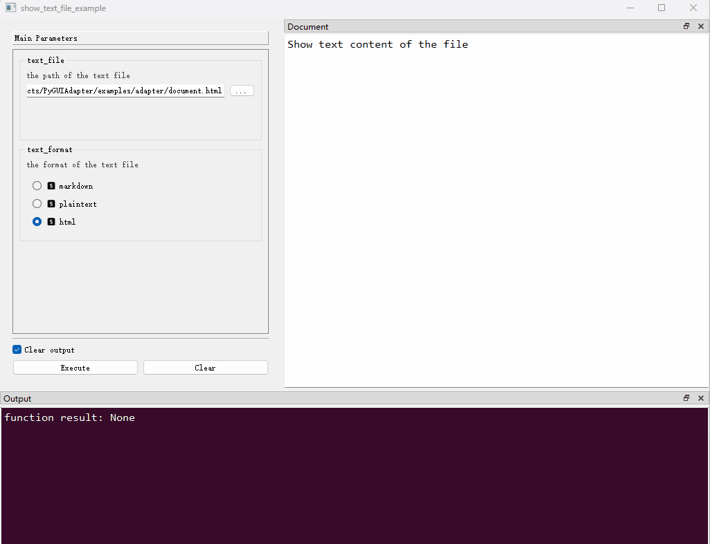
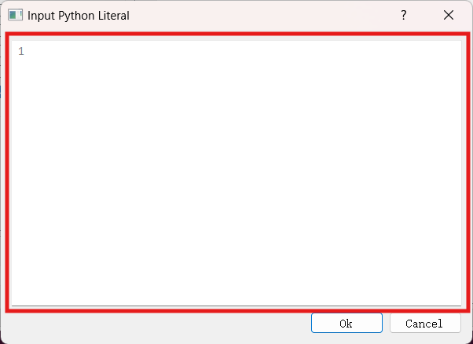

## 在函数中与用户进行交互

`PyGUIAdapter`提供了多种方式，使得开发者可以在其函数允许过程中与用户进行交互。开发者可以在函数运行过程中弹出对话框，向用户展示一些信息，或者请求用户对某些信息进行再次确认，开发者也可以在函数运行过程中弹出输入框，要求用户输入某些数据......

通过合理使用交互手段，开发者可以使整个应用程序更加易用，增强用户体验。


### 一、弹出消息对话框

> 消息对话框相关API定义在[`pyguiadapter.adapter.udialog`]()模块中

#### （一）一般消息对话框

`PyGUIAdapter`提供了四种标准的消息对话框，可以用于展示不同级别的提示信息。

**1、Information消息对话框**

用于提示一般性信息。

```python
def show_info_dialog(
    text: str,
    title: str = "Information",
    buttons: StandardButton | StandardButtons = QMessageBox.Ok,
    default_button: StandardButton = QMessageBox.NoButton,
    **kwargs,
) -> int | StandardButton:
    ...

```


**2、Warning消息对话框**

用于提示警告信息。

```python
def show_warning_dialog(
    text: str,
    title: str = "Warning",
    buttons: StandardButton | StandardButtons = QMessageBox.Ok,
    default_button: StandardButton = QMessageBox.NoButton,
    **kwargs,
) -> int | StandardButton:
    ...
```


**3、Critical消息对话框**

用于提示严重错误信息。

```python
def show_critical_dialog(
    text: str,
    title: str = "Critical",
    buttons: StandardButton | StandardButtons = QMessageBox.Ok,
    default_button: StandardButton = QMessageBox.NoButton,
    **kwargs,
) -> int | StandardButton:
    ...
```


**4、Question对话框**

用于提示问询信息，并且可以从用户处获得问询结果。

```python
def show_question_dialog(
    text: str,
    title: str = "Question",
    buttons: StandardButton | StandardButtons = QMessageBox.Yes | QMessageBox.No,
    default_button: StandardButton = QMessageBox.NoButton,
    **kwargs,
) -> int | StandardButton:
    ...
```


下面，提供一个综合性的示例：

```python
from pyguiadapter.adapter import GUIAdapter
from pyguiadapter.adapter import udialog
from pyguiadapter.adapter.ucontext import uprint
from pyguiadapter.extend_types import text_t


def dialog_example(
        info_message: text_t,
        warning_message: text_t,
        error_message: text_t,
        question_message: text_t,
):
    if info_message:
        udialog.show_info_messagebox(
            text=info_message,
            title="Information",
            buttons=udialog.QMessageBox.Ok | udialog.QMessageBox.No,
            default_button=udialog.QMessageBox.Ok,
        )

    if warning_message:
        udialog.show_warning_messagebox(
            text=warning_message,
            title="Warning",
            buttons=udialog.QMessageBox.Ok | udialog.QMessageBox.No,
            default_button=udialog.QMessageBox.Ok,
        )

    if error_message:
        udialog.show_critical_messagebox(
            text=error_message,
            title="Error",
            buttons=udialog.QMessageBox.Ok | udialog.QMessageBox.No,
            default_button=udialog.QMessageBox.Ok,
        )

    if question_message:
        answer = udialog.show_question_messagebox(
            text=question_message,
            title="Question",
            buttons=udialog.QMessageBox.Yes | udialog.QMessageBox.No,
            default_button=udialog.QMessageBox.No,
        )
        if answer == udialog.QMessageBox.Yes:
            uprint("Your Choice: Yes")
            udialog.show_info_messagebox("You Choose Yes!", title="Answer")
        else:
            uprint("Your Choice: No")
            udialog.show_info_messagebox("You Choose No!", title="Answer")


if __name__ == "__main__":
    adapter = GUIAdapter()
    adapter.add(dialog_example)
    adapter.run()

```


#### （二）特殊消息对话框

除了上述四种标准消息对话框，`PyGUIAdapter`还提供了几种特殊的对话框

**1、展示文本内容**

`PyGUIAdapter`允许开发者通过对话框展示长文本内容，而且支持多种文本格式：

- `markdown`（默认格式）
- `plaintext`
- `html`

> 注意：对于`html`支持有限，仅支持部分html标签，不支持css3和html5。

API如下：

```python
import pyguiadapter.utils.messagebox


def show_text_content(
        text_content: str,
        text_format: Literal["markdown", "plaintext", "html"] = "markdown",
        size: Tuple[int, int] = None,
        title: str | None = "",
        icon: utils.IconType = None,
        buttons: int | pyguiadapter.utils.messagebox.StandardButtons | None = QDialogButtonBox.Ok,
        resizeable: bool = True,
):
    ...
```

一个简单的实例：

```python
from typing import Literal

from pyguiadapter.adapter import GUIAdapter
from pyguiadapter.adapter import udialog
from pyguiadapter.extend_types import text_t


def show_text_context_example(
        content: text_t, text_format: Literal["markdown", "plaintext", "html"] = "markdown"
):
    if content:
        udialog.show_text_content(
            title="Hello",
            text_content=content,
            text_format=text_format,
            size=(600, 400),
        )


if __name__ == "__main__":
    adapter = GUIAdapter()
    adapter.add(show_text_context_example)
    adapter.run()

```


**2、展示文本文件内容**

`PyGUIAdapter`还允许开发者通过对话框展示文本文件内容。

```python
import pyguiadapter.utils.messagebox


def show_text_file(
        text_file: str,
        text_format: Literal["markdown", "plaintext", "html"] = "markdown",
        size: Tuple[int, int] = None,
        title: str | None = "",
        icon: utils.IconType = None,
        buttons: int | pyguiadapter.utils.messagebox.StandardButtons | None = QDialogButtonBox.Ok,
        resizeable: bool = True,
):
    ...
```

示例代码如下：

```python
import os.path
from typing import Literal

from pyguiadapter.adapter import GUIAdapter
from pyguiadapter.adapter import udialog
from pyguiadapter.exceptions import ParameterError
from pyguiadapter.extend_types import file_t


def show_text_file_example(
        text_file: file_t,
        text_format: Literal["markdown", "plaintext", "html"] = "markdown",
):
    """
    Show text content of the file

    @param text_file: the path of the text file
    @param text_format: the format of the text file
    @return:

    @params
    [text_file]
    filters = "Text files(*.txt);;Markdown files(*.md);;HTML files(*.html);;All files(*.*)"
    @end
    """
    text_file = text_file.strip()
    if not text_file:
        raise ParameterError("text_file", "text_file is empty!")

    if not os.path.isfile(text_file):
        udialog.show_critical_messagebox(text="File not found", title="Error")
        return
    filename = os.path.basename(text_file)
    if text_file:
        udialog.show_text_file(
            text_file=text_file,
            text_format=text_format,
            title=f"View - {filename}",
            size=(600, 400),
        )


if __name__ == "__main__":
    adapter = GUIAdapter()
    adapter.add(show_text_context_example)
    adapter.add(show_text_file_example)
    adapter.run()

```




#### （三）自定义消息对话框

> 为了实现自定义对话框，开发者需要掌握一定`pyqt`或`pyside`

如果`PyGUIAdapter`内置的消息对话框不能满足需要，开发者也可以自定义消息对话框。一般流程如下：


**1、继承`pyguiadater.adapter.BaseCustomDialog`实现自定义对话框类**

开发者需要在自定义对话框类中实现`get_result()`抽象方法，后续，开发者可以在函数中获取该方法的返回值。

**2、调用`udialog.show_custom_dialog()`弹出自定义对话框**

```python
def show_custom_dialog(
    dialog_class: Type[BaseCustomDialog], **kwargs
) -> Any:
    ...
```

`udialog.show_custom_dialog()`的第一个参数是自定义对话框类，第一个参数之后的关键字参数将作为自定义对话框`__init__()`函数的参数。

`udialog.show_custom_dialog()`将返回`get_result()`方法的返回值。


下面给出一个具体示例：

```python
from datetime import date, datetime
from typing import Any
from uuid import uuid1

from qtpy.QtWidgets import QWidget, QVBoxLayout, QLabel, QDialogButtonBox

from pyguiadapter.adapter import GUIAdapter, BaseCustomDialog
from pyguiadapter.adapter import udialog
from pyguiadapter.adapter.ucontext import uprint
from pyguiadapter.exceptions import ParameterError


class UserInfoDialog(BaseCustomDialog):
    def __init__(
            self,
            parent: QWidget,
            username: str,
            nickname: str,
            user_id: str,
            birthdate: date,
            join_time: datetime,
            **kwargs,
    ):
        super().__init__(parent, **kwargs)

        self.setWindowTitle("Confirm")

        self._confirmed = False
        self._user_info = {
            "username": username,
            "nickname": nickname,
            "user_id": user_id,
            "birthdate": birthdate,
            "join_time": join_time,
        }

        self._button_box = QDialogButtonBox(self)
        self._button_box.setStandardButtons(
            QDialogButtonBox.Ok | QDialogButtonBox.Cancel
        )
        self._button_box.accepted.connect(self._on_accepted)
        self._button_box.rejected.connect(self._on_rejected)

        layout = QVBoxLayout()
        username_label = QLabel(self)
        username_label.setText(f"username: {username}")
        layout.addWidget(username_label)
        nickname_label = QLabel(self)
        nickname_label.setText(f"nickname: {nickname}")
        layout.addWidget(nickname_label)
        user_id_label = QLabel(self)
        user_id_label.setText(f"user_id: {user_id}")
        layout.addWidget(user_id_label)
        birthdate_label = QLabel(self)
        birthdate_label.setText(f"birthdate: {birthdate}")
        layout.addWidget(birthdate_label)
        join_time_label = QLabel(self)
        join_time_label.setText(f"join_time: {join_time}")
        layout.addWidget(join_time_label)
        layout.addWidget(self._button_box)
        self.setLayout(layout)

    def get_result(self) -> Any:
        if self._confirmed:
            return self._user_info
        return None

    def _on_accepted(self) -> None:
        self._confirmed = True
        self.accept()

    def _on_rejected(self) -> None:
        self._confirmed = False
        self.reject()


def add_user_example(
        username: str,
        nickname: str,
        user_id: str,
        birth_date: date,
        join_time: datetime,
):
    if not username:
        raise ParameterError("username", "username is empty")

    if not user_id:
        udialog.show_warning_messagebox("user_id is empty, a random one will be generated!")
        user_id = uuid1().hex

    result = udialog.show_custom_dialog(
        UserInfoDialog,
        username=username,
        nickname=nickname,
        user_id=user_id,
        birthdate=birth_date,
        join_time=join_time,
    )
    if result is not None:
        udialog.show_info_messagebox(f"user added!")
        uprint(result)
        return
    udialog.show_info_messagebox(f"user not added!")


if __name__ == "__main__":
    adapter = GUIAdapter()
    adapter.add(add_user_example)
    adapter.run()

```


### 二、弹出输入框

> 输入框相关API在[`pyguiadapter.adapter.uinput`]()模块中定义

`PyGUIAdapter`允许开发者在函数运行过程中弹出输入框，以便开发者动态地从获取用户输入。`PyGUIAdapter`内置了多种类型的输入框，用以输入不同类型的数据。若内置的输入框无法满足需求，开发者也可以自定义输入框。

#### （一）内置输入框类型

**1、整数输入框**

```python
def get_int(
    title: str = "Input Integer",
    label: str = "",
    value: int = 0,
    min_value: int = -2147483647,
    max_value: int = 2147483647,
    step: int = 1,
) -> int | None:
	...
```

**2、单行文本输入框**

```python
def get_string(
    title: str = "Input Text",
    label: str = "",
    echo: EchoMode | None = None,
    text: str = "",
) -> str | None:
    ...
```

**3、多行文本输入框**

```python
def get_text(
    title: str = "Input Text",
    label: str = "",
    text: str = "",
) -> str | None:
    ...
```

**4、浮点数输入框**

```python
def get_float(
    title: str = "Input Float",
    label: str = "",
    value: float = 0.0,
    min_value: float = -2147483647.0,
    max_value: float = 2147483647.0,
    decimals: int = 3,
    step: float = 1.0,
) -> float | None:
    ...
```

**5、多选一输入框**

```python
def get_selected_item(
    items: List[str],
    title: str = "Select Item",
    label: str = "",
    current: int = 0,
    editable: bool = False,
) -> str | None:
    ...
```

**6、颜色输入框**

```python
def get_color(
    initial: QColor | str | tuple = "white",
    title: str = "",
    alpha_channel: bool = True,
    return_type: Literal["tuple", "str", "QColor"] = "str",
) -> Tuple[int, int, int] | Tuple[int, int, int] | str | QColor | None:
    ...
```

**7、目录选择对话框**

```python
def get_existing_directory(
    title: str = "",
    start_dir: str = "",
) -> str | None:
	...
```

**8、打开文件对话框**

```python
def get_open_file(
    title: str = "",
    start_dir: str = "",
    filters: str = "",
) -> str | None:
	...
```

**9、保存文件对话框**

```python
def get_save_file(
    title: str = "",
    start_dir: str = "",
    filters: str = "",
) -> str | None:
	...
```

**10、选择多个文件对话框**

```python
def get_open_files(
    title: str = "",
    start_dir: str = "",
    filters: str = "",
) -> List[str] | None:
	...
```

**11、Json对象输入框**
```python
def get_json_object(
    title: str = "Input Json",
    icon: IconType = None,
    size: Tuple[int, int] = (600, 400),
    ok_button_text: str = "Ok",
    cancel_button_text: Optional[str] = "Cancel",
    initial_text: str = "",
    auto_indent: bool = True,
    indent_size: int = 4,
    auto_parentheses: bool = True,
    line_wrap_mode: LineWrapMode = LineWrapMode.WidgetWidth,
    line_wrap_width: int = 88,
    font_family: Union[str, Sequence[str], None] = "Consolas",
    font_size: Optional[int] = None,
    **kwargs,
) -> Any:
    ...
```

**12、Python字面值输入框**
```python
def get_py_literal(
    title: str = "Input Python Literal",
    icon: IconType = None,
    size: Tuple[int, int] = (600, 400),
    ok_button_text: str = "Ok",
    cancel_button_text: Optional[str] = "Cancel",
    initial_text: str = "",
    auto_indent: bool = True,
    indent_size: int = 4,
    auto_parentheses: bool = True,
    line_wrap_mode: LineWrapMode = LineWrapMode.WidgetWidth,
    line_wrap_width: int = 88,
    font_family: Union[str, Sequence[str], None] = "Consolas",
    font_size: Optional[int] = None,
    **kwargs,
) -> PyLiteralType:
    ...
```

> `PyLiteralType`是一个联合类型，表示Python中支持的字面量类型，包括：
>
> ```python
> PyLiteralType = Union[bool, int, float, bytes, str, list, tuple, dict, set, type(None)]
> ```

一个简单的示例：

```python
from pyguiadapter.adapter import GUIAdapter
from pyguiadapter.adapter import uinput
from pyguiadapter.adapter.ucontext import uprint
from pyguiadapter.extend_types import choices_t


# noinspection SpellCheckingInspection
def uinput_example(inputs: choices_t):
    """
    Example of getting user inputs inside the function
    @param inputs: choose what you want to get from user
    @return:

    @params
    [inputs]
    choices = ["int", "str", "text", "float", "item", "color", "dir", "file", "save_file", "files", "json object", "python literal"]
    columns = 2
    @end
    """
    if "int" in inputs:
        value = uinput.get_int(title="Input Integer", label="Enter an integer:")
        uprint("User inputs: ", value)
    if "str" in inputs:
        value = uinput.get_string(title="Input Text", label="Enter a string:")
        uprint("User inputs: ", value)
    if "text" in inputs:
        value = uinput.get_text(title="Input Text", label="Enter a string:")
        uprint("User inputs: ", value)
    if "float" in inputs:
        value = uinput.get_float(title="Input Float", label="Enter a float:")
        uprint("User inputs: ", value)

    if "item" in inputs:
        value = uinput.get_selected_item(
            items=["Item 1", "Item 2", "Item 3", "Item 4"],
            title="Select Item",
            label="Select an item:",
        )
        uprint("User inputs: ", value)
    if "color" in inputs:
        value = uinput.get_color(title="Select Color", alpha_channel=True)
        uprint("User inputs: ", value)
    if "dir" in inputs:
        value = uinput.get_existing_directory(title="Select Directory")
        uprint("User inputs: ", value)
    if "file" in inputs:
        value = uinput.get_open_file(title="Select File")
        uprint("User inputs: ", value)
    if "save_file" in inputs:
        value = uinput.get_save_file(title="Select File")
        uprint("User inputs: ", value)
    if "files" in inputs:
        value = uinput.get_open_files(title="Select Files")
        uprint("User inputs: ", value)
    if "json object" in inputs:
        value = uinput.get_json_object(title="Input Json Object")
        uprint("User inputs: ", value, f" {type(value)}")
    if "python literal" in inputs:
        value = uinput.get_py_literal(title="Input Python Literal")
        uprint("User inputs: ", value, f" {type(value)}")


if __name__ == "__main__":
    adapter = GUIAdapter()
    adapter.add(uinput_example)
    adapter.run()


```


#### （二）自定义输入框类型

若内置的输入框无法满足开发者需求，开发者也可以创建自定义输入框。具体的步骤如下。

**1、创建自定义输入框类**

自定义输入框类需继承自[`pyguiadapter.utils.inputdialog.UniversalInputDialog`]()类。开发者必须实现以下两个抽象方法。

（1）`create_main_widget()`方法

```
@abstractmethod
def create_main_widget(self) -> QWidget:
    pass
```

开发者需在该方法中创建输入框的主控件并将其返回。所谓`主控件（main widget）`就是输入框窗口标题栏之下，确认按钮之上，中间的位置:



(2) `get_result()`方法

```python
    @abstractmethod
    def get_result(self) -> Any:
        pass
```

该方法用于从输入框获取用户输入的值。


**2、调用`uinput.get_custom_input()`函数弹出自定义输入框，并获得用户输入值**

```python
def get_custom_input(
    input_dialog_class: Type[UniversalInputDialog],
    **input_dialog_args,
) -> Any:
    ...
```

`get_custom_input()`函数的第一个参数`input_dialog_class`就是开发者创建的自定义输入框类，第二个参数`input_dialog_args`则是将传递给自动输入框类构造函数的参数。

关于`get_custom_input()`函数的返回值，存在以下两种情况：

（1）若自定义输入框被`reject`，则`get_custom_input()`函数返回`None`

（2）若自定义输入框被`accept`，则`get_custom_input()`函数的返回值就是`get_result()`方法的返回值。

---

下面，通过一个实际的例子演示如何创建自定义输入框。这次我们选择用QT提供的可视化设计工具`QT设计师`来设计输入框的主控件。

假设我们需要为以下类型创建自定义输入框：

```python
@dataclasses.dataclass
class UserInfo:
    username: str
    birthday: date
    address: str
    email: str
    phone: str
    description: str
```

**第一步：**创建对应的`自定义输入框类`，假设其名称为`UserInfoDialog`。

```python
class UserInfoDialog(UniversalInputDialog):

    def __init__(
        self,
        parent: Optional[QWidget],
        title: str = "",
        icon: IconType = None,
        size: Tuple[int, int] = (400, 300),
        ok_button_text: str = "Ok",
        cancel_button_text: Optional[str] = "Cancel",
        **kwargs
    ):
        super().__init__(
            parent,
            title=title,
            icon=icon,
            size=size,
            ok_button_text=ok_button_text,
            cancel_button_text=cancel_button_text,
            **kwargs
        )

    def get_result(self) -> Any:
        pass

    def create_main_widget(self) -> QWidget:
        pass
```

可以看到，`create_main_widget()`和`get_result()`目前都还是未实现的状态，后面，我们将逐步实现它们。

同时，你可能注意到了`UserInfoDialog`的构造函数中有一些参数，这些参数来自父类`UniversalInputDialog`，它们的作用从名称就能看出来，这里就不赘述。

现在，让我们在这些参数之后添加一个参数`initial_user_info`，这个参数将用来为界面上的控件设置初始值，现在`UserInfoDialog`的构造函数如下：

```python
class UserInfoDialog(UniversalInputDialog):

    def __init__(
        self,
        parent: Optional[QWidget],
        title: str = "",
        icon: IconType = None,
        size: Tuple[int, int] = (400, 300),
        ok_button_text: str = "Ok",
        cancel_button_text: Optional[str] = "Cancel",
        initial_user_info: Optional[UserInfo] = None,
        **kwargs
    ):
        self._initial_user_info: Optional[UserInfo] = initial_user_info
        super().__init__(
            parent,
            title=title,
            icon=icon,
            size=size,
            ok_button_text=ok_button_text,
            cancel_button_text=cancel_button_text,
            **kwargs
        )

```


**第二步**：创建`主控件`，实现`create_main_widget()`函数。

前面说过，这次我们选择使用`QT设计师`，而不是手动写代码的方式来实现主控件。

根据`UserInfo`的字段，在`QT设计师`选择合适的控件，通过拖拽的方式进行布局，最终将布局好的界面保存为`.ui`文件，假设名称为`user_info_dialog_main_widget.ui`。将该文件与自定义输入框的源码文件放在同一目录下。

> 我们需要在`QT设计师`中为字段对应的输入控件合理命名，后续我们将通过其名称在代码中引用它们。在本例中，这些控件的名称如下：
>
> 
>
> 

在`create_main_widget()`中加载ui文件，获取各字段对应输入控件，根据`inital_user_info`设置初始值，最后将最外层的控件作为主控件返回。

```python
    def create_main_widget(self) -> QWidget:
        ui_file = "user_info_dialog_main_widget.ui"
        # create widget from ui file
        main_widget = loadUi(ui_file)

        # obtain input widgets for UserInfo fields and set its initial values from initial_user_info
        self._username_edit = main_widget.findChild(QLineEdit, "username_edit")
        if self._initial_user_info:
            self._username_edit.setText(self._initial_user_info.username)

        self._birthday_edit = main_widget.findChild(QDateEdit, "birthday_edit")
        if self._initial_user_info:
            self._birthday_edit.setDate(self._initial_user_info.birthday)

        self._address_edit = main_widget.findChild(QLineEdit, "address_edit")
        if self._initial_user_info:
            self._address_edit.setText(self._initial_user_info.address)

        self._email_edit = main_widget.findChild(QLineEdit, "email_edit")
        if self._initial_user_info:
            self._email_edit.setText(self._initial_user_info.email)

        self._phone_edit = main_widget.findChild(QLineEdit, "phone_edit")
        if self._initial_user_info:
            self._phone_edit.setText(self._initial_user_info.phone)

        self._description_edit = main_widget.findChild(QTextEdit, "description_edit")
        if self._initial_user_info:
            self._description_edit.setText(self._initial_user_info.description)

        return main_widget
```

为了后续引用方便，我们可以在构造函数中预先定义`self._username_edit`、`self._birthday_edit`等成员变量。

于是，我们的`UserInfoDialog`类现在变成了下面这个样子：

```python
class UserInfoDialog(UniversalInputDialog):

    def __init__(
        self,
        parent: Optional[QWidget],
        title: str = "",
        icon: IconType = None,
        size: Tuple[int, int] = (400, 300),
        ok_button_text: str = "Ok",
        cancel_button_text: Optional[str] = "Cancel",
        initial_user_info: Optional[UserInfo] = None,
        **kwargs
    ):
        self._description_edit: Optional[QTextEdit] = None
        self._phone_edit: Optional[QLineEdit] = None
        self._email_edit: Optional[QLineEdit] = None
        self._address_edit: Optional[QLineEdit] = None
        self._birthday_edit: Optional[QDateEdit] = None
        self._username_edit: Optional[QLineEdit] = None
        self._initial_user_info: Optional[UserInfo] = initial_user_info
        super().__init__(
            parent,
            title=title,
            icon=icon,
            size=size,
            ok_button_text=ok_button_text,
            cancel_button_text=cancel_button_text,
            **kwargs
        )

    def get_result(self) -> Any:
        pass

    def create_main_widget(self) -> QWidget:
        ui_file = "user_info_dialog_main_widget.ui"
        # create widget from ui file
        main_widget = loadUi(ui_file)

        # obtain input widgets for UserInfo fields and set its initial values from initial_user_info
        self._username_edit = main_widget.findChild(QLineEdit, "username_edit")
        if self._initial_user_info:
            self._username_edit.setText(self._initial_user_info.username)

        self._birthday_edit = main_widget.findChild(QDateEdit, "birthday_edit")
        if self._initial_user_info:
            self._birthday_edit.setDate(self._initial_user_info.birthday)

        self._address_edit = main_widget.findChild(QLineEdit, "address_edit")
        if self._initial_user_info:
            self._address_edit.setText(self._initial_user_info.address)

        self._email_edit = main_widget.findChild(QLineEdit, "email_edit")
        if self._initial_user_info:
            self._email_edit.setText(self._initial_user_info.email)

        self._phone_edit = main_widget.findChild(QLineEdit, "phone_edit")
        if self._initial_user_info:
            self._phone_edit.setText(self._initial_user_info.phone)

        self._description_edit = main_widget.findChild(QTextEdit, "description_edit")
        if self._initial_user_info:
            self._description_edit.setText(self._initial_user_info.description)

        return main_widget

```

现在，离完成只有一步之遥，接下来，只需要实现`get_result()`即可大功告成。

**第三步：**实现`get_result()`，返回用户输入结果。

在我们的例子中，`get_result()`应当返回一个`UserInfo`对象。这将是非常简单的一件事——从字段对应的控件获取当前值，用这些值实例化`UserInfo`，然后返回它，就这么简单：

```python
    def get_result(self) -> UserInfo:
        username = self._username_edit.text()
        birthday = self._birthday_edit.date().toPyDate()
        address = self._address_edit.text()
        email = self._email_edit.text()
        phone = self._phone_edit.text()
        description = self._description_edit.toPlainText()
        new_user_info = UserInfo(
            username=username,
            birthday=birthday,
            address=address,
            email=email,
            phone=phone,
            description=description,
        )
        return new_user_info
```


现在，我们的`UserInfoDialog`已经完成了，完整的代码如下：

```python
class UserInfoDialog(UniversalInputDialog):

    def __init__(
        self,
        parent: Optional[QWidget],
        title: str = "",
        icon: IconType = None,
        size: Tuple[int, int] = (400, 300),
        ok_button_text: str = "Ok",
        cancel_button_text: Optional[str] = "Cancel",
        initial_user_info: Optional[UserInfo] = None,
        **kwargs
    ):
        self._description_edit: Optional[QTextEdit] = None
        self._phone_edit: Optional[QLineEdit] = None
        self._email_edit: Optional[QLineEdit] = None
        self._address_edit: Optional[QLineEdit] = None
        self._birthday_edit: Optional[QDateEdit] = None
        self._username_edit: Optional[QLineEdit] = None
        self._initial_user_info: Optional[UserInfo] = initial_user_info
        super().__init__(
            parent,
            title=title,
            icon=icon,
            size=size,
            ok_button_text=ok_button_text,
            cancel_button_text=cancel_button_text,
            **kwargs
        )

    def get_result(self) -> UserInfo:
        username = self._username_edit.text()
        birthday = self._birthday_edit.date().toPyDate()
        address = self._address_edit.text()
        email = self._email_edit.text()
        phone = self._phone_edit.text()
        description = self._description_edit.toPlainText()
        new_user_info = UserInfo(
            username=username,
            birthday=birthday,
            address=address,
            email=email,
            phone=phone,
            description=description,
        )
        return new_user_info

    def create_main_widget(self) -> QWidget:
        ui_file = "user_info_dialog_main_widget.ui"
        # create widget from ui file
        main_widget = loadUi(ui_file)

        # obtain input widgets for UserInfo fields and set its initial values from initial_user_info
        self._username_edit = main_widget.findChild(QLineEdit, "username_edit")
        if self._initial_user_info:
            self._username_edit.setText(self._initial_user_info.username)

        self._birthday_edit = main_widget.findChild(QDateEdit, "birthday_edit")
        if self._initial_user_info:
            self._birthday_edit.setDate(self._initial_user_info.birthday)

        self._address_edit = main_widget.findChild(QLineEdit, "address_edit")
        if self._initial_user_info:
            self._address_edit.setText(self._initial_user_info.address)

        self._email_edit = main_widget.findChild(QLineEdit, "email_edit")
        if self._initial_user_info:
            self._email_edit.setText(self._initial_user_info.email)

        self._phone_edit = main_widget.findChild(QLineEdit, "phone_edit")
        if self._initial_user_info:
            self._phone_edit.setText(self._initial_user_info.phone)

        self._description_edit = main_widget.findChild(QTextEdit, "description_edit")
        if self._initial_user_info:
            self._description_edit.setText(self._initial_user_info.description)

        return main_widget

   
```

让我们写一个函数来测试一下它吧。

```python
def user_info_example(
    initial_username: str = "",
    initial_birthday: date = date(1990, 1, 1),
    initial_address: str = "",
    initial_email: str = "",
    initial_phone: str = "",
    initial_description: text_t = "",
):
    user_info = uinput.get_custom_input(
        UserInfoDialog,
        title="Get User Info",
        size=(350, 400),
        ok_button_text="Confirm",
        cancel_button_text="Dismiss",
        initial_user_info=UserInfo(
            username=initial_username,
            birthday=initial_birthday,
            address=initial_address,
            email=initial_email,
            phone=initial_phone,
            description=initial_description,
        ),
    )
    uprint(user_info)


if __name__ == "__main__":
    adapter = GUIAdapter()
    adapter.add(user_info_example)
    adapter.run()

```


最后，贴上所有代码：

```python
import dataclasses
from datetime import date
from typing import Optional, Tuple

from qtpy.QtWidgets import QWidget, QLineEdit, QTextEdit, QDateEdit
from qtpy.uic import loadUi

from pyguiadapter.adapter import uinput, GUIAdapter
from pyguiadapter.adapter.ucontext import uprint
from pyguiadapter.extend_types import text_t
from pyguiadapter.utils import IconType
from pyguiadapter.utils.inputdialog import UniversalInputDialog


@dataclasses.dataclass
class UserInfo:
    username: str
    birthday: date
    address: str
    email: str
    phone: str
    description: str


class UserInfoDialog(UniversalInputDialog):

    def __init__(
        self,
        parent: Optional[QWidget],
        title: str = "",
        icon: IconType = None,
        size: Tuple[int, int] = (400, 300),
        ok_button_text: str = "Ok",
        cancel_button_text: Optional[str] = "Cancel",
        initial_user_info: Optional[UserInfo] = None,
        **kwargs
    ):
        self._description_edit: Optional[QTextEdit] = None
        self._phone_edit: Optional[QLineEdit] = None
        self._email_edit: Optional[QLineEdit] = None
        self._address_edit: Optional[QLineEdit] = None
        self._birthday_edit: Optional[QDateEdit] = None
        self._username_edit: Optional[QLineEdit] = None
        self._initial_user_info: Optional[UserInfo] = initial_user_info
        super().__init__(
            parent,
            title=title,
            icon=icon,
            size=size,
            ok_button_text=ok_button_text,
            cancel_button_text=cancel_button_text,
            **kwargs
        )

    def get_result(self) -> UserInfo:
        username = self._username_edit.text()
        birthday = self._birthday_edit.date().toPyDate()
        address = self._address_edit.text()
        email = self._email_edit.text()
        phone = self._phone_edit.text()
        description = self._description_edit.toPlainText()
        new_user_info = UserInfo(
            username=username,
            birthday=birthday,
            address=address,
            email=email,
            phone=phone,
            description=description,
        )
        return new_user_info

    def create_main_widget(self) -> QWidget:
        ui_file = "user_info_dialog_main_widget.ui"
        # create widget from ui file
        main_widget = loadUi(ui_file)

        # obtain input widgets for UserInfo fields and set its initial values from initial_user_info
        self._username_edit = main_widget.findChild(QLineEdit, "username_edit")
        if self._initial_user_info:
            self._username_edit.setText(self._initial_user_info.username)

        self._birthday_edit = main_widget.findChild(QDateEdit, "birthday_edit")
        if self._initial_user_info:
            self._birthday_edit.setDate(self._initial_user_info.birthday)

        self._address_edit = main_widget.findChild(QLineEdit, "address_edit")
        if self._initial_user_info:
            self._address_edit.setText(self._initial_user_info.address)

        self._email_edit = main_widget.findChild(QLineEdit, "email_edit")
        if self._initial_user_info:
            self._email_edit.setText(self._initial_user_info.email)

        self._phone_edit = main_widget.findChild(QLineEdit, "phone_edit")
        if self._initial_user_info:
            self._phone_edit.setText(self._initial_user_info.phone)

        self._description_edit = main_widget.findChild(QTextEdit, "description_edit")
        if self._initial_user_info:
            self._description_edit.setText(self._initial_user_info.description)

        return main_widget


def user_info_example(
    initial_username: str = "",
    initial_birthday: date = date(1990, 1, 1),
    initial_address: str = "",
    initial_email: str = "",
    initial_phone: str = "",
    initial_description: text_t = "",
):
    user_info = uinput.get_custom_input(
        UserInfoDialog,
        title="Get User Info",
        size=(350, 400),
        ok_button_text="Confirm",
        cancel_button_text="Dismiss",
        initial_user_info=UserInfo(
            username=initial_username,
            birthday=initial_birthday,
            address=initial_address,
            email=initial_email,
            phone=initial_phone,
            description=initial_description,
        ),
    )
    uprint(user_info)


if __name__ == "__main__":
    adapter = GUIAdapter()
    adapter.add(user_info_example)
    adapter.run()

```

> `user_info_dialog_main_widget.ui`文件可在[`examples/adapter`]()目录下找到。