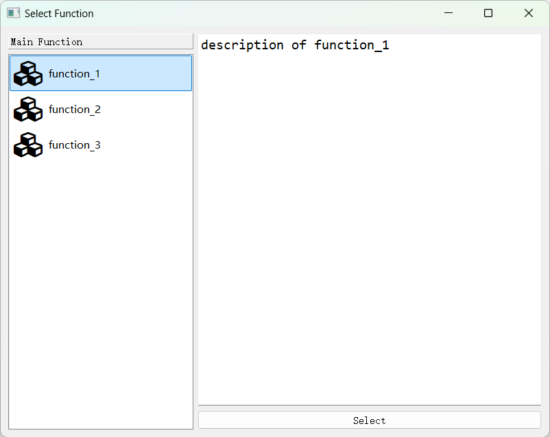
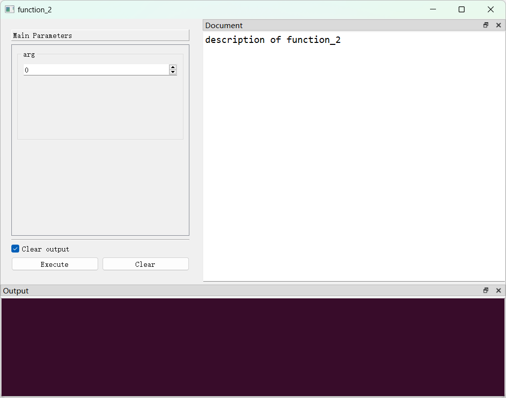
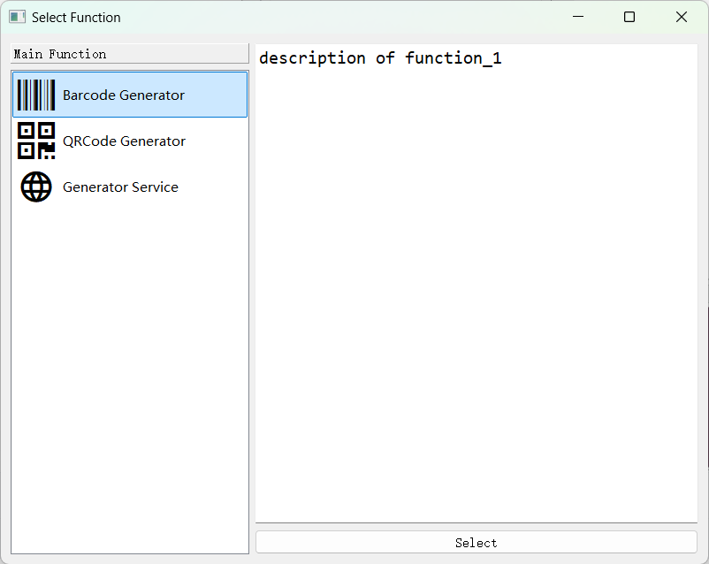
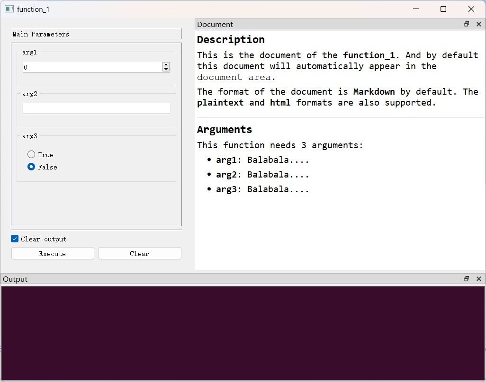
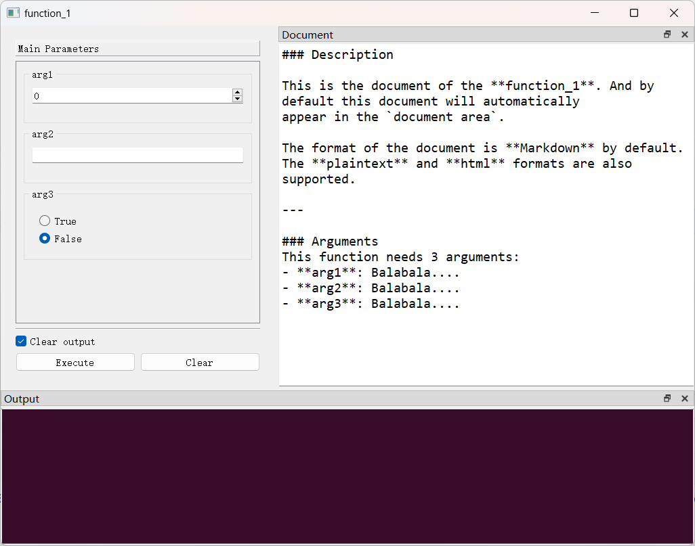
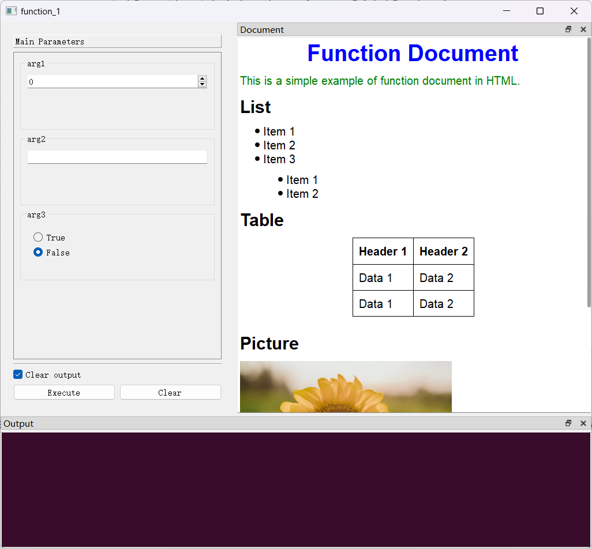
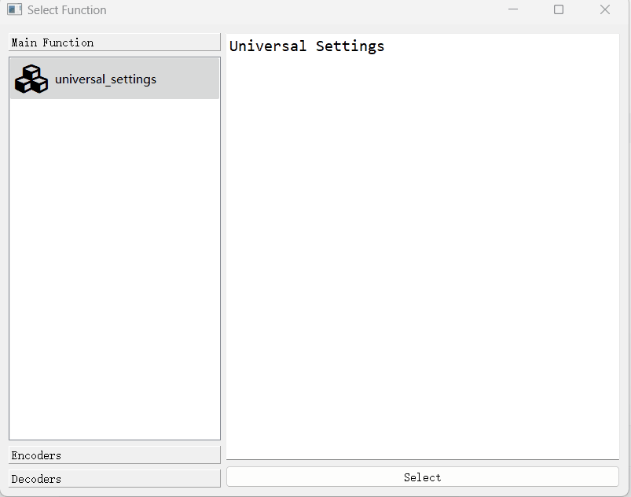

## 添加多个函数


开发者可以向 `GUIAdapter`实例中添加多个函数，在此情况下，`PyGUIAdapter`将生成`函数选择窗口`，以便用户选择需要执行的功能。

### 一、基本用法

```python
from pyguiadapter.adapter import GUIAdapter


def function_1(arg: int):
    """
    description of function_1
    """
    pass


def function_2(arg: int):
    """
    description of function_2
    """
    pass


def function_3(arg: int):
    """
    description of function_3
    """
    pass


if __name__ == "__main__":
    adapter = GUIAdapter()
    adapter.add(function_1)
    adapter.add(function_2)
    adapter.add(function_3)
    adapter.run()

```



如上图所，所有添加到`GUIAdapter`实例中的函数，都会显示在`函数选择窗口`左侧的函数列表中。函数列表中的条目有一个默认的图标，其名称默认为对应的函数名。

当用户选中列表中的某个条目，双击它或者点击右下方`Select`按钮，即可进入对应函数的执行界面：



---

### 二、修改函数图标和显示名称

如前面所说，函数列表中的条目默认情况下，基于相同的图标，显示的名称则为对应的函数名。开发者可以修改这些默认的行为，比如，为函数设置一个更具可读性的显示名称，或者为函数设置不同的图标以便用户更好地区分它们。

```python
from pyguiadapter.adapter import GUIAdapter


def function_1(arg: int):
    """
    description of function_1
    """
    pass


def function_2(arg: int):
    """
    description of function_2
    """
    pass


def function_3(arg: int):
    """
    description of function_3
    """
    pass


if __name__ == "__main__":
    adapter = GUIAdapter()
    adapter.add(function_1, display_name="Barcode Generator", icon="ei.barcode")
    adapter.add(function_2, display_name="QRCode Generator", icon="ei.qrcode")
    adapter.add(function_3, display_name="Generator Service", icon="mdi.web")
    adapter.run()

```

如上面的代码所演示的那样，开发者通过`GUIAdapter.add()`函数的`display_name`参数和`icon`参数来指定函数的显示名称及图标。



---

### 三、函数文档

在`函数选择窗口`和`函数执行窗口`均有一块区域用于显示函数的文档。默认情况下，`PyGUIAdapter`会自动提取函数的文档字符串（docstring），并将其作为函数的文档，显示在文档区域。函数的文档默认为`Markdown`格式：

```python
from pyguiadapter.adapter import GUIAdapter


def function_1(arg1: int, arg2: str, arg3: bool):
    """
    ### Description
    This is the document of the **function_1**. And by default this document will automatically
    appear in the `document area`.

    The format of the document is **Markdown** by default. The **plaintext** and **html** formats are also
    supported.

    ---

    ### Arguments
    This function needs 3 arguments:
    - **arg1**: Balabala....
    - **arg2**: Balabala....
    - **arg3**: Balabala....

    """
    pass


if __name__ == "__main__":
    adapter = GUIAdapter()
    adapter.add(function_1)
    adapter.run()

```



开发者也可以将文档的格式设置为`plaintext`和`html`格式：

> 提示：对`html`的支持有限，仅支持部分`html`标签。

```python
from pyguiadapter.adapter import GUIAdapter


def function_1(arg1: int, arg2: str, arg3: bool):
    """
    ### Description
    This is the document of the **function_1**. And by default this document will automatically
    appear in the `document area`.

    The format of the document is **Markdown** by default. The **plaintext** and **html** formats are also
    supported.

    ---

    ### Arguments
    This function needs 3 arguments:
    - **arg1**: Balabala....
    - **arg2**: Balabala....
    - **arg3**: Balabala....

    """
    pass


if __name__ == "__main__":
    adapter = GUIAdapter()
    adapter.add(function_1, document_format="plaintext")
    adapter.run()
```



开发者也可以手动指定函数的文档，例如，可以从读取外部文件内容作为函数的文档：

```python
from pyguiadapter import utils
from pyguiadapter.adapter import GUIAdapter


def function_1(arg1: int, arg2: str, arg3: bool):
    """
    ### Description
    This is the document of the **function_1**. And by default this document will automatically
    appear in the `document area`.

    The format of the document is **Markdown** by default. The **plaintext** and **html** formats are also
    supported.

    ---

    ### Arguments
    This function needs 3 arguments:
    - **arg1**: Balabala....
    - **arg2**: Balabala....
    - **arg3**: Balabala....

    """
    pass


if __name__ == "__main__":
    adapter = GUIAdapter()
    # adapter.add(function_1)
    # adapter.add(function_1, document_format="plaintext")
    doc = utils.read_text_file("document.html")
    adapter.add(function_1, document=doc, document_format="html")
    adapter.run()

```

> 可以在[examples/adapter/function_document_example.py]()找到上述示例代码。



---

### 四、函数分组

当开发者向`GUIAdapter`添加了很多函数时，开发者可能希望按照一定的逻辑对函数进行分类，`PyGUIAdapter`提供了函数分组功能，开发者在调用`GUIAdapter.add()`方法时，可以传入`group`来指定函数的分组，`PyGUIAdapter`会将相同`group`的函数聚合到一起显示；对于指定`group`的函数，`PyGUIAdapter`会将其放置在默认组别中，该组别的名称默认为`"Main Function"`。

```python
from pyguiadapter.adapter import GUIAdapter


def mp4_encoder():
    """
    MP4 Encoder
    """
    pass


def mp3_encoder():
    """
    MP3 Encoder
    """
    pass


def avi_encoder():
    """
    AVI Encoder
    """
    pass


def ogg_encoder():
    """
    OGG Encoder
    """
    pass


def avi_decoder():
    """
    AVI Decoder
    """
    pass


def ogg_decoder():
    """
    OGG Decoder
    """
    pass


def mp3_decoder():
    """
    MP3 Decoder
    """
    pass


def mp4_decoder():
    """
    MP4 Decoder
    """
    pass


def universal_settings():
    """
    Universal Settings
    """
    pass


if __name__ == "__main__":
    adapter = GUIAdapter()
    adapter.add(universal_settings)
    adapter.add(mp4_encoder, group="Encoders")
    adapter.add(mp3_encoder, group="Encoders")
    adapter.add(avi_encoder, group="Encoders")
    adapter.add(ogg_encoder, group="Encoders")
    adapter.add(avi_decoder, group="Decoders")
    adapter.add(ogg_decoder, group="Decoders")
    adapter.add(mp3_decoder, group="Decoders")
    adapter.add(mp4_decoder, group="Decoders")
    adapter.run()

```


