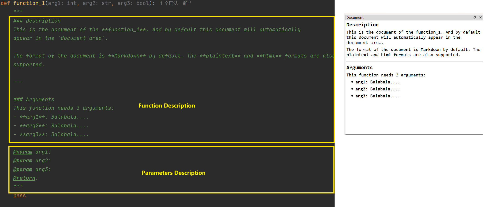

## 函数的名称、图标、文档及分组

开发者可以向 `GUIAdapter`实例中添加多个函数，在此情况下，`PyGUIAdapter`将生成`函数选择窗口（FnSelectWindow）`，以列表的形式展现所有已添加的函数，供用户自由选择。

### 一、添加多个函数

```python
from pyguiadapter.adapter import GUIAdapter


def function_1(arg: int):
    """
    description of function_1
    """
    pass


def function_2(arg: int):
    """
    description of function_2
    """
    pass


def function_3(arg: int):
    """
    description of function_3
    """
    pass


if __name__ == "__main__":
    adapter = GUIAdapter()
    adapter.add(function_1)
    adapter.add(function_2)
    adapter.add(function_3)
    adapter.run()

```


如图所示，所有添加到`GUIAdapter`实例中的函数都会显示在`函数选择窗口（FnSelectWindow）`左侧的函数列表中。函数列表将同时显示函数的名称及图标，如果没有显式地指定函数的图标和名称，`PyGUIAadpter`将使用默认的图标，显示的名称则为函数名。

当用户选中函数列表中的某个条目，双击它或者点击右下方的`Select`按钮，即可进入对应的`函数执行窗口（FnExecuteWindow）`。当用户关闭`函数执行窗口（FnSelectWindow）`，将回到函数选择界面。


---

### 二、修改函数图标（`icon`）和显示名称（`display_name`）

如前面所说，函数列表中的条目，默认情况下使用相同的图标，显示的名称则为函数名。`PyGUIAdapter`允许开发者对函数的图标（`display_icon`）和显示名称(`display_name`)，为函数设置独特的图标或更具可读性的名称，将有助于提高界面的观感并增强用户的体验。

```python
from pyguiadapter.adapter import GUIAdapter


def function_1(arg: int):
    """
    description of function_1
    """
    pass


def function_2(arg: int):
    """
    description of function_2
    """
    pass


def function_3(arg: int):
    """
    description of function_3
    """
    pass


if __name__ == "__main__":
    adapter = GUIAdapter()
    adapter.add(function_1, display_name="Barcode Generator", icon="ei.barcode")
    adapter.add(function_2, display_name="QRCode Generator", icon="ei.qrcode")
    adapter.add(function_3, display_name="Generator Service", icon="mdi.web")
    adapter.run()

```

如上面的代码所演示的那样，开发者通过`GUIAdapter.add()`函数的`display_name`参数和`icon`参数来指定函数的显示名称及图标。


---

### 三、函数的文档

在`函数选择窗口（FnSelectWindow）`和`函数执行窗口（FnExecuteWindow）`中均有一块专门的区域用于显示函数的文档。函数的文档

默认情况下，`PyGUIAdapter`会自动提取函数文档字符串（`docstring`）中函数的描述信息（包括`long description`和`short description`，但一般不包括参数的描述部分），将其作为函数的文档，其格式默认为`Markdown`。下面是一个简单的示例：

```python
from pyguiadapter.adapter import GUIAdapter


def function_1(arg1: int, arg2: str, arg3: bool):
    """
    ### Description
    This is the document of the **function_1**. And by default this document will automatically
    appear in the `document area`.

    The format of the document is **Markdown** by default. The **plaintext** and **html** formats are also
    supported.

    ---

    ### Arguments
    This function needs 3 arguments:
    - **arg1**: Balabala....
    - **arg2**: Balabala....
    - **arg3**: Balabala....

    """
    pass


if __name__ == "__main__":
    adapter = GUIAdapter()
    adapter.add(function_1)
    adapter.run()

```



上图直观地显示了`docstring`的哪些部分将被提取为函数的文档，哪些部分将被忽略。程序完整的界面如下图。


开发者也可以将文档的格式设置为`plaintext`和`html`格式：

> 提示：`文档浏览器`对`html`的支持有限，仅支持`html4`的子集，具体可以参考Qt官方文档的说明：[Supported HTML Subset | Qt GUI 5.15.17](https://doc.qt.io/qt-5/richtext-html-subset.html#table-cell-attributes)

```python
from pyguiadapter.adapter import GUIAdapter


def function_2(arg1: int, arg2: str, arg3: bool):
    """
    <h3>Description</h3>
    <p>
    This is the document of the <b>function_1</b>. And by default this document will automatically
    appear in the <strong>document area</strong>.
    </p>
    <p>
    The format of the document is <b>Markdown</b> by default. The <b>plaintext</b> and <b>html</b> formats are also
    supported.
    </p>
    <hr>
    <h3>Arguments</h3>
    <p>This function needs 3 arguments:</p>
    <ul>
    <li><b>arg1</b>: Balabala....</li>
    <li><b>arg2</b>: Balabala....</li>
    <li><b>arg3</b>: Balabala....</li>
    </ul>
    """
    pass


if __name__ == "__main__":
    adapter = GUIAdapter()
    adapter.add(function_2, document_format="html")
    adapter.run()

```


开发者也可以手动指定函数的文档，比如可以从文本文件中读取内容作为函数的文档。以下是一个简单的示例：

```python
from pyguiadapter import utils
from pyguiadapter.adapter import GUIAdapter


def function_3(arg1: int, arg2: str, arg3: bool):
    """

    @param arg1:
    @param arg2:
    @param arg3:
    @return:
    """
    pass


if __name__ == "__main__":
    adapter = GUIAdapter()
    html_doc = utils.read_text_file("document.html")
    adapter.add(function_3, document=html_doc, document_format="html")
    adapter.run()

```

> 可以在[examples/adapter/function_document_example.py]()文件中找到上述示例代码。其他所需的文件，如`document.html`以及`document.html`引用的图片资源文件都在同目录下，即[examples/adapter/]()目录下。


---

### 四、函数分组

当开发者向`GUIAdapter`实例添加了多个函数时，从便于用户查找的角度出发，开发者可能希望可以按照一定的逻辑对函数进行分类。`PyGUIAdapter`提供了函数分组功能，开发者在调用`GUIAdapter.add()`方法添加函数时，可以通过`group`参数指定函数的分组，`PyGUIAdapter`会将相同`group`的函数聚合到一起；对于未指定`group`的函数，`PyGUIAdapter`则会将其放置在默认分组中，该分组的默认名称为`"Main Function"`。

比如下面这个示例，将函数按照功能分成了三类：编码器函数`Encoders`、解码器函数`Decoder`和其他函数（默认分组）`Main Function`。

```python
from pyguiadapter.adapter import GUIAdapter


def mp4_encoder():
    """
    MP4 Encoder
    """
    pass


def mp3_encoder():
    """
    MP3 Encoder
    """
    pass


def avi_encoder():
    """
    AVI Encoder
    """
    pass


def ogg_encoder():
    """
    OGG Encoder
    """
    pass


def avi_decoder():
    """
    AVI Decoder
    """
    pass


def ogg_decoder():
    """
    OGG Decoder
    """
    pass


def mp3_decoder():
    """
    MP3 Decoder
    """
    pass


def mp4_decoder():
    """
    MP4 Decoder
    """
    pass


def universal_settings():
    """
    Universal Settings
    """
    pass


if __name__ == "__main__":
    adapter = GUIAdapter()
    adapter.add(universal_settings)
    adapter.add(mp4_encoder, group="Encoders")
    adapter.add(mp3_encoder, group="Encoders")
    adapter.add(avi_encoder, group="Encoders")
    adapter.add(ogg_encoder, group="Encoders")
    adapter.add(avi_decoder, group="Decoders")
    adapter.add(ogg_decoder, group="Decoders")
    adapter.add(mp3_decoder, group="Decoders")
    adapter.add(mp4_decoder, group="Decoders")
    adapter.run()

```


