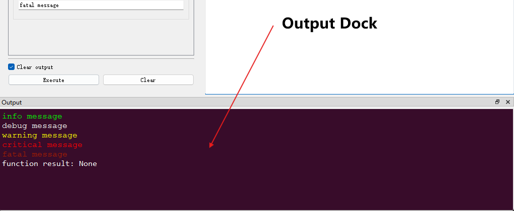
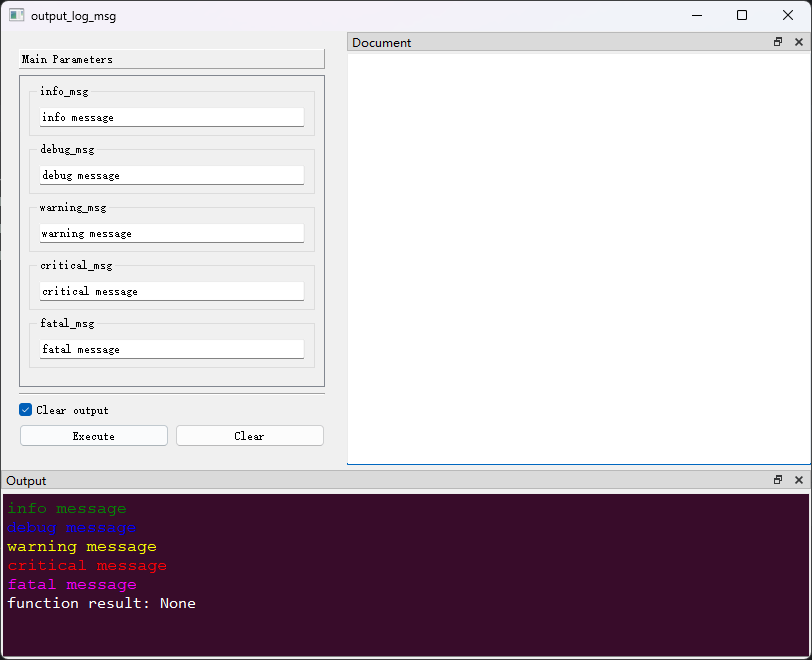

## 向窗口输出信息

[`pyguiadapter.adapter.uoutput`]()模块中提供了许多输出信息的函数，开发者可以借助这些函数将信息输出到`函数执行窗口`的`程序输出停靠窗口（Output Dock）`中。



### 一、消息输出函数

|                           函数名称                           |                             说明                             |
| :----------------------------------------------------------: | :----------------------------------------------------------: |
| `uprint(*args, sep=" ", end="\n", html: bool = False, scroll_to_bottom: bool = True)` | 最基础的输出信息的方法，用法类似内置函数`print()`。可以输出`html`格式的富文本信息，但对`html`支持有限，不支持部分标签，也不支持`css3`和`html5`。 |
|                       `info(msg: str)`                       |          打印`info`消息。`info`颜色值为`#00FF00`。           |
|                      `debug(msg: str)`                       |         打印`debug`消息。`debug`颜色值为`#FFFFFF`。          |
|                     `warning(msg: str)`                      |       打印`warning`消息。`warning`颜色值为`#FFFF00`。        |
|                     `critical(msg: str)`                     |      打印`critical`消息。`critical`颜色值为`#FF0000`。       |
|                      `fatal(msg: str)`                       |         打印`fatal`消息。`fatal`颜色值为`#A61C00`。          |

### 二、自定义`Logger`

如果需要改变`info`、`debug`、`fatal`等级别消息的颜色值，可以使用自定义颜色配置来创建`pyguiadapter.adapter.uoutput.Logger`实例，并使用其进行输出。下面是一个简单的示例：

```python
from pyguiadapter.adapter import GUIAdapter
from pyguiadapter.adapter.uoutput import Logger, LoggerConfig

logger = Logger(
    confing=LoggerConfig(
        info_color="green",
        debug_color="blue",
        warning_color="yellow",
        critical_color="red",
        fatal_color="magenta",
    )
)


def output_log_msg(
    info_msg: str = "info message",
    debug_msg: str = "debug message",
    warning_msg: str = "warning message",
    critical_msg: str = "critical message",
    fatal_msg: str = "fatal message",
):

    logger.info(info_msg)
    logger.debug(debug_msg)
    logger.warning(warning_msg)
    logger.critical(critical_msg)
    logger.fatal(fatal_msg)


if __name__ == "__main__":
    adapter = GUIAdapter()
    adapter.add(output_log_msg)
    adapter.run()

```



### 三、输出`html`内容

`uprint()`函数可以输出`html`格式的消息，尽管其对`html`和`css`的支持是有限的，但开发者仍然可以借助这一特性向用户展示样式丰富的消息文本。

`uprint()`支持的`html`子集，包括`html标签`、`html标签属性`、`css属性`等，可以参考Qt官方文档：[Supported HTML Subset | Qt GUI 5.15.17](https://doc.qt.io/qt-5/richtext-html-subset.html#table-cell-attributes)