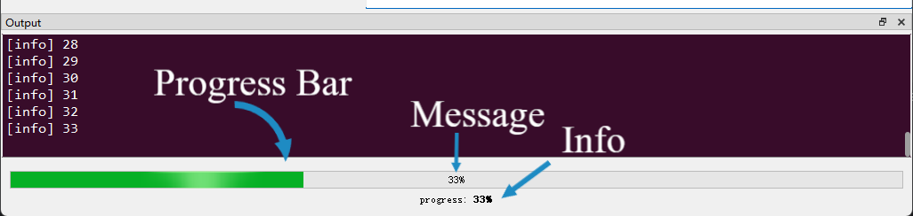

## 进度条

`PyGUIAdapter`提供了进度条功能，开发者可以在函数执行过程中自由地显示、隐藏和更新进度条。

进度条区域主要包括三个部分：



- **Progress Bar**：进度条本体。
- **Message**：进度条上显示的进度信息。
- **Info**：额外显示的信息。


进度条相关的API在[`pyguiadapter.adapter.uprogress`]()模块中，主要包括三个接口：

- **`show_progressbar()`**：用于显示进度条。
- **`hide_progressbar()`**：用于隐藏进度条。
- **`update_progress()`**：用于更新进度信息。


### 一、显示进度条

```python
def show_progressbar(
    min_value: int = 0,
    max_value: int = 100,
    inverted_appearance: bool = False,
    *,
    message_visible: bool = False,
    message_format: str = "%p%",
    message_centered: str = True,
    show_info: bool = True,
    info_centered: bool = True,
    info_text_format: Literal[
        "richtext", "markdown", "plaintext", "autotext"
    ] = "autotext",
    initial_info: str = "",
):
    ...
```

默认情况下，进度条处于隐藏状态，开发者必须手动调用此函数来显示进度条。

此函数除了用于显示进度条，还可以对进度条进行配置，其各参数的含义如下：

- `min_value`：用于设置最小进度值，默认为`0`。
- `max_value`：用于设置最大进度值，默认为`100`。
- `inverted_appearance`：这个参数改变进度条的显示方式，使其以反方向显示进度。
- `message_visible`：这个参数用于控制是否显示message信息。
- `message_format`： 这个参数用于控制message信息的格式，可以有三种显示格式：`%p%`（显示完成的百分比，这是默认显示方式）、`%v`（显示当前的进度值）和`%m`（显示总的步进值）。
- `message_centered`：这个参数用于控制是否使message信息居中显示。
- `show_info`：该参数用于控制是否显示info区域。
- `info_centered`：该参数用于控制info信息是否居中显示。
- `info_text_format`：该参数用于控制info信息的文本格式，支持`"richtext"` 、` "markdown"` 、`"plaintext"` 、`"autotext"`，默认为`"autotext"`。
- `initial_info`：该参数用于指定初始info信息。


### 二、隐藏进度条

```python
def hide_progressbar():
    ...
```

当开发者不再需要进度条时，可以调用该函数将进度条隐藏。


### 三、更新进度信息

```python
def update_progress(value: int, info: str | None = None):
    ...
```

开发者可以在函数中调用此函数来更新当前进度和info信息。


### 四、示例

下面是一个简单的示例：

```python
import time

from pyguiadapter.adapter import GUIAdapter, udialog
from pyguiadapter.adapter import uprogress
from pyguiadapter.adapter.ucontext import is_function_cancelled, uprint


def progressbar_example(total: int = 100, delay: float = 0.5):
    """
    example for **progressbar** and **cancellable function**

    @param total: how many task will be processed
    @param delay: how much time will be consumed per task
    @return:
    """
    uprogress.show_progressbar(0, total, message_visible=True)
    cancelled = False
    task_processed = 0
    for i in range(total):
        if is_function_cancelled():
            uprint("Cancelled!")
            cancelled = True
            break
        task_processed = i + 1
        uprint(f"[Processed] {task_processed}")
        uprogress.update_progress(
            task_processed, info=f"[{task_processed}/{total}] please wait..."
        )
        time.sleep(delay)
    if cancelled:
        udialog.show_warning_dialog(
            f"{task_processed} task(s) processed!", title="Cancelled"
        )
    else:
        udialog.show_info_dialog(
            f"{task_processed} task(s) processed!", title="Completed"
        )
    uprogress.hide_progressbar()


if __name__ == "__main__":
    adapter = GUIAdapter()
    adapter.add(progressbar_example, cancelable=True)
    adapter.run()

```


