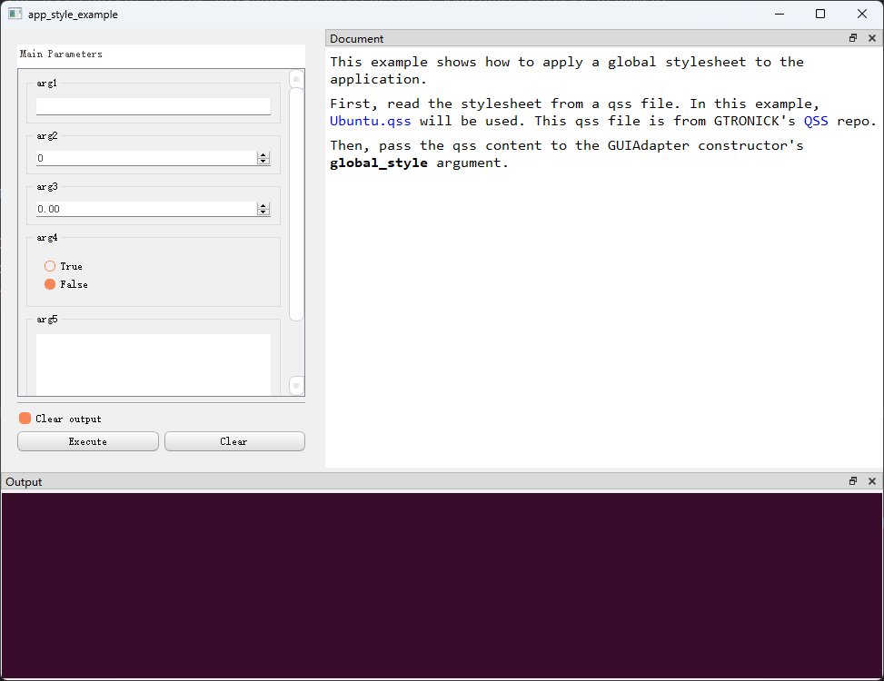
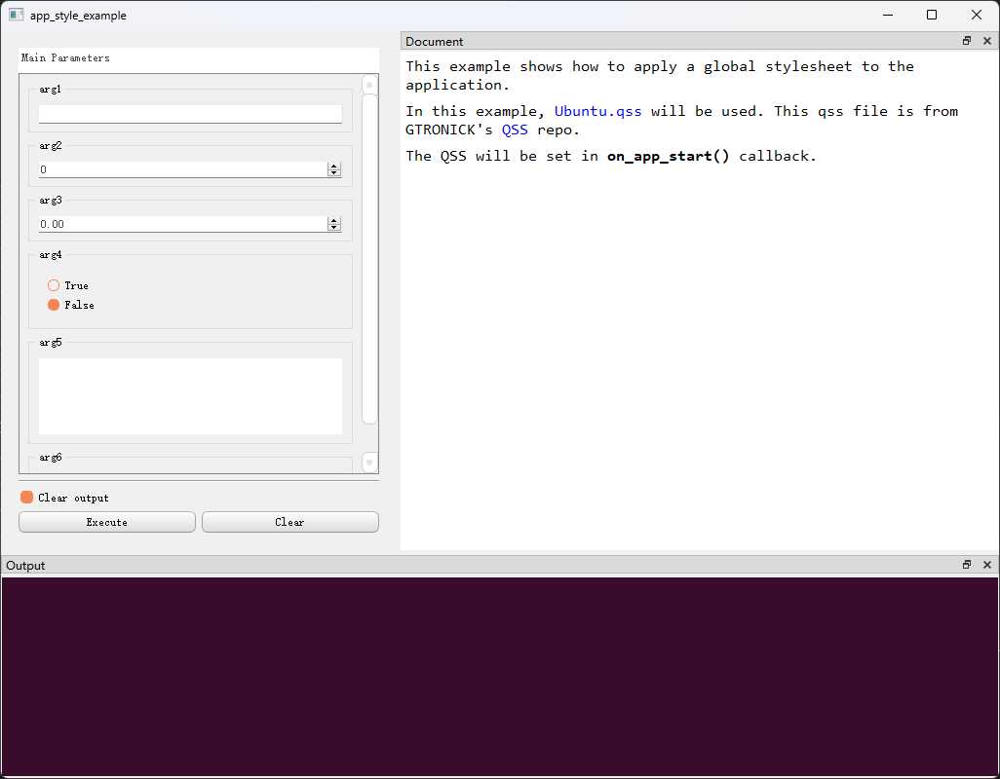
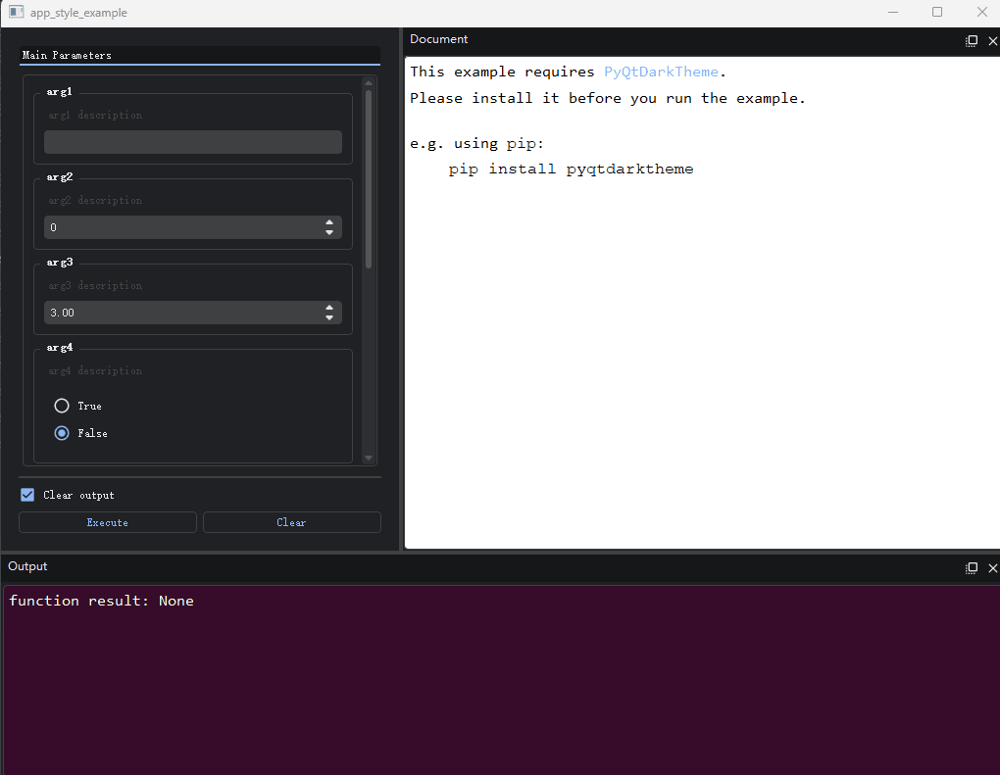
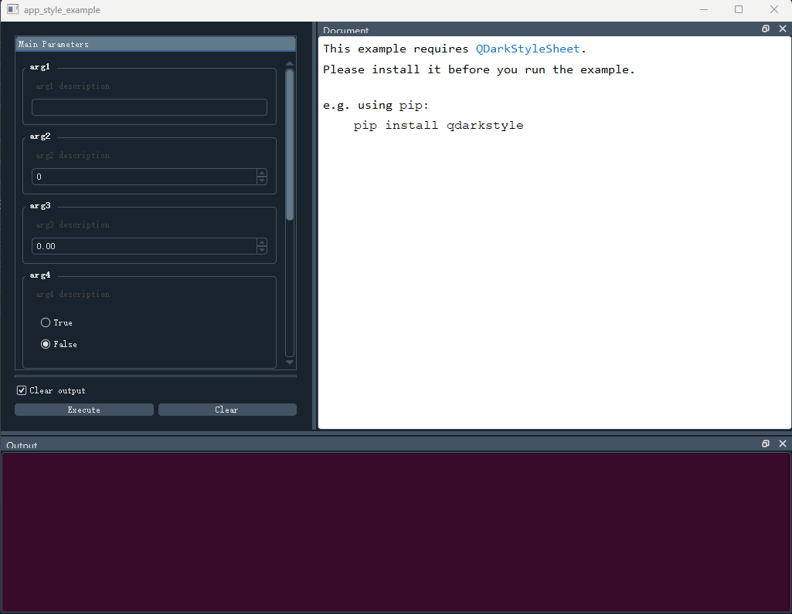
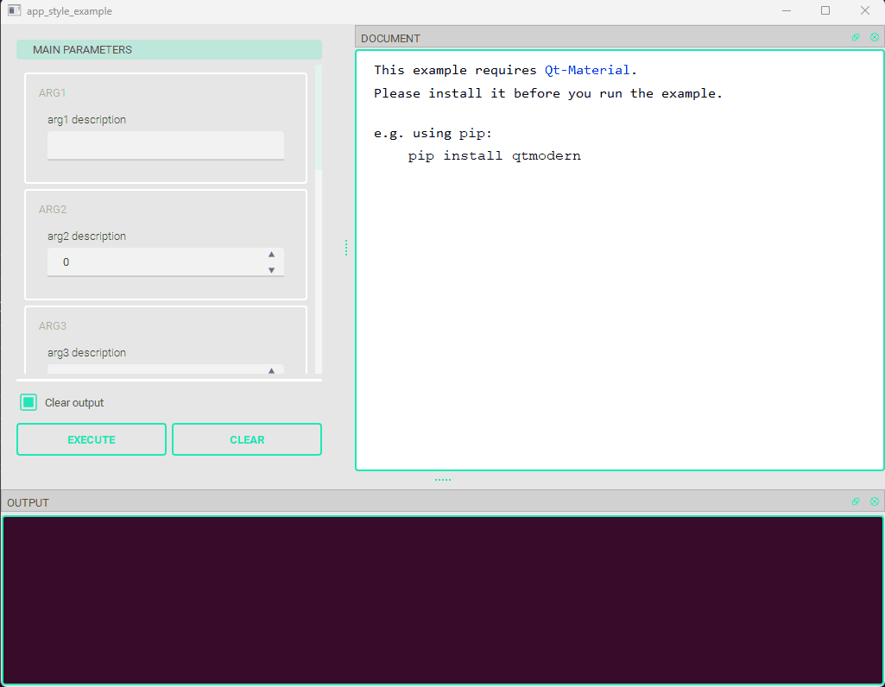

## 界面美化：使用样式表与第三方库

`PyGUIAdapter`的底层基于`Qt`, 所以一些适用于`Qt`的界面美化方法同样适用于`PyGUIAdapter`。

### 一、使用样式表
开发者可以使用QT样式表（`QSS`）来自定义界面风格。有几种方法可以设置样式表：

#### 1、设置全局样式表

`GUIAdapter`构造函数中有一个`global_style`参数，用于设置全局样式表，用户可以把全局样式表的内容或者一个以全局样式表内容为返回值的函数传递给该参数。

**（1）直接传入全局样式表内容**

```python
import os.path
from datetime import datetime

from pyguiadapter import utils
from pyguiadapter.adapter import GUIAdapter
from pyguiadapter.extend_types import text_t


def app_style_example(
        arg1: str, arg2: int, arg3: float, arg4: bool, arg5: text_t, arg6: datetime
):
    """
    This example shows how to apply a global stylesheet to the application.

    First, read the stylesheet from a qss file. In this example, [Ubuntu.qss](https://github.com/GTRONICK/QSS/blob/master/Ubuntu.qss)
    will be used. This qss file is from GTRONICK's [QSS](https://github.com/GTRONICK/QSS) repo.

    Then, pass the qss content to the GUIAdapter constructor's **global_style** argument.

    """
    pass


if __name__ == "__main__":
    QSS_FILE = os.path.join(os.path.dirname(__file__), "Ubuntu.qss")
    global_stylesheet = utils.read_text_file(QSS_FILE)

    adapter = GUIAdapter(global_style=global_stylesheet)
    adapter.add(app_style_example)
    adapter.run()

```

**（2）传入一个函数**

```python
import os.path
from datetime import datetime

from pyguiadapter import utils
from pyguiadapter.adapter import GUIAdapter
from pyguiadapter.extend_types import text_t


def app_style_example(
        arg1: str, arg2: int, arg3: float, arg4: bool, arg5: text_t, arg6: datetime
):
    """
    This example shows how to apply a global stylesheet to the application.

    First, read the stylesheet from a qss file. In this example, [Ubuntu.qss](https://github.com/GTRONICK/QSS/blob/master/Ubuntu.qss)
    will be used. This qss file is from GTRONICK's [QSS](https://github.com/GTRONICK/QSS) repo.

    Then, pass the qss content to the GUIAdapter constructor's **global_style** argument.

    """
    pass


if __name__ == "__main__":
    QSS_FILE = os.path.join(os.path.dirname(__file__), "Ubuntu.qss")


    def load_stylesheet() -> str:
        """
        This function will be called after the QApplication instance being created
        """
        return utils.read_text_file(QSS_FILE)


    adapter = GUIAdapter(global_style=load_stylesheet)
    adapter.add(app_style_example)
    adapter.run()

```

> 之所以要允许函数作为`global_style`参数，主要是因为一些第三方库要求QSS的加载发生在QApplication实例创建之后，传入函数可以确保加载过程发生在QApplication实例化之后。如果不涉及此特殊要求，一般直接将QSS字符串传入`global_style`即可。





#### 2、手动加载并设置样式表

`GUIAdapter`启动时，内部将创建`QApplication`实例。启动完成后，`PyGUIAdapter`将回调`on_app_start()`，开发者可以在该回调函数中访问到当前`QApplication`对象，之后便可调用其`setStyleSheet()`方法设置样式表。

下面是一个简单的示例：

```python
import os.path
from datetime import datetime

from qtpy.QtWidgets import QApplication
from pyguiadapter import utils
from pyguiadapter.adapter import GUIAdapter
from pyguiadapter.extend_types import text_t


def app_style_example(
        arg1: str, arg2: int, arg3: float, arg4: bool, arg5: text_t, arg6: datetime
):
    """
    This example shows how to apply a global stylesheet to the application.

    In this example, [Ubuntu.qss](https://github.com/GTRONICK/QSS/blob/master/Ubuntu.qss)
    will be used. This qss file is from GTRONICK's [QSS](https://github.com/GTRONICK/QSS) repo.

    The QSS will be set in **on_app_start()** callback.
    """
    pass


if __name__ == "__main__":
    QSS_FILE = os.path.join(os.path.dirname(__file__), "Ubuntu.qss")


    def on_app_start(app: QApplication):
        assert isinstance(app, QApplication)
        print("on_app_start")
        qss = utils.read_text_file(QSS_FILE)
        app.setStyleSheet(qss)
        print("app style applied")


    adapter = GUIAdapter(on_app_start=on_app_start)
    adapter.add(app_style_example)
    adapter.run()

```




### 二、接入第三方库

`PyGUIAdapter`生成的界面建立在`qtpy`基础之上，因此可以无缝接入一些支持`qtpy`的第三方美化库。

下面是一些初步测试可用第三方库。

#### 1、`PyQtDarkTheme`

> 运行示例代码，需要先安装[`PyQtDarkTheme`](https://github.com/5yutan5/PyQtDarkTheme)，比如：
>
> ```bas
> pip install pyqtdarktheme
> ```

```python
"""
This example requires PyQtDarkTheme. Please install it before you run the example.
"""

from datetime import datetime

from pyguiadapter.adapter import GUIAdapter
from pyguiadapter.extend_types import text_t


def app_style_example(
        arg1: str, arg2: int, arg3: float, arg4: bool, arg5: text_t, arg6: datetime
):
    """
    This example requires [PyQtDarkTheme](https://github.com/5yutan5/PyQtDarkTheme).
    Please install it before you run the example.

    <br />

    e.g. using `pip`:

    > `pip install pyqtdarktheme`

    @param arg1: arg1 description
    @param arg2: arg2 description
    @param arg3: arg3 description
    @param arg4: arg4 description
    @param arg5: arg5 description
    @param arg6: arg6 description
    @return:
    """
    pass


if __name__ == "__main__":
    import qdarktheme


    def on_app_start(app):
        # this will be called after the instantiation of QApplication.
        print("app started")
        qdarktheme.setup_theme("dark")


    # enable_hi_dpi() must be called before instantiation of QApplication.
    qdarktheme.enable_hi_dpi()
    adapter = GUIAdapter(on_app_start=on_app_start)
    adapter.add(app_style_example)
    adapter.run()

```




#### 2、`QDarkStyleSheet`

> 运行示例代码，需要先安装[`QDarkStyleSheet`](https://github.com/ColinDuquesnoy/QDarkStyleSheet)，比如：
>
> ```bash
> pip install qdarkstyle
> ```

```python
from datetime import datetime

from qtpy.QtWidgets import QApplication

from pyguiadapter.adapter import GUIAdapter
from pyguiadapter.extend_types import text_t


def app_style_example(
        arg1: str, arg2: int, arg3: float, arg4: bool, arg5: text_t, arg6: datetime
):
    """
    This example requires [QDarkStyleSheet](https://github.com/ColinDuquesnoy/QDarkStyleSheet).
    Please install it before you run the example.

    <br />

    e.g. using `pip`:

    > `pip install qdarkstyle`

    @param arg1: arg1 description
    @param arg2: arg2 description
    @param arg3: arg3 description
    @param arg4: arg4 description
    @param arg5: arg5 description
    @param arg6: arg6 description
    @return:

    @params
    [arg6]
    calendar_popup = true

    @end

    """
    pass


if __name__ == "__main__":
    import qdarkstyle


    def on_app_start(app: QApplication):
        # this will be called after the instantiation of QApplication.
        print("app started")
        app.setStyleSheet(qdarkstyle.load_stylesheet())


    adapter = GUIAdapter(on_app_start=on_app_start)
    adapter.add(app_style_example)
    adapter.run()

```



#### 3、`qtmodern`

> 运行示例代码，需要先安装[`qtmodern`](https://github.com/gmarull/qtmodern)，比如：
>
> ```bash
> pip install qtmodern
> ```

```python
from datetime import datetime

from qtpy.QtWidgets import QApplication

from pyguiadapter.adapter import GUIAdapter
from pyguiadapter.extend_types import text_t


def app_style_example(
        arg1: str, arg2: int, arg3: float, arg4: bool, arg5: text_t, arg6: datetime
):
    """
    This example requires [qtmodern](https://github.com/gmarull/qtmodern).
    Please install it before you run the example.

    <br />

    e.g. using `pip`:

    > `pip install qtmodern`

    @param arg1: arg1 description
    @param arg2: arg2 description
    @param arg3: arg3 description
    @param arg4: arg4 description
    @param arg5: arg5 description
    @param arg6: arg6 description
    @return:

    @params
    [arg6]
    calendar_popup = true

    @end

    """
    pass


if __name__ == "__main__":
    import qtmodern.styles


    def on_app_start(app: QApplication):
        # this will be called after the instantiation of QApplication.
        print("app started")
        qtmodern.styles.light(app)


    adapter = GUIAdapter(on_app_start=on_app_start)
    adapter.add(app_style_example)
    adapter.run()

```


#### `4、Qt-Material`

> 运行示例代码，需要先安装[`Qt-Material`](https://github.com/UN-GCPDS/qt-material)，比如：
>
> ```bash
> pip install qt-material
> ```

```python
from datetime import datetime

from qtpy.QtWidgets import QApplication

from pyguiadapter.adapter import GUIAdapter
from pyguiadapter.extend_types import text_t


def app_style_example(
        arg1: str, arg2: int, arg3: float, arg4: bool, arg5: text_t, arg6: datetime
):
    """
    This example requires [Qt-Material](https://github.com/UN-GCPDS/qt-material).
    Please install it before you run the example.

    <br />

    e.g. using `pip`:

    > `pip install qtmodern`

    @param arg1: arg1 description
    @param arg2: arg2 description
    @param arg3: arg3 description
    @param arg4: arg4 description
    @param arg5: arg5 description
    @param arg6: arg6 description
    @return:

    @params
    [arg6]
    calendar_popup = true

    @end

    """
    pass


if __name__ == "__main__":
    import qt_material


    def on_app_start(app: QApplication):
        # this will be called after the instantiation of QApplication.
        print("app started")
        qt_material.apply_stylesheet(app, theme="light_teal.xml")


    adapter = GUIAdapter(on_app_start=on_app_start)
    adapter.add(app_style_example)
    adapter.run()

```

