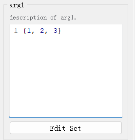
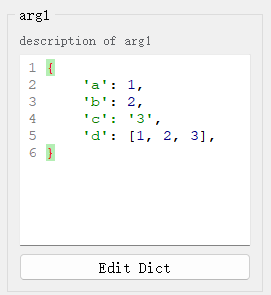
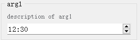
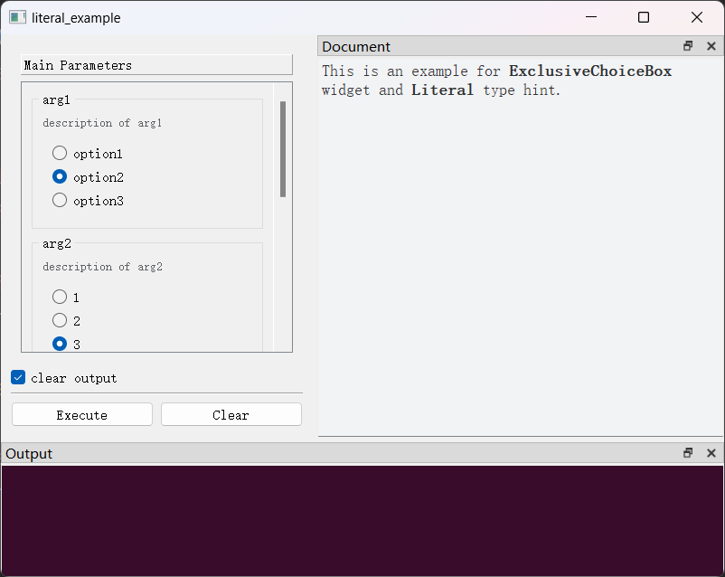
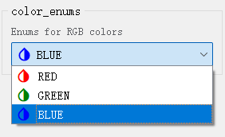
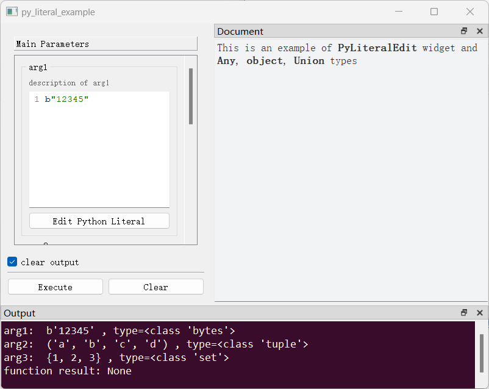

## （一）`int`类型

### 1、默认控件

- [`IntSpinBox`](apis/pyguiadapter.widgets.intspin.md)
- 外观

<div style="text-align: center">
    
</div>


### 2、可配置属性

参见配置类：[`IntSpinBoxConfig`](apis/pyguiadapter.widgets.intspin.md#pyguiadapter.widgets.IntSpinBoxConfig)

### 3、示例

```python
from pyguiadapter.adapter import GUIAdapter
from pyguiadapter.adapter.uoutput import uprint
from pyguiadapter.widgets import IntSpinBoxConfig


def int_example(arg1: int, arg2: int, arg3: int = 100) -> int:
    """
    A simple example for **int** and **IntSpinBox**

    @param arg1: description for arg1
    @param arg2: description for arg2
    @param arg3: description for arg3

    @return:

    @params
    # parameter widget config for arg1
    [arg1]
    default_value = -100
    min_value = -100
    max_value = 100

    # parameter widget config for arg2
    [arg2]
    default_value = 1000
    max_value = 999
    prefix = "$"

    @end

    """
    uprint("arg1:", arg1)
    uprint("arg2:", arg2)
    uprint("arg3:", arg3)
    return arg1 + arg2 + arg3


if __name__ == "__main__":
    adapter = GUIAdapter()
    adapter.add(
        int_example,
        widget_configs={
            # parameter config for arg3
            "arg3": IntSpinBoxConfig(
                default_value=100, min_value=0, max_value=1000, step=10, prefix="$"
            )
        },
    )
    adapter.run()
```

<div style="text-align: center">
    
</div>

----

## （二）`float`类型

### 1、默认控件

- [`FloatSpinBox`](apis/pyguiadapter.widgets.floatspin.md)
- 外观

<div style="text-align: center">
    
</div>


### 2、可配置属性

参见配置类：[`FloatSpinBoxConfig`](apis/pyguiadapter.widgets.floatspin.md#pyguiadapter.widgets.FloatSpinBoxConfig)

### 3、示例

```python
from pyguiadapter.adapter import GUIAdapter
from pyguiadapter.adapter.uoutput import uprint
from pyguiadapter.widgets import FloatSpinBoxConfig


def float_example(float_arg1: float, float_arg2: float, float_arg3: float = 3.14):
    """
    example for **float** and **FloatSpinBox**

    @param float_arg1: this parameter is configured in docstring , see `@params ... @end` block below
    @param float_arg2: this parameter is configured with `run()` via a FloatSpinBoxConfig object
    @param float_arg3: this parameter is configured with `run()` via a dict instance
    @return:

    @params
    [float_arg1]
    default_value = 1.0
    max_value = 100.0
    step = 2.0
    decimals = 3
    prefix = "r: "
    suffix = "%"

    @end

    """
    uprint("float_arg1", float_arg1)
    uprint("float_arg2", float_arg2)
    uprint("float_arg3", float_arg3)
    return float_arg1 + float_arg2 + float_arg3


if __name__ == "__main__":
    adapter = GUIAdapter()

    float_arg2_config = FloatSpinBoxConfig(
        default_value=-0.5, max_value=1.0, step=0.000005, decimals=5, prefix="R: "
    )

    adapter.add(
        float_example,
        widget_configs={
            "float_arg2": float_arg2_config,
            "float_arg3": {
                # this will override the default_value in the function signature
                "default_value": 1,
                "max_value": 2.0,
                "step": 0.00001,
                "decimals": 5,
            },
        },
    )
    adapter.run()
```

<div style="text-align: center">
    
</div>

---

## （三）`bool`类型

### 1、默认控件

- [`BoolBox`](apis/pyguiadapter.widgets.boolbox.md)
- 外观

<div style="text-align: center">
    
</div>


### 2、可配置属性

参见配置类：[`BoolBoxConfig`](apis/pyguiadapter.widgets.boolbox.md#pyguiadapter.widgets.BoolBoxConfig)

### 3、示例

```python
from pyguiadapter.adapter import GUIAdapter
from pyguiadapter.adapter.uoutput import uprint
from pyguiadapter.widgets import BoolBoxConfig


def bool_example(
    bool_arg1: bool = False, bool_arg2: bool = True, bool_arg3: bool = False
):
    """
    example for type **bool** and **BoolBox** widget

    @param bool_arg1: this parameter will be configured in docstring
    @param bool_arg2: this parameter will be configured with **adapter.run()** via a BoolBoxConfig object
    @param bool_arg3: this parameter will be configured with **adapter.run()** via a dict
    @return:

    @params
    [bool_arg1]
    # this will override the default value defined in the function signature
    default_value = true
    true_text = "On"
    false_text = "Off"
    true_icon = "fa.toggle-on"
    false_icon = "fa.toggle-off"
    vertical = false
    @end
    """
    uprint(bool_arg1, bool_arg2, bool_arg3)
    return bool_arg1, bool_arg2, bool_arg3


if __name__ == "__main__":

    bool_arg2_conf = {
        # this will override the default value defined in the function signature
        "default_value": True,
        "true_text": "Enable",
        "false_text": "Disable",
        "true_icon": "fa.toggle-on",
        "false_icon": "fa.toggle-off",
        "vertical": True,
    }

    bool_arg3_conf = BoolBoxConfig(
        # this will override the default value defined in the function signature
        default_value=True,
        true_text="true",
        false_text="false",
        vertical=False,
    )

    adapter = GUIAdapter()
    adapter.add(
        bool_example,
        widget_configs={"bool_arg2": bool_arg2_conf, "bool_arg3": bool_arg3_conf},
    )
    adapter.run()
```

<div style="text-align: center">
    
</div>


---

## （四）`str`类型

### 1、默认控件

- [`LineEdit`](apis/pyguiadapter.widgets.lineedit.md)
- 外观

<div style="text-align: center">
    
</div>


### 2、可配置属性

参见配置类：[`LineEditConfig`](apis/pyguiadapter.widgets.lineedit.md#pyguiadapter.widgets.LineEditConfig)

### 3、示例

```python
from pyguiadapter.adapter import GUIAdapter
from pyguiadapter.adapter.uoutput import uprint
from pyguiadapter.widgets import LineEditConfig, LineEdit


def str_example(
    str_arg1: str = "arg1",
    str_arg2: str = "arg2",
    str_arg3: str = "arg3",
    str_arg4: str = "arg4",
    str_arg5: str = "arg5",
):
    """
    example for type **str** and **LineEdit** widget

    @param str_arg1: this parameter will be configured in docstring
    @param str_arg2: this parameter will be configured in docstring
    @param str_arg3: this parameter will be configured in docstring
    @param str_arg4: this parameter will be configured with adapter.run() via a LineEditConfig object
    @param str_arg5: this parameter will be configured with adapter.run() via a dict
    @return:

    @params
    [str_arg1]
    # override the default value of str_arg1 defined in the function signature
    default_value = "123456"
    clear_button = true
    max_length = 5
    frame = false

    [str_arg2]
    input_mask = "000.000.000.000;_"

    [str_arg3]
    default_value = ""
    placeholder = "this is a placeholder text"


    @end

    """
    uprint("str_example")
    uprint("str_arg1:", str_arg1)
    uprint("str_arg2:", str_arg2)
    uprint("str_arg3:", str_arg3)
    uprint("str_arg4:", str_arg4)
    uprint("str_arg5:", str_arg5)
    return str_arg1 + str_arg2 + str_arg3 + str_arg4 + str_arg5


if __name__ == "__main__":

    str_arg4_conf = LineEditConfig(
        # override the default value of str_arg4 defined in the function signature
        default_value="this is a readonly text",
        readonly=False,
        echo_mode=LineEdit.PasswordEchoOnEditMode,
    )

    str_arg5_conf = {
        "validator": r"^[a-zA-Z0-9]+$",
        "alignment": LineEdit.AlignCenter,
    }

    adapter = GUIAdapter()
    adapter.add(
        str_example,
        widget_configs={
            "str_arg4": str_arg4_conf,
            "str_arg5": str_arg5_conf,
        },
    )
    adapter.run()
```

<div style="text-align: center">
    
</div>


---

## （五）`list`类型

### 1、默认控件

- [`ListEdit`](apis/pyguiadapter.widgets.listedit.md)
- 外观

<div style="text-align: center">
    
</div>


### 2、可配置属性

参见配置类：[`ListEditConfig`](apis/pyguiadapter.widgets.listedit.md#pyguiadapter.widgets.ListEditConfig)

### 3、示例

```python
from typing import List

from pyguiadapter.adapter import GUIAdapter
from pyguiadapter.adapter.uoutput import uprint
from pyguiadapter.widgets import ListEditConfig


def list_example(arg1: list, arg2: List, arg3: list):
    """
    This is an example for **ListEdit** and list** types

    Args:
        arg1: description of arg1
        arg2: description of arg2
        arg3: description of arg3

    Returns:
        None

    @params
    [arg1]
    default_value = [1,2,3,4]

    [arg2]
    default_value = ["a", "b", 3, "d"]
    @end
    """
    uprint("arg1: ", arg1)
    uprint("arg2: ", arg2)
    uprint("arg3: ", arg3)


if __name__ == "__main__":
    arg3_conf = ListEditConfig(
        default_value=[1, 2, 3, 4, ["a", "b", 3, "d"]],
        # set editor_height or editor_width to 0 will hide the inplace editor
        editor_height=0,
        editor_width=0,
    )
    adapter = GUIAdapter()
    adapter.add(
        list_example,
        widget_configs={"arg3": arg3_conf},
    )
    adapter.run()
```

<div style="text-align: center">
    
</div>


---

## （六）`tuple`类型

### 1、默认控件

- [`TupleEdit`](apis/pyguiadapter.widgets.tupleedit.md)
- 外观

<div style="text-align: center">
    
</div>


### 2、可配置属性

参见配置类：[`TupleEditConfig`](apis/pyguiadapter.widgets.tupleedit.md#pyguiadapter.widgets.TupleEditConfig)

### 3、示例

```python
from typing import Tuple

from pyguiadapter.adapter import GUIAdapter
from pyguiadapter.adapter.uoutput import uprint
from pyguiadapter.widgets import TupleEditConfig


def tuple_example(arg1: tuple, arg2: Tuple, arg3: tuple):
    """
    This is an example for **TupleEdit** and **tuple** types

    Args:
        arg1: describes of arg1
        arg2: describes of arg2
        arg3: describes of arg3

    Returns:
        None
    """
    uprint("arg1: ", arg1)
    uprint("arg2: ", arg2)
    uprint("arg3: ", arg3)


if __name__ == "__main__":
    arg1_conf = TupleEditConfig(
        default_value=(1, 2, 3),
    )
    arg2_conf = {
        "default_value": (1, 2, 3, [1, 2, 3, 4]),
    }
    arg3_conf = TupleEditConfig(
        default_value=(1, 2, 3),
        label="Arg3",
        # set editor_height or editor_width to 0 will hide the inplace editor
        editor_height=0,
        editor_width=0,
    )
    adapter = GUIAdapter()
    adapter.add(
        tuple_example,
        widget_configs={
            "arg1": arg1_conf,
            "arg2": arg2_conf,
            "arg3": arg3_conf,
        },
    )
    adapter.run()

```

<div style="text-align: center">
    
</div>


---

## （七）`set`类型

### 1、默认控件

- [`SetEdit`](apis/pyguiadapter.widgets.setedit.md)
- 外观

<div style="text-align: center">
    
</div>


### 2、可配置属性

参见配置类：[`SetEditConfig`](apis/pyguiadapter.widgets.setedit.md#pyguiadapter.widgets.SetEditConfig)

### 3、示例

```python
from typing import Set, MutableSet

from pyguiadapter.adapter import GUIAdapter
from pyguiadapter.adapter.uoutput import uprint
from pyguiadapter.widgets import SetEditConfig


def set_example(arg1: set, arg2: Set, arg3: MutableSet):
    """
    This is an example for **SetEdit** for **set** types.

    Args:
        arg1: description of arg1.
        arg2: description of arg2.
        arg3: description of arg3.

    Returns:
        None.
    """
    uprint("arg1: ", arg1)
    uprint("arg2: ", arg2)
    uprint("arg3: ", arg3)


if __name__ == "__main__":
    arg1_conf = SetEditConfig(
        default_value={1, 2, 3},
    )
    arg2_conf = SetEditConfig(
        default_value={"a", "b", 1, 2},
    )
    arg3_conf = {
        "default_value": {1, 2, 3, (1, 2, 3, 4)},
    }
    adapter = GUIAdapter()
    adapter.add(
        set_example,
        widget_configs={
            "arg1": arg1_conf,
            "arg2": arg2_conf,
            "arg3": arg3_conf,
        },
    )
    adapter.run()
```

<div style="text-align: center">
    
</div>


---


## （七）`dict`类型

### 1、默认控件

- [`DictEdit`](apis/pyguiadapter.widgets.dictedit.md)
- 外观

<div style="text-align: center">
    
</div>


### 2、可配置属性

参见配置类：[`DictEditConfig`](apis/pyguiadapter.widgets.dictedit.md#pyguiadapter.widgets.DictEditConfig)

### 3、示例

```python
from typing import Dict, Mapping, MutableMapping, TypedDict

from pyguiadapter.adapter import GUIAdapter
from pyguiadapter.adapter.uoutput import uprint
from pyguiadapter.widgets import DictEditConfig


class User(TypedDict):
    name: str
    age: int
    address: str
    email: str


def dict_example(
    arg1: dict, arg2: Dict, arg3: MutableMapping, arg4: Mapping, arg5: User
):
    """
    This is an example for **DictEdit** widget and **dict** types.

    Args:
        arg1: description of arg1
        arg2: description of arg2
        arg3: description of arg3
        arg4: description of arg4
        arg5: description of arg5

    Returns:
        None

    @params
    [arg1]
    default_value = {a=1,b=2,c="3"}

    [arg2]
    default_value = {"key1"="value1", "key2"="value2"}

    @end
    """
    uprint("arg1: ", arg1)
    uprint("arg2: ", arg2)
    uprint("arg3: ", arg3)
    uprint("arg4: ", arg4)
    uprint("arg5: ", arg5)


if __name__ == "__main__":
    arg1_conf = DictEditConfig(
        default_value={"a": 1, "b": 2, "c": "3", "d": [1, 2, 3]},
    )
    arg3_conf = DictEditConfig(
        default_value={"a": "A", "b": "B"},
    )

    arg4_conf = DictEditConfig(
        default_value={"c": "C", "d": "D", "e": [1, 2, 3, 4]},
    )

    arg5_conf = DictEditConfig(
        default_value=User(
            name="John", age=30, address="123 Main St", email="john@example.com"
        ),
    )

    adapter = GUIAdapter()
    adapter.add(
        dict_example,
        widget_configs={
            "arg1": arg1_conf,
            "arg3": arg3_conf,
            "arg4": arg4_conf,
            "arg5": arg5_conf,
        },
    )
    adapter.run()
```

<div style="text-align: center">
    
</div>


---

## （八）`date`类型

### 1、默认控件

- [`DateEdit`](apis/pyguiadapter.widgets.dateedit.md)
- 外观

<div style="text-align: center">
    
</div>


### 2、可配置属性

参见配置类：[`DateEditConfig`](apis/pyguiadapter.widgets.dateedit.md#pyguiadapter.widgets.DateEditConfig)

### 3、示例

```python
from datetime import date

from pyguiadapter.adapter import GUIAdapter
from pyguiadapter.adapter.uoutput import uprint
from pyguiadapter.widgets import DateEditConfig, DateEdit


def date_example(arg1: date, arg2: date, arg3: date):
    """
    This is an example for **DateEdit** and **date** type.
    Args:
        arg1: description of arg1
        arg2: description of arg2
        arg3: description of arg3

    Returns:
        None

    @params
    [arg2]
    label = "Argument 2"
    display_format = "yyyy-MM-dd"
    @end

    """
    uprint("arg1", arg1)
    uprint("arg2", arg2)
    uprint("arg3", arg3)


if __name__ == "__main__":
    arg1_conf = DateEditConfig(
        min_date=date(2023, 1, 1),
        max_date=date(2023, 12, 31),
    )
    arg3_conf = DateEditConfig(
        default_value=date(2023, 6, 1),
        min_date=date(2023, 1, 1),
        max_date=date(2023, 12, 31),
        calendar_popup=True,
        alignment=DateEdit.AlignCenter,
        time_spec=DateEdit.UTC,
    )
    adapter = GUIAdapter()
    adapter.add(
        date_example,
        widget_configs={"arg1": arg1_conf, "arg3": arg3_conf},
    )
    adapter.run()
```

<div style="text-align: center">
    
</div>


---

## （九）`time`类型

### 1、默认控件

- [`TimeEdit`](apis/pyguiadapter.widgets.timeedit.md)
- 外观

<div style="text-align: center">
    
</div>


### 2、可配置属性

参见配置类：[`TimeEditConfig`](apis/pyguiadapter.widgets.timeedit.md#pyguiadapter.widgets.TimeEditConfig)

### 3、示例

```python
from datetime import time

from pyguiadapter.adapter import GUIAdapter
from pyguiadapter.adapter.uoutput import uprint
from pyguiadapter.widgets import TimeEditConfig, TimeEdit
from pyguiadapter.widgets.basic.datetimeedit import TimeSpec


def time_example(arg1: time, arg2: time, arg3: time):
    """
    This is an example for **TimeEdit** and **datetime.time** type.

    Args:
        arg1: description of arg1
        arg2: description of arg2
        arg3: description of arg3

    Returns:
        None

    @params
    [arg3]
    label = "Argument 3"
    display_format = "HH小时mm分ss秒"

    @end
    """
    uprint("arg1:", arg1)
    uprint("arg2:", arg2)
    uprint("arg3:", arg3)


if __name__ == "__main__":
    arg1_conf = TimeEditConfig(
        default_value=time(hour=12, minute=30),
        max_time=time(hour=23, minute=59),
        min_time=time(hour=0, minute=0),
        time_spec=TimeSpec.UTC,
    )
    arg2_conf = TimeEditConfig(
        default_value=time(hour=20, minute=30),
        max_time=time(hour=23, minute=59),
        min_time=time(hour=12, minute=0),
        alignment=TimeEdit.AlignCenter,
    )
    adapter = GUIAdapter()
    adapter.add(
        time_example,
        widget_configs={"arg1": arg1_conf, "arg2": arg2_conf},
    )
    adapter.run()
```

<div style="text-align: center">
    
</div>


---

## （十）`datetime`类型

### 1、默认控件

- [`DateTimeEdit`](apis/pyguiadapter.widgets.datetimeedit.md)
- 外观

<div style="text-align: center">
    
</div>


### 2、可配置属性

参见配置类：[`DateTimeEditConfig`](apis/pyguiadapter.widgets.datetimeedit.md#pyguiadapter.widgets.DateTimeEditConfig)

### 3、示例

```python
from datetime import datetime

from pyguiadapter.adapter import GUIAdapter
from pyguiadapter.adapter.uoutput import uprint
from pyguiadapter.widgets import DateTimeEditConfig, DateTimeEdit


def datetime_example(arg1: datetime, arg2: datetime, arg3: datetime):
    """
    This an example for **DateTimeEdit** widget and **datetime** type.

    Args:
        arg1: description of arg1.
        arg2: description of arg2.
        arg3: description of arg3.

    Returns:
        None.
    
    @params
    [arg2]
    label = "Argument 2"
    display_format = "dd.MM.yyyy HH:mm:ss"
    @end

    """
    uprint("arg1", arg1)
    uprint("arg2", arg2)
    uprint("arg3", arg3)


if __name__ == "__main__":
    arg1_conf = DateTimeEditConfig(
        min_datetime=datetime(2023, 1, 1),
        max_datetime=datetime(2023, 12, 31),
        time_spec=DateTimeEdit.UTC,
    )
    arg3_conf = DateTimeEditConfig(
        default_value=datetime(2023, 6, 1, 12, 59, 59),
        min_datetime=datetime(2023, 1, 1),
        max_datetime=datetime(2023, 12, 31),
        alignment=DateTimeEdit.AlignCenter,
        calendar_popup=False,
    )
    adapter = GUIAdapter()
    adapter.add(
        datetime_example,
        widget_configs={
            "arg1": arg1_conf,
            "arg3": arg3_conf,
        },
    )
    adapter.run()
```

<div style="text-align: center">
    
</div>


---

## （十一）`typing.Literal`类型

### 1、默认控件

- [`ExclusiveChoiceBox`](apis/pyguiadapter.widgets.exclusivechoice.md)
- 外观

<div style="text-align: center">
    
</div>


### 2、可配置属性

参见配置类：[`ExclusiveChoiceBoxConfig`](apis/pyguiadapter.widgets.exclusivechoice.md#pyguiadapter.widgets.ExclusiveChoiceBoxConfig)

### 3、示例

```python
from typing import Literal

from pyguiadapter.adapter import GUIAdapter
from pyguiadapter.adapter.uoutput import uprint
from pyguiadapter.widgets import ExclusiveChoiceBoxConfig


class MyObj(object):
    def __init__(self, name: str):
        self._name = name

    def __str__(self):
        return self._name

    def __eq__(self, other):
        if isinstance(other, MyObj):
            return other._name == self._name
        return False

    def __hash__(self):
        return hash(self._name)


my_objects = [MyObj("obj1"), MyObj("obj2"), MyObj("obj3")]


def literal_example(
    arg1: Literal["option1", "option2", "option3"] = "option2",
    arg2: Literal[1, 2, 3, 4, 5] = 3,
    arg3: Literal["option1", "option2", 1, 2, True, False] = 1,
    arg4: MyObj = my_objects[0],
):
    """
    This is an example for **ExclusiveChoiceBox** widget and **Literal** type hint.

    Args:
        arg1: description of arg1
        arg2: description of arg2
        arg3: description of arg3
        arg4: description of arg4

    Returns:
        None

    @params
    [arg3]
    columns = 2
    show_type_icon = true
    @end
    """
    uprint("arg1: ", arg1)
    uprint("arg2: ", arg2)
    uprint("arg3: ", arg3)
    uprint(f"arg4: {arg4}({type(arg4)})")


if __name__ == "__main__":
    arg4_conf = ExclusiveChoiceBoxConfig(
        default_value=my_objects[1],
        show_type_icon=True,
        choices=my_objects,
        object_icon="ei.asl",
    )
    adapter = GUIAdapter()
    adapter.add(literal_example, widget_configs={"arg4": arg4_conf})
    adapter.run()
```

<div style="text-align: center">
    
</div>


---

## （十二）`enum.Enum`类型

### 1、默认控件

- [`EnumSelect`](apis/pyguiadapter.widgets.enumselect.md)
- 外观

<div style="text-align: center">
    
</div>


### 2、可配置属性

参见配置类：[`EnumSelectConfig`](apis/pyguiadapter.widgets.enumselect.md#pyguiadapter.widgets.EnumSelectConfig)

### 3、示例

```python
from enum import Enum
from pyguiadapter.adapter import GUIAdapter
from pyguiadapter.adapter.uoutput import uprint
from pyguiadapter.utils import qta_icon
from pyguiadapter.widgets import EnumSelectConfig


class Weekday(Enum):
    MONDAY = 1
    TUESDAY = 2
    WEDNESDAY = 3
    THURSDAY = 4
    FRIDAY = 5
    SATURDAY = 6
    SUNDAY = 7


class Color(Enum):
    RED = 1
    GREEN = 2
    BLUE = 3


def enums_example(day_enums: Weekday, color_enums: Color = Color.GREEN):
    """
    This is an example for type **enum** and **EnumSelect** widget.

    @param day_enums: Enums for week days
    @param color_enums:  Enums for RGB colors
    @return:

    @params
    [day_enums]
    default_value = "MONDAY"
    icons = {"MONDAY"="mdi6.numeric-1-circle", "TUESDAY"="mdi6.numeric-2-circle"}

    @end

    """
    uprint(day_enums)
    uprint(color_enums)


if __name__ == "__main__":
    color_enums_conf = EnumSelectConfig(
        # this will override the default value defined in the function signature
        default_value=Color.BLUE,
        icons={
            # you can use the Enum value as the key to its icon
            "RED": qta_icon("mdi.invert-colors", color="red"),
            "GREEN": qta_icon("mdi.invert-colors", color="green"),
            "BLUE": qta_icon("mdi.invert-colors", color="blue"),
            # or you can use the Enum value itself as the key to its icon
            # Color.RED: qta_icon("mdi.invert-colors", color="red"),
            # Color.GREEN: qta_icon("mdi.invert-colors", color="green"),
            # Color.BLUE: qta_icon("mdi.invert-colors", color="blue"),
        },
        icon_size=(24, 24),
    )
    adapter = GUIAdapter()
    adapter.add(enums_example, widget_configs={"color_enums": color_enums_conf})
    adapter.run()
```

<div style="text-align: center">
    
</div>


---

## （十三）`typing.Any`、`object`类型

### 1、默认控件

- [`PyLiteralEdit`](apis/pyguiadapter.widgets.pyliteraledit.md)
- 外观

<div style="text-align: center">
    
</div>


### 2、可配置属性

参见配置类：[`PyLiteralEditConfig`](apis/pyguiadapter.widgets.pyliteraledit.md#pyguiadapter.widgets.PyLiteralEditConfig)

### 3、示例

```python
from typing import Any, Union

from pyguiadapter.adapter import GUIAdapter
from pyguiadapter.adapter.uoutput import uprint
from pyguiadapter.widgets import PyLiteralEditConfig


def py_literal_example(arg1: Any, arg2: object, arg3: Union[int, str]):
    """
    This is an example of **PyLiteralEdit** widget and **Any**, **object**, **Union** types

    Args:
        arg1: description of arg1
        arg2: description of arg2
        arg3: description of arg3

    Returns:
        None
    """
    uprint("arg1: ", arg1, f", type={type(arg1)}")
    uprint("arg2: ", arg2, f", type={type(arg2)}")
    uprint("arg3: ", arg3, f", type={type(arg3)}")


if __name__ == "__main__":
    # PyLiteralEdit support the PyLiteralType, which is a Union of:
    # bool, int, float, bytes, str, list, tuple, dict, set and NoneType.

    arg1_config = PyLiteralEditConfig(
        default_value=[1, 2, 3, 4],
    )
    arg2_config = PyLiteralEditConfig(
        default_value=("a", "b", "c", "d"),
    )
    arg3_config = PyLiteralEditConfig(
        default_value={1, 2, 3},
    )
    adapter = GUIAdapter()
    adapter.add(
        py_literal_example,
        widget_configs={
            "arg1": arg1_config,
            "arg2": arg2_config,
            "arg3": arg3_config,
        },
    )
    adapter.run()
```

<div style="text-align: center">
    
</div>


---