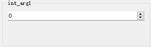

## （一）`int`类型

### 1、默认控件

- [`IntSpinBox`](apis/pyguiadapter.widgets.intspin.md)
- 外观

<div style="text-align: center">
    
</div>


### 2、可配置属性

参见配置类：[`IntSpinBoxConfig`](apis/pyguiadapter.widgets.intspin.md#pyguiadapter.widgets.IntSpinBoxConfig)

### 3、示例

```python
from pyguiadapter.adapter import GUIAdapter
from pyguiadapter.adapter.uoutput import uprint
from pyguiadapter.widgets import IntSpinBoxConfig


def int_example(arg1: int, arg2: int, arg3: int = 100) -> int:
    """
    A simple example for **int** and **IntSpinBox**

    @param arg1: description for arg1
    @param arg2: description for arg2
    @param arg3: description for arg3

    @return:

    @params
    # parameter widget config for arg1
    [arg1]
    default_value = -100
    min_value = -100
    max_value = 100

    # parameter widget config for arg2
    [arg2]
    default_value = 1000
    max_value = 999
    prefix = "$"

    @end

    """
    uprint("arg1:", arg1)
    uprint("arg2:", arg2)
    uprint("arg3:", arg3)
    return arg1 + arg2 + arg3


if __name__ == "__main__":
    adapter = GUIAdapter()
    adapter.add(
        int_example,
        widget_configs={
            # parameter config for arg3
            "arg3": IntSpinBoxConfig(
                default_value=100, min_value=0, max_value=1000, step=10, prefix="$"
            )
        },
    )
    adapter.run()
```

<div style="text-align: center">
    
</div>

----

## （二）`float`类型

### 1、默认控件

- [`FloatSpinBox`](apis/pyguiadapter.widgets.floatspin.md)
- 外观

<div style="text-align: center">
    
</div>


### 2、可配置属性

参见配置类：[`FloatSpinBoxConfig`](apis/pyguiadapter.widgets.float.md#pyguiadapter.widgets.FloatSpinBoxConfig)

### 3、示例

```python

```

<div style="text-align: center">
    
</div>

---

## （三）`bool`类型

### 1、默认控件

- [`xxx`](apis/pyguiadapter.widgets.xxx)
- 外观

<div style="text-align: center">
    
</div>

### 2、可配置属性

参见配置类：[`xxx`](apis/pyguiadapter.widgets.xxx.md#pyguiadapter.widgets.xxx)

### 3、示例

```python

```

<div style="text-align: center">
    
</div>

---

## （四）`str`类型

### 1、默认控件

- [`xxx`](apis/pyguiadapter.widgets.xxx)
- 外观

<div style="text-align: center">
    
</div>

### 2、可配置属性

参见配置类：[`xxx`](apis/pyguiadapter.widgets.xxx.md#pyguiadapter.widgets.xxx)

### 3、示例

```python

```

<div style="text-align: center">
    
</div>

---

## （五）`list`类型

### 1、默认控件

- [`xxx`](apis/pyguiadapter.widgets.xxx)
- 外观

<div style="text-align: center">
    
</div>

### 2、可配置属性

参见配置类：[`xxx`](apis/pyguiadapter.widgets.xxx.md#pyguiadapter.widgets.xxx)

### 3、示例

```python

```

<div style="text-align: center">
    
</div>

---

## （六）`tuple`类型

### 1、默认控件

- [`xxx`](apis/pyguiadapter.widgets.xxx)
- 外观

<div style="text-align: center">
    
</div>

### 2、可配置属性

参见配置类：[`xxx`](apis/pyguiadapter.widgets.xxx.md#pyguiadapter.widgets.xxx)

### 3、示例

```python

```

<div style="text-align: center">
    
</div>

---

## （七）`set`类型

### 1、默认控件

- [`xxx`](apis/pyguiadapter.widgets.xxx)
- 外观

<div style="text-align: center">
    
</div>

### 2、可配置属性

参见配置类：[`xxx`](apis/pyguiadapter.widgets.xxx.md#pyguiadapter.widgets.xxx)

### 3、示例

```python

```

<div style="text-align: center">
    
</div>

---

## （八）`date`类型

### 1、默认控件

- [`xxx`](apis/pyguiadapter.widgets.xxx)
- 外观

<div style="text-align: center">
    
</div>

### 2、可配置属性

参见配置类：[`xxx`](apis/pyguiadapter.widgets.xxx.md#pyguiadapter.widgets.xxx)

### 3、示例

```python

```

<div style="text-align: center">
    
</div>

---

## （九）`time`类型

### 1、默认控件

- [`xxx`](apis/pyguiadapter.widgets.xxx)
- 外观

<div style="text-align: center">
    
</div>

### 2、可配置属性

参见配置类：[`xxx`](apis/pyguiadapter.widgets.xxx.md#pyguiadapter.widgets.xxx)

### 3、示例

```python

```

<div style="text-align: center">
    
</div>

---

## （十）`datetime`类型

### 1、默认控件

- [`xxx`](apis/pyguiadapter.widgets.xxx)
- 外观

<div style="text-align: center">
    
</div>

### 2、可配置属性

参见配置类：[`xxx`](apis/pyguiadapter.widgets.xxx.md#pyguiadapter.widgets.xxx)

### 3、示例

```python

```

<div style="text-align: center">
    
</div>

---

## （十一）`typing.Literal`类型

### 1、默认控件

- [`xxx`](apis/pyguiadapter.widgets.xxx)
- 外观

<div style="text-align: center">
    
</div>

### 2、可配置属性

参见配置类：[`xxx`](apis/pyguiadapter.widgets.xxx.md#pyguiadapter.widgets.xxx)

### 3、示例

```python

```

<div style="text-align: center">
    
</div>

---

## （十二）`enum.Enum`类型

### 1、默认控件

- [`xxx`](apis/pyguiadapter.widgets.xxx)
- 外观

<div style="text-align: center">
    
</div>

### 2、可配置属性

参见配置类：[`xxx`](apis/pyguiadapter.widgets.xxx.md#pyguiadapter.widgets.xxx)

### 3、示例

```python

```

<div style="text-align: center">
    
</div>

---

## （十三）`typing.Any`、`object`类型

### 1、默认控件

- [`xxx`](apis/pyguiadapter.widgets.xxx)
- 外观

<div style="text-align: center">
    
</div>

### 2、可配置属性

参见配置类：[`xxx`](apis/pyguiadapter.widgets.xxx.md#pyguiadapter.widgets.xxx)

### 3、示例

```python

```

<div style="text-align: center">
    
</div>

---