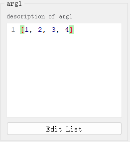

## （一）`int`类型

### 1、默认控件

- [`IntSpinBox`](apis/pyguiadapter.widgets.intspin.md)
- 外观

<div style="text-align: center">
    
</div>


### 2、可配置属性

参见配置类：[`IntSpinBoxConfig`](apis/pyguiadapter.widgets.intspin.md#pyguiadapter.widgets.IntSpinBoxConfig)

### 3、示例

```python
from pyguiadapter.adapter import GUIAdapter
from pyguiadapter.adapter.uoutput import uprint
from pyguiadapter.widgets import IntSpinBoxConfig


def int_example(arg1: int, arg2: int, arg3: int = 100) -> int:
    """
    A simple example for **int** and **IntSpinBox**

    @param arg1: description for arg1
    @param arg2: description for arg2
    @param arg3: description for arg3

    @return:

    @params
    # parameter widget config for arg1
    [arg1]
    default_value = -100
    min_value = -100
    max_value = 100

    # parameter widget config for arg2
    [arg2]
    default_value = 1000
    max_value = 999
    prefix = "$"

    @end

    """
    uprint("arg1:", arg1)
    uprint("arg2:", arg2)
    uprint("arg3:", arg3)
    return arg1 + arg2 + arg3


if __name__ == "__main__":
    adapter = GUIAdapter()
    adapter.add(
        int_example,
        widget_configs={
            # parameter config for arg3
            "arg3": IntSpinBoxConfig(
                default_value=100, min_value=0, max_value=1000, step=10, prefix="$"
            )
        },
    )
    adapter.run()
```

<div style="text-align: center">
    
</div>

----

## （二）`float`类型

### 1、默认控件

- [`FloatSpinBox`](apis/pyguiadapter.widgets.floatspin.md)
- 外观

<div style="text-align: center">
    
</div>


### 2、可配置属性

参见配置类：[`FloatSpinBoxConfig`](apis/pyguiadapter.widgets.floatspin.md#pyguiadapter.widgets.FloatSpinBoxConfig)

### 3、示例

```python
from pyguiadapter.adapter import GUIAdapter
from pyguiadapter.adapter.uoutput import uprint
from pyguiadapter.widgets import FloatSpinBoxConfig


def float_example(float_arg1: float, float_arg2: float, float_arg3: float = 3.14):
    """
    example for **float** and **FloatSpinBox**

    @param float_arg1: this parameter is configured in docstring , see `@params ... @end` block below
    @param float_arg2: this parameter is configured with `run()` via a FloatSpinBoxConfig object
    @param float_arg3: this parameter is configured with `run()` via a dict instance
    @return:

    @params
    [float_arg1]
    default_value = 1.0
    max_value = 100.0
    step = 2.0
    decimals = 3
    prefix = "r: "
    suffix = "%"

    @end

    """
    uprint("float_arg1", float_arg1)
    uprint("float_arg2", float_arg2)
    uprint("float_arg3", float_arg3)
    return float_arg1 + float_arg2 + float_arg3


if __name__ == "__main__":
    adapter = GUIAdapter()

    float_arg2_config = FloatSpinBoxConfig(
        default_value=-0.5, max_value=1.0, step=0.000005, decimals=5, prefix="R: "
    )

    adapter.add(
        float_example,
        widget_configs={
            "float_arg2": float_arg2_config,
            "float_arg3": {
                # this will override the default_value in the function signature
                "default_value": 1,
                "max_value": 2.0,
                "step": 0.00001,
                "decimals": 5,
            },
        },
    )
    adapter.run()
```

<div style="text-align: center">
    
</div>

---

## （三）`bool`类型

### 1、默认控件

- [`BoolBox`](apis/pyguiadapter.widgets.boolbox.md)
- 外观

<div style="text-align: center">
    
</div>


### 2、可配置属性

参见配置类：[`BoolBoxConfig`](apis/pyguiadapter.widgets.boolbox.md#pyguiadapter.widgets.BoolBoxConfig)

### 3、示例

```python
from pyguiadapter.adapter import GUIAdapter
from pyguiadapter.adapter.uoutput import uprint
from pyguiadapter.widgets import BoolBoxConfig


def bool_example(
    bool_arg1: bool = False, bool_arg2: bool = True, bool_arg3: bool = False
):
    """
    example for type **bool** and **BoolBox** widget

    @param bool_arg1: this parameter will be configured in docstring
    @param bool_arg2: this parameter will be configured with **adapter.run()** via a BoolBoxConfig object
    @param bool_arg3: this parameter will be configured with **adapter.run()** via a dict
    @return:

    @params
    [bool_arg1]
    # this will override the default value defined in the function signature
    default_value = true
    true_text = "On"
    false_text = "Off"
    true_icon = "fa.toggle-on"
    false_icon = "fa.toggle-off"
    vertical = false
    @end
    """
    uprint(bool_arg1, bool_arg2, bool_arg3)
    return bool_arg1, bool_arg2, bool_arg3


if __name__ == "__main__":

    bool_arg2_conf = {
        # this will override the default value defined in the function signature
        "default_value": True,
        "true_text": "Enable",
        "false_text": "Disable",
        "true_icon": "fa.toggle-on",
        "false_icon": "fa.toggle-off",
        "vertical": True,
    }

    bool_arg3_conf = BoolBoxConfig(
        # this will override the default value defined in the function signature
        default_value=True,
        true_text="true",
        false_text="false",
        vertical=False,
    )

    adapter = GUIAdapter()
    adapter.add(
        bool_example,
        widget_configs={"bool_arg2": bool_arg2_conf, "bool_arg3": bool_arg3_conf},
    )
    adapter.run()
```

<div style="text-align: center">
    
</div>


---

## （四）`str`类型

### 1、默认控件

- [`LineEdit`](apis/pyguiadapter.widgets.lineedit.md)
- 外观

<div style="text-align: center">
    
</div>


### 2、可配置属性

参见配置类：[`LineEditConfig`](apis/pyguiadapter.widgets.lineedit.md#pyguiadapter.widgets.LineEditConfig)

### 3、示例

```python
from pyguiadapter.adapter import GUIAdapter
from pyguiadapter.adapter.uoutput import uprint
from pyguiadapter.widgets import LineEditConfig, LineEdit


def str_example(
    str_arg1: str = "arg1",
    str_arg2: str = "arg2",
    str_arg3: str = "arg3",
    str_arg4: str = "arg4",
    str_arg5: str = "arg5",
):
    """
    example for type **str** and **LineEdit** widget

    @param str_arg1: this parameter will be configured in docstring
    @param str_arg2: this parameter will be configured in docstring
    @param str_arg3: this parameter will be configured in docstring
    @param str_arg4: this parameter will be configured with adapter.run() via a LineEditConfig object
    @param str_arg5: this parameter will be configured with adapter.run() via a dict
    @return:

    @params
    [str_arg1]
    # override the default value of str_arg1 defined in the function signature
    default_value = "123456"
    clear_button = true
    max_length = 5
    frame = false

    [str_arg2]
    input_mask = "000.000.000.000;_"

    [str_arg3]
    default_value = ""
    placeholder = "this is a placeholder text"


    @end

    """
    uprint("str_example")
    uprint("str_arg1:", str_arg1)
    uprint("str_arg2:", str_arg2)
    uprint("str_arg3:", str_arg3)
    uprint("str_arg4:", str_arg4)
    uprint("str_arg5:", str_arg5)
    return str_arg1 + str_arg2 + str_arg3 + str_arg4 + str_arg5


if __name__ == "__main__":

    str_arg4_conf = LineEditConfig(
        # override the default value of str_arg4 defined in the function signature
        default_value="this is a readonly text",
        readonly=False,
        echo_mode=LineEdit.PasswordEchoOnEditMode,
    )

    str_arg5_conf = {
        "validator": r"^[a-zA-Z0-9]+$",
        "alignment": LineEdit.AlignCenter,
    }

    adapter = GUIAdapter()
    adapter.add(
        str_example,
        widget_configs={
            "str_arg4": str_arg4_conf,
            "str_arg5": str_arg5_conf,
        },
    )
    adapter.run()
```

<div style="text-align: center">
    
</div>


---

## （五）`list`类型

### 1、默认控件

- [`ListEdit`](apis/pyguiadapter.widgets.listedit.md)
- 外观

<div style="text-align: center">
    
</div>


### 2、可配置属性

参见配置类：[`ListEditConfig`](apis/pyguiadapter.widgets.listedit.md#pyguiadapter.widgets.ListEditConfig)

### 3、示例

```python
from typing import List

from pyguiadapter.adapter import GUIAdapter
from pyguiadapter.adapter.uoutput import uprint
from pyguiadapter.widgets import ListEditConfig


def list_example(arg1: list, arg2: List, arg3: list):
    """
    This is an example for **ListEdit** and list** types

    Args:
        arg1: description of arg1
        arg2: description of arg2
        arg3: description of arg3

    Returns:
        None

    @params
    [arg1]
    default_value = [1,2,3,4]

    [arg2]
    default_value = ["a", "b", 3, "d"]
    @end
    """
    uprint("arg1: ", arg1)
    uprint("arg2: ", arg2)
    uprint("arg3: ", arg3)


if __name__ == "__main__":
    arg3_conf = ListEditConfig(
        default_value=[1, 2, 3, 4, ["a", "b", 3, "d"]],
        # set editor_height or editor_width to 0 will hide the inplace editor
        editor_height=0,
        editor_width=0,
    )
    adapter = GUIAdapter()
    adapter.add(
        list_example,
        widget_configs={"arg3": arg3_conf},
    )
    adapter.run()
```

<div style="text-align: center">
    
</div>


---

## （六）`tuple`类型

### 1、默认控件

- [`TupleEdit`](apis/pyguiadapter.widgets.tupleedit.md)
- 外观

<div style="text-align: center">
    
</div>


### 2、可配置属性

参见配置类：[`TupleEditConfig`](apis/pyguiadapter.widgets.tupleedit.md#pyguiadapter.widgets.TupleEditConfig)

### 3、示例

```python
from typing import Tuple

from pyguiadapter.adapter import GUIAdapter
from pyguiadapter.adapter.uoutput import uprint
from pyguiadapter.widgets import TupleEditConfig


def tuple_example(arg1: tuple, arg2: Tuple, arg3: tuple):
    """
    This is an example for **TupleEdit** and **tuple** types

    Args:
        arg1: describes of arg1
        arg2: describes of arg2
        arg3: describes of arg3

    Returns:
        None
    """
    uprint("arg1: ", arg1)
    uprint("arg2: ", arg2)
    uprint("arg3: ", arg3)


if __name__ == "__main__":
    arg1_conf = TupleEditConfig(
        default_value=(1, 2, 3),
    )
    arg2_conf = {
        "default_value": (1, 2, 3, [1, 2, 3, 4]),
    }
    arg3_conf = TupleEditConfig(
        default_value=(1, 2, 3),
        label="Arg3",
        # set editor_height or editor_width to 0 will hide the inplace editor
        editor_height=0,
        editor_width=0,
    )
    adapter = GUIAdapter()
    adapter.add(
        tuple_example,
        widget_configs={
            "arg1": arg1_conf,
            "arg2": arg2_conf,
            "arg3": arg3_conf,
        },
    )
    adapter.run()

```

<div style="text-align: center">
    
</div>


---

## （七）`set`类型

### 1、默认控件

- [`xxx`](apis/pyguiadapter.widgets.xxx)
- 外观

<div style="text-align: center">
    
</div>

### 2、可配置属性

参见配置类：[`xxx`](apis/pyguiadapter.widgets.xxx.md#pyguiadapter.widgets.xxx)

### 3、示例

```python

```

<div style="text-align: center">
    
</div>

---

## （八）`date`类型

### 1、默认控件

- [`xxx`](apis/pyguiadapter.widgets.xxx)
- 外观

<div style="text-align: center">
    
</div>

### 2、可配置属性

参见配置类：[`xxx`](apis/pyguiadapter.widgets.xxx.md#pyguiadapter.widgets.xxx)

### 3、示例

```python

```

<div style="text-align: center">
    
</div>

---

## （九）`time`类型

### 1、默认控件

- [`xxx`](apis/pyguiadapter.widgets.xxx)
- 外观

<div style="text-align: center">
    
</div>

### 2、可配置属性

参见配置类：[`xxx`](apis/pyguiadapter.widgets.xxx.md#pyguiadapter.widgets.xxx)

### 3、示例

```python

```

<div style="text-align: center">
    
</div>

---

## （十）`datetime`类型

### 1、默认控件

- [`xxx`](apis/pyguiadapter.widgets.xxx)
- 外观

<div style="text-align: center">
    
</div>

### 2、可配置属性

参见配置类：[`xxx`](apis/pyguiadapter.widgets.xxx.md#pyguiadapter.widgets.xxx)

### 3、示例

```python

```

<div style="text-align: center">
    
</div>

---

## （十一）`typing.Literal`类型

### 1、默认控件

- [`xxx`](apis/pyguiadapter.widgets.xxx)
- 外观

<div style="text-align: center">
    
</div>

### 2、可配置属性

参见配置类：[`xxx`](apis/pyguiadapter.widgets.xxx.md#pyguiadapter.widgets.xxx)

### 3、示例

```python

```

<div style="text-align: center">
    
</div>

---

## （十二）`enum.Enum`类型

### 1、默认控件

- [`xxx`](apis/pyguiadapter.widgets.xxx)
- 外观

<div style="text-align: center">
    
</div>

### 2、可配置属性

参见配置类：[`xxx`](apis/pyguiadapter.widgets.xxx.md#pyguiadapter.widgets.xxx)

### 3、示例

```python

```

<div style="text-align: center">
    
</div>

---

## （十三）`typing.Any`、`object`类型

### 1、默认控件

- [`xxx`](apis/pyguiadapter.widgets.xxx)
- 外观

<div style="text-align: center">
    
</div>

### 2、可配置属性

参见配置类：[`xxx`](apis/pyguiadapter.widgets.xxx.md#pyguiadapter.widgets.xxx)

### 3、示例

```python

```

<div style="text-align: center">
    
</div>

---