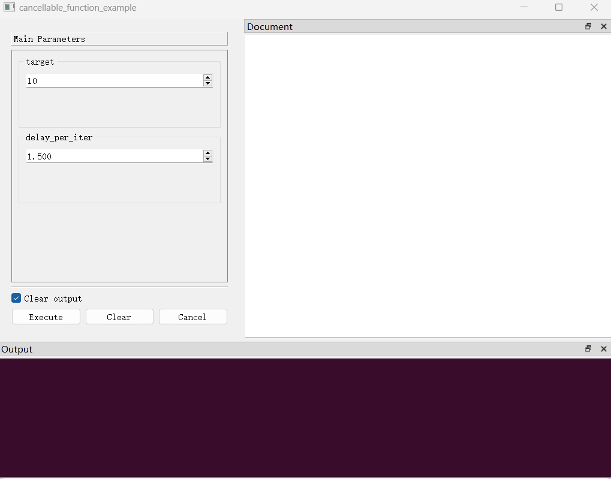

## （一）概述

在`PyGUIAdapter`中，开发者的函数默认运行在单独的一个线程中（当前的实现），这样的设计主要是为了避免函数长时间执行阻塞主线程，导致界面卡死。对于长时间运行的函数，开发者可能希望让用户具备取消真正执行中的函数的能力。

为了实现取消函数执行的效果，一种简单粗暴的想法是直接终结（terminate）函数运行的那个线程，但是这种做法存在很大的隐患，这种方法无法确定线程终止时的具体状态，可能会导致数据不一致、资源泄露或其他难以预测的问题。正常的做法是通过轮询检查某个条件，在满足条件时让函数返回，从而达到线程正常结束的效果，`PyGUIAdapter`基于这一思路，实现了一种称之为`协商式取消`的函数执行取消机制。

所谓`“协商式”`，指的是函数的取消并不是必然的，用户取消函数的操作被视为一种`“请求”`，开发者需要在函数中手动处理这种请求，并根据具体的情况做出处理。这里说的处理，可以是`“同意请求，立即从函数返回”`，也可以是`“同意请求，执行某些特定步骤（比如资源清理）后返回”`，当然也可以是`“不同意请求，继续执行函数”`。换言之，用户具有取消函数执行的`“建议权”`，而函数是否取消的`“决定权”`仍然归于开发者或者说函数本身。

## （二）方法与示例

要使一个函数可以被取消，首先，需要在调用`GUIAdapter.add()`时传入`cancellable=True`。此时，函数执行窗口的操作区域将显示一个取消按钮。用户通过按下此按钮来向函数发出取消执行的请求。

在函数中，开发者需要通过调用`ucontext.is_function_cancelled()`定期检查用户是否发出了取消函数执行的请求，并根据实际情况做出处理。

下面是一个简单的示例：

```python
import time

from pyguiadapter.adapter import GUIAdapter
from pyguiadapter.adapter.ucontext import is_function_cancelled
from pyguiadapter.adapter.uoutput import uprint
from pyguiadapter.windows.fnexec import FnExecuteWindowConfig


def cancel_function_example(target: int = 10, delay_per_iter: float = 0.5):
    """
    @params
    [target]
    min_value = 1

    [delay_per_iter]
    min_value = 0.001
    step = 0.5
    decimals = 3

    @end
    """
    for i in range(target):
        if is_function_cancelled():
            break
        uprint("process: ", i)
        time.sleep(delay_per_iter)
    uprint("done!")


if __name__ == "__main__":
    adapter = GUIAdapter()
    adapter.add(
        cancel_function_example,
        cancelable=True,
        window_config=FnExecuteWindowConfig(disable_widgets_on_execute=True),
    )
    adapter.run()

```

效果如下：

<div style="text-align: center">
    
</div>

