## （一）`text_t`类型

### 0、说明

`str`类型的扩展类型，语义上代表长文本（多行文本）。

### 1、默认控件

- [`TextEdit`](apis/pyguiadapter.widgets.textedit.md)
- 外观

<div style="text-align: center">
    
</div>


### 2、可配置属性

参见配置类：[`TextEditConfig`](apis/pyguiadapter.widgets.textedit.md#pyguiadapter.widgets.TextEditConfig)

### 3、示例

```python
from pyguiadapter.adapter import GUIAdapter
from pyguiadapter.adapter.uoutput import uprint
from pyguiadapter.extend_types import text_t
from pyguiadapter.widgets import TextEditConfig


def text_t_example(arg1: text_t, arg2: text_t, arg3: text_t = "foo") -> str:
    """
    This is an example for **text_t** type hint and **TextEdit** widget.

    @param arg1: description for arg1
    @param arg2: description for arg2
    @param arg3: description for arg3
    @return:

    @params
    [arg1]
    default_value = "Hello World"

    [arg2]
    default_value = "你好，世界！"

    @end
    """
    assert isinstance(arg1, str)
    assert isinstance(arg2, str)
    assert isinstance(arg3, str)
    uprint("arg1:", arg1)
    uprint("arg2:", arg2)
    uprint("arg3:", arg3)
    return "{};{};{}".format(arg1, arg2, arg3)


if __name__ == "__main__":

    arg3_conf = TextEditConfig(
        default_value="bar",
        placeholder="Please input some text here!",
    )

    adapter = GUIAdapter()
    adapter.add(
        text_t_example,
        widget_configs={"arg3": arg3_conf},
    )
    adapter.run()
```

<div style="text-align: center">
    
</div>


----

## （二）`int_t`类型

### 0、说明

`int`类型的扩展类型，用于提供`LineEdit`形式的输入控件。

### 1、默认控件

- [`IntLineEdit`](apis/pyguiadapter.widgets.intedit.md)
- 外观

<div style="text-align: center">
    
</div>


### 2、可配置属性

参见配置类：[`IntLineEditConfig`](apis/pyguiadapter.widgets.intedit.md#pyguiadapter.widgets.IntLineEditConfig)

### 3、示例

```python
from pyguiadapter.adapter import GUIAdapter
from pyguiadapter.adapter.uoutput import uprint
from pyguiadapter.extend_types import int_t
from pyguiadapter.widgets import IntLineEditConfig


def int_t_example(arg1: int_t, arg2: int_t, arg3: int_t = 100) -> int:
    """
    This is an example for **int_t** type hint and **IntLineEdit** widget.

    @param arg1: description for arg1
    @param arg2: description for arg2
    @param arg3: description for arg3
    @return:

    @params
    [arg1]
    default_value = -100
    min_value = -100
    max_value = 100

    [arg2]
    max_value = 999
    empty_value = -1

    @end
    """
    assert isinstance(arg1, int)
    assert isinstance(arg2, int)
    assert isinstance(arg3, int)
    uprint("arg1:", arg1)
    uprint("arg2:", arg2)
    uprint("arg3:", arg3)
    return arg1 + arg2 + arg3


if __name__ == "__main__":

    arg3_conf = IntLineEditConfig(
        default_value=-99,
        min_value=-100,
        max_value=100,
        empty_value=None,
        placeholder="Enter a number",
        clear_button=True,
    )

    adapter = GUIAdapter()
    adapter.add(
        int_t_example,
        widget_configs={"arg3": arg3_conf},
    )
    adapter.run()
```

<div style="text-align: center">
    
</div>


---

## （三）`float_t`类型

### 0、说明

`float`类型的扩展类型，用于提供`LineEdit`形式的输入控件。

### 1、默认控件

- [`FloatLineEdit`](apis/pyguiadapter.widgets.floatedit.md)
- 外观

<div style="text-align: center">
    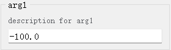
</div>


### 2、可配置属性

参见配置类：[`FloatLineEditConfig`](apis/pyguiadapter.widgets.floatedit.md#pyguiadapter.widgets.FloatLineEditConfig)

### 3、示例

```python
from pyguiadapter.adapter import GUIAdapter
from pyguiadapter.adapter.uoutput import uprint
from pyguiadapter.extend_types import float_t
from pyguiadapter.widgets import FloatLineEditConfig


def float_t_example(arg1: float_t, arg2: float_t, arg3: float_t = 100) -> float:
    """
    This is an example for **float_t** type hint and **FloatLineEdit** widget.

    @param arg1: description for arg1
    @param arg2: description for arg2
    @param arg3: description for arg3
    @return:

    @params
    [arg1]
    default_value = -100.0
    min_value = -100.0
    max_value = 100.0

    [arg2]
    default_value = 99999999.0
    max_value = 99999999.0
    empty_value = -1.0
    decimals = 3
    scientific_notation = true

    @end

    """
    uprint("arg1:", arg1)
    uprint("arg2:", arg2)
    uprint("arg3:", arg3)
    return arg1 + arg2 + arg3


if __name__ == "__main__":

    arg3_conf = FloatLineEditConfig(
        default_value=-0.00005,
        min_value=-100.0,
        max_value=100.0,
        empty_value=None,
        decimals=5,
        scientific_notation=True,
        clear_button=True,
        placeholder="Enter a float value",
    )

    adapter = GUIAdapter()
    adapter.add(
        float_t_example,
        widget_configs={"arg3": arg3_conf},
    )
    adapter.run()
```

<div style="text-align: center">
    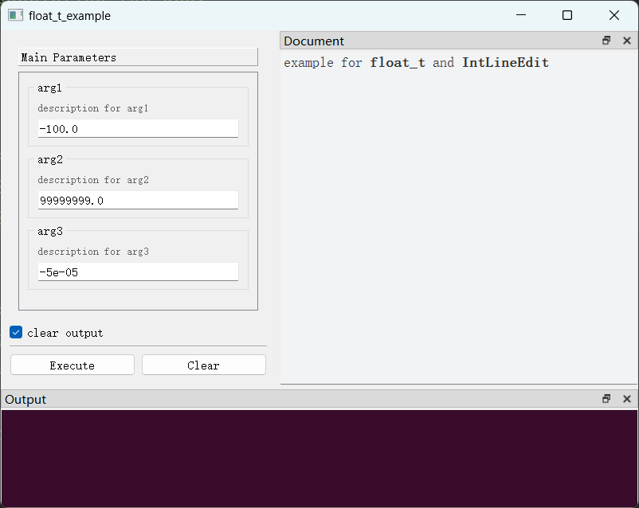
</div>


---

## （四）`int_slider_t`类型

### 0、说明
`int`类型的扩展类型，用于提供`Slider（滑动条）`形式的输入控件。

### 1、默认控件

- [`Slider`](apis/pyguiadapter.widgets.slider.md)
- 外观

<div style="text-align: center">
    
</div>


### 2、可配置属性

参见配置类：[`SliderConfig`](apis/pyguiadapter.widgets.slider.md#pyguiadapter.widgets.SliderConfig)

### 3、示例

```python
from pyguiadapter.adapter import GUIAdapter
from pyguiadapter.adapter.uoutput import uprint
from pyguiadapter.extend_types import int_slider_t
from pyguiadapter.widgets import SliderConfig
from pyguiadapter.widgets.extend.slider import TickPosition


def int_slider_t_example(
    arg1: int_slider_t, arg2: int_slider_t, arg3: int_slider_t = 100
) -> int:
    """
    This is an example for **int_slider_t** type hint and **Slider** widget.

    @param arg1: description for arg1
    @param arg2: description for arg2
    @param arg3: description for arg3
    @return:

    @params
    [arg1]
    default_value = -100
    min_value = -100
    max_value = 100

    [arg2]
    max_value = 999
    single_step = 2
    tracking = false
    prefix = "count: "
    tick_interval = 10
    inverted_controls = true
    inverted_appearance = true

    @end
    """
    uprint("arg1:", arg1)
    uprint("arg2:", arg2)
    uprint("arg3:", arg3)
    return arg1 + arg2 + arg3


if __name__ == "__main__":

    arg3_conf = SliderConfig(
        default_value=-99,
        min_value=-100,
        max_value=100,
        tick_position=TickPosition.TicksAbove,
        tick_interval=2,
        single_step=1,
        page_step=10,
        suffix=" mv",
    )

    adapter = GUIAdapter()
    adapter.add(
        int_slider_t_example,
        widget_configs={"arg3": arg3_conf},
    )
    adapter.run()
```

<div style="text-align: center">
    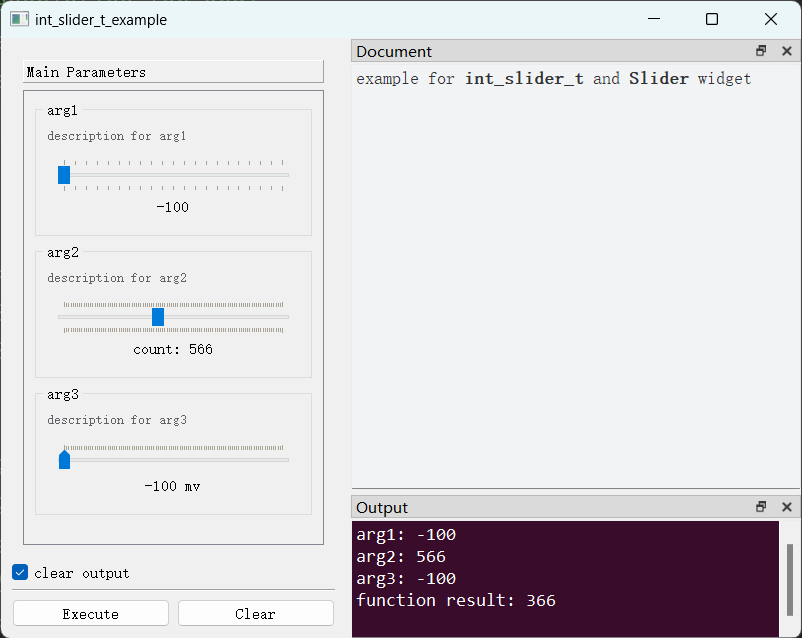
</div>


---

## （五）`int_dial_t`类型

### 0、说明
`int`类型的扩展类型，用于提供`Dial（拨号盘）`形式的输入控件。

### 1、默认控件

- [`Dial`](apis/pyguiadapter.widgets.dial.md)
- 外观

<div style="text-align: center">
    
</div>


### 2、可配置属性

参见配置类：[`DialConfig`](apis/pyguiadapter.widgets.dial.md#pyguiadapter.widgets.DialConfig)

### 3、示例

```python
from pyguiadapter.adapter import GUIAdapter
from pyguiadapter.adapter.uoutput import uprint
from pyguiadapter.extend_types import int_dial_t
from pyguiadapter.widgets import DialConfig


def int_dial_t_example(
    arg1: int_dial_t, arg2: int_dial_t, arg3: int_dial_t = 100
) -> int:
    """
    This is an example for **int_dial_t** type hint and **Dial** widget.

    @param arg1: description for arg1
    @param arg2: description for arg2
    @param arg3: description for arg3
    @return:

    @params
    [arg1]
    default_value = -100
    min_value = -100
    max_value = 100

    [arg2]
    max_value = 999
    single_step = 2
    tracking = false
    prefix = "count: "
    inverted_controls = true
    inverted_appearance = true

    @end

    """
    uprint("arg1:", arg1)
    uprint("arg2:", arg2)
    uprint("arg3:", arg3)
    return arg1 + arg2 + arg3


if __name__ == "__main__":

    arg3_conf = DialConfig(
        default_value=-99,
        min_value=-100,
        max_value=100,
        suffix=" mv",
    )

    adapter = GUIAdapter()
    adapter.add(int_dial_t_example, widget_configs={"arg3": arg3_conf})
    adapter.run()
```

<div style="text-align: center">
    
</div>


---

## （六）`colot_hex_t`类型

### 0、说明
`str`类型的扩展类型，语义上代表颜色值（十六进制字符串）。可以表示RGB颜色值，如`#FFFFFF`；也可以表示RGBA颜色值，如`#FFFFFF80`。


### 1、默认控件

- [`ColorHexPicker`](apis/pyguiadapter.widgets.colorpicker.md)
- 外观

<div style="text-align: center">
    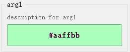
</div>


### 2、可配置属性

参见配置类：[`ColorPickerConfig`](apis/pyguiadapter.widgets.colorpicker.md#pyguiadapter.widgets.ColorPickerConfig)

### 3、示例

```python
from pyguiadapter.adapter import GUIAdapter
from pyguiadapter.adapter.uoutput import uprint
from pyguiadapter.extend_types import color_hex_t
from pyguiadapter.widgets import ColorHexPickerConfig


def color_hex_t_example(
    arg1: color_hex_t,
    arg2: color_hex_t,
    arg3: color_hex_t = "red",
):
    """
    This is an example for type **color_hex_t** type hint and **ColorPicker** widget.

    @param arg1: description for arg1
    @param arg2: description for arg2
    @param arg3: description for arg3

    @params
    [arg1]
    default_value = "#aaffbb"
    alpha_channel = false
    @end
    """
    uprint("arg1:", arg1)
    uprint("arg2:", arg2)
    uprint("arg3:", arg3)


if __name__ == "__main__":
    arg2_conf = ColorHexPickerConfig(default_value="#effeedff", alpha_channel=True)
    arg3_conf = ColorHexPickerConfig(display_color_name=False)
    adapter = GUIAdapter()
    adapter.add(
        color_hex_t_example, widget_configs={"arg2": arg2_conf, "arg3": arg3_conf}
    )
    adapter.run()
```

<div style="text-align: center">
    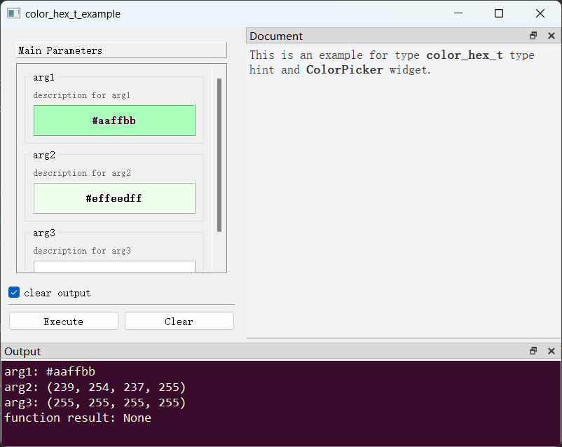
</div>


---

## （七）`colot_tuple_t`类型

### 1、默认控件

- [`ColorPicker`](apis/pyguiadapter.widgets.colorpicker.md)
- 外观

<div style="text-align: center">
    
</div>


### 2、可配置属性

参见配置类：[`ColorPickerConfig`](apis/pyguiadapter.widgets.colorpicker.md#pyguiadapter.widgets.ColorPickerConfig)

### 3、示例

```python
from pyguiadapter.adapter import GUIAdapter
from pyguiadapter.adapter.uoutput import uprint
from pyguiadapter.extend_types import color_tuple_t
from pyguiadapter.widgets import ColorTuplePickerConfig


def color_tuple_t_example(
    arg1: color_tuple_t,
    arg2: color_tuple_t,
    arg3: color_tuple_t = (125, 230, 156),
):
    """
    This is an example for type **color_tuple_t** type hint and **ColorPicker** widget.

    @param arg1: description for arg1
    @param arg2: description for arg2
    @param arg3: description for arg3

    @params
    [arg1]
    default_value = [255,0, 126]
    alpha_channel = false
    @end
    """
    uprint("arg1:", arg1)
    uprint("arg2:", arg2)
    uprint("arg3:", arg3)


if __name__ == "__main__":
    arg2_conf = ColorTuplePickerConfig(
        default_value=(25, 25, 25, 255), alpha_channel=True
    )
    arg3_conf = ColorTuplePickerConfig(display_color_name=False)
    adapter = GUIAdapter()
    adapter.add(
        color_tuple_t_example, widget_configs={"arg2": arg2_conf, "arg3": arg3_conf}
    )
    adapter.run()
```

<div style="text-align: center">
    
</div>


---


## （八）`choice_t`类型

### 0、说明
`object`类型的扩展类型，语义上代表一组确定对象中的一个对象，提供`ComboBox（下拉列表）`形式的输入控件，用于从一组可选项中选择任意一个选项。可选项可以是可以实现了`__hash__`和`__eq__`方法的任何对象，包括但不限于字符串、数字等。


### 1、默认控件

- [`ChoiceBox`](apis/pyguiadapter.widgets.choicebox.md)
- 外观

<div style="text-align: center">
    
</div>


### 2、可配置属性

参见配置类：[`ChoiceBoxConfig`](apis/pyguiadapter.widgets.choicebox.md#pyguiadapter.widgets.ChoiceBoxConfig)

### 3、示例

```python
from pyguiadapter.adapter import GUIAdapter
from pyguiadapter.adapter.uoutput import uprint
from pyguiadapter.extend_types import choice_t
from pyguiadapter.widgets import ChoiceBoxConfig


class MyObject(object):
    def __init__(self, name: str):
        self.name = name

    def __eq__(self, other):
        if not isinstance(other, MyObject):
            return False
        return self.name == other.name

    def __hash__(self):
        return hash(self.name)

    def __str__(self):
        # this method is very important
        # the return value will be displayed as the ChoiceBox's item
        return self.name


def choice_t_example(arg1: choice_t, arg2: choice_t, arg3: choice_t, arg4: choice_t):
    """
    This is an example for type **choice_t** type hint and **ChoiceBox** widget.

    @param arg1: description for arg1
    @param arg2: description for arg2
    @param arg3: description for arg3
    @param arg4: description for arg4
    @return:

    @params
    [arg1]
    # choices can be a list of numbers
    choices = {"A"=1, "B"=2, "C"=3}

    @end
    """
    uprint("arg1:", arg1, f", type: {type(arg1)}")
    uprint("arg2:", arg2, f", type: {type(arg2)}")
    uprint("arg3:", arg3, f", type: {type(arg3)}")
    uprint("arg4:", arg4, f", type: {type(arg4)}")


if __name__ == "__main__":
    arg2_conf = ChoiceBoxConfig(
        default_value="opt2",
        # choices can be a list of strings
        choices=["opt1", "opt2", "opt3", "opt4"],
        editable=True,
    )

    obj1 = MyObject("apple")
    obj2 = MyObject("banana")
    obj3 = MyObject("orange")

    arg3_conf = ChoiceBoxConfig(
        default_value=obj2,
        # choices can be a list of objects which have implemented __eq__ and __hash__ methods
        choices=[obj1, obj2, obj3],
    )

    arg4_conf = ChoiceBoxConfig(
        # choices can be a list of numbers
        choices={"A": 1, "B": 2, "C": 3},
        editable=True,
        add_user_input=False,
    )

    adapter = GUIAdapter()
    adapter.add(
        choice_t_example,
        widget_configs={"arg2": arg2_conf, "arg3": arg3_conf, "arg4": arg4_conf},
    )
    adapter.run()
```

<div style="text-align: center">
    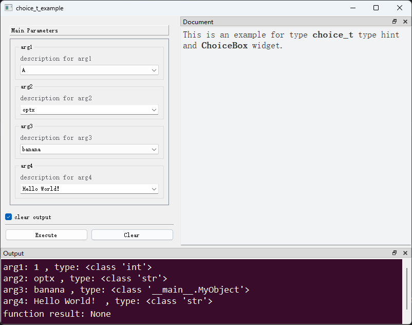
</div>


---

## （九）`choices_t`类型

### 0、说明
`list`类型的扩展类型，语义上代表一组可选项中的多个对象，提供一组`CheckBox（复选框）`作为输入控件，用于从一组可选项中选择多个选项。可选项可以是可以实现了`__hash__`和`__eq__`方法的任何对象，包括但不限于字符串、数字等。

### 1、默认控件

- [`MultiChoiceBox`](apis/pyguiadapter.widgets.multichoice.md)
- 外观

<div style="text-align: center">
    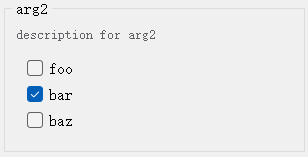
</div>


### 2、可配置属性

参见配置类：[`MultiChoiceBoxConfig`](apis/pyguiadapter.widgets.multichoice.md#pyguiadapter.widgets.MultiChoiceBoxConfig)

### 3、示例

```python
from pyguiadapter.adapter import GUIAdapter
from pyguiadapter.adapter.uoutput import uprint
from pyguiadapter.extend_types import choices_t
from pyguiadapter.widgets import MultiChoiceBoxConfig


class MyObject(object):
    def __init__(self, name: str):
        self.name = name

    def __eq__(self, other):
        if not isinstance(other, MyObject):
            return False
        return self.name == other.name

    def __hash__(self):
        return hash(self.name)

    def __str__(self):
        # this method is very important
        # the return value will be displayed as the ChoiceBox's item
        return self.name


def choices_t_example(arg1: choices_t, arg2: choices_t, arg3: choices_t):
    """
    This is an example for type **choices_t** type hint and **MultiChoiceBox** widget.

    @param arg1: description for arg1
    @param arg2: description for arg2
    @param arg3: description for arg3

    @params
    [arg1]
    default_value = ["opt1", "opt2"]
    choices = ["opt1", "opt2", "opt3", "opt4", "opt5"]
    @end
    """
    uprint("arg1:", arg1)
    uprint("arg2:", arg2)
    uprint("arg3:", arg3)


if __name__ == "__main__":
    arg2_conf = MultiChoiceBoxConfig(
        choices=[MyObject("foo"), MyObject("bar"), MyObject("baz")]
    )
    arg3_conf = MultiChoiceBoxConfig(
        default_value=(1, 2, 3),
        choices={
            "Option 1": 1,
            "Option 2": 2,
            "Option 3": 3,
            "Option 4": 4,
            "Option 5": 5,
        },
        columns=2,
    )
    adapter = GUIAdapter()
    adapter.add(
        choices_t_example, widget_configs={"arg2": arg2_conf, "arg3": arg3_conf}
    )
    adapter.run()
```

<div style="text-align: center">
    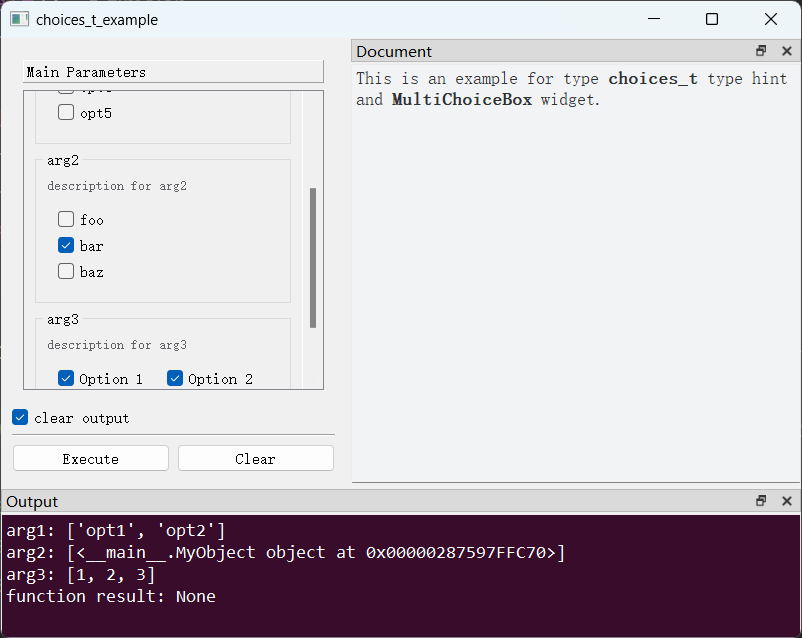
</div>


---

## （十）`key_sequence_t`类型

### 0、说明
`str`或`List[str]`类型的扩展类型（从控件获取的值是`str`类型还是`List[str]`类型，由`KeySequenceEditConfig`的`return_type`属性决定），语义上代表按键序列。

### 1、默认控件

- [`KeySequenceEdit`](apis/pyguiadapter.widgets.keysequenceedit.md)
- 外观

<div style="text-align: center">
    
</div>


### 2、可配置属性

参见配置类：[`KeySequenceEditConfig`](apis/pyguiadapter.widgets.keysequenceedit.md#pyguiadapter.widgets.KeySequenceEditConfig)

### 3、示例

```python
from pyguiadapter.adapter import GUIAdapter
from pyguiadapter.adapter.uoutput import uprint
from pyguiadapter.extend_types import key_sequence_t
from pyguiadapter.widgets import KeySequenceEditConfig, KeySequenceEdit


def key_sequence_t_example(
    arg1: key_sequence_t,
    arg2: key_sequence_t,
    arg3: key_sequence_t,
):
    """
    This is an example for type **key_sequence_t** type hint and **KeySequenceEdit** widget.

    @param arg1: description for arg1
    @param arg2: description for arg2
    @param arg3: description for arg3

    @params
    [arg1]
    default_value = "Ctrl+Shift+V"

    @end
    """
    uprint("arg1:", arg1)
    uprint("arg2:", arg2)
    uprint("arg3:", arg3)


if __name__ == "__main__":
    arg2_conf = KeySequenceEditConfig(default_value="Ctrl+Alt+D")

    arg3_conf = KeySequenceEditConfig(
        default_value="Ctrl+Shift+T",
        key_sequence_format=KeySequenceEdit.PortableText,
        return_type="list",
    )
    adapter = GUIAdapter()
    adapter.add(
        key_sequence_t_example, widget_configs={"arg2": arg2_conf, "arg3": arg3_conf}
    )
    adapter.run()
```

<div style="text-align: center">
    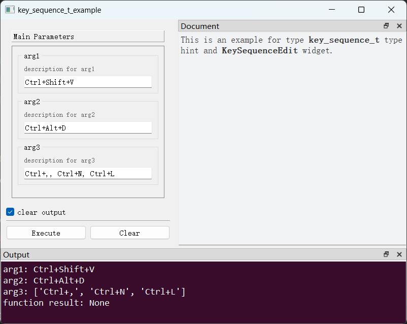
</div>


---

## （十一）`plain_dict_t`类型

### 0、说明
`dict`类型的扩展类型，语义上代表一个普通字典，所谓普通字典是指键值对类型满足：key:str -> value: Union[str,int,float,bool,list,dict,None]的字典。

### 1、默认控件

- [`PlainDictEdit`](apis/pyguiadapter.widgets.plaindict.md)
- 外观

<div style="text-align: center">
    
</div>


### 2、可配置属性

参见配置类：[`PlainDictEditConfig`](apis/pyguiadapter.widgets.plaindict.md#pyguiadapter.widgets.PlainDictEditConfig)

### 3、示例

```python
from pyguiadapter.adapter import GUIAdapter
from pyguiadapter.adapter.uoutput import uprint
from pyguiadapter.widgets import PlainDictEditConfig
from pyguiadapter.extend_types import plain_dict_t


def plain_dict_t_example(arg1: plain_dict_t, arg2: plain_dict_t, arg3: plain_dict_t):
    """
    This is an example for type **plain_dict_t** type hint and **PlainDictEdit** widget.

    @param arg1: description for arg1
    @param arg2: description for arg2
    @param arg3: description for arg3

    @params
    [arg3]
    default_value = {key1=1,key2="value",key3=true,key4=[1,2,3.0]}
    @end

    """
    uprint("arg1:", arg1, "type: ", type(arg1))
    uprint("arg2:", arg2, "type: ", type(arg2))
    uprint("arg3:", arg3, "type: ", type(arg3))


if __name__ == "__main__":
    arg1_conf = PlainDictEditConfig(
        default_value={
            "key1": 1,
            "key2": "value",
            "key3": True,
            "key4": [1, 2, 3.0],
            "key5": None,
            "key6": {"key7": 1},
        }
    )
    arg2_conf = PlainDictEditConfig(
        default_value={
            "Content-Type": "application/json",
            "Authorization": "Bearer token123",
        },
        key_header="Header",
        value_header="Value",
        vertical_header_visible=True,
    )
    adapter = GUIAdapter()
    adapter.add(
        plain_dict_t_example, widget_configs={"arg1": arg1_conf, "arg2": arg2_conf}
    )
    adapter.run()
```

<div style="text-align: center">
    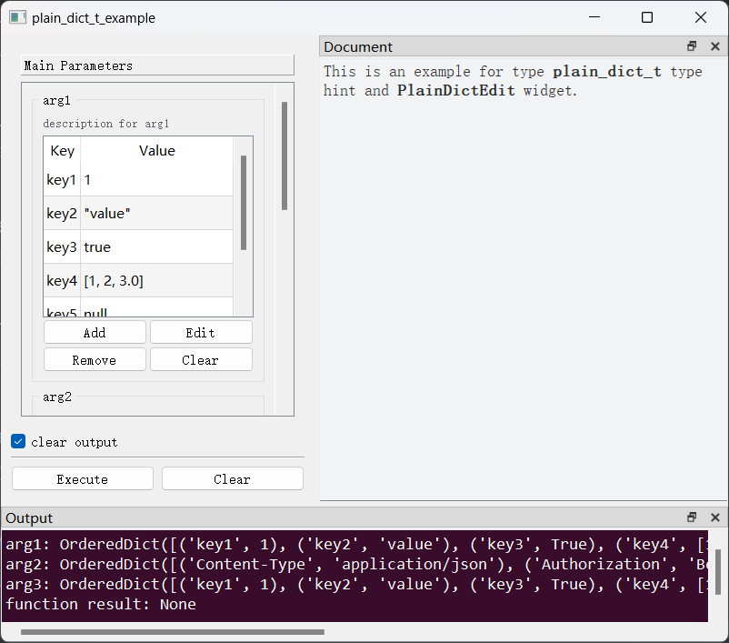
</div>


---

## （十二）`string_list_t`类型

### 0、说明
`List[str]`类型的扩展类型，语义上代表一个字符串列表。

### 1、默认控件

- [`StringListEdit`](apis/pyguiadapter.widgets.stringlist.md)
- 外观

<div style="text-align: center">
    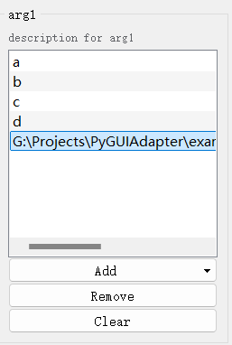
</div>


### 2、可配置属性

参见配置类：[`StringListEditConfig`](apis/pyguiadapter.widgets.stringlist.md#pyguiadapter.widgets.StringListEditConfig)

### 3、示例

```python
from pyguiadapter.adapter import GUIAdapter
from pyguiadapter.adapter.uoutput import uprint
from pyguiadapter.widgets import StringListEditConfig
from pyguiadapter.extend_types import string_list_t


def string_list_t_example(
    arg1: string_list_t,
    arg2: string_list_t,
    arg3: string_list_t,
):
    """
    This is an example for type **string_list_t** type hint and **StringListEdit** widget.

    @param arg1: description for arg1
    @param arg2: description for arg2
    @param arg3: description for arg3

    @params
    [arg1]
    default_value = ["a", "b", "c", "d"]
    add_file = true
    add_dir = false
    file_filters = "Python files(*.py);;Text files(*.txt)"

    @end

    """
    uprint("arg1:", arg1)
    uprint("arg2:", arg2)
    uprint("arg3:", arg3)


if __name__ == "__main__":
    arg2_conf = StringListEditConfig(add_file=False, add_dir=True)
    arg3_conf = StringListEditConfig(add_file=False, add_dir=False)
    adapter = GUIAdapter()
    adapter.add(
        string_list_t_example, widget_configs={"arg2": arg2_conf, "arg3": arg3_conf}
    )
    adapter.run()
```

<div style="text-align: center">
    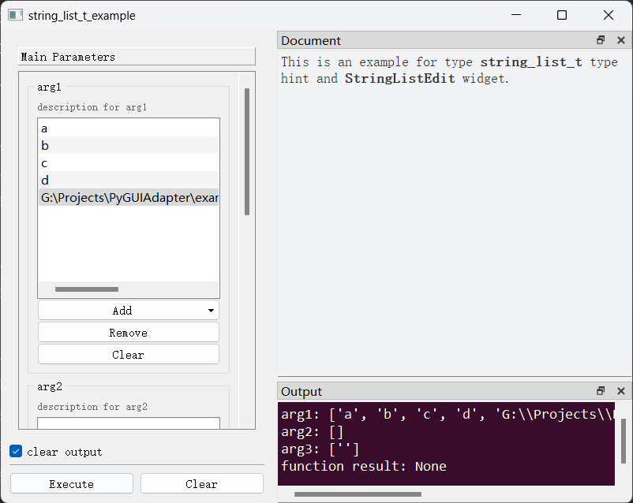
</div>


---

## （十三）`json_obj_t`类型

### 0、说明
`Union[str,int,float,bool,list,dict,None]`类型的扩展类型，语义上代表一个JSON对象。


### 1、默认控件

- [`JsonEdit`](apis/pyguiadapter.widgets.jsonedit.md)
- 外观

<div style="text-align: center">
    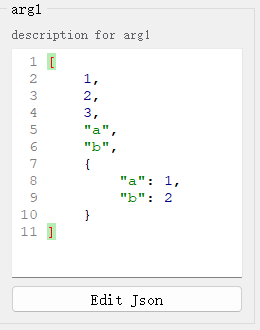
</div>


### 2、可配置属性

参见配置类：[`JsonEditConfig`](apis/pyguiadapter.widgets.jsonedit.md#pyguiadapter.widgets.JsonEditConfig)

### 3、示例

```python
from pyguiadapter.adapter import GUIAdapter
from pyguiadapter.adapter.uoutput import uprint
from pyguiadapter.widgets import JsonEditConfig
from pyguiadapter.extend_types import json_obj_t


def json_obj_t_example(arg1: json_obj_t, arg2: json_obj_t, arg3: json_obj_t):
    """
    This is an example for type **json_obj_t** type hint and **JsonEdit** widget.

    @param arg1: description for arg1
    @param arg2: description for arg2
    @param arg3: description for arg3

    @params
    [arg3]
    default_value = true

    @end

    """
    uprint("arg1:", arg1, "type: ", type(arg1))
    uprint("arg2:", arg2, "type: ", type(arg2))
    uprint("arg3:", arg3, "type: ", type(arg3))


if __name__ == "__main__":
    arg1_conf = JsonEditConfig(default_value=[1, 2, 3, "a", "b", {"a": 1, "b": 2}])
    arg2_conf = JsonEditConfig(
        default_value={"a": 1, "b": 2},
        # height=0 or width=0 will make the inplace editor hidden.
        height=0,
        width=0,
    )
    adapter = GUIAdapter()
    adapter.add(
        json_obj_t_example, widget_configs={"arg1": arg1_conf, "arg2": arg2_conf}
    )
    adapter.run()
```

<div style="text-align: center">
    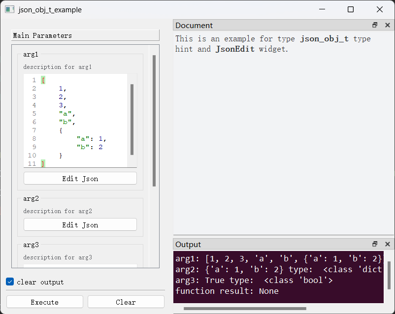
</div>


---

## （十四）`directory_t`、`dir_t`类型

### 0、说明
`str`类型的扩展类型，语义上代表一个目录路径。

### 1、默认控件

- [`DirSelect`](apis/pyguiadapter.widgets.dirselect.md)
- 外观

<div style="text-align: center">
    
</div>


### 2、可配置属性

参见配置类：[`DirSelectConfig`](apis/pyguiadapter.widgets.dirselect.md#pyguiadapter.widgets.PyLiteralEditConfig)

### 3、示例

```python
import os.path

from pyguiadapter.adapter import GUIAdapter
from pyguiadapter.adapter.uoutput import uprint
from pyguiadapter.extend_types import directory_t, dir_t
from pyguiadapter.widgets import DirSelectConfig


def directory_t_example(arg1: directory_t, arg2: directory_t, arg3: dir_t):
    """
    This is an example for type **directory_t**(**dir_t**) type hint and **DirSelect** widget.

    @param arg1: description for arg1
    @param arg2: description for arg2
    @param arg3: description for arg3

    @params
    [arg3]
    placeholder = "select path"
    dialog_title = "Select Dir"
    @end

    """
    uprint("arg1:", arg1)
    uprint("arg2:", arg2)
    uprint("arg3:", arg3)


if __name__ == "__main__":
    arg1_conf = DirSelectConfig(
        placeholder="select save path",
        dialog_title="Select Save Path",
    )
    arg2_conf = DirSelectConfig(
        default_value=os.path.dirname(os.path.abspath(__file__)),
        start_dir=os.path.expanduser("~"),
        clear_button=True,
    )
    adapter = GUIAdapter()
    adapter.add(
        directory_t_example, widget_configs={"arg1": arg1_conf, "arg2": arg2_conf}
    )
    adapter.run()
```

<div style="text-align: center">
    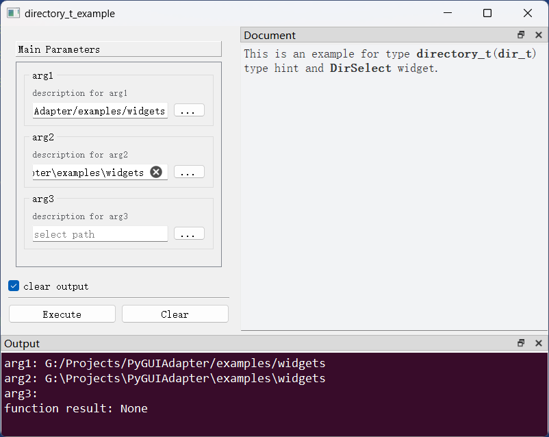
</div>


---

## （十五）`file_t`类型

### 0、说明
`str`类型的扩展类型，语义上代表一个文件路径。


### 1、默认控件

- [`FileSelect`](apis/pyguiadapter.widgets.fileselect.md)
- 外观

<div style="text-align: center">
    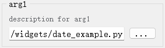
</div>


### 2、可配置属性

参见配置类：[`FileSelectConfig`](apis/pyguiadapter.widgets.fileselect.md#pyguiadapter.widgets.DirSelectConfig)

### 3、示例

```python
import os.path

from pyguiadapter.adapter import GUIAdapter
from pyguiadapter.adapter.uoutput import uprint
from pyguiadapter.widgets import FileSelectConfig
from pyguiadapter.extend_types import file_t


def file_t_example(arg1: file_t, arg2: file_t, arg3: file_t):
    """
    This is an example for type **file_t** type hint and **FileSelect** widget.

    @param arg1: description for arg1
    @param arg2: description for arg2
    @param arg3: description for arg3

    @params
    [arg3]
    placeholder = "input save path here"
    save_file = true
    dialog_title = "Save File"
    @end

    """
    uprint("arg1:", arg1)
    uprint("arg2:", arg2)
    uprint("arg3:", arg3)


if __name__ == "__main__":
    arg1_conf = FileSelectConfig(
        placeholder="input file path here",
        filters="Text files(*.txt);;All files(*.*)",
        dialog_title="Open File",
    )
    arg2_conf = FileSelectConfig(
        default_value=os.path.abspath(__file__),
        start_dir=os.path.expanduser("~"),
        clear_button=True,
    )
    adapter = GUIAdapter()
    adapter.add(file_t_example, widget_configs={"arg1": arg1_conf, "arg2": arg2_conf})
    adapter.run()
```

<div style="text-align: center">
    
</div>


---

## （十六）`files_t`类型

### 0、说明
`List[str]`类型的扩展类型，语义上代表一个文件路径列表。

### 1、默认控件

- [`MultiFileSelect`](apis/pyguiadapter.widgets.fileselect.md#pyguiadapter.widgets.MultiFileSelect)
- 外观

<div style="text-align: center">
    
</div>


### 2、可配置属性

参见配置类：[`MultiFileSelectConfig`](apis/pyguiadapter.widgets.fileselect.md#pyguiadapter.widgets.MultiFileSelectConfig)

### 3、示例

```python
import os.path

from pyguiadapter.adapter import GUIAdapter
from pyguiadapter.adapter.uoutput import uprint
from pyguiadapter.widgets import MultiFileSelectConfig
from pyguiadapter.extend_types import files_t


def files_t_example(arg1: files_t, arg2: files_t, arg3: files_t):
    """
    This is an example for type **files_t** type hint and **MultiFileSelect** widget.

    @param arg1: description for arg1
    @param arg2: description for arg2
    @param arg3: description for arg3

    @params
    [arg3]
    placeholder = "select files"
    @end

    """
    uprint("arg1:", arg1)
    uprint("arg2:", arg2)
    uprint("arg3:", arg3)


if __name__ == "__main__":
    arg1_conf = MultiFileSelectConfig(
        default_value=("a", "b"),
        placeholder="input files here",
        filters="Text files(*.txt);;All files(*.*)",
        dialog_title="Open Files",
    )
    arg2_conf = MultiFileSelectConfig(
        default_value=[os.path.abspath(__file__)],
        start_dir=os.path.expanduser("~"),
        clear_button=True,
    )
    adapter = GUIAdapter()
    adapter.add(files_t_example, widget_configs={"arg1": arg1_conf, "arg2": arg2_conf})
    adapter.run()
```

<div style="text-align: center">
    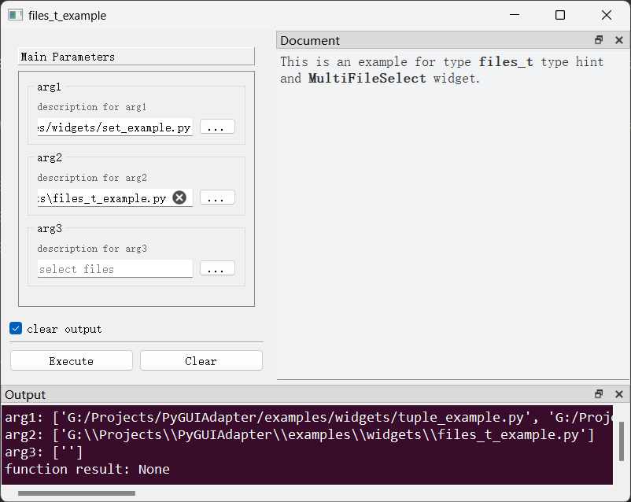
</div>

---

## （十七）`path_list_t`类型

### 0、说明
`List[str]`类型的扩展类型，语义上代表一个路径列表，支持添加文件路径和文件夹路径。

### 1、默认控件

- [`PathListEdit`](apis/pyguiadapter.widgets.pathlist.md#pyguiadapter.widgets.PathListEdit)
- 外观

<div style="text-align: center">
    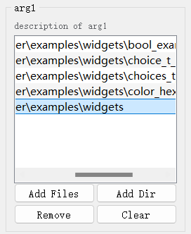
</div>


### 2、可配置属性

参见配置类：[`PathListEditConfig`](apis/pyguiadapter.widgets.pathlist.md#pyguiadapter.widgets.PathListEditConfig)

### 3、示例

```python
from pyguiadapter.adapter import GUIAdapter
from pyguiadapter.adapter.uoutput import uprint
from pyguiadapter.extend_types import path_list_t
from pyguiadapter.widgets import PathListEdit, PathListEditConfig


def path_list_t_example(arg1: path_list_t, arg2: path_list_t, arg3: path_list_t):
    """
    This is an example for **path_list_t** type hint and **PathListEdit** widget.

    Args:
        arg1: description of arg1
        arg2: description of arg2
        arg3: description of arg3

    Returns:
    """
    uprint(arg1)
    uprint(arg2)
    uprint(arg3)


if __name__ == "__main__":
    adapter = GUIAdapter()
    adapter.add(
        path_list_t_example,
        widget_configs={
            "arg1": PathListEditConfig(
                add_files=True,
                add_dirs=True,
                file_filters="Python Files (*.py);;Json Files (*.json)",
                text_elide_mode=PathListEdit.ElideNone,
                drag_n_drop=True,
            ),
            "arg2": PathListEditConfig(
                add_files=True,
                add_dirs=False,
                file_filters="Python Files (*.py);;Json Files (*.json)",
                text_elide_mode=PathListEdit.ElideRight,
                drag_n_drop=True,
            ),
            "arg3": PathListEditConfig(
                add_files=False,
                add_dirs=True,
                text_elide_mode=PathListEdit.ElideLeft,
                drag_n_drop=True,
            ),
        },
    )
    adapter.run()
```

<div style="text-align: center">
    
</div>

---

## （十八）`file_list_t`类型

### 0、说明
`List[str]`类型的扩展类型，语义上代表一个路径列表，支持添加文件路径。

### 1、默认控件

- [`FileListEdit`](apis/pyguiadapter.widgets.pathlist.md#pyguiadapter.widgets.FileListEdit)
- 外观

<div style="text-align: center">
    
</div>


### 2、可配置属性

参见配置类：[`FileListEditConfig`](apis/pyguiadapter.widgets.pathlist.md#pyguiadapter.widgets.FileListEditConfig)

### 3、示例

```python
from pyguiadapter.adapter import GUIAdapter
from pyguiadapter.adapter.uoutput import uprint
from pyguiadapter.extend_types import file_list_t
from pyguiadapter.widgets import FileListEditConfig, FileListEdit


def file_list_t_example(arg1: file_list_t, arg2: file_list_t, arg3: file_list_t):
    """
    This is an example for **file_list_t** type hint and **FileListEdit** widget.

    Args:
        arg1: description of arg1
        arg2: description of arg2
        arg3: description of arg3

    Returns:
    """
    uprint(arg1)
    uprint(arg2)
    uprint(arg3)


if __name__ == "__main__":
    adapter = GUIAdapter()
    adapter.add(
        file_list_t_example,
        widget_configs={
            "arg1": FileListEditConfig(
                file_filters="Python Files (*.py);;Json Files (*.json)",
                text_elide_mode=FileListEdit.ElideNone,
                drag_n_drop=True,
            ),
            "arg2": FileListEditConfig(
                file_filters="Python Files (*.py);;Json Files (*.json)",
                text_elide_mode=FileListEdit.ElideRight,
                drag_n_drop=True,
            ),
            "arg3": FileListEditConfig(
                text_elide_mode=FileListEdit.ElideLeft,
                drag_n_drop=True,
            ),
        },
    )
    adapter.run()
```

<div style="text-align: center">
    
</div>

---

## （十九）`dir_list_t`类型

### 0、说明
`List[str]`类型的扩展类型，语义上代表一个路径列表，支持添加文件夹路径。

### 1、默认控件

- [`DirectoryListEdit`](apis/pyguiadapter.widgets.pathlist.md#pyguiadapter.widgets.DirectoryListEdit)
- 外观

<div style="text-align: center">
    
</div>


### 2、可配置属性

参见配置类：[`DirectoryListEditConfig`](apis/pyguiadapter.widgets.pathlist.md#pyguiadapter.widgets.DirectoryListEditConfig)

### 3、示例

```python
from pyguiadapter.adapter import GUIAdapter
from pyguiadapter.adapter.uoutput import uprint
from pyguiadapter.extend_types import dir_list_t
from pyguiadapter.widgets import DirectoryListEditConfig, DirectoryListEdit


def dir_list_t_example(arg1: dir_list_t, arg2: dir_list_t, arg3: dir_list_t):
    """
    This is an example for **dir_list_t** type hint and **DirectoryListEdit** widget.

    Args:
        arg1: description of arg1
        arg2: description of arg2
        arg3: description of arg3

    Returns:
    """
    uprint(arg1)
    uprint(arg2)
    uprint(arg3)


if __name__ == "__main__":
    adapter = GUIAdapter()
    adapter.add(
        dir_list_t_example,
        widget_configs={
            "arg1": DirectoryListEditConfig(
                text_elide_mode=DirectoryListEdit.ElideNone,
                drag_n_drop=True,
            ),
            "arg2": DirectoryListEditConfig(
                text_elide_mode=DirectoryListEdit.ElideRight,
                drag_n_drop=True,
            ),
            "arg3": DirectoryListEditConfig(
                text_elide_mode=DirectoryListEdit.ElideLeft,
                drag_n_drop=True,
            ),
        },
    )
    adapter.run()
```

<div style="text-align: center">
    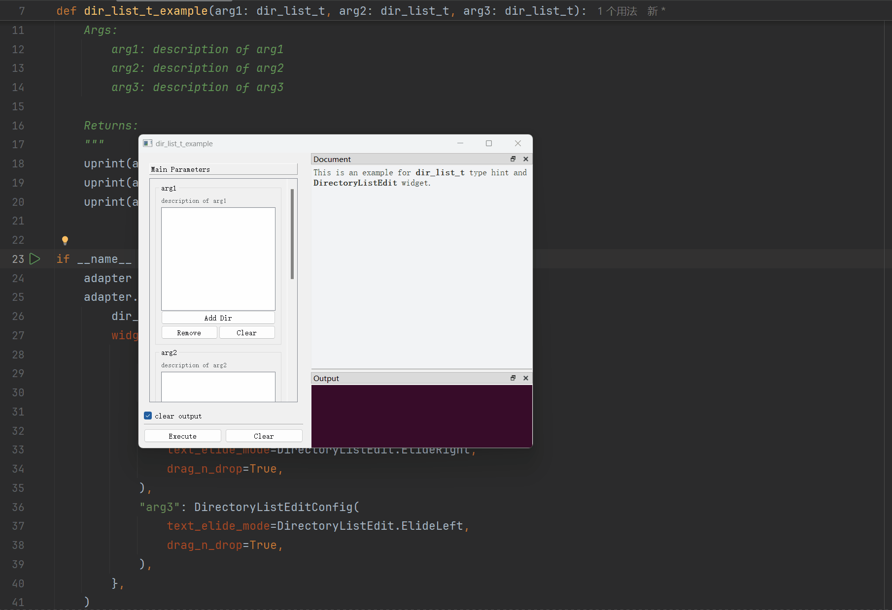
</div>

---

## （二十）`font_t`类型

### 0、说明
`str`类型的扩展类型，语义上代表一个字体名称，提供下拉框供用户选择当前系统已安装字体。

### 1、默认控件

- [`FontSelect`](apis/pyguiadapter.widgets.fontselect.md#pyguiadapter.widgets.FontSelect)
- 外观

<div style="text-align: center">
    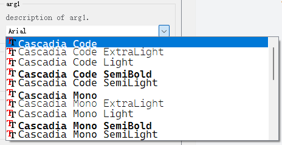
</div>


### 2、可配置属性

参见配置类：[`FontSelectConfig`](apis/pyguiadapter.widgets.fontselect.md#pyguiadapter.widgets.FontSelectConfig)

### 3、示例

```python
from pyguiadapter.adapter import GUIAdapter
from pyguiadapter.adapter.uoutput import uprint
from pyguiadapter.extend_types import font_t
from pyguiadapter.widgets import FontSelectConfig, FontSelect


def font_t_example(arg1: font_t, arg2: font_t, arg3: font_t):
    """
    This is an example for **font_t** type hint and **FontSelect** widget.

    Args:
        arg1: description of arg1.
        arg2: description of arg2.
        arg3: description of arg3.
    """
    uprint("arg1: ", arg1)
    uprint("arg2: ", arg2)
    uprint("arg3: ", arg3)


if __name__ == "__main__":
    adapter = GUIAdapter()
    adapter.add(
        font_t_example,
        widget_configs={
            "arg1": FontSelectConfig(
                default_value="Arial",
                font_filters=FontSelect.MonospacedFonts,
            ),
            "arg2": FontSelectConfig(
                font_filters=FontSelect.ProportionalFonts,
            ),
            "arg3": FontSelectConfig(
                font_filters=FontSelect.MonospacedFonts | FontSelect.ProportionalFonts,
            ),
        },
    )
    adapter.run()
```

<div style="text-align: center">
    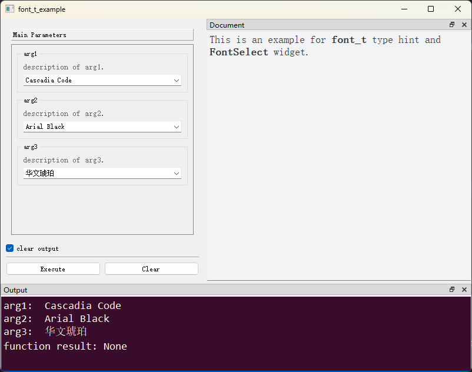
</div>

---

## （二十一）`int_quantity_t`类型

### 0、说明
`tuple`类型的扩展类型，具体为一个二元素元组`Tuple[int, str | None]`，语义上代表一个整数型的`数量`（所谓数量即带单位的量），第一个元素为数量的值，第二个元素为数量的单位。实现了专门的输入控件，允许用户输入数量的值和选择数量的单位。

### 1、默认控件

- [`IntQuantityBox`](apis/pyguiadapter.widgets.quantitybox.md#pyguiadapter.widgets.IntQuantityBox)
- 外观

<div style="text-align: center">
    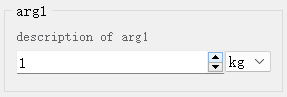
</div>


### 2、可配置属性

参见配置类：[`IntQuantityBoxConfig`](apis/pyguiadapter.widgets.quantitybox.md#pyguiadapter.widgets.IntQuantityBoxConfig)

### 3、示例

```python
from pyguiadapter.adapter import GUIAdapter
from pyguiadapter.adapter.uoutput import uprint
from pyguiadapter.extend_types import int_quantity_t, float_quantity_t
from pyguiadapter.widgets import IntQuantityBoxConfig, FloatQuantityBoxConfig


def quantity_t_example(arg1: int_quantity_t, arg2: float_quantity_t):
    """
    This is an example about **xxx_quantity_t** type hint and **XXXQuantityBox** widget.

    Args:
        arg1: description of arg1
        arg2: description of arg2
    """
    uprint("arg1: ", arg1)
    uprint("arg2: ", arg2)


if __name__ == "__main__":
    adapter = GUIAdapter()
    adapter.add(
        quantity_t_example,
        widget_configs={
            "arg1": IntQuantityBoxConfig(
                default_value=(1, "kg"),
                units=["kg", "g", "mg", "µg", "ng", "pg"],
                min_value=0,
                step=1,
            ),
            "arg2": FloatQuantityBoxConfig(
                default_value=(1.0, "m"),
                units=["m", "cm", "mm", "µm", "nm", "pm"],
                min_value=0.0,
                max_value=1000.0,
                decimals=5,
                step=0.00001,
            ),
        },
    )
    adapter.run()
```

<div style="text-align: center">
    
</div>

---

## （二十二）`float_quantity_t`类型

### 0、说明
`tuple`类型的扩展类型，具体为一个二元素元组`Tuple[float, str | None]`，语义上代表一个浮点型的`数量`（所谓数量即带单位的量），第一个元素为数量的值，第二个元素为数量的单位。实现了专门的输入控件，允许用户输入数量的值和选择数量的单位。

### 1、默认控件

- [`FloatQuantityBox`](apis/pyguiadapter.widgets.quantitybox.md#pyguiadapter.widgets.FloatQuantityBox)
- 外观

<div style="text-align: center">
    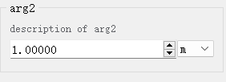
</div>


### 2、可配置属性

参见配置类：[`FloatQuantityBoxConfig`](apis/pyguiadapter.widgets.quantitybox.md#pyguiadapter.widgets.FloatQuantityBoxConfig)

### 3、示例

```python
from pyguiadapter.adapter import GUIAdapter
from pyguiadapter.adapter.uoutput import uprint
from pyguiadapter.extend_types import int_quantity_t, float_quantity_t
from pyguiadapter.widgets import IntQuantityBoxConfig, FloatQuantityBoxConfig


def quantity_t_example(arg1: int_quantity_t, arg2: float_quantity_t):
    """
    This is an example about **xxx_quantity_t** type hint and **XXXQuantityBox** widget.

    Args:
        arg1: description of arg1
        arg2: description of arg2
    """
    uprint("arg1: ", arg1)
    uprint("arg2: ", arg2)


if __name__ == "__main__":
    adapter = GUIAdapter()
    adapter.add(
        quantity_t_example,
        widget_configs={
            "arg1": IntQuantityBoxConfig(
                default_value=(1, "kg"),
                units=["kg", "g", "mg", "µg", "ng", "pg"],
                min_value=0,
                step=1,
            ),
            "arg2": FloatQuantityBoxConfig(
                default_value=(1.0, "m"),
                units=["m", "cm", "mm", "µm", "nm", "pm"],
                min_value=0.0,
                max_value=1000.0,
                decimals=5,
                step=0.00001,
            ),
        },
    )
    adapter.run()
```

<div style="text-align: center">
    
</div>
