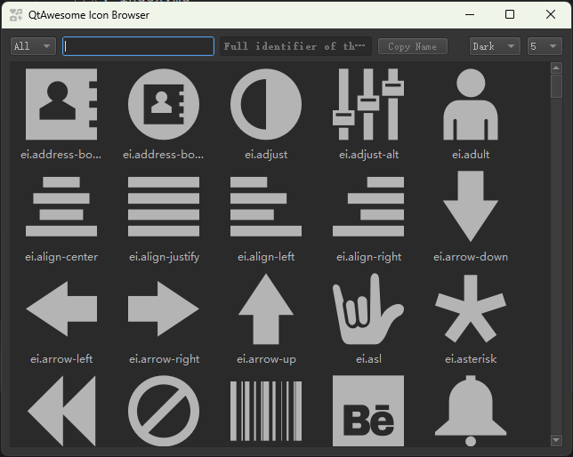

在`PyGUIAdapter`中，绝大多数需要开发者提供图标的地方，都会要求开发者传入一个类型为`utils.IconType`类型的对象。 

实际上，`utils.IconType`是一个联合类型或类型别名，它等价于`Union[str, Tuple[str, Union[list, dict]], QIcon, QPixmap, type(None)]`。


`PyGUIAdapter`内部将通过`utils.get_icon()`函数将开发者传入转化为实际的`QIcon`对象。


为了方便开发者快速利用现有的字体图标，如`FontAwesome`、`Material Design Icons`等，`PyGUIAdapter`集成了[`qtawesome`](https://github.com/spyder-ide/qtawesome)库。因此在需要`utils.IconType`的场合，可以传入一个[`qtawesome`](https://github.com/spyder-ide/qtawesome)支持的图标名称字符串。

> 可以通过[`qtawesome`](https://github.com/spyder-ide/qtawesome)提供的图标浏览工具`qta-browser`来浏览和复制其所支持的图标。可以通过输入以下命令来启动`qta-browser`工具
>
> ```shell
> qta-browser
> ```
>
> 其界面如下：
>
> <div style="text-align: center">
>     
> </div>


开发者也可以直接传入图标文件的路径，如`"/path/to/icon/icon.png"`，或者Qt资源文件（`qrc`）文件中图标的路径，如：`":/path/to/icon/icon.png"`。


当传入值为`Tuple[str, list|tuple]`类型时，情况更加复杂一些。在这种情况下，第一个元素应当是[`qtawesome`](https://github.com/spyder-ide/qtawesome)支持的图标名称，第二个元素则是[`qtawesome.icon()`](https://qtawesome.readthedocs.io/en/latest/_generate/qtawesome.icon.html#qtawesome.icon)函数第一个参数之后的剩余参数。例如对于下面示例中的`my_icon`

```pytho
icon_options = {
	"color": "blue",
	"color_active": "orange"
}
my_icon = ("fa5s.music", icon_options)
```

`utils.get_icon()`将按照如下方式进行处理：

```python
import qtawesome as qta

def get_icon(src: IconType, *args, **kwargs) -> QIcon | None:
 ...
 if isinstance(src, tuple):
     assert len(src) >= 2
     assert isinstance(src[0], str) and isinstance(src[1], (dict, list))
     if isinstance(src[1], dict):
         return qta.icon(src[0], **src[1])
     else:
         return qta.icon(src[0], *src[1])
 else:
     raise ValueError(f"invalid icon type: {type(src)}")
```

`utils.get_icon()`函数的完整代码如下：

```python
def get_icon(src: IconType, *args, **kwargs) -> Optional[QIcon]:
    if src is None:
        return None
    if isinstance(src, QIcon):
        return src
    if isinstance(src, QPixmap):
        return QIcon(src)
    if isinstance(src, str):
        if os.path.isfile(src) or src.startswith(":/"):
            return QIcon(src)
        return qta.icon(src, *args, **kwargs)
    if isinstance(src, tuple):
        assert len(src) >= 2
        assert isinstance(src[0], str) and isinstance(src[1], (dict, list))
        if isinstance(src[1], dict):
            return qta.icon(src[0], **src[1])
        else:
            return qta.icon(src[0], *src[1])
    else:
        raise ValueError(f"invalid icon type: {type(src)}")
```


