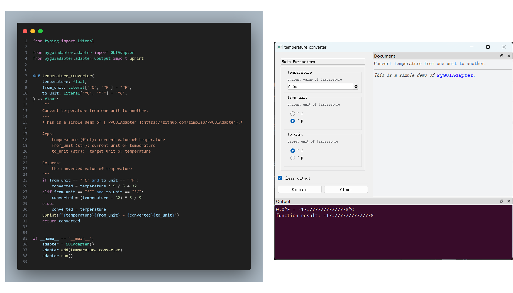
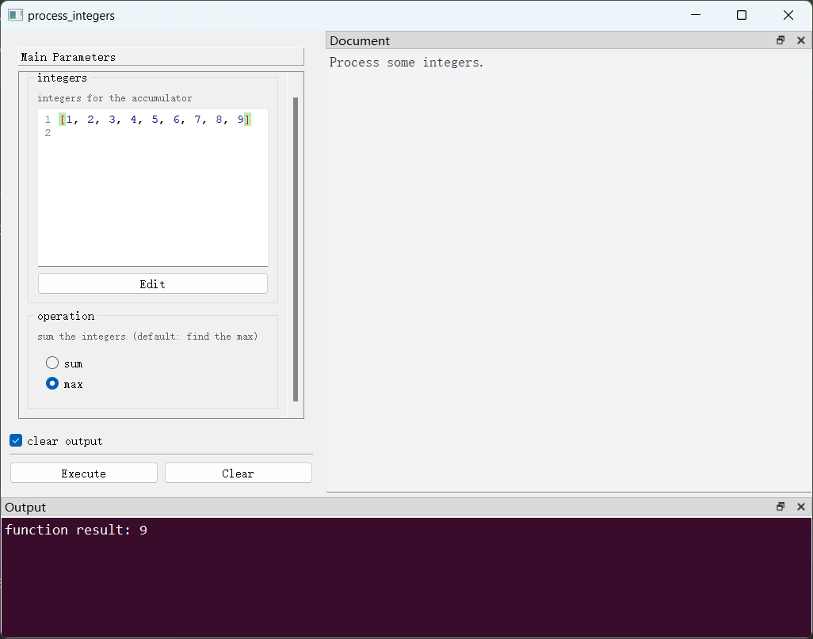

## （一）简介

`PyGUIAdapter`是一个用于快速构建图形用户界面的Python库，只需极少的代码，就可以将几乎任意Python函数无缝转化为图形用户界面，大大简化了GUI应用程序的开发过程。

`PyGUIAdapter`的核心理念是，以尽可能“无感”和“低侵入性”的方式，帮助开发者创建用户界面，使开发者能够专注于核心功能的实现，而不必将精力分散到复杂、繁琐的GUI编程上，从而尽可能降低开发者的学习成本和心智负担。

<div style="text-align: center;">
    
</div>


## （二） 适用场景

`PyGUIAdapter`与“`输入（Input）-处理（Process）-输出（Output）`”程序设计模式高度契合，因此其特别适用于以下几种开发场景：

- **工具类应用程序的开发**
- **将现有`CLI`程序快速迁移到图形界面**

下面是[Python官方文档](https://docs.python.org/3/library/argparse.html#example)给出的一个使用`argparse`创建命令行的例子：

```python
import argparse
parser = argparse.ArgumentParser(description='Process some integers.')
parser.add_argument('integers', metavar='N', type=int, nargs='+',
                    help='an integer for the accumulator')
parser.add_argument('--sum', dest='accumulate', action='store_const',
                    const=sum, default=max,
                    help='sum the integers (default: find the max)')

args = parser.parse_args()
print(args.accumulate(args.integers))
```

借助`PyGUIAdapter`，开发者可以用极少的代码将其转换成GUI程序。而且开发者再也无需将大量精力花费在命令行参数的设计和处理上：

```python
from typing import List, Literal
from pyguiadapter.adapter import GUIAdapter


def process_integers(
    integers: List[int], operation: Literal["sum", "max"] = "max"
) -> int:
    """
    Process some integers.

    @param integers: integers for the accumulator
    @param operation: sum the integers (default: find the max)
    """
    func = max if operation == "max" else sum
    return func(integers)


if __name__ == "__main__":
    adapter = GUIAdapter()
    adapter.add(process_integers)
    adapter.run()


```

<div style="text-align:center">
    
</div>

## （三）特性

- 使用简单，开发快速，可以用极少代码完成图形用户界面创建，学习成本低，心智负担小。 
- 丰富的内置控件类型，实现了近30种内置控件，基本实现开箱即用。
  > - 所有Python的基本数据类型均实现了对应输入控件。
  > - 扩展了基本数据类型，定义了大量语义化类型并实现了专用控件，方便用户输入日期、时间、颜色、文件路径等特殊对象。
  > - 实现了通用对象输入控件，支持输入`Json对象`和任意`Python字面量对象`（包括`int`、`float`、`bool`、`str`、`bytes`、`list`、`tuple`、`set`、`dict`），赋予了用户输入任意复杂数据的能力。
- 高可扩展性，提供了自定义控件接口。开发者可以很方便地为自定义数据类型实现专用输入控件。
- 高灵活性。控件与窗口定义了大量可配置属性，开发者可以灵活地调整控件及窗口的外观、样式、行为，提升用户体验。
- 支持使用使用样式表（`QSS`）定制界面风格，同时接入现有第三方界面美化库。
- 支持添加窗口菜单栏、工具栏。
- 支持监听窗口事件。
- 支持动态修改控件，为构建复杂应用提供了可能。
- 基于[`qtpy`](https://github.com/spyder-ide/qtpy)抽象层，不依赖特定Qt绑定库，开发者可以根据实际需要可自由选择`PyQt5`、`PyQt6`、`PySide2`、`PySide2`。
- 界面底层使用`Qt`，兼容性好，相比`webview类`方案，系统资源占用更小。
- 纯Python，跨平台简单。