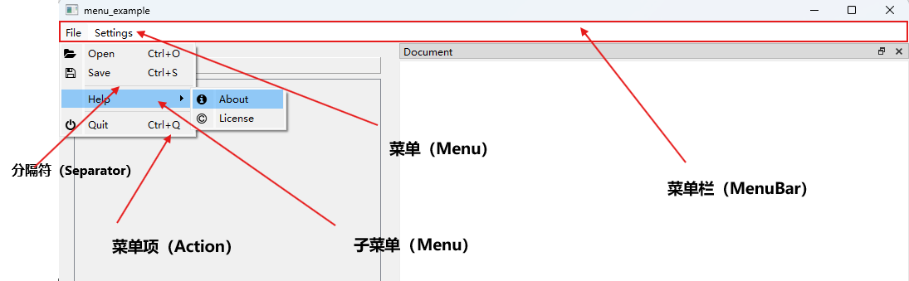
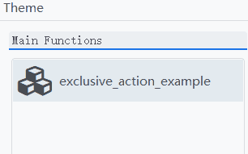
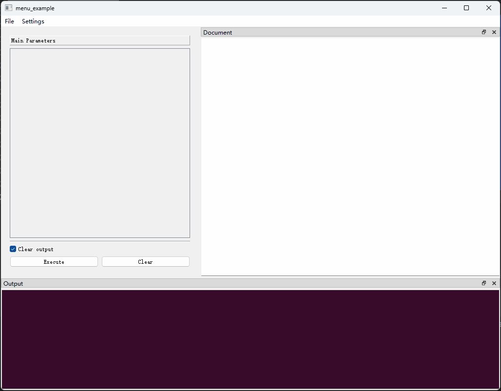
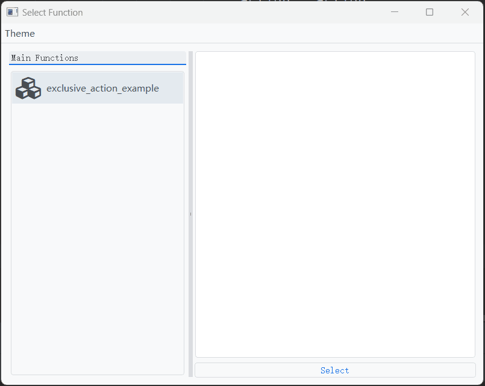

## （一）概述

菜单栏由一组菜单（`Menu`）组成，每个菜单下可以添加若干菜单项（`Action`）或子菜单（`Menu`），中间可以添加分隔符（`Separator`）加以分隔。

菜单栏的典型外观如下图所示：

<div style="text-align: center">
    
</div>

开发者可以通过[**Menu**]({{main_branch}}/pyguiadapter/menu.py)类对象来定义菜单的属性，包括指定菜单的标题、是否合并连续的分隔符、菜单是否可被"tear-off"以及该菜单下包含的菜单项（`Action`）或子菜单（`Menu`）。可以通过如下方式导入`Menu`类

```python
from pyguiadapter.menu import Menu
```

关于`Menu`对象的详细说明，可以参考以下文档：

- [**pyguiadapter.menu.Menu**](apis/pyguiadapter.menu.md#pyguiadapter.menu.Menu)


## （二）主要属性

::: pyguiadapter.menu.Menu.title
    options:
        heading_level: 3
        show_root_full_path: false
        show_source: false


::: pyguiadapter.menu.Menu.actions
    options:
        heading_level: 3
        show_root_full_path: false
        show_source: false

在菜单栏上，菜单项使用动作`（Action）`定义，动作`（Action）`可以设置图标（`icon`）、文字（`text`）、快捷键（`shortcut`）等属性，也可以设置`on_triggered`、`on_toggled`等事件监听器。关于`Action`可以参考以下文档：

- [**pyguiadapter.action.Action**](apis/pyguiadapter.action.md/#pyguiadapter.action.Action)

在菜单栏上，子菜单使用`Menu`类本身进行定义。


::: pyguiadapter.menu.Menu.separators_collapsible
    options:
        heading_level: 3
        show_root_full_path: false
        show_source: false


::: pyguiadapter.menu.Menu.tear_off_enabled
    options:
        heading_level: 3
        show_root_full_path: false
        show_source: false


::: pyguiadapter.menu.Menu.exclusive
    options:
        heading_level: 3
        show_root_full_path: false
        show_source: false

菜单项互斥的效果如下图所示：

<div style="text-align: center">
    
</div>

## （三）示例

### 1、示例1

```python
import json

from pyguiadapter.action import Action, Separator
from pyguiadapter.adapter import GUIAdapter
from pyguiadapter.menu import Menu
from pyguiadapter.utils import filedialog, inputdialog, messagebox
from pyguiadapter.window import SimpleWindowEventListener
from pyguiadapter.windows.fnselect import FnSelectWindow


def menu_example():
    pass


############Action Callbacks##########
def on_action_open(window: FnSelectWindow, _: Action):
    print("on_action_open()")
    ret = filedialog.get_open_file(
        parent=window,
        title="Open File",
        start_dir="./",
        filters="JSON files(*.json);;All files(*.*)",
    )
    if ret:
        messagebox.show_info_message(window, f"File will be opened: {ret}")


def on_action_save(window: FnSelectWindow, _: Action):
    print("on_action_save()")
    ret = filedialog.get_save_file(
        parent=window,
        title="Save File",
        start_dir="./",
        filters="JSON files(*.json);;All files(*.*)",
    )
    if ret:
        messagebox.show_info_message(window, f"File will be saved to: {ret}")


def on_action_settings(window: FnSelectWindow, _: Action):
    default_settings = {
        "opt1": 1,
        "opt2": "2",
        "opt3": True,
    }
    new_settings = inputdialog.input_json_object(
        parent=window,
        title="Settings",
        icon="fa.cog",
        size=(600, 400),
        ok_button_text="Save",
        cancel_button_text="Cancel",
        initial_text=json.dumps(default_settings, indent=4, ensure_ascii=False),
        auto_indent=True,
        indent_size=4,
        auto_parentheses=True,
        line_wrap_mode=inputdialog.LineWrapMode.WidgetWidth,
        line_wrap_width=88,
    )
    if isinstance(new_settings, dict):
        messagebox.show_info_message(window, f"new settings: {new_settings}")


def on_action_confirm_quit(window: FnSelectWindow, action: Action, checked: bool):
    print("on_action_confirm_close(): ", checked)


def on_action_close(window: FnSelectWindow, _: Action):
    print("on_action_close()")
    window.close()


def on_action_about(window: FnSelectWindow, _: Action):
    print("on_action_about()")


###############################


if __name__ == "__main__":
    action_open = Action(
        text="Open",
        icon="fa.folder-open",
        on_triggered=on_action_open,
        shortcut="Ctrl+O",
    )
    action_save = Action(
        text="Save",
        icon="fa.save",
        on_triggered=on_action_save,
        shortcut="Ctrl+S",
    )

    action_settings = Action(
        text="Settings",
        icon="fa.cog",
        on_triggered=on_action_settings,
        shortcut="Ctrl+,",
    )

    action_quit = Action(
        text="Quit",
        icon="fa.power-off",
        on_triggered=on_action_close,
        shortcut="Ctrl+Q",
    )
    action_confirm_quit = Action(
        text="Confirm Quit",
        checkable=True,
        checked=False,
        on_toggled=on_action_confirm_quit,
    )

    def on_window_create(window: FnSelectWindow):
        print("on_window_create()")
        # make action_confirm_quit checked after the select window is created
        window.set_action_state(action_confirm_quit, True)

    def on_window_close(window: FnSelectWindow) -> bool:
        # get the state of action_confirm_quit
        # if it is checked, show a question message box to ask if the user really wants to close the window
        # if it is not checked, return True to close the window directly.
        state = window.get_action_state(action_confirm_quit)
        if state:
            # access the
            ret = messagebox.show_question_message(
                window,
                message="Do you really want to close the window?",
                title="Quit",
                buttons=messagebox.Yes | messagebox.No,
            )
            return ret == messagebox.Yes
        return True

    window_listener = SimpleWindowEventListener(
        on_create=on_window_create, on_close=on_window_close
    )

    menus = [
        Menu(
            title="File",
            actions=[
                action_open,
                action_save,
                Separator(),
                action_confirm_quit,
                action_quit,
            ],
        ),
        Menu(title="Help", actions=[action_settings]),
    ]

    adapter = GUIAdapter()
    adapter.add(menu_example, window_menus=menus, window_listener=window_listener)
    adapter.run()
```

<div style="text-align: center">
    
</div>

### 2、示例2：通过互斥菜单项实现主题切换效果

以下示例用到了第三方库[`PyQtDarkTheme`]([5yutan5/PyQtDarkTheme: A flat dark theme for PySide and PyQt. (github.com)](https://github.com/5yutan5/PyQtDarkTheme))，运行该示例需先安装该库，可以参考这篇文档：[**界面美化**](style.md)。

```python
import qdarktheme

from pyguiadapter.action import Action
from pyguiadapter.adapter import GUIAdapter
from pyguiadapter.menu import Menu
from pyguiadapter.windows.fnselect import FnSelectWindow


def exclusive_action_example():
    pass


def on_app_start(app):
    qdarktheme.setup_theme("auto")


def on_action_auto(win: FnSelectWindow, action: Action, checked: bool):
    if checked:
        qdarktheme.setup_theme("auto")


def on_action_light(win: FnSelectWindow, action: Action, checked: bool):
    if checked:
        qdarktheme.setup_theme("light")


def on_action_dark(win: FnSelectWindow, action: Action, checked: bool):
    if checked:
        qdarktheme.setup_theme("dark")


action_auto = Action(
    text="auto",
    on_toggled=on_action_auto,
    checkable=True,
    checked=True,
)

action_light = Action(
    text="light",
    on_toggled=on_action_light,
    checkable=True,
)

action_dark = Action(
    text="dark",
    on_toggled=on_action_dark,
    checkable=True,
)

menu_theme = Menu(
    title="Theme",
    actions=[action_auto, action_light, action_dark],
    exclusive=True,
)

if __name__ == "__main__":
    adapter = GUIAdapter(on_app_start=on_app_start)
    adapter.add(exclusive_action_example)
    adapter.run(show_select_window=True, select_window_menus=[menu_theme])
```

<div style="text-align: center">
    
</div>