## （一）概述

开发者可以向 `GUIAdapter`实例中添加多个函数，在此情况下，`PyGUIAdapter`将显示一个`函数选择窗口（FnSelectWindow）`，并以列表的形式展现所有已添加的函数，供用户选择。在函数列表中，将显示函数图标与名称，开发者可以对图标与函数的显示名称进行自定义。同时，在`函数选择窗口（FnSelectWindow）`的右侧，将通过`文档浏览器（Document Browser）`显示当前选中函数的说明文档。

<div style="text-align:center">
    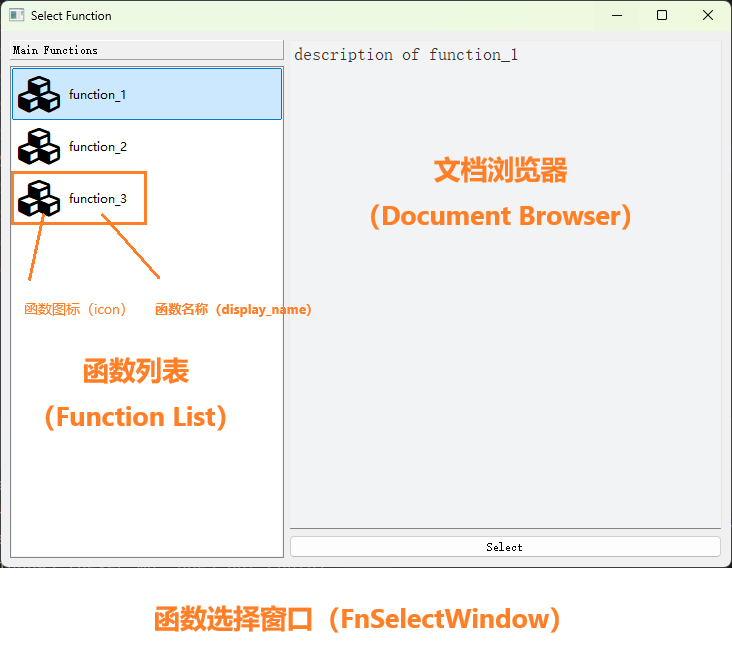
</div>

用户可通过双击函数列表中的条目或者点击`选择按钮（Select）`打开目标函数的执行窗口（`FnExecuteWindow`）。

<div style="text-align:center">
    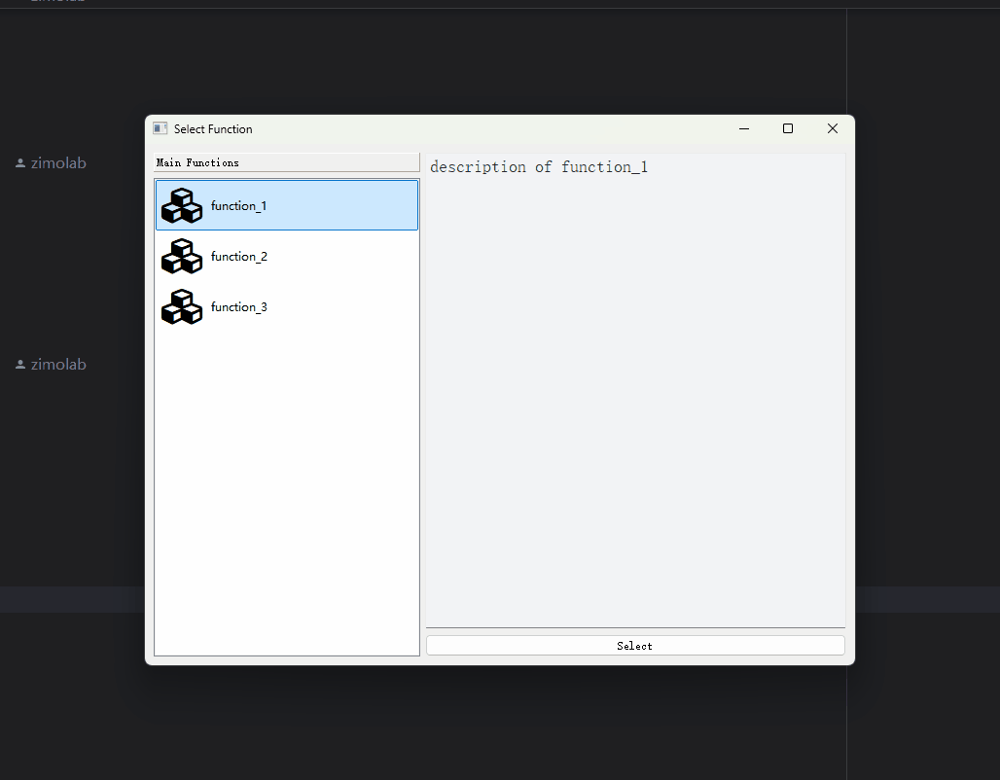
</div>

同时，`PyGUIAdapter`支持函数分组功能，在函数较多时，使用该功能可以使界面更加简洁、直观。

<div style="text-align:center">
    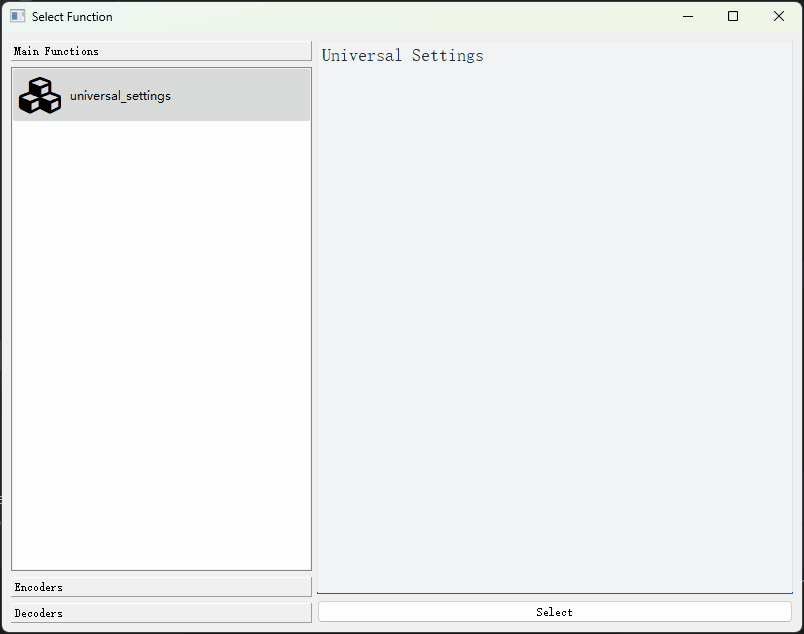
</div>

下面，围绕`GUIAdapter.add()`函数对上面提到的功能进行详细说明。


## （二）添加多个函数

在调用`GUIAdapter.run()`函数前，开发者可以通过多次调用`GUIAdapter.add()`将多个函数添加到`GUIAdapter`实例中：

> [examples/multiple_function_example.py]({{main_branch}}/examples/multiple_function_example.py)

```python
from pyguiadapter.adapter import GUIAdapter


def function_1(arg: int):
    """
    description of function_1
    """
    pass


def function_2(arg: int):
    """
    description of function_2
    """
    pass


def function_3(arg: int):
    """
    description of function_3
    """
    pass


if __name__ == "__main__":
    adapter = GUIAdapter()
    adapter.add(function_1)
    adapter.add(function_2)
    adapter.add(function_3)
    adapter.run()
```

<div style="text-align:center">
    
</div>

所有添加到`GUIAdapter`实例中的函数都会显示在`函数选择窗口（FnSelectWindow）`左侧的函数列表中。函数列表将同时显示函数的名称及图标，如果没有显式地指定函数的图标和名称，`PyGUIAadpter`将使用默认的图标，显示的名称则为函数名。

当用户选中函数列表中的某个条目，双击它或者点击右下方的`Select`按钮，即可进入对应的`函数执行窗口（FnExecuteWindow）`。当用户关闭`函数执行窗口（FnSelectWindow）`，将回到函数选择界面。

## （三）自定义函数图标（`icon`）及名称（`display_name`）

`PyGUIAdapter`允许开发者对函数的图标（`icon`）及其显示名称（`display_name`）进行自定义。为函数设置独特的图标，赋予函数一个更具可读性的名称，将有助于提高界面的观感并增强用户的体验。

>  [examples/custom_icon_and_name_example.py]({{main_branch}}/examples/custom_icon_and_name_example.py)

```python
from pyguiadapter.adapter import GUIAdapter


def function_1(arg: int):
    """
    description of function_1
    """
    pass


def function_2(arg: int):
    """
    description of function_2
    """
    pass


def function_3(arg: int):
    """
    description of function_3
    """
    pass


if __name__ == "__main__":
    adapter = GUIAdapter()
    adapter.add(function_1, display_name="Barcode Generator", icon="ei.barcode")
    adapter.add(function_2, display_name="QRCode Generator", icon="ei.qrcode")
    adapter.add(function_3, display_name="Generator Service", icon="mdi.web")
    adapter.run()

```

<div style="text-align:center">
    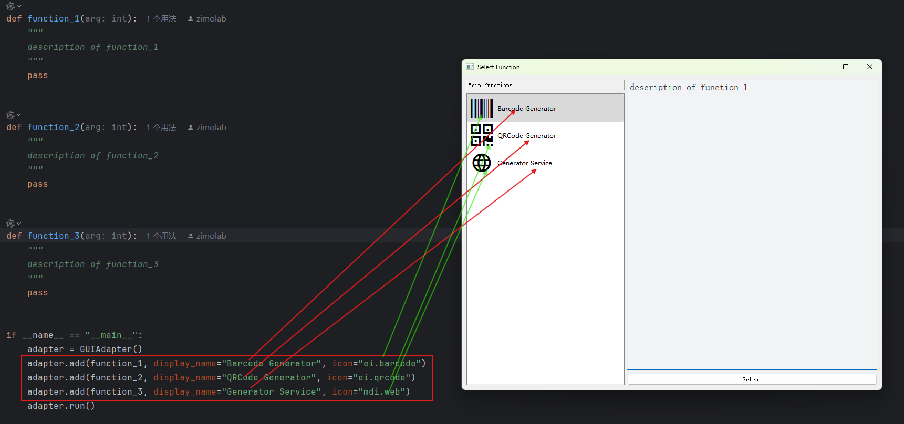
</div>

> 在本例中，使用了字体图标名称作为函数的`icon`，开发者也可以传入图标文件路径。更多详细信息可以参考：[关于图标](icon_type.md)。


## （四）设置函数说明文档

在`函数选择窗口（FnSelectWindow）`和`函数执行窗口（FnExecuteWindow）`中均有专门的区域用于显示函数的说明文档，用于显示函数文档的组件被称为`文档浏览器（DocumentBrowser）`。

### 1、`docstring`作为说明文档

默认情况下，`PyGUIAdapter`会自动提取函数文档字符串（`docstring`）中对于函数的描述（包括`long description`和`short description`，但一般不包括参数的描述部分和`@params...@end`块）作为说明文档，格式默认为`Markdown`。比如：

<div style="text-align:center">
    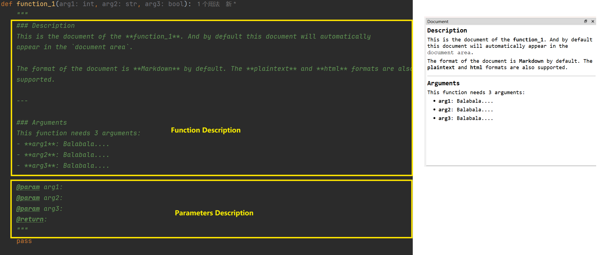
</div>

> [examples/html_docstring_document_example.py]({{main_branch}}/examples/html_docstring_document_example.py)

```python
from pyguiadapter.adapter import GUIAdapter


def function_1(arg1: int, arg2: str, arg3: bool):
    """
    ### Description
    This is the document of the **function_1**. And by default this document will automatically
    appear in the `document area`.

    The format of the document is **Markdown** by default. The **plaintext** and **html** formats are also
    supported.

    ---

    ### Arguments
    This function needs 3 arguments:
    - **arg1**: Balabala....
    - **arg2**: Balabala....
    - **arg3**: Balabala....

    @param arg1:
    @param arg2:
    @param arg3:
    @return:
    """
    pass


if __name__ == "__main__":
    adapter = GUIAdapter()
    adapter.add(function_1)
    adapter.run()

```

除了`markdown`，也可以将文档的格式指定为`html`或`plaintext`。比如：

<div style="text-align:center">
    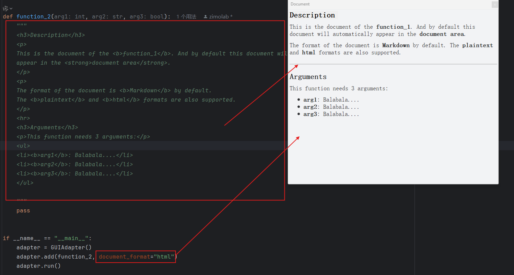
</div>

> 

```python
from pyguiadapter.adapter import GUIAdapter


def function_2(arg1: int, arg2: str, arg3: bool):
    """
    <h3>Description</h3>
    <p>
    This is the document of the <b>function_2</b>. And by default this document will automatically
    appear in the <strong>document area</strong>.
    </p>
    <p>
    The format of the document is <b>Markdown</b> by default.
    The <b>plaintext</b> and <b>html</b> formats are also supported.
    </p>
    <hr>
    <h3>Arguments</h3>
    <p>This function needs 3 arguments:</p>
    <ul>
    <li><b>arg1</b>: Balabala....</li>
    <li><b>arg2</b>: Balabala....</li>
    <li><b>arg3</b>: Balabala....</li>
    </ul>

    """
    pass


if __name__ == "__main__":
    adapter = GUIAdapter()
    adapter.add(function_2, document_format="html")
    adapter.run()

```

> 提示：`文档浏览器`对`html`的支持有限，仅支持`html4`的子集，具体可以参考Qt官方文档的说明：[Supported HTML Subset | Qt GUI 5.15.17](https://doc.qt.io/qt-5/richtext-html-subset.html#table-cell-attributes)

### 2、手动设置说明文档内容

如果开发者不想将大段文本放到函数的`docstring`中，也可以手动指定函数的说明文档，比如将外部文件作为说明文档：

<div style="text-align:center">
    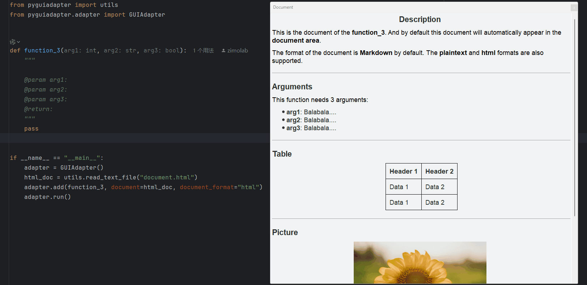
</div>

> [examples/html_file_document_example.py]({{main_branch}}/examples/html_file_document_example.py)

```python
from pyguiadapter import utils
from pyguiadapter.adapter import GUIAdapter


def function_3(arg1: int, arg2: str, arg3: bool):
    """

    @param arg1:
    @param arg2:
    @param arg3:
    @return:
    """
    pass


if __name__ == "__main__":
    adapter = GUIAdapter()
    html_doc = utils.read_text_file("document.html")
    adapter.add(function_3, document=html_doc, document_format="html")
    adapter.run()
```


### 3、说明文档中的特殊“锚点”链接

在函数的说明文档中，存在两种特殊的”锚点“链接，一种是**”Parameter锚点（parameter anchor）“**，另一种是**Group锚点（group anchor）**，这两种锚点链接的作用是与指定的函数参数或函数参数分组相锚定，在用户点击这些链接时快速导航到指定参数控件或参数分组，具体来讲：

对于**Parameter锚点（parameter anchor）**，`PyGUIAdapter`首先会查找对应参数的控件位于哪个函数分组，然后展开其所在的函数分组，接着调整滚动条位置，确保该参数控件对用户可见，然后高亮显示该控件。效果如图所示：


<div style="text-align">
    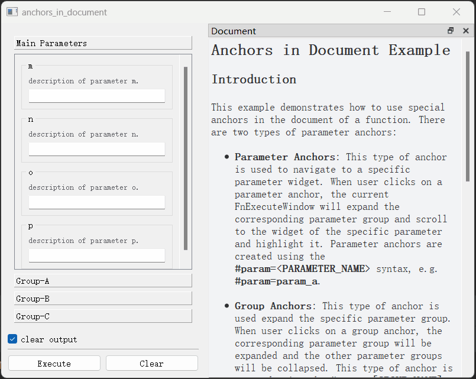
</div>


对于**Group锚点（group anchor）**，`PyGUIAdapter`则会在用户点击锚点链接时展开对于的函数分组。效果如下图所示：


<div style="text-align">
    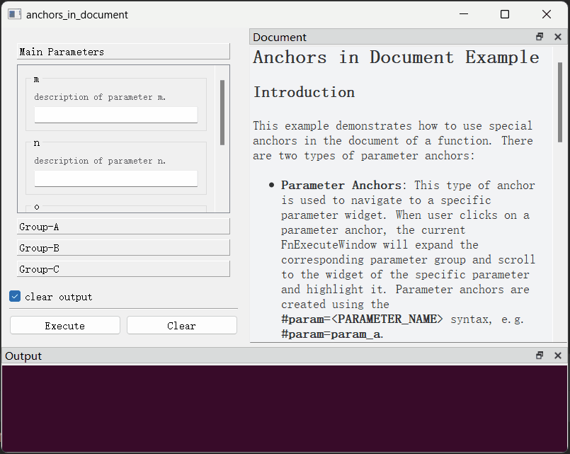
</div>


在函数参数非常多时，**Parameter锚点（parameter anchor）**与**Group锚点（group anchor）**非常有用。开发者在函数说明文档中描述参数时，可以使用这些锚点以帮助用户快速定位到对应的控件，这大大增加了程序的易用性。


**Parameter锚点（parameter anchor）**与**Group锚点（group anchor）**特性默认是关闭的，需要在`FnExecuteWindowConfig`中开启，方法如下：


<div style="text-align">
    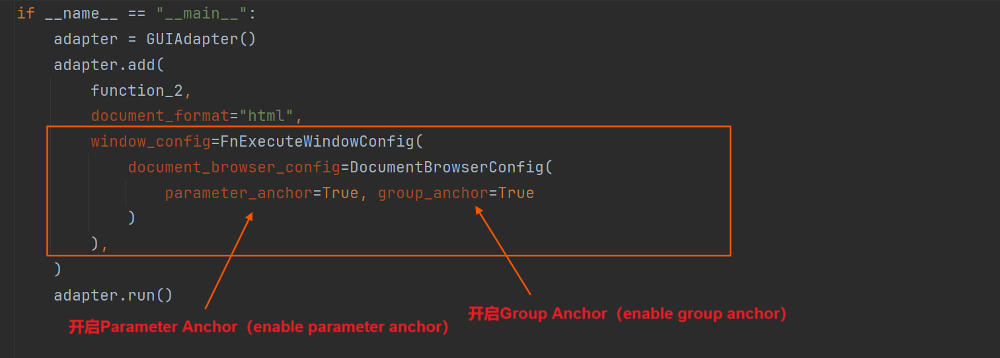
</div>


以下是一个完整的例子：

> 源码以及函数文档的路径
>
> - 源码：[examples/anchors_in_document.py]({{main_branch}}/examples/anchors_in_document.py)
> - 函数文档：[examples/anchors_in_document.md]({{main_branch}}/examples/anchors_in_document.md)

```python
import os

from pyguiadapter.adapter import GUIAdapter
from pyguiadapter.utils import read_text_file
from pyguiadapter.windows import DocumentBrowserConfig
from pyguiadapter.windows.fnexec import FnExecuteWindowConfig

DOCUMENT_PATH = os.path.join(os.path.dirname(__file__), "anchors_in_document.md")


def anchors_in_document(
    a: str,
    b: str,
    c: str,
    d: str,
    e: str,
    f: str,
    g: str,
    h: str,
    i: str,
    j: str,
    k: str,
    l: str,
    m: str,
    n: str,
    o: str,
    p: str,
):
    """
    This is an example demonstrating how to use parameter anchors and group anchors in the document of function.

    Args:
        a: description of parameter a.
        b: description of parameter b.
        c: description of parameter c.
        d: description of parameter d.
        e: description of parameter e.
        f: description of parameter f.
        g: description of parameter g.
        h: description of parameter h.
        i: description of parameter i.
        j: description of parameter j.
        k: description of parameter k.
        l: description of parameter l.
        m: description of parameter m.
        n: description of parameter n.
        o: description of parameter o.
        p: description of parameter p.
    """
    pass


if __name__ == "__main__":

    widget_configs = {
        # parameters in Group-A
        "a": {"group": "Group-A"},
        "b": {"group": "Group-A"},
        "c": {"group": "Group-A"},
        "d": {"group": "Group-A"},
        # parameters in Group-B
        "e": {"group": "Group-B"},
        "f": {"group": "Group-B"},
        "g": {"group": "Group-B"},
        "h": {"group": "Group-B"},
        # parameters in Group-C
        "i": {"group": "Group-C"},
        "j": {"group": "Group-C"},
        "k": {"group": "Group-C"},
        "l": {"group": "Group-C"},
        # parameters in default group
        "m": {"group": None},
        "n": {"group": None},
        "o": {"group": None},
        "p": {"group": None},
    }

    document = read_text_file(DOCUMENT_PATH)
    adapter = GUIAdapter()
    adapter.add(
        anchors_in_document,
        document=document,
        document_format="markdown",
        widget_configs=widget_configs,
        window_config=FnExecuteWindowConfig(
            document_browser_config=DocumentBrowserConfig(
                parameter_anchor=True, group_anchor=True
            )
        ),
    )
    adapter.run()
```


## （五）对函数进行分组

开发者在调用`GUIAdapter.add()`方法添加函数时，可以通过`group`参数指定函数的分组，`PyGUIAdapter`会将相同`group`的函数聚合到一起；对于未指定`group`的函数，`PyGUIAdapter`则会将其放置在默认分组中，该分组的默认名称为`"Main Functions"`。

比如下面这个示例，将函数按照功能分成了三组：编码器函数`Encoders`、解码器函数`Decoders`和其他函数（默认分组）`Main Functions`。

<div style="text-align:center">
    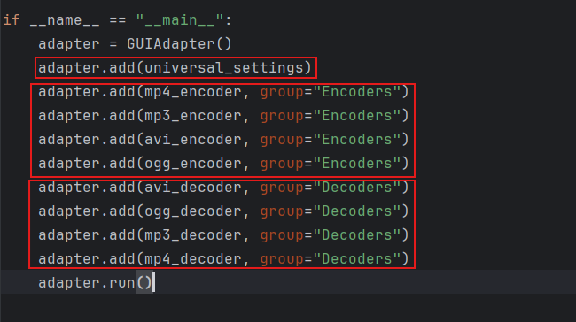
</div>

<div style="text-align:center">
    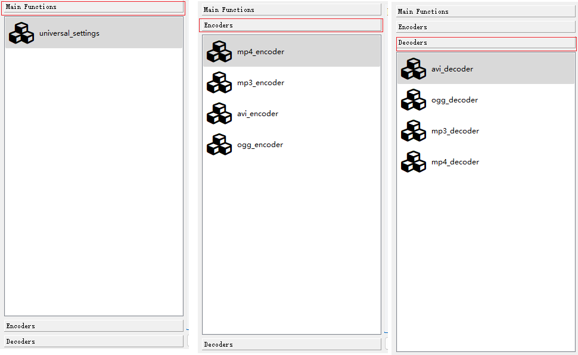
</div>

> [examples/function_groups_example.py]({{main_branch}}/examples/function_groups_example.py)


```python
from pyguiadapter.adapter import GUIAdapter


def mp4_encoder():
    """
    MP4 Encoder
    """
    pass


def mp3_encoder():
    """
    MP3 Encoder
    """
    pass


def avi_encoder():
    """
    AVI Encoder
    """
    pass


def ogg_encoder():
    """
    OGG Encoder
    """
    pass


def avi_decoder():
    """
    AVI Decoder
    """
    pass


def ogg_decoder():
    """
    OGG Decoder
    """
    pass


def mp3_decoder():
    """
    MP3 Decoder
    """
    pass


def mp4_decoder():
    """
    MP4 Decoder
    """
    pass


def universal_settings():
    """
    Universal Settings
    """
    pass


if __name__ == "__main__":
    adapter = GUIAdapter()
    adapter.add(universal_settings)
    adapter.add(mp4_encoder, group="Encoders")
    adapter.add(mp3_encoder, group="Encoders")
    adapter.add(avi_encoder, group="Encoders")
    adapter.add(ogg_encoder, group="Encoders")
    adapter.add(avi_decoder, group="Decoders")
    adapter.add(ogg_decoder, group="Decoders")
    adapter.add(mp3_decoder, group="Decoders")
    adapter.add(mp4_decoder, group="Decoders")
    adapter.run()
```

