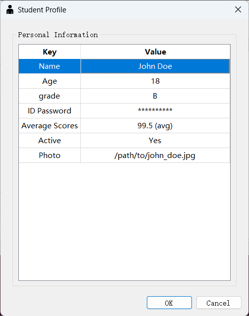
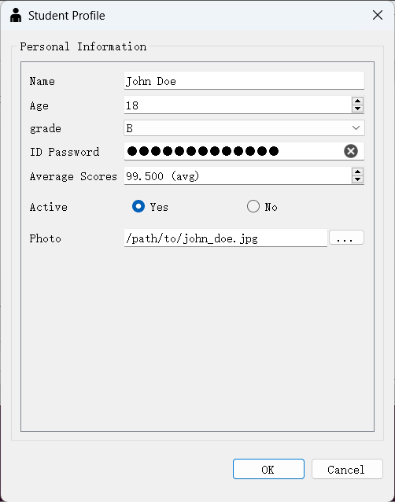
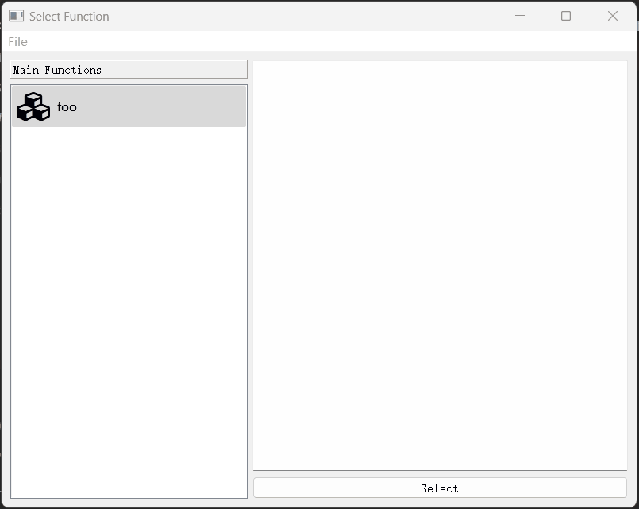

# 结构化对象（Schema Object）及其编辑器

## 一、什么是结构化对象（schema object）

我们这里将结构化对象称为“schema object”，因为它指的是这样一类对象：本质上它是一个dict，但与一般的dict不同的是，它具有一组固定的“键”，且每个键所对应的
值具有确定的类型，用于描述一个对象应当具有哪些键以及这些键可以被赋予什么类型的值的东西就被称为"schema"。简单来说，所谓结构化对象，就是一个使用schema
来限制其键的范围和值的类型的普通dict。

例如，以下对象：

```python
{
    "name": "Alice",
    "age": 25,
    "scores": 90.5,
    "grade": "A",
    "photo": "images/alice.jpg"
}
```

可以使用以下schema来描述：

```python
{
    "name": StringValue(),
    "age": IntValue(),
    "password": StringValue(),
    "scores": FloatValue(),
    "grade": ChoiceValue("A", ["A", "B", "C", "D", "E"]),
    "photo": FileValue()
}
```

可以看到，我们使用`StrValue`、`IntValue`、`FloatValue`、`ChoiceValue`、`FileValue`来描述每个键所对应值的类型（
这些类都继承自`pyguiadapter.itemseditor.schema.ValueType`类），而不是使用`int`、`str`、`float`等内置的类型，
主要是是因为`ValueType`可以提供更多的信息。

比如，对于`IntValue`类型，可以设置它的上下限：

```python
{   
    "age": IntValue(min_value=0, max_value=20)
}
```

又比如，可以通过`FileValue`设置文件名过滤器：

```python
{
    "photo": FileValue(file_filters="JPG Files (*.jpg);;PNG Files (*.png)")
}
```

同时，有些`ValueType`还定义了一些可以影响其编辑控件的外观和行为的属性，比如，可以通过`StrValue`设置文本输入框的占位文本、回显模式、是否显示清除按钮等：

```python
{
    "password": StringValue(
        default_value="123456",
        display_name="Password",
        placeholder="Enter Password",
        echo_mode=PasswordEchoOnEditMode,
        clear_button=True,
    ),
}
```

对于常用的值类型，`pyguiadapter`已经实现了相应的`ValueType`，包括：

- IntValue
- FloatValue
- StringValue
- BoolValue
- ChoiceValue
- ColorValue
- DateTimeValue
- DateValue
- DateTimeValue
- TimeValue
- FileValue
- DirectoryValue
- GenericPathValue
- VariantValue
- ListValue
- TupleValue
- DictValue

这些类型均在`pyguiadapter.itemseditor.valuetypes`包中定义和实现，可以通过如下方式导入：

```python
from pyguiadapter.itemseditor.valuetypes import <Value-Type-Name>
```

例如：
```python
from pyguiadapter.itemseditor.valuetypes import (
    StringValue,
    PasswordEchoOnEditMode,
    BoolValue,
    ChoiceValue,
)
```

如果内置的`ValueType`无法满足需求，也可以通过继承`ValueType`类来实现自定义的类型。

所有的`ValueType`均具有以下属性：

- `default_value`：该类型的默认值。
- `display_name`：用于指定显示在界面上的名称，如果不指定（None），则使用键名作为显示名称。

除了以上公共属性，不同类型的`ValueType`还定义一些专属的属性，这些属性或许用于值的校验，或者用于配置界面的外观和行为。可以参考相应的`ValueType`类的
构造函数来了解该类型支持的属性。


## 二、结构化对象的编辑器

目前，我们实现了两种可视化工具，用于浏览和编辑结构化对象，开发者可以在菜单或者工具栏按钮的回调函数中调出这些工具。

### （一）`show_schema_object_editor()`

函数`show_schema_object_editor()`用于调出一个`TableView`风格的结构化对象编辑器:

<div style="text-align: center">
    
</div>


它的函数签名如下：

::: pyguiadapter.utils.show_schema_object_editor
    options:
        heading_level: 3
        show_root_full_path: false

下面是一个相对完整的示例，展示了如何使用`show_schema_object_editor()`来编辑一个结构化对象：

```python
from typing import Any, Dict

from qtpy.QtWidgets import QWidget

from pyguiadapter.action import Action
from pyguiadapter.adapter import GUIAdapter
from pyguiadapter.adapter.uoutput import uprint
from pyguiadapter.itemseditor.valuetypes import (
    StringValue,
    IntValue,
    ChoiceValue,
    PasswordEchoOnEditMode,
    FloatValue,
    BoolValue,
    FileValue,
)
from pyguiadapter.toolbar import ToolBar
from pyguiadapter.utils import (
    messagebox,
    show_schema_object_editor,
    SchemaObjectEditorConfig,
)
from pyguiadapter.windows.fnexec import FnExecuteWindow

student_profile_schema = {
    "name": StringValue(default_value="Undefined", display_name="Name"),
    "age": IntValue(default_value=16, display_name="Age", min_value=16, max_value=20),
    "grade": ChoiceValue(
        default_value="A",
        choices=["A", "B", "C", "D", "E"],
    ),
    "password": StringValue(
        default_value="Admin123",
        display_name="ID Password",
        echo_mode=PasswordEchoOnEditMode,
        clear_button=True,
        password_symbol="*",
        max_password_symbols=10,
    ),
    "scores": FloatValue(
        default_value=0.0,
        display_name="Average Scores",
        min_value=0.0,
        max_value=100.0,
        step=0.5,
        suffix=" (avg)",
        display_affix=True,
    ),
    "is_active": BoolValue(
        default_value=True, display_name="Active", true_text="Yes", false_text="No"
    ),
    "photo": FileValue(
        default_value="Not Provided",
        display_name="Photo",
        title="Select a photo",
        file_filters="JPG Files (*.jpg);;PNG Files (*.png);;All Files (*.*)",
    ),
}

student_profile = {
    "name": "John Doe",
    "age": 18,
    "grade": "B",
    "password": "MyPassword123",
    "scores": 99.5,
    "is_active": True,
    "photo": "/path/to/john_doe.jpg",
}


def _accept_hook(editor: QWidget, obj: Dict[str, Any]) -> bool:
    password = obj.get("password")
    if len(password) < 6:
        messagebox.show_warning_message(
            editor,
            message="Password should be at least 6 characters long.",
            title="Warning",
        )
        return False
    return True


def on_action_schema_object_editor(window: FnExecuteWindow, action: Action):
    _ = action  # unused
    new_settings, ok = show_schema_object_editor(
        window,
        schema=student_profile_schema,
        obj=student_profile,
        config=SchemaObjectEditorConfig(
            title="Student Profile",
            center_container_title="Personal Information",
            icon="ei.adult",
            # show_horizontal_header=False,
        ),
        accept_hook=_accept_hook,
    )
    if not ok:
        return
    student_profile.update(new_settings)


action_profile = Action(
    text="Profile",
    icon="ei.adult",
    on_triggered=on_action_schema_object_editor,
    shortcut="Ctrl+O",
)

toolbar = ToolBar(actions=[action_profile], moveable=False, floatable=False)


def foo():
    uprint("current profile:")
    uprint(student_profile)


if __name__ == "__main__":
    adapter = GUIAdapter()
    adapter.add(foo, window_toolbar=toolbar)
    adapter.run()
```


### （二）`show_schema_object_panel()`

函数`show_schema_object_panel()`用于调出一个`Panel`风格的结构化对象编辑器:


<div style="text-align: center">
    
</div>


其函数签名如下：

::: pyguiadapter.utils.show_schema_object_panel
    options:
        heading_level: 3
        show_root_full_path: false

下面是一个相对完整的示例，展示了如何使用`show_schema_object_editor()`来编辑一个结构化对象：

```python
from typing import Any, Dict

from qtpy.QtWidgets import QWidget

from pyguiadapter.action import Action
from pyguiadapter.adapter import GUIAdapter
from pyguiadapter.adapter.uoutput import uprint
from pyguiadapter.itemseditor.valuetypes import (
    StringValue,
    IntValue,
    ChoiceValue,
    PasswordEchoOnEditMode,
    FloatValue,
    BoolValue,
    FileValue,
)
from pyguiadapter.toolbar import ToolBar
from pyguiadapter.utils import (
    messagebox,
    show_schema_object_panel,
    SchemaObjectPanelConfig,
)
from pyguiadapter.windows.fnexec import FnExecuteWindow

student_profile_schema = {
    "name": StringValue(default_value="Undefined", display_name="Name"),
    "age": IntValue(default_value=16, display_name="Age", min_value=16, max_value=20),
    "grade": ChoiceValue(
        default_value="A",
        choices=["A", "B", "C", "D", "E"],
    ),
    "password": StringValue(
        default_value="Admin123",
        display_name="ID Password",
        echo_mode=PasswordEchoOnEditMode,
        clear_button=True,
        password_symbol="*",
        max_password_symbols=10,
    ),
    "scores": FloatValue(
        default_value=0.0,
        display_name="Average Scores",
        min_value=0.0,
        max_value=100.0,
        step=0.5,
        suffix=" (avg)",
        display_affix=True,
    ),
    "is_active": BoolValue(
        default_value=True, display_name="Active", true_text="Yes", false_text="No"
    ),
    "photo": FileValue(
        default_value="Not Provided",
        display_name="Photo",
        title="Select a photo",
        file_filters="JPG Files (*.jpg);;PNG Files (*.png);;All Files (*.*)",
    ),
}

student_profile = {
    "name": "John Doe",
    "age": 18,
    "grade": "B",
    "password": "MyPassword123",
    "scores": 99.5,
    "is_active": True,
    "photo": "/path/to/john_doe.jpg",
}


def _accept_hook(editor: QWidget, obj: Dict[str, Any]) -> bool:
    password = obj.get("password")
    if len(password) < 6:
        messagebox.show_warning_message(
            editor,
            message="Password should be at least 6 characters long.",
            title="Warning",
        )
        return False
    return True


def on_action_schema_object_panel(window: FnExecuteWindow, action: Action):
    _ = action  # unused
    new_settings, ok = show_schema_object_panel(
        window,
        schema=student_profile_schema,
        obj=student_profile,
        config=SchemaObjectPanelConfig(
            title="Student Profile",
            center_container_title="Personal Information",
            icon="ei.adult",
        ),
        accept_hook=_accept_hook,
    )
    if not ok:
        return
    student_profile.update(new_settings)


action_profile = Action(
    text="Profile",
    icon="ei.adult",
    on_triggered=on_action_schema_object_panel,
    shortcut="Ctrl+O",
)

toolbar = ToolBar(actions=[action_profile], moveable=False, floatable=False)


def foo():
    uprint("current profile:")
    uprint(student_profile)


if __name__ == "__main__":
    adapter = GUIAdapter()
    adapter.add(foo, window_toolbar=toolbar)
    adapter.run()
```


## 三、示例：使用结构化对象编辑器实现配置界面

有些开发者可能已经想到，使用结构化对象和结构化对象编辑器，可以很容易实现一个`设置界面`，下面是一个简单的示例：

```python
from typing import Any, Dict

from qtpy.QtWidgets import QWidget

from pyguiadapter.action import Action, Separator
from pyguiadapter.adapter import GUIAdapter
from pyguiadapter.adapter.uoutput import uprint
from pyguiadapter.itemseditor.valuetypes import (
    StringValue,
    PasswordEchoOnEditMode,
    BoolValue,
    ChoiceValue,
)
from pyguiadapter.menu import Menu
from pyguiadapter.utils import (
    messagebox,
    show_schema_object_editor,
    show_schema_object_panel,
    SchemaObjectEditorConfig,
    SchemaObjectPanelConfig,
)
from pyguiadapter.windows.fnselect import FnSelectWindow

setting_schema = {
    "username": StringValue(
        default_value="admin", display_name="Username", placeholder="Enter Username"
    ),
    "password": StringValue(
        default_value="123456",
        display_name="Password",
        placeholder="Enter Password",
        echo_mode=PasswordEchoOnEditMode,
        clear_button=True,
    ),
    "remember_me": BoolValue(
        default_value=True, display_name="Remember Me", true_text="Yes", false_text="No"
    ),
    "language": ChoiceValue(
        default_value=0,
        choices=["English", "Chinese", "Japanese", "Korean", "French"],
        display_name="Language",
    ),
    "theme": ChoiceValue(
        default_value="light",
        choices=["light", "dark", "system"],
        display_name="Theme",
    ),
    "port": StringValue(
        default_value="8080",
        display_name="Port",
        validator="^[0-9]+$",
        max_length=5,
        placeholder="Enter Port",
    ),
    "host": StringValue(
        default_value="localhost",
        display_name="Host",
        placeholder="Enter Host",
        max_length=100,
    ),
}

settings = {
    "username": "admin",
    "password": "123456",
    "remember_me": True,
    "language": 0,
    "theme": "light",
    "port": "8080",
    "host": "localhost",
}


def _accept_hook(editor: QWidget, obj: Dict[str, Any]) -> bool:
    password = obj.get("password")
    if len(password) < 6:
        messagebox.show_warning_message(
            editor,
            message="Password should be at least 6 characters long.",
            title="Warning",
        )
        return False
    return True


def on_action_settings(window: FnSelectWindow, action: Action):
    _ = action  # unused
    new_settings, ok = show_schema_object_editor(
        window,
        schema=setting_schema,
        obj=settings,
        config=SchemaObjectEditorConfig(
            title="Settings",
            center_container_title="configurations",
            icon="ri.settings-5-fill",
        ),
        accept_hook=_accept_hook,
    )
    if not ok:
        return
    settings.update(new_settings)


def on_action_settings_panel(window: FnSelectWindow, action: Action):
    _ = action  # unused
    new_settings, ok = show_schema_object_panel(
        window,
        schema=setting_schema,
        obj=settings,
        config=SchemaObjectPanelConfig(
            title="Settings",
            center_container_title="configurations",
            icon="ri.settings-5-fill",
        ),
        accept_hook=_accept_hook,
    )
    if not ok:
        return
    settings.update(new_settings)


def on_action_close(window: FnSelectWindow, _: Action):
    ret = messagebox.show_question_message(
        window,
        message="Are you sure to close the application?",
        buttons=messagebox.Yes | messagebox.No,
    )
    if ret == messagebox.Yes:
        window.close()


action_settings = Action(
    text="Settings",
    icon="msc.settings-gear",
    on_triggered=on_action_settings,
    shortcut="Ctrl+O",
)
action_settings_panel = Action(
    text="Settings Panel",
    icon="msc.settings-gear",
    on_triggered=on_action_settings_panel,
    shortcut="Ctrl+P",
)
action_close = Action(
    text="Close", icon="fa.close", on_triggered=on_action_close, shortcut="Ctrl+Q"
)


menu_file = Menu(
    title="File",
    actions=[action_settings, action_settings_panel, Separator(), action_close],
)


def foo():
    uprint("current settings:")
    uprint(settings)


if __name__ == "__main__":
    adapter = GUIAdapter()
    adapter.add(foo)
    adapter.run(show_select_window=True, select_window_menus=[menu_file])

```

效果如下：


<div style="text-align: center">
    
</div>