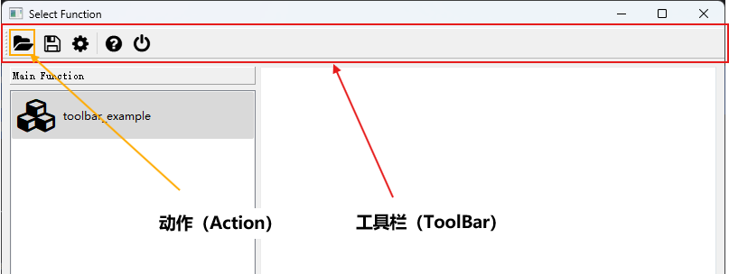
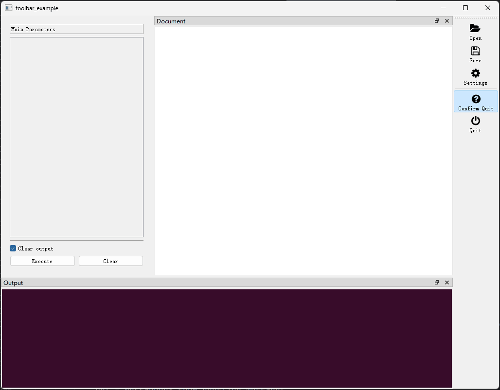

## （一）概述

`BaseWindow`的子类窗口均可添加工具栏，工具栏的典型外观如下图所示：

<div style="text-align: center">
    
</div>

为`函数选择窗口`和`函数执行窗口`添加工具栏的具体方法，在[**配置窗口属性**](window.md)一章已经给出，这里不再赘述，本章节主要介绍工具栏本身的属性。


工具栏（ToolBar）的属性由[**ToolBar**]({{main_branch}}/pyguiadapter/toolbar.py)类定义，开发者可以通过以下方式导入该类：

```python
from pyguiadapter.toolbar import ToolBar
```

通过`ToolBar`对象，开发者可以指定工具栏的初始位置、是否可拖动、是否可漂浮、动作按钮的大小和样式以及包含那些动作等。

要查看`ToolBar`类中定义了哪些属性，可以参考以下文档：

- [ pyguiadapter.toolbar.ToolBar]( apis/pyguiadapter.toolbar.md#pyguiadapter.toolbar.ToolBar)


## （二）主要属性

::: pyguiadapter.toolbar.ToolBar.actions
    options:
        heading_level: 3
        show_root_full_path: false
        show_source: false

工具栏上的动作`（Action）`可以设置图标（`icon`）、文字（`text`）、快捷键（`shortcut`）等属性，也可以设置`on_triggered`、`on_toggled`等事件监听器。关于`Action`可以参考以下文档：

- [**pyguiadapter.action.Action**](apis/pyguiadapter.action.md/#pyguiadapter.action.Action)


::: pyguiadapter.toolbar.ToolBar.moveable
    options:
        heading_level: 3
        show_root_full_path: false
        show_source: false


::: pyguiadapter.toolbar.ToolBar.floatable
    options:
        heading_level: 3
        show_root_full_path: false
        show_source: false


::: pyguiadapter.toolbar.ToolBar.allowed_areas
    options:
        heading_level: 3
        show_root_full_path: false
        show_source: false

可停靠区域可以使用单个`ToolBarArea`值，也可以是`ToolBarArea`的组合，例如：`TopToolBarArea | BottomToolBarArea`表示工具栏可以停靠在窗口的顶部或底部。


::: pyguiadapter.toolbar.ToolBar.initial_area
    options:
        heading_level: 3
        show_root_full_path: false
        show_source: false

停靠区域通常使用以下常量指定：

- `TopToolBarArea`（在窗口顶部放置工具栏）

- `BottomToolBarArea`（在窗口底部放置工具栏）

- `LeftToolBarArea`（在窗口左侧放置工具栏）

- `RightToolBarArea`（在窗口右侧放置工具栏）


::: pyguiadapter.toolbar.ToolBar.button_style
    options:
        heading_level: 3
        show_root_full_path: false
        show_source: false

按钮样式主要包括以下值：

- `ToolButtonIconOnly`（只显示图标）
- `ToolButtonTextBesideIcon`（在图标旁显示文字，即`Action`对象的`text`属性）
- `ToolButtonTextUnderIcon`（在图标下方显示文字，即`Action`对象的`text`属性）
- `ToolButtonTextOnly`（只显示文字，即`Action`对象的`text`属性）
- `ToolButtonFollowStyle`（遵循系统设置）


::: pyguiadapter.toolbar.ToolBar.icon_size
    options:
        heading_level: 3
        show_root_full_path: false
        show_source: false


## （三）示例

```python
import json

from pyguiadapter.action import Action, Separator
from pyguiadapter.adapter import GUIAdapter
from pyguiadapter.toolbar import (
    ToolBar,
    RightToolBarArea,
    LeftToolBarArea,
    ToolButtonTextUnderIcon,
    TopToolBarArea,
)
from pyguiadapter.utils import filedialog, inputdialog, messagebox
from pyguiadapter.window import SimpleWindowEventListener
from pyguiadapter.windows.fnexec import FnExecuteWindow


def toolbar_example():
    pass


###################Action Callbacks#########################
def on_action_open(window: FnExecuteWindow, _: Action):
    print("on_action_open()")
    ret = filedialog.get_open_file(
        parent=window,
        title="Open File",
        start_dir="./",
        filters="JSON files(*.json);;All files(*.*)",
    )
    if ret:
        messagebox.show_info_message(window, f"File will be opened: {ret}")


def on_action_save(window: FnExecuteWindow, _: Action):
    print("on_action_save()")
    ret = filedialog.get_save_file(
        parent=window,
        title="Save File",
        start_dir="./",
        filters="JSON files(*.json);;All files(*.*)",
    )
    if ret:
        messagebox.show_info_message(window, f"File will be saved to: {ret}")


def on_action_settings(window: FnExecuteWindow, _: Action):
    default_settings = {
        "opt1": 1,
        "opt2": "2",
        "opt3": True,
    }
    new_settings = inputdialog.input_json_object(
        parent=window,
        title="Settings",
        icon="fa.cog",
        size=(600, 400),
        ok_button_text="Save",
        cancel_button_text="Cancel",
        initial_text=json.dumps(default_settings, indent=4, ensure_ascii=False),
        auto_indent=True,
        indent_size=4,
        auto_parentheses=True,
        line_wrap_mode=inputdialog.LineWrapMode.WidgetWidth,
        line_wrap_width=88,
    )
    if isinstance(new_settings, dict):
        messagebox.show_info_message(window, f"new settings: {new_settings}")


def on_action_confirm_quit(window: FnExecuteWindow, _: Action, checked: bool):
    print("on_action_confirm_close(): ", checked)


def on_action_close(window: FnExecuteWindow, _: Action):
    print("on_action_close()")
    window.close()


###################~Action Callbacks#########################


if __name__ == "__main__":
    ###################Actions#############################
    action_open = Action(
        text="Open",
        icon="fa.folder-open",
        on_triggered=on_action_open,
        shortcut="Ctrl+O",
    )
    action_save = Action(
        text="Save",
        icon="fa.save",
        on_triggered=on_action_save,
        shortcut="Ctrl+S",
    )

    action_settings = Action(
        text="Settings",
        icon="fa.cog",
        on_triggered=on_action_settings,
        shortcut="Ctrl+,",
    )

    action_quit = Action(
        text="Quit",
        icon="fa.power-off",
        on_triggered=on_action_close,
        shortcut="Ctrl+Q",
    )
    action_confirm_quit = Action(
        text="Confirm Quit",
        icon="fa.question-circle",
        checkable=True,
        checked=False,
        on_toggled=on_action_confirm_quit,
    )
    ###################~Actions#############################

    ####################ToolBar#############################
    toolbar = ToolBar(
        actions=[
            action_open,
            action_save,
            action_settings,
            Separator(),
            action_confirm_quit,
            action_quit,
        ],
        moveable=True,
        floatable=True,
        initial_area=RightToolBarArea,
        allowed_areas=RightToolBarArea | LeftToolBarArea | TopToolBarArea,
        button_style=ToolButtonTextUnderIcon,
    )


    ###################~ToolBar#############################

    ################Window Event Listener###################
    def on_window_create(window: FnExecuteWindow):
        print("on_window_create()")
        # make action_confirm_quit checked after the select window is created
        window.set_action_state(action_confirm_quit, True)


    def on_window_close(window: FnExecuteWindow) -> bool:
        # get the state of action_confirm_quit
        # if it is checked, show a question message box to ask if the user really wants to close the window
        # if it is not checked, return True to close the window directly.
        state = window.get_action_state(action_confirm_quit)
        if state:
            # access the
            ret = messagebox.show_question_message(
                window,
                message="Do you really want to close the window?",
                title="Quit",
                buttons=messagebox.Yes | messagebox.No,
            )
            return ret == messagebox.Yes
        return True


    window_listener = SimpleWindowEventListener(
        on_create=on_window_create, on_close=on_window_close
    )
    #################Window Event Listener##################

    adapter = GUIAdapter()
    adapter.add(toolbar_example, window_listener=window_listener, window_toolbar=toolbar)
    adapter.run()

```

<div style="text-align: center">
    
</div>