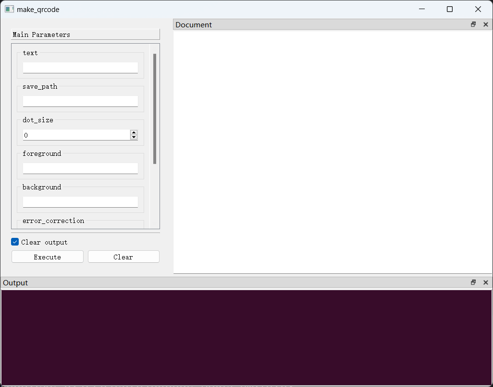
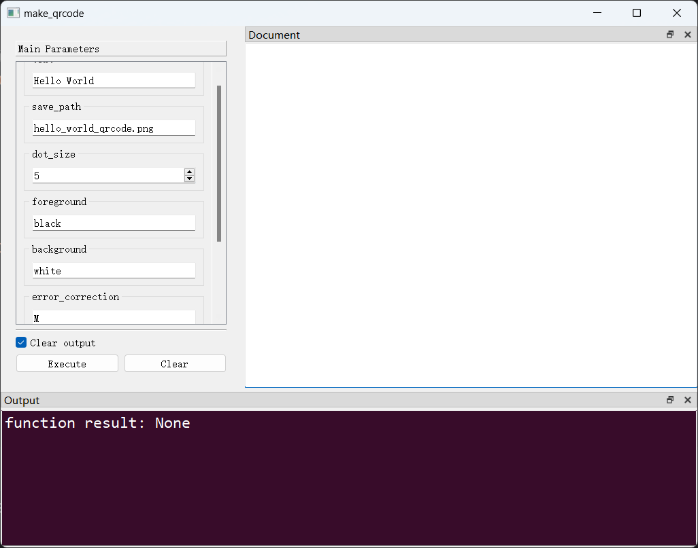

## 一、建立应用基本结构

### （一） 创建项目并安装依赖

> 这里使用`poetry`进行项目依赖管理，开发者也可以选择自己习惯的工具。
#### 1. 创建项目

```bash
poetry new QRCode-Makder
cd QRCode-Makder
```

#### 2. 激活虚拟环境

```bash
poetry install
poetry shell
```

#### 3. 安装依赖

（1）安装`PyGUIAdapter`

```bash
poetry add pyguiadapter
```

（2）安装Qt的Python绑定库，这里选择`PySide2`（注意不同Qt绑定库对Python版本的要求）

```bash
poetry add pyside2
```

（3）安装`segno`库

> 从零开始实现二维码生成算法是一个相对复杂的任务，幸运的是，很多聪明的程序员已经实现了这个功能，并将其开源出来。
> 其中，一个非常值得推荐的库是`segno`，它简单易用，纯Python实现，无外部依赖，并且提供了丰富的功能和灵活的选项，可以帮助开发者轻松地生成各种
> 类型的二维码。 珠玉在前，这里就不重复造轮子，而是直接使用`segno`来完成我们的需求。

> 关于`segno`库的使用，请阅读它的[官方文档](https://segno.readthedocs.io/en/latest/)，这里不再赘述。

```bash
poetry add segno
```

为了生成艺术化的二维码，我们还需要安装`segno`的一个插件`qrcode_artistic`:

> Tip：`qrcode_artistic`插件会引入`Pillow`库的依赖。

```bash
poetry add qrcode-artistic
```

（4）创建程序入口文件

经过以上步骤，不出意外，项目结构应该大致如下：

```bash
QRCode-Makder/
  |- pyproject.toml
  |- README.md
  |- poetry.lock
  |- tests/
  | |- __init__.py
  |- qrcode_maker/  
    |- __init__.py
```

> 项目中可能还会有一些其他文件，一般来说，这些文件并不影响接下来的步骤和程序的运行，所以可以先忽略它们。 

现在，让我们在项目根目录下创建应用程序的入口文件`main.py`，

```bash
QRCode-Makder/
  |- pyproject.toml
  |- README.md
  |- poetry.lock
  |- tests/
  |  |- __init__.py
  |- qrcode_maker/  
  |  |- __init__.py
  |- main.py
```

修改`main.py`的内容为：

```python
def main():
    pass


if __name__ == "__main__":
    main()
```

目前，`main.py`中仅包含一个空函数`main()`，该函数作为程序的入口函数，会用户运行`main.py`时被调用。 之后，我们将在`main()`中添加更多代码
（主要是`PyGUIAdapter`相关的代码），其他代码将全部放在`qrcode_maker/`目录下。

### 实现核心功能

（1）实现`make_qrcode()`函数

在`PyGUIAdapter`中，所有对用户提供的功能都应当被封装成函数的形式。`QRCode Maker`的核心功能是生成二维码，这里我们定义一个函数`make_qrcode()`
来实现这一功能。

`make_qrcode()`函数将被放在`qrcode_maker/`目录下的`qrcode.py`文件中，首先创建该文件:

```bash
QRCode-Makder/
  |- pyproject.toml
  |- README.md
  |- poetry.lock
  |- tests/
  |  |- __init__.py
  |- qrcode_maker/  
  |  |- __init__.py
  |  |- qrcode.py
  |- main.py
```

然后，根据需求，确定`make_qrcode()`函数的参数。函数的参数即希望用户输入的数据。为了简单起见，这里先添加一些基础参数，如：

- 待编码为二维码的文本（`text`）
- 待编码文本的编码格式（`encoding`）
- 码元的大小（`dot_size`）
- 码元的颜色，即“前景色”（`foreground`）
- 二维码的背景色，（`background`）
- 纠错级别（`error_correction`）
- 边框的宽度（`border`）
- 生成二维码的保存路径（`save_path`）

> 后面，我们将逐步添加更多参数，完善`make_qrcode()`的功能

这样，我们就得到了`make_qrcode()`函数的签名：

> [qrcode_maker/qrcode.py]()

```python
def make_qrcode(
        text: str,
        save_path: str,
        dot_size: int,
        foreground: str,
        background: str,
        error_correction: str,
        border: int,
        encoding: str
):
    pass
```

现在，让我们来实现这个函数：

```python
import segno
from pyguiadapter.exceptions import ParameterError

def make_qrcode(
        text: str,
        save_path: str,
        dot_size: int,
        foreground: str,
        background: str,
        error_correction: str,
        border: int,
        encoding: str
):
    # Before we do the actual work, it is highly recommended to check the parameters first.
    if not text:
        raise ParameterError("text", "Text cannot be empty!")

    if not save_path or save_path.strip() == "":
        raise ParameterError("save_path", "Save path cannot be empty!")

    if dot_size < 1:
        raise ParameterError("dot_size", f"Invalid dot size: {dot_size}")

    if not foreground or foreground.strip() == "":
        raise ParameterError("foreground", "Foreground color cannot be empty!")

    if not background or background.strip() == "":
        raise ParameterError("background", "Background color cannot be empty!")

    if error_correction not in ["L", "M", "Q", "H"]:
        raise ParameterError("error_correction", f"Invalid error correction level: {error_correction}")

    if border < 0:
        raise ParameterError("border", f"Invalid border size: {border}")

    # OK, here we think all the parameters are valid, let encode the text into a QR code
    qr = segno.make_qr(
        content=text,
        error=error_correction,
    )
    qr.save(
        out=save_path,
        scale=dot_size,
        border=border,
        dark=foreground,
        light=background,
    )
```

可以看到，这个函数实际上非常简单，基本上就是先进行参数校验（占用的大部分代码行），然后调用`segno`库实现二维码的生成和保存。

接下来，让我们为这个函数适配GUI界面，借助`PyGUIAdapter`，这同样是一件非常简单的事情。

（2）适配GUI界面

让我们切换到[`main.py`]()文件，将代码修改为：

```python
from pyguiadapter.adapter import GUIAdapter
from qrcode_maker.qrcode import make_qrcode


def main():
    adapter = GUIAdapter()
    adapter.add(make_qrcode)
    adapter.run()


if __name__ == "__main__":
    main()
```

接着，运行`main.py`文件：

> 如果此时你没有激活虚拟环境，那么在运行`main.py`之前，你可能需要先激活虚拟环境，例如:
> ```bash
> poetry shell
>```

```bash
python main.py
```

不出意外，我们会看到如下界面：



让我们填入一些参数，尝试生成一个二维码：



不出意外，点击`Execute`按钮后，当前工作路径下应当生成一个名为`hello_world_qrcode.png`的文件：

。

---

到这里，我们就完成了一个能正常工作的GUI应用程序的开发，是不是很简单呢？

当然，现在这个应用程序的功能简单了些，并且用户体验实在是算不上好，包括：

1. 每次用户都要输入全部参数，而用户对于一些参数可能并不关心，让其保持默认即可，但是却没有设置合适的缺省值。比如`dot_size`、`border`，这些参数 
在控件上的初始值为`0`，因此，用户每次都要手动调整/输入这些参数，这样就显得很不方便了。
2. 一些参数的控件对于输入该类型的数据来说并不十分合适，例如：`save_path`、`forground`、`background`、`error_correction`
3. 一些参数的控件没有对输入值的范围进行限制，例如：`dot_size`、`border`，虽然我们已经在`make_qrcode()`函数中对它们进行了校验，
但是用户仍然有可能在输入框中输入不合法的值，例如：0和负值。
4. 输出区域总是默认输出"function result: None"，在二维码生成失败或者成功时，没有显示合适的提示信息，这显然降低了用户的使用体验。
5. 在自动生成的界面上，缺少描述信息，其中既包括对参数的描述，也包括对整个函数本身的描述，如果有这些信息，用户将能够更直观地了解如何使用这个应用程序。
6. 缺少快速保存和加载参数的功能，而用户可能有交换或分享二维码生成参数的需求。

我们将使用`PyGUIAdapter`提供的功能，逐一解决这些问题。接下来，请继续阅读：
[二、选择合适的控件类型](/tutorials/qrcode-maker/2.widget_types.md)