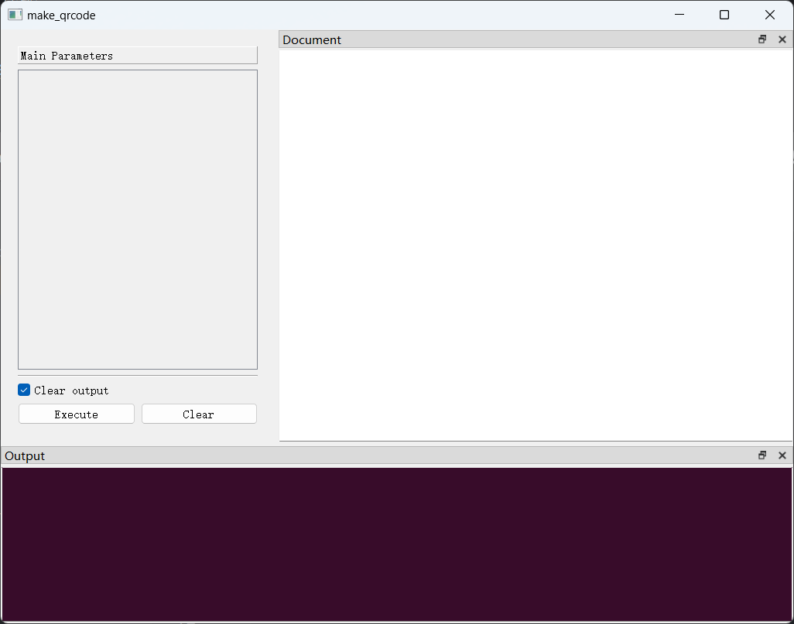

# QRCode Maker

`QRCode Maker`是一个二维码生成器，用户通过简单的操作，即可将任意类型的文本编码为二维码。它允许用户对各种参数进行调整，以满足用户生成定制化二维码
的需求。同时，它还为用户提供了批量生成二维码的功能。

----

下面，我们将用几个篇章，从零开始构建这个应用程序，当然，开发者也可以在[这个仓库](https://github.com/zimolab/QRCode-Maker)找到
该项目的最终代码。

> Tip1: 在正式开始前，假定开发者已经了解`PyGUIAdapter`的基本用法。

> Tip2: 本教程适用于`v2.0.0`及以上版本的`PyGUIAdapter`。
 
## 目录

### [一、创建项目](/tutorials/qrcode-maker/1.basic_structural.md)
### [二、调整参数控件类型及属性](/tutorials/qrcode-maker/2.config_widgets.md)
### [三、配置控件](/tutorials/qrcode-maker/3.widget_configs.md)
### [四、添加新功能：生成micro qrcode](/tutorials/qrcode-maker/4.micro_qrcode.md)
### [五、添加新功能：批量生成二维码](/tutorials/qrcode-maker/5.batch_make.md)
### [六、配置窗口](/tutorials/qrcode-maker/6.window_configs.md)
### [七、添加菜单与工具栏](/tutorials/qrcode-maker/7.menu_and_toolbar.md)
### [八、界面美化](/tutorials/qrcode-maker/8.beautify.md)
### [九、打包](/tutorials/qrcode-maker/9.packaging.md)