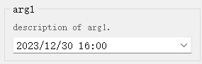
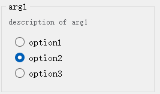
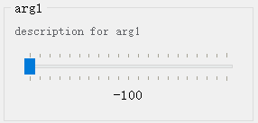
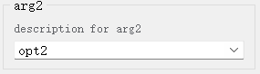
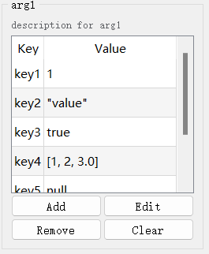
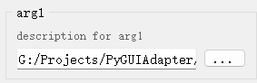
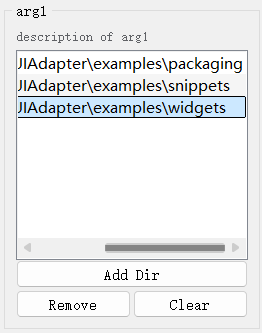

## 内置参数控件一览

### （一）Python内置类型的默认控件

|                           控件类型                           |                         控件配置类型                         |                         对应参数类型                         |                                                                          说明                                                                           |                   外观                    |
| :----------------------------------------------------------: | :----------------------------------------------------------: | :----------------------------------------------------------: |:-----------------------------------------------------------------------------------------------------------------------------------------------------:| :---------------------------------------: |
|     [`IntSpinBox`](apis/pyguiadapter.widgets.intspin.md)     | [`IntSpinBoxConfig`](apis/pyguiadapter.widgets.intspin.md#pyguiadapter.widgets.IntSpinBoxConfig) |                            `int`                             |                                                                    用于输入`int`类型数据。                                                                     |      |
|   [`FloatSpinBox`](apis/pyguiadapter.widgets.floatspin.md)   | [`FloatSpinBoxConfig`](apis/pyguiadapter.widgets.floatspin.md#pyguiadapter.widgets.FloatSpinBoxConfig) |                           `float`                            |                                                                   用于输入`float`类型数据。                                                                    |  |
|      [`BoolBox`](apis/pyguiadapter.widgets.boolbox.md)       | [`BoolBoxConfig`](apis/pyguiadapter.widgets.boolbox.md#pyguiadapter.widgets.BoolBoxConfig) |                            `bool`                            |                                                                    用于输入`bool`类型数据。                                                                    |      |
|     [`LineEdit`](apis/pyguiadapter.widgets.lineedit.md)      | [`LineEditConfig`](apis/pyguiadapter.widgets.lineedit.md#pyguiadapter.widgets.LineEditConfig) |                            `str`                             |                                                                    用于输入`str`类型数据。                                                                     |    |
|     [`DictEdit`](apis/pyguiadapter.widgets.dictedit.md)      | [`DictEditConfig`](apis/pyguiadapter.widgets.dictedit.md#pyguiadapter.widgets.DictEditConfig) |      `dict`、`typing.Dict`、`Mapping`、`MutableMapping`      |                                                                     用于字典类型数据的输入。                                                                      |                    |
|     [`ListEdit`](apis/pyguiadapter.widgets.listedit.md)      | [`ListEditConfig`](apis/pyguiadapter.widgets.listedit.md#pyguiadapter.widgets.ListEditConfig) |                    `list`、`typing.List`                     |                                                                     用于列表类型数据的输入。                                                                      |                    |
|    [`TupleEdit`](apis/pyguiadapter.widgets.tupleedit.md)     | [`TupleEditConfig`](apis/pyguiadapter.widgets.tupleedit.md#pyguiadapter.widgets.TupleEditConfig) |                   `tuple`、`typing.Tuple`                    |                                                                     用于元组类型数据的输入。                                                                      |                   |
|      [`SetEdit`](apis/pyguiadapter.widgets.setedit.md)       | [`SetEditConfig`](apis/pyguiadapter.widgets.setedit.md#pyguiadapter.widgets.SetEditConfig) |              `set`、`typing.Set`、`MutableSet`               |                                                                     用于集合类型数据的输入。                                                                      |                     |
|     [`DateEdit`](apis/pyguiadapter.widgets.dateedit.md)      | [`DateEditConfig`](apis/pyguiadapter.widgets.dateedit.md#pyguiadapter.widgets.DateEditConfig) |                            `date`                            |                                                    该控件用于输入日期，是python内置`datetime.date`类型参数的默认输入控件。                                                     |               |
|     [`TimeEdit`](apis/pyguiadapter.widgets.timeedit.md)      | [`TimeEditConfig`](apis/pyguiadapter.widgets.timeedit.md#pyguiadapter.widgets.TimeEditConfig) |                            `time`                            |                                                    该控件用于输入日期，是python内置`datetime.time`类型参数的默认输入控件。                                                     |               |
| [`DateTimeEdit`](apis/pyguiadapter.widgets.datetimeedit.md)  | [`DateTimeEditConfig`](apis/pyguiadapter.widgets.datetimeedit.md#pyguiadapter.widgets.DateTimeEditConfig) |                          `datetime`                          |                                                 该控件用于输入日期时间，是python内置`datetime.datetime`类型参数的默认输入控件。                                                  |           |
| [`ExclusiveChoiceBox`](apis/pyguiadapter.widgets.exclusivechoice.md) | [`ExclusiveChoiceBoxConfig`](apis/pyguiadapter.widgets.exclusivechoice.md#pyguiadapter.widgets.ExclusiveChoiceBoxConfig) |                       `typing.Literal`                       |                                       用于从一组选项中选择一个选项，是`typing.Literal`类型的默认控件，可以自动提取`Literal`所有给定的字面量并将其作为可选项。                                        |    |
| [`PyLiteralEdit`](apis/pyguiadapter.widgets.pyliteraledit.md) | [`PyLiteralEditConfig`](apis/pyguiadapter.widgets.pyliteraledit.md#pyguiadapter.widgets.PyLiteralEditConfig) | `typing.Any`、`object`、`Union[str,bytes,bool,int,float,list,tuple,set,dict,None]` | `PyLiteralEdit`主要用于Python字面量的输入，是`Any`、`object`、`Union`等类型参数的默认输入控件。 `Python字面量`是指`ast.eval_literal()`支持的任意Python字面量，包括：字符串、字节对象、数值、元组、列表、字典、集合、布尔值等。 |           |
|   [`EnumSelect`](apis/pyguiadapter.widgets.enumselect.md)    | [`EnumSelectConfig`](apis/pyguiadapter.widgets.enumselect.md#pyguiadapter.widgets.EnumSelectConfig) |                         `enum.Enum`                          |                                                                  用于`Enum`（枚举类型）值的输入                                                                   |              |

### （二）语义化类型（扩展类型）及其控件

`语义化类型`是从内置类型中扩展而来的类型，很多时候，可以看作是对应内置类型的`“别名”`，在使用上与对应内置类型没有区别。

语义化类型（扩展类型）的主要作用在于，提供区别于对应内置类型默认控件的专用控件，以满足特定场景下的输入需求。比如`int_slider_t`是`int`类型的语义化类型（扩展类型），在使用上与`int`类型一致，但它对应的输入控件是一个`Slider`（滑动条），而不是一个`SpinBox`。

通过合理使用语义化类型（扩展类型），开发者可以构建出界面更加丰富，用户交互体验更加良好的应用程序。以下是`PyGUIAdapter`提供的语义化类型（扩展类型）及其对应的控件。


> 所有的语义化类型（扩展类型）均在[`pyguiadapter.extend_types`]({{main_branch}}/pyguiadapter/extend_types.py)模块中定义，可以通过以下方式导入：
>
> ```python
> from pyguiadapter.extend_types import TYPE_NAME
> ```
>
> 其中，`TYPE_NAME`是需要导入的类型名称。比如，对于`int_slider_t`，可以通过如下方式导入：
>
> ```python
> from pyguiadapter.extend_types import int_slider_t
> ```
>
> 


|                           控件类型                           |                         控件配置类型                         |             对应数据类型              |                             说明                             |                  外观                   |
| :----------------------------------------------------------: | :----------------------------------------------------------: | :-----------------------------------: | :----------------------------------------------------------: | :-------------------------------------: |
|    [`IntLineEdit`](apis/pyguiadapter.widgets.intedit.md)     | [`IntLineEditConfig`](apis/pyguiadapter.widgets.intedit.md#pyguiadapter.widgets.IntLineEditConfig) |                `int_t`                | `int_t`扩展自`int`，可以看作是`int`类型的别名。`PyGUIAdapter`为该类型提供了一个单行文本输入框样式的输入组件，但于与一般单行文本输入框，该类型的输入组件只允许用户输入整数文本。 |                 |
|  [`FloatLineEdit`](apis/pyguiadapter.widgets.floatedit.md)   | [`FloatLineEditConfig`](apis/pyguiadapter.widgets.floatedit.md#pyguiadapter.widgets.FloatLineEditConfig) |               `float_t`               | `float_t`扩展自`float`，可以看作是`float`类型的别名。`PyGUIAdapter`为该类型提供了一个单行文本输入框样式的输入组件，但于与一般单行文本输入框标题，该类型的输入组件只允许用户输入浮点数文本。 |               |
|     [`TextEdit`](apis/pyguiadapter.widgets.textedit.md)      | [`TextEditConfig`](apis/pyguiadapter.widgets.textedit.md#pyguiadapter.widgets.TextEditConfig) |               `text_t`                | `text_t`扩展自`str`，可以看作是`str`类型的别名。`PyGUIAdapter`为该类型提供了一个多行文本输入框，允许用户输入多行文本。 |                |
|       [`Slider`](apis/pyguiadapter.widgets.slider.md)        | [`SliderConfig`](apis/pyguiadapter.widgets.slider.md#pyguiadapter.widgets.SliderConfig) |            `int_slider_t`             | `int_slider_t`扩展自`int`，可以看作是`int`类型的别名。与其他`int`不同，`PyGUIAdapter`为该类型提供了滑动条形式的输入控件。 |          |
|         [`Dial`](apis/pyguiadapter.widgets.dial.md)          | [`DialConfig`](apis/pyguiadapter.widgets.dial.md#pyguiadapter.widgets.DialConfig) |             `int_dial_t`              | `int_dial_t`扩展自`int`，可以看作是`int`类型的别名。与其他`int`不同，`PyGUIAdapter`为该类型提供了刻度盘形式的输入控件。 |            |
|  [`ColorPicker`](apis/pyguiadapter.widgets.colorpicker.md)   | [`ColorPickerConfig`](apis/pyguiadapter.widgets.colorpicker.md#pyguiadapter.widgets.ColorPickerConfig) | `color_t、color_hex_t、color_tuple_t` | `color_t`扩展自`object`，代表颜色类型的数据，实际支持的类型包括`tuple`（3元素或4元素元组）、`str`、`QColor`，发者可以选择颜色的表示方式。`PyGUIAdapter`为该类型提供了一个颜色选择器。 |               |
|    [`ChoiceBox`](apis/pyguiadapter.widgets.choicebox.md)     | [`ChoiceBoxConfig`](apis/pyguiadapter.widgets.choicebox.md#pyguiadapter.widgets.ChoiceBoxConfig) |              `choice_t`               | 该类型扩展自`object`，`PyGUIAdapter`为该类型提供了一个下拉选择框，用户可以从一组选项中选择其中一个。 |              |
| [`MultiChoiceBox`](apis/pyguiadapter.widgets.multichoice.md) | [`MultiChoiceBoxConfig`](apis/pyguiadapter.widgets.multichoice.md#pyguiadapter.widgets.MultiChoiceBoxConfig) |              `choices_t`              |      该类型扩展自`list`，用于从一组对象中选择多个对象。      |             |
| [`KeySequenceEdit`](apis/pyguiadapter.widgets.keysequenceedit.md) | [`KeySequenceEditConfig`](apis/pyguiadapter.widgets.keysequenceedit.md#pyguiadapter.widgets.KeySequenceEditConfig) |           `key_sequence_t`            |          `key_sequence_t`扩展自`str`，代表快捷键。           |        |
|  [`PlainDictEdit`](apis/pyguiadapter.widgets.plaindict.md)   | [`PlainDictEditConfig`](apis/pyguiadapter.widgets.plaindict.md#pyguiadapter.widgets.PlainDictEditConfig) |            `plain_dict_t`             | `plain_dict_t`类型扩展自`dict`，用于`Dict[key, int|bool|float|str|list|dict]`类型数据的输入。 |          |
| [`StringListEdit`](apis/pyguiadapter.widgets.stringlist.md)  | [`StringListEditConfig`](apis/pyguiadapter.widgets.stringlist.md#pyguiadapter.widgets.StringListEditConfig) |            `string_list_t`            | `string_list_t`扩展自`list`，用于`List[str]`类型数据的输入。 |         |
|    [`JsonEdit`](apis/pyguiadapter.widgets.jsoneditor.md)     | [`JsonEditConfig`](apis/pyguiadapter.widgets.jsoneditor.md#pyguiadapter.widgets.JsonEditConfig) |             `json_obj_t`              | `json_obj_t`扩展自`object`，用于json类型数据的输入。用户在控件上输入的文本将通过`json.loads`转换为对应的Python对象。 |            |
|    [`DirSelect`](apis/pyguiadapter.widgets.dirselect.md)     | [`DirSelectConfig`](apis/pyguiadapter.widgets.dirselect.md#pyguiadapter.widgets.PyLiteralEditConfig) |        `directory_t`、`dir_t`         | `directory_t`扩展自`str`，代表一个目录路径，`PyGUIAdapter`为该类型提供了一个文件选择对话框用于选择目录。 |           |
|   [`FileSelect`](apis/pyguiadapter.widgets.fileselect.md)    | [`FileSelectConfig`](apis/pyguiadapter.widgets.fileselect.md#pyguiadapter.widgets.DirSelectConfig) |               `file_t`                | `file`扩展自`str`，代表一个文件路径，`PyGUIAdapter`为该类型提供了一个文件选择对话框用于选择文件。 |                |
| [`MultiFileSelect`](apis/pyguiadapter.widgets.fileselect.md) | [`MultiFileSelectConfig`](apis/pyguiadapter.widgets.fileselect.md#pyguiadapter.widgets.MultiFileSelectConfig) |               `files_t`               | `files`扩展自`list`，代表一组文件路径，`PyGUIAdapter`为该类型提供了一个文件选择对话框用于选择多个文件。 |               |
| [`PathListEdit`](apis/pyguiadapter.widgets.pathlist.md#pyguiadapter.widgets.PathListEdit) | [`PathListEditConfig`](apis/pyguiadapter.widgets.pathlist.md#pyguiadapter.widgets.PathListEditConfig) |             `path_list_t`             | `List[str]`类型的扩展类型，语义上代表一个路径列表，支持添加文件路径和文件夹路径。 |  |
| [`FileListEdit`](apis/pyguiadapter.widgets.pathlist.md#pyguiadapter.widgets.FileListEdit) | [`FileListEditConfig`](apis/pyguiadapter.widgets.pathlist.md#pyguiadapter.widgets.FileListEditConfig) |             `file_list_t`             | `List[str]`类型的扩展类型，语义上代表一个路径列表，支持添加文件路径。 |  |
| [`DirectoryListEdit`](apis/pyguiadapter.widgets.pathlist.md#pyguiadapter.widgets.DirectoryListEdit) | [`DirectoryListEditConfig`](apis/pyguiadapter.widgets.pathlist.md#pyguiadapter.widgets.DirectoryListEditConfig) |             `dir_list_t`              | `List[str]`类型的扩展类型，语义上代表一个路径列表，支持添加文件夹路径。 |   |

