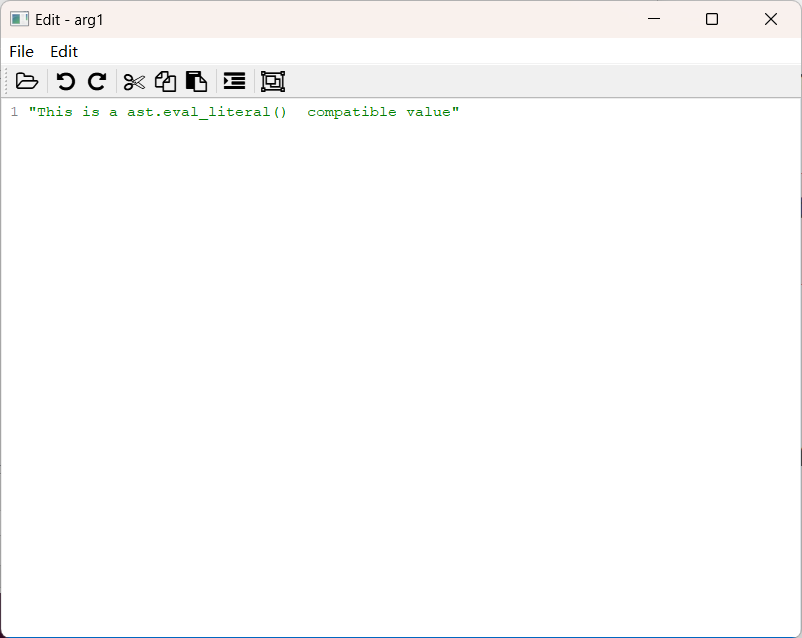
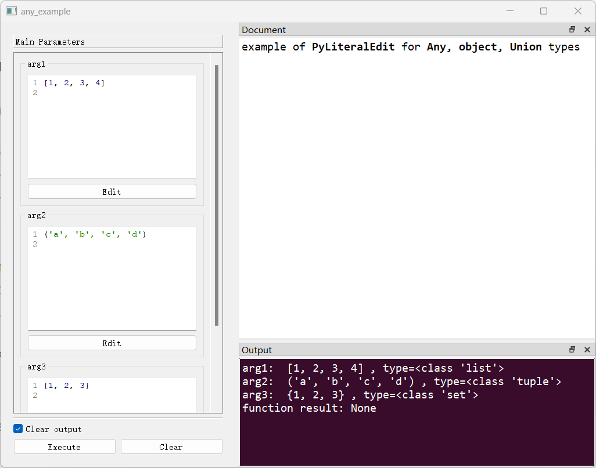
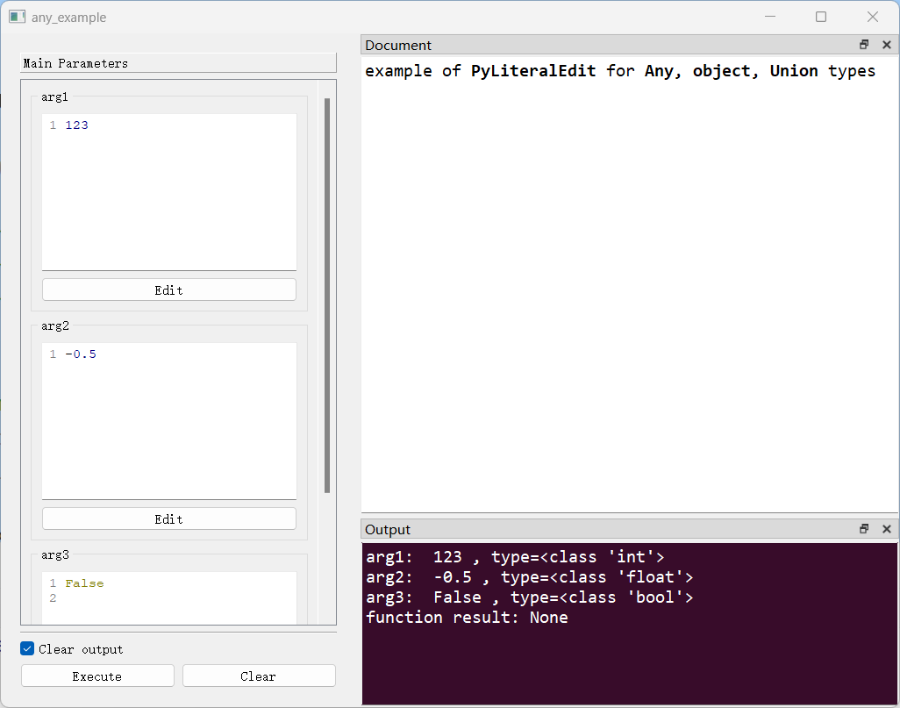
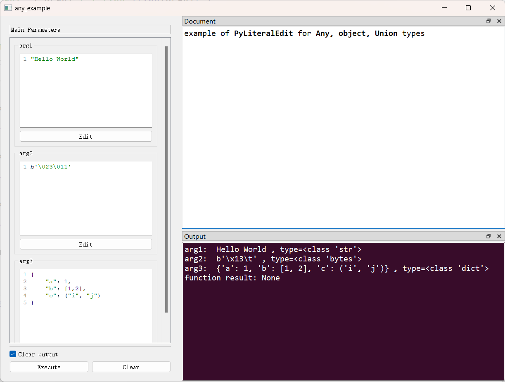
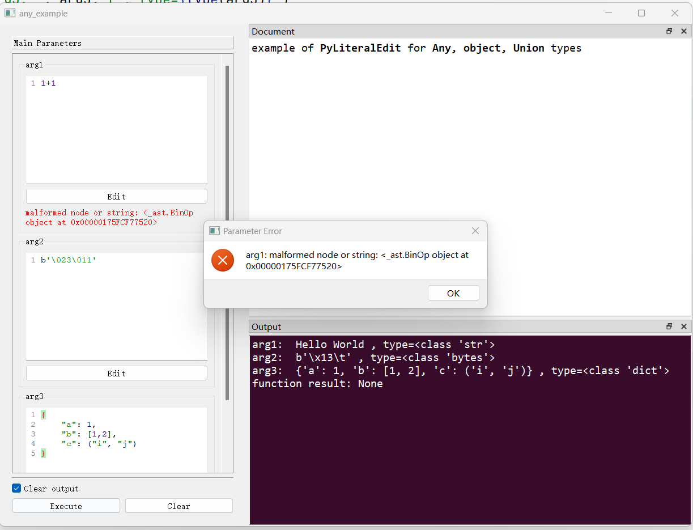

# `PyLiteralEdit`控件

## 一、控件类型：`PyLiteralEdit`

> 源码: [`pyguiadapter/widgets/basic/literaledit.py`]()


`PyLiteralEdit`是[`BaseCodeEdit`](widgets/base_code_edit.md)的子类，主要用于Python字面量的输入，是`Any`、`object`、`Union`等类型的函数参数的默认输入控件。

> `Python字面量`是指`ast.eval_literal()`函数支持任意Python字面量结构，包括：
>
> - 字符串(str)，如：```"this is a string"``
> - 字节对象(bytes)，如：```b"\011\012"``
> - 数值(int、float)，如：```1```、```2.0```
> - 元组(tuple)，如：```(1, 2, 3)```
> - 列表(list)，如：```[1, "2", 3, (1 ,2, 3)]```
> - 字典(dict)，如：```{"a": 1, "b": 2}```
> - 集合(set)，如：```{"a", "b", "c"}```
> - 布尔值(bool)，如：```True```、```False```
> -  `None`
>
> 关于`ast.eval_literal()`的更多细节请参见[`官方文档`](https://docs.python.org/3.8/library/ast.html#ast.literal_eval)。


  



## 二、配置类型：`PyLiteralEditConfig`

> 源码: [`pyguiadapter/widgets/basic/literaledit.py`]()

```python
@dataclasses.dataclass(frozen=True)
class PyLiteralEditConfig(BaseCodeEditConfig):
    default_value: PyLiteralType = ""
    highlighter: Type[QPythonHighlighter] = QPythonHighlighter
    formatter: QPythonHighlighter = PythonFormatter()
    initial_text: str = ""
    file_filters: str = FILE_FILTERS

    @classmethod
    def target_widget_class(cls) -> Type["PyLiteralEdit"]:
        return PyLiteralEdit

```

| 配置项名称      | 类型                       | 默认值                                                       |
| --------------- | -------------------------- | ------------------------------------------------------------ |
| `default_value` | `PyLiteralType`            | `""`                                                         |
| `highlighter`   | `Type[QPythonHighlighter]` | `QPythonHighlighter`                                         |
| `formatter`     | `QPythonHighlighter`       | `PythonFormatter()`                                          |
| `file_filters`  | `str`                      | `Python files (*.py);;Text files(*.txt);;Text files(*.text);;All files (*.*)` |

``PyLiteralEditConfig`继承自[`BaseCodeEditConfig`](widgets/base_code_edit.md)，并针对`输入Python字面量`这一特定需求，对以上配置项（属性）进行了覆盖。比如将代码着色器指定为`QPythonHighlighter`、将`formatter`设置为`PythonFormatter`，如无必要，开发者不应对这些属性进行调整。 

关于其他可以调整的配置项，请参考其父类[`BaseCodeEditConfig`](widgets/base_code_edit.md)，父类中定义的配置项一般情况下也适用于子类。

> `PyLiteralType`是以下类型的别名：


## 三、示例

> 源码：[examples/widgets/any_example.py]()

```python
from typing import Any, Union

from pyguiadapter.adapter import GUIAdapter
from pyguiadapter.adapter.ucontext import uprint
from pyguiadapter.widgets import PyLiteralEditConfig


def any_example(arg1: Any, arg2: object, arg3: Union[int, str]):
    """
    example of **PyLiteralEdit** for **Any**, **object**, **Union** types
    """
    uprint("arg1: ", arg1, f", type={type(arg1)}")
    uprint("arg2: ", arg2, f", type={type(arg2)}")
    uprint("arg3: ", arg3, f", type={type(arg3)}")


if __name__ == "__main__":
    # PyLiteralEdit support the PyLiteralType, which is a Union of:
    # bool, int, float, bytes, str, list, tuple, dict, set

    arg1_config = PyLiteralEditConfig(
        default_value=[1, 2, 3, 4],
    )
    arg2_config = PyLiteralEditConfig(
        default_value=("a", "b", "c", "d"),
    )
    arg3_config = PyLiteralEditConfig(
        default_value={1, 2, 3},
    )
    adapter = GUIAdapter()
    adapter.add(
        any_example,
        widget_configs={
            "arg1": arg1_config,
            "arg2": arg2_config,
            "arg3": arg3_config,
        },
    )
    adapter.run()

```




让我们尝试改变控件中的值：






让我们尝试输入一些非法的值，比如说输入一个简单的二元运算表达式：



不出意外报错了，因为`ast.literal_eval()`并非为此目的而设计。


**`PyLiteralEdit`是一个强大的控件，对其善加利用，开发者几乎可以让用户输入任意复杂的对象。**


---

[参数数据类型及其对应控件](widgets/types_and_widgets.md)