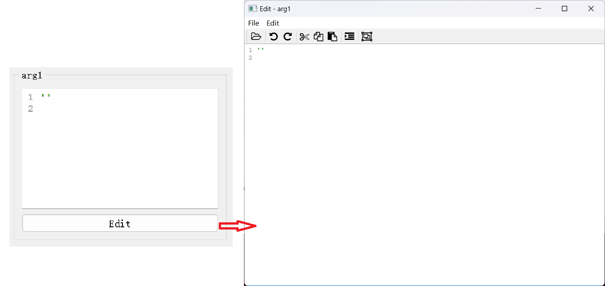

# `BaseCodeEdit`控件

## 一、控件类型：`BaseCodeEdit`

> 源码: [`pyguiadapter/widgets/extend/base.py`]()


该控件不直接对应某一数据类型，而是作为一个`基类`，定义了其所有子类的共用属性和逻辑。

该控件实现了一个简单的代码编辑控件和一个独立的代码编辑器窗口，通过子类化该控件，可以实现复杂对象（如列表、元组、字典等）的输入。





## 二、配置类型：`BaseCodeEditConfig`

> 源码: [`pyguiadapter/widgets/extend/base.py`]()

```python
@dataclasses.dataclass(frozen=True)
class BaseCodeEditConfig(CommonParameterWidgetConfig):
    font_size: int | None = None
    indent_size: int = INDENT_SIZE
    min_height: int = MIN_HEIGHT
    highlighter: Type[QStyleSyntaxHighlighter] | None = None
    highlighter_args: dict | list | tuple | None = None
    editor_window: bool = True
    editor_button_text: str = EDITOR_BUTTON_TEXT
    editor_title: str = EDITOR_TITLE
    auto_indent: bool = True
    auto_parentheses: bool = True
    formatter: BaseCodeFormatter | Callable[[str], str] | None = None
    file_filters: str | None = None
    start_dir: str | None = None
    line_wrap_mode: LineWrapMode = LineWrapMode.WidgetWidth
    line_wrap_width: int = 88
    word_wrap_mode: WordWrapMode = WordWrapMode.WordWrap
    initial_text: str | None = None
    use_default_menus: bool = True
    use_default_toolbar: bool = True
    exclude_default_menus: Tuple[str] = ()
    exclude_default_menu_actions: Tuple[Tuple[str, str]] = (
        (MENU_FILE, ACTION_SAVE),
        (MENU_FILE, ACTION_SAVE_AS),
    )
    exclude_default_toolbar_actions: Tuple[str] = (
        ACTION_SAVE,
        ACTION_SAVE_AS,
    )
    confirm_dialog: bool = True
    confirm_dialog_title: str = CONFIRM_DIALOG_TITLE
    accept_changes_message: str = ACCEPT_CHANGES_MSG

    @classmethod
    @abstractmethod
    def target_widget_class(cls) -> Type["BaseCodeEdit"]:
        pass

```

|            配置项名称             |                        类型                         |                  默认值                   |                             说明                             |
| :-------------------------------: | :-------------------------------------------------: | :---------------------------------------: | :----------------------------------------------------------: |
|          `default_value`          |                        `Any`                        |                  `None`                   |                        控件的默认值。                        |
|            `font_size`            |                    `int \| None`                    |                  `None`                   |     代码编辑控件的字体大小。默认为`None`，即保持默认值。     |
|           `indent_size`           |                        `int`                        |                    `4`                    |                  缩进大小。默认为4个空格。                   |
|           `min_height`            |                        `int`                        |                   `180`                   |           代码编辑控件的最小高度。默认为180像素。            |
|           `highlighter`           |       `Type[QStyleSyntaxHighlighter] \| None`       |                  `None`                   | 代码着色器类型。注意该属性要求传入代码着色器类本身，而不是类示例。 |
|        `highlighter_args`         |           `dict \| list \| tuple \| None`           |                  `None`                   |                   代码着色器构造函数参数。                   |
|          `editor_window`          |                       `bool`                        |                  `True`                   | 是否启用独立代码编辑窗口，若为`True`，则在代码编辑控件下方添加一个按钮，用于打开独立代码编辑器窗口。 |
|       `editor_button_text`        |                        `str`                        |                  `Edit`                   |         用于设置打开独立代码编辑器窗口的按钮的文本。         |
|          `editor_title`           |                        `str`                        |                `Edit - {}`                | 该属性用于设置独立代码编辑器窗口标题。默认为`Edit - {}`，其中，`{}`将被替换为用户当前正在编辑的参数的标签（`label`）。 |
|      `editor_line_wrap_mode`      |                   `LineWrapMode`                    |           `LineWrapMode.NoWrap`           | 该属性用于设置行包裹模式。默认为`NoWrap`，即不包裹行（换言之，不启用自动换行）。该属性对独立代码编辑窗口有效。 |
|     `editor_line_wrap_width`      |                        `int`                        |                   `88`                    | 该属性用于设置行的最大长度（仅在行包裹模式为`FixedPixelWidth`或`FixedColumnWidth`时有效）。该属性对独立代码编辑窗口有效。 |
|      `editor_word_wrap_mode`      |                   `WordWrapMode`                    |           `WordWrapMode.NoWrap`           | 该属性用于设置单词包裹模式，默认为`NoWrap`。该属性对独立代码编辑窗口有效。 |
|           `auto_indent`           |                       `bool`                        |                  `True`                   |                 是否启用自动缩进。默认启用。                 |
|        `auto_parentheses`         |                       `bool`                        |                  `True`                   |               是否启用括号自动匹配。默认启用。               |
|            `formatter`            | `BaseCodeFormatter \| Callable[[str], str] \| None` |                  `None`                   | 用于指定代码格式化函数或对象。默认为`None`，即无代码格式化功能。 |
|          `file_filters`           |                    `str \| None`                    |                  `None`                   | 该属性用于为独立代码编辑器窗口的打开文件对话框设置文件名过滤器。 |
|            `start_dir`            |                    `str \| None`                    |                  `None`                   | 该属性用于为独立代码编辑器窗口的打开文件对话框设置起始路径。 |
|         `line_wrap_mode`          |                   `LineWrapMode`                    |          ```LineWrapMode.NoWrap`          | 该属性用于设置行包裹模式。默认为`NoWrap`，即不包裹行（换言之，不启用自动换行）。该属性对代码编辑控件有效。 |
|         `line_wrap_width`         |                        `int`                        |                   `88`                    | 该属性用于设置行的最大长度（仅在行包裹模式为`FixedPixelWidth`或`FixedColumnWidth`时有效）。该属性对代码编辑控件有效。 |
|         `word_wrap_mode`          |                   `WordWrapMode`                    |           `WordWrapMode.NoWrap`           | 该属性用于设置单词包裹模式，默认为`NoWrap`。该属性对代码编辑控件有效。 |
|          `initial_text`           |                    `str \| None`                    |                  `None`                   |                   代码编辑控件的初始文本。                   |
|        `use_default_menus`        |                       `bool`                        |                  `True`                   | 该属性用于设置是否在独立代码编辑器窗口中启用用户自定义菜单。 |
|       `use_default_toolbar`       |                       `bool`                        |                  `True`                   | 该属性用于设置是否在独立代码编辑器窗口中启用用户自定义工具栏。 |
|      `exclude_default_menus`      |                    `Tuple[str]`                     |                   `()`                    | 该属性用于指定需要从独立代码编辑器窗口默认菜单栏中排除的菜单。 |
|  `exclude_default_menu_actions`   |              `Tuple[Tuple[str, str]]`               | `(('File', 'Save'), ('File', 'Save as'))` | 该属性用于指定需要从独立代码编辑器窗口默认菜单栏中排除的指定菜单项。默认排除以下菜单项：`File`菜单下的`Save`和`Save as`菜单项。 |
| `exclude_default_toolbar_actions` |                    `Tuple[str]`                     |           `('Save', 'Save as')`           | 该属性用于指定需要从独立代码编辑器窗口默认工具栏中排除的工具按钮，默认排除以下工具按钮：`Save`、`Save as`。 |
|         `confirm_dialog`          |                       `bool`                        |                  `True`                   | 该属性用于设置在关闭独立代码编辑器窗口时是否弹出确认更改对话框。 |
|      `confirm_dialog_title`       |                        `str`                        |                `"Confirm"`                |             该属性用于设置确认更改对话框的标题。             |
|     `accept_changes_message`      |                        `str`                        |   `"Do you want to keep the changes?"`    |           该属性用于设置确认更改对话框的提示内容。           |

## 

---

[参数数据类型及其对应控件](widgets/types_and_widgets.md)