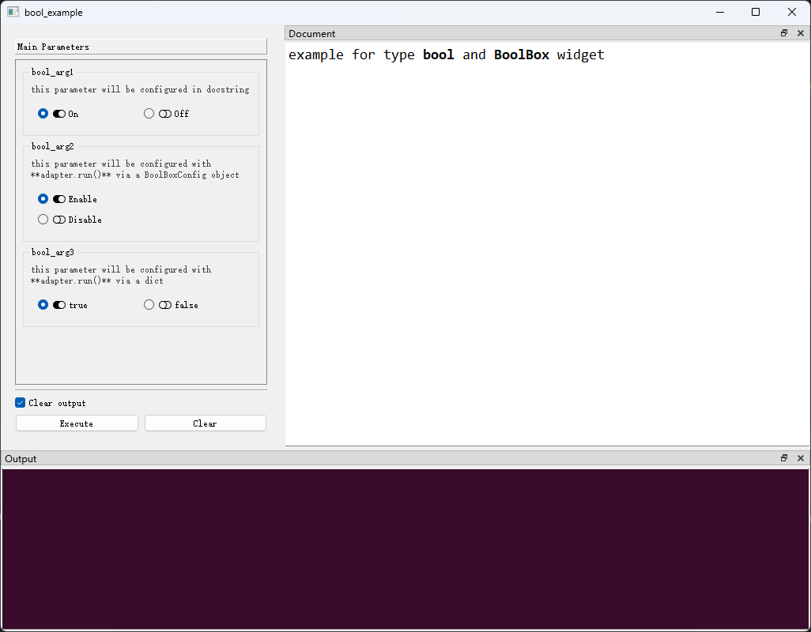

# # `bool`类型及`BoolBox`控件

## 一、控件类型：BoolBox

> 源码：[pyguiadapter/widgets/basic/boolbox.py]()

用于`bool`类型数据的输入，是`bool`类型参数的默认控件。


## 二、配置类型：FloatSpinBoxConfig

> 源码：[pyguiadapter/widgets/basic/boolbox.py]() 

```py
@dataclasses.dataclass(frozen=True)
class BoolBoxConfig(CommonParameterWidgetConfig):
    default_value: bool | None = False
    true_text: str = "True"
    false_text: str = "False"
    true_icon: utils.IconType | None = None
    false_icon: utils.IconType | None = None
    vertical: bool = True
    
```

|   配置项名称    |       类型       |  默认值   |                             说明                             |
| :-------------: | :--------------: | :-------: | :----------------------------------------------------------: |
| `default_value` |  `bool \| None`  |  `false`  |                          控件默认值                          |
|   `true_text`   |      `str`       | `"True"`  |         代表值为真的选项显示的文本，默认为`"True"`。         |
|  `false_text`   |      `str`       | `"False"` |        代表值为假的选项显示的文本，默认为`"False"`。         |
|   `true_icon`   | `utils.IconType` |  `None`   |   代表值为真的选项显示的图标，默认为`None`，即不显示图标。   |
|  `false_icon`   | `utils.IconType` |  `None`   |   代表值为假的选项显示的图标，默认为`None`，即不显示图标。   |
|   `vertical`    |      `bool`      |  `True`   | 是否竖向排列真、假选项按钮，默认为真，即默认竖向排列选项按钮。 |


> 关于图标，请参考[这篇文章](widgets/types_and_widgets.md)


## 三、示例

> 源码：[examples/widgets/bool_example.py]()


```python

from pyguiadapter.adapter import GUIAdapter
from pyguiadapter.adapter.ucontext import uprint
from pyguiadapter.widgets import BoolBoxConfig


def bool_example(
    bool_arg1: bool = False, bool_arg2: bool = True, bool_arg3: bool = False
):
    """
    example for type **bool** and **BoolBox** widget

    @param bool_arg1: this parameter will be configured in docstring
    @param bool_arg2: this parameter will be configured with **adapter.run()** via a BoolBoxConfig object
    @param bool_arg3: this parameter will be configured with **adapter.run()** via a dict
    @return:

    @params
    [bool_arg1]
    # this will override the default value defined in the function signature
    default_value = true
    true_text = "On"
    false_text = "Off"
    true_icon = "fa.toggle-on"
    false_icon = "fa.toggle-off"
    vertical = false
    @end
    """
    uprint(bool_arg1, bool_arg2, bool_arg3)
    return bool_arg1, bool_arg2, bool_arg3


if __name__ == "__main__":

    bool_arg2_conf = {
        # this will override the default value defined in the function signature
        "default_value": True,
        "true_text": "Enable",
        "false_text": "Disable",
        "true_icon": "fa.toggle-on",
        "false_icon": "fa.toggle-off",
        "vertical": True,
    }

    bool_arg3_conf = BoolBoxConfig(
        # this will override the default value defined in the function signature
        default_value=True,
        true_text="true",
        false_text="false",
        true_icon="fa.toggle-on",
        false_icon="fa.toggle-off",
        vertical=False,
    )

    adapter = GUIAdapter()
    adapter.add(
        bool_example,
        widget_configs={"bool_arg2": bool_arg2_conf, "bool_arg3": bool_arg3_conf},
    )
    adapter.run()

```




---

[参数数据类型及其对应控件](widgets/types_and_widgets.md)
