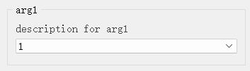
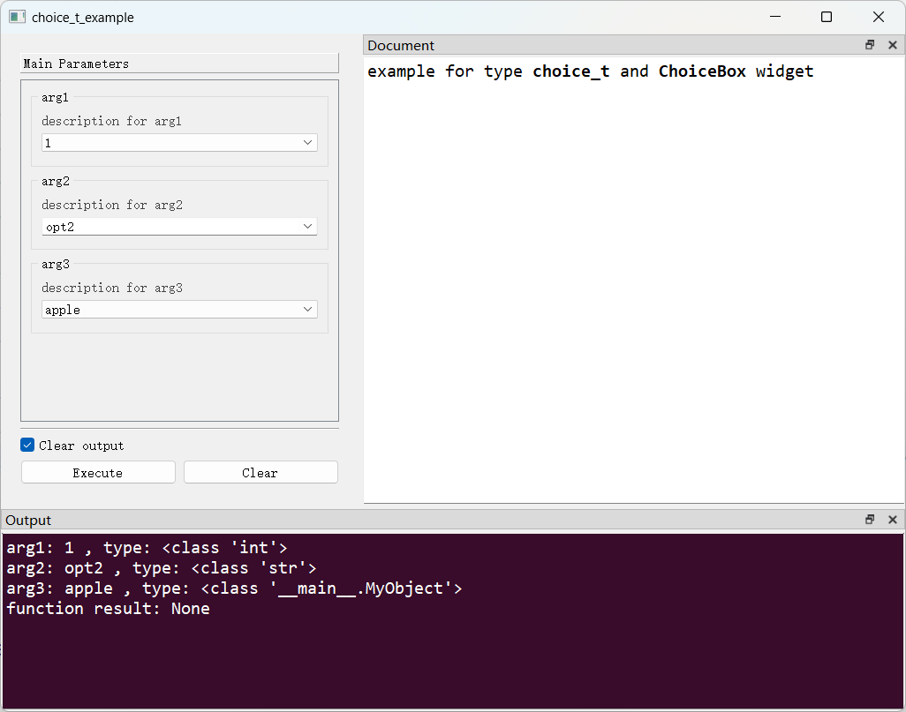

# `ChoiceBox`控件

## 一、控件类型：`ChoiceBox`

> 源码: [`pyguiadapter/widgets/extend/choicebox.py`]()



该类型扩展自`object`，`PyGUIAdapter`为该类型提供了一个下拉选择框，用户可以从一组选项中选择其中一个。

## 二、配置类型：`ChoiceBoxConfig`

> 源码: [`pyguiadapter/widgets/extend/choicebox.py`]()

```python
@dataclasses.dataclass(frozen=True)
class ChoiceBoxConfig(CommonParameterWidgetConfig):
    default_value: Any | None = _FIRST_ITEM
    choices: Dict[str, Any] | List[Any] = dataclasses.field(default_factory=list)
    editable: bool = False

    @classmethod
    def target_widget_class(cls) -> Type["ChoiceBox"]:
        return ChoiceBox

```

| 配置项名称      | 类型                          | 默认值         | 说明                                                         |
| --------------- | ----------------------------- | -------------- | ------------------------------------------------------------ |
| `default_value` | `Any \| None`                 | ` _FIRST_ITEM` | 控件的默认值，默认为一个特殊的值`_FIRST_ITEM`，意为将第一个选项作为默认值。 |
| `choices`       | `Dict[str, Any] \| List[Any]` | `[]`           | 所有可选的选项。                                             |
| `editable`      | `bool`                        | `False`        | 指示下拉框是否可编辑，若为`True`，则用户可以在允许时输入预先提供的可选项以为的值。默认为`False`，即不可编辑。 |

## 三、示例

> 源码：[examples/widgets/choice_t_example.py]()

```python
from pyguiadapter.adapter import GUIAdapter
from pyguiadapter.adapter.ucontext import uprint
from pyguiadapter.types import choice_t, choices_t
from pyguiadapter.widgets import ChoiceBoxConfig


class MyObject(object):
    def __init__(self, name: str):
        self.name = name

    def __eq__(self, other):
        if not isinstance(other, MyObject):
            return False
        return self.name == other.name

    def __hash__(self):
        return hash(self.name)

    def __str__(self):
        # this method is very important
        # the return value will be displayed as the ChoiceBox's item
        return self.name


def choice_t_example(arg1: choice_t, arg2: choice_t, arg3: choices_t):
    """
    example for type **choice_t** and **ChoiceBox** widget

    @param arg1: description for arg1
    @param arg2: description for arg2
    @param arg3: description for arg3
    @return:

    @params
    [arg1]
    choices = [1,2,3,4]

    @end
    """
    uprint("arg1:", arg1, f", type: {type(arg1)}")
    uprint("arg2:", arg2, f", type: {type(arg2)}")
    uprint("arg3:", arg3, f", type: {type(arg3)}")


if __name__ == "__main__":
    arg2_conf = ChoiceBoxConfig(
        default_value="opt2", choices=["opt1", "opt2", "opt3", "opt4"], editable=True
    )
    arg3_conf = ChoiceBoxConfig(
        choices=[MyObject("apple"), MyObject("banana"), MyObject("orange")]
    )

    adapter = GUIAdapter()
    adapter.add(
        choice_t_example,
        widget_configs={
            "arg2": arg2_conf,
            "arg3": arg3_conf,
        },
    )
    adapter.run()

```



---

[参数数据类型及其对应控件](widgets/types_and_widgets.md)