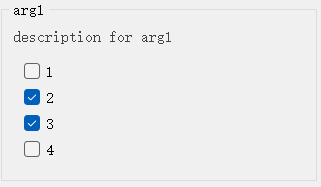
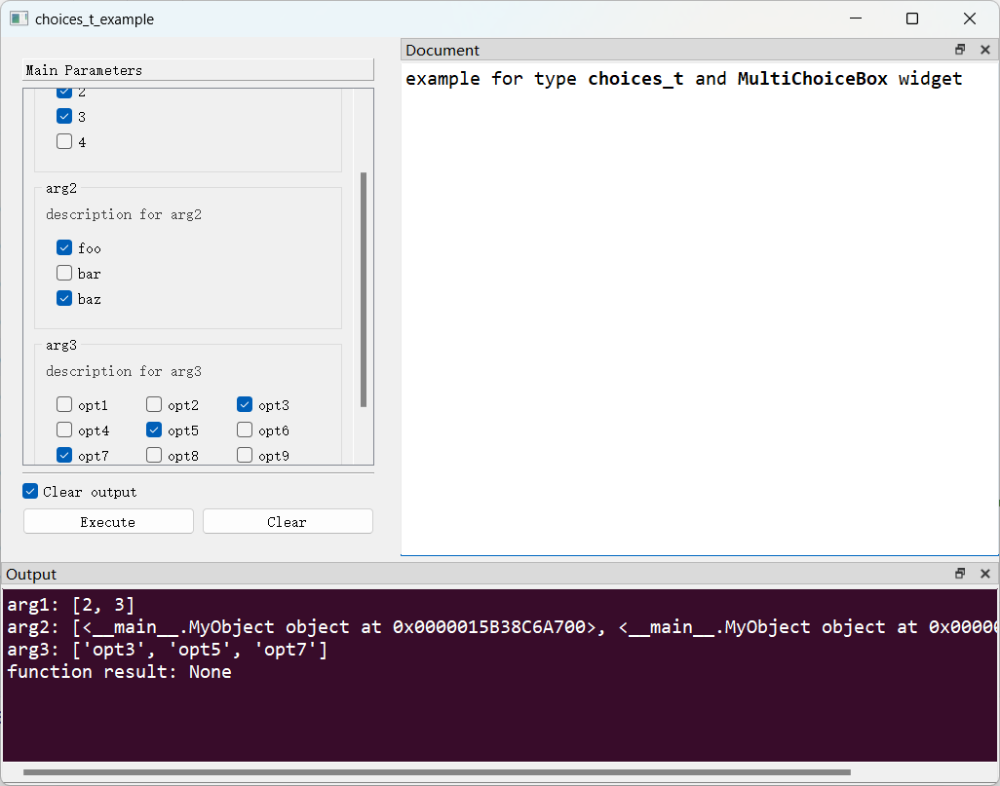

# `MultiChoiceBox`控件

## 一、控件类型：`MultiChoiceBox`

> 源码: [`pyguiadapter/widgets/extend/multichoice.py`]()



该类型扩展自`list`，用于从一组对象中选择多个对象。

## 二、配置类型：`MultiChoiceBoxConfig`

> 源码: [`pyguiadapter/widgets/extend/multichoice.py`]()

```python
@dataclasses.dataclass(frozen=True)
class MultiChoiceBoxConfig(CommonParameterWidgetConfig):
    default_value: List[Any] | None = dataclasses.field(default_factory=list)
    choices: List[Any] | Dict[str, Any] = dataclasses.field(default_factory=list)
    columns: int = 1

    @classmethod
    def target_widget_class(cls) -> Type["MultiChoiceBox"]:
        return MultiChoiceBox

```

| 配置项名称      | 类型                          | 默认值 | 说明                                                         |
| --------------- | ----------------------------- | ------ | ------------------------------------------------------------ |
| `default_value` | `List[Any] \| None`           | `[]`   | 控件的默认值。                                               |
| `choices`       | `List[Any] \| Dict[str, Any]` | `[]`   | 所有可选项。                                                 |
| `columns`       | `int`                         | `1`    | 每行显示的可选项的列数。默认为`1`，每行1列可选项，即每个可选项独占一行。 |

## 三、示例

> 源码：[examples/widgets/MultiChoiceBox_example.py]()

```python
from pyguiadapter.adapter import GUIAdapter
from pyguiadapter.adapter.ucontext import uprint
from pyguiadapter.extend_types import choices_t
from pyguiadapter.widgets import MultiChoiceBoxConfig


class MyObject(object):
    def __init__(self, name: str):
        self.name = name

    def __eq__(self, other):
        if not isinstance(other, MyObject):
            return False
        return self.name == other.name

    def __hash__(self):
        return hash(self.name)

    def __str__(self):
        # this method is very important
        # the return value will be displayed as the ChoiceBox's item
        return self.name


def choices_t_example(arg1: choices_t, arg2: choices_t, arg3: choices_t):
    """
    example for type **choices_t** and **MultiChoiceBox** widget

    @param arg1: description for arg1
    @param arg2: description for arg2
    @param arg3: description for arg3

    @params
    [arg1]
    default_value = [2,3]
    choices = [1,2,3,4]
    @end
    """
    uprint("arg1:", arg1)
    uprint("arg2:", arg2)
    uprint("arg3:", arg3)


if __name__ == "__main__":
    arg2_conf = MultiChoiceBoxConfig(
        choices=[MyObject("foo"), MyObject("bar"), MyObject("baz")],
    )
    arg3_conf = MultiChoiceBoxConfig(
        default_value=["opt3"],
        choices=[
            "opt1",
            "opt2",
            "opt3",
            "opt4",
            "opt5",
            "opt6",
            "opt7",
            "opt8",
            "opt9",
            "opt10",
        ],
        columns=3,
    )
    adapter = GUIAdapter()
    adapter.add(
        choices_t_example, widget_configs={"arg2": arg2_conf, "arg3": arg3_conf}
    )
    adapter.run()

```



---

[参数数据类型及其对应控件](widgets/types_and_widgets.md)