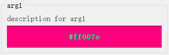
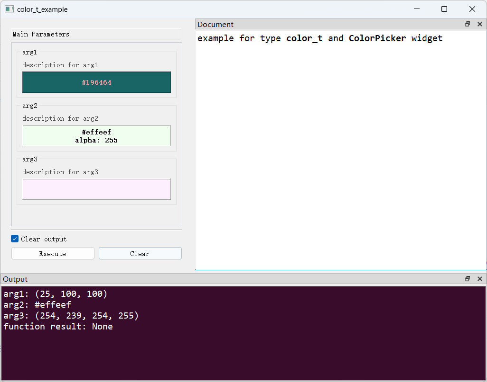

# `ColorPicker`控件

## 一、控件类型：`ColorPicker`

> 源码: [`pyguiadapter/widgets/extend/colorpicker.py`]()



`color_t`扩展自`object`，实际支持的类型包括`tuple`（3元素或4元素元组）、`str`、`QColor`，发者可以选择颜色的表示方式。`PyGUIAdapter`为该类型提供了一个颜色选择器。

## 二、配置类型：`ColorPickerConfig`

> 源码: [`pyguiadapter/widgets/extend/colorpicker.py`]()

```python
@dataclasses.dataclass(frozen=True)
class ColorPickerConfig(CommonParameterWidgetConfig):
    default_value: ColorType | None = "white"
    initial_color: ColorType = "white"
    alpha_channel: bool = True
    display_color_name: bool = True
    min_height: int = 45
    max_height: int = 45
    return_type: Literal["tuple", "QColor", "str"] = "tuple"

    @classmethod
    def target_widget_class(cls) -> Type["ColorPicker"]:
        return ColorPicker

```

| 配置项名称           | 类型                                | 默认值    | 说明                                   |
| -------------------- | ----------------------------------- | --------- | -------------------------------------- |
| `default_value`      | `ColorType \| None`                 | `white`   | 控件的默认值，默认为`white`。          |
| `initial_color`      | `ColorType`                         | `white`   | 控件显示的初始颜色，默认为`white`。    |
| `alpha_channel`      | `bool`                              | `True`    | 是否启用alpha通道。                    |
| `display_color_name` | `bool`                              | `True`    | 是否在控件上显示颜色名称（16进制值）。 |
| `min_height`         | `int`                               | `45`      | 控件的最小高度。                       |
| `max_height`         | `int`                               | `45`      | 控件的最大高度。                       |
| `return_type`        | `Literal['tuple', 'QColor', 'str']` | `"tuple"` | 从控件获取值时，以何种形式表示颜色值。 |

## 三、示例

> 源码：[examples/widgets/color_t_example.py]()

```python
from pyguiadapter.adapter import GUIAdapter
from pyguiadapter.adapter.ucontext import uprint
from pyguiadapter.types import color_t
from pyguiadapter.widgets import ColorPickerConfig


def color_t_example(arg1: color_t, arg2: color_t, arg3: color_t = "red"):
    """
    example for type **color_t** and **ColorPicker** widget

    @param arg1: description for arg1
    @param arg2: description for arg2
    @param arg3: description for arg3

    @params
    [arg1]
    default_value = [25, 100, 100]
    alpha_channel = false
    return_type = "tuple"
    @end
    """
    uprint("arg1:", arg1)
    uprint("arg2:", arg2)
    uprint("arg3:", arg3)


if __name__ == "__main__":
    arg2_conf = ColorPickerConfig(default_value="#effeef", return_type="str")
    arg3_conf = ColorPickerConfig(
        default_value="#feeffe", display_color_name=False, return_type="tuple"
    )
    adapter = GUIAdapter()
    adapter.add(
        color_t_example,
        widget_configs={
            "arg2": arg2_conf,
            "arg3": arg3_conf,
        },
    )
    adapter.run()
```



---

[参数数据类型及其对应控件](widgets/types_and_widgets.md)