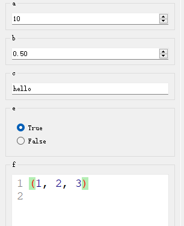
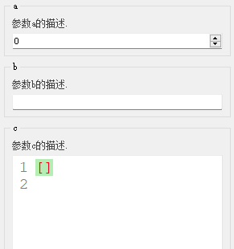
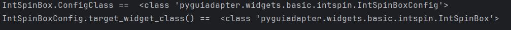
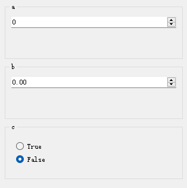
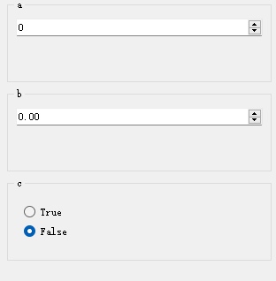
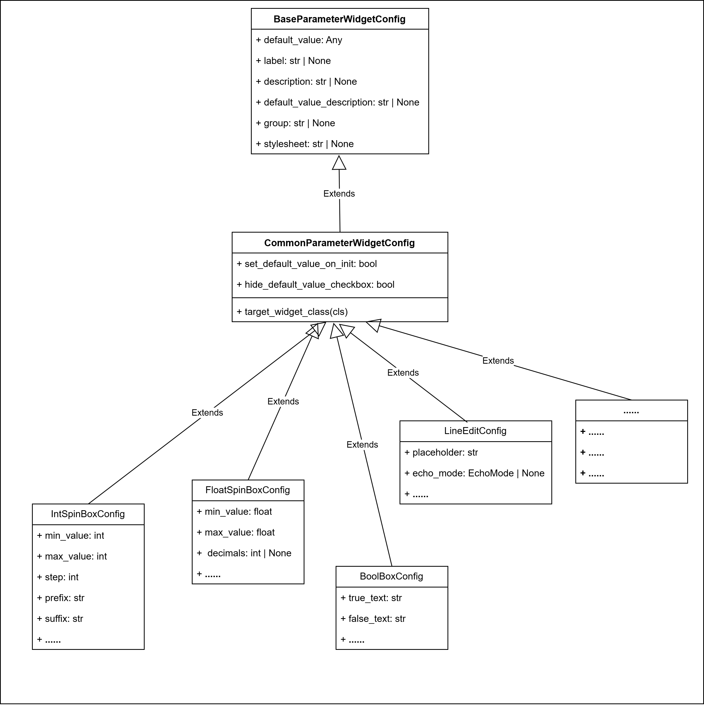
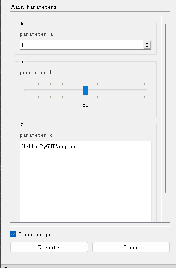
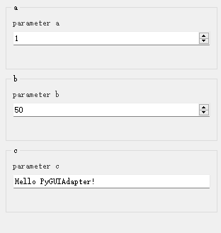

## 配置函数参数控件

### 一、参数控件类型的决定

#### （一）一般规则：充分利用函数参数类型信息

一般而言，函数参数所对应的输入控件的类型由该参数的类型决定，而函数参数的类型则使用Python类型标注来确定。

```python
def f1(a: str, b: int, c: float):
    pass
```

例如，在上面的函数`f1`中，参数`a`、`b`、`c`的类型分别被标注为`str`、`int`、`float`。在运行时，`PyGUIAdapter`将读取这一信息，分别为`a`、`b`、`c`生成`LineEdit`、`IntSpinBox`、`FloatSpinBox`，作为其输入控件。

>  

也就是说，在`PyGUIAdapter`内部，实现了一套映射机制，可以将特定的数据类型与特定的控件类型关联起来，借助这些映射关系，`PyGUIAdapter`便能按图索骥，快速知晓应当为一个参数创建何种控件。因此，对于`PyGUIAdapter`来说，给正确地为参数标注数据类型是至关重要的一步，类型标注不是那种可有可、无锦上添花的东西！

> `PyGUIAdapter`除了从函数参数的类型注解中获取参数的数据类型信息，它还实现了一些`“类型推断”`，比如，可以从函数参数的默认值中推断出其类型信息。
>
> ```python
> def f2(a=10, b=0.5, c="hello", e=True, f=(1, 2, 3)):
>     pass
> ```
>
> 
>
> 或者，通过文档字符串中参数的描述推断参数的类型信息。比如在下面的代码片段中，使用google风格在文档字符串中描述了函数`f3()`各参数的类型：
>
> ```python
> def f3(a, b, c):
>     """
>     这是一个示例函数.
> 
>     Args:
>         a (int): 参数a的描述.
>         b (str): 参数b的描述.
>         c (list): 参数c的描述.
> 
>     Returns:
>         bool: 函数返回的结果描述.
>     """
>     pass
> ```
>
> 
>
> 
>
> 但是，必须要指出的是，**所谓的`“类型推断”`机制仅仅是一种辅助的手段，并不总是准确，也不保证可靠，所以切勿过度依赖它。请记住，通过类型标注语法准确、明晰、无歧义地指明函数参数的类型，永远是更优的选择。**

`PyGUIAdapter`已经为Python的常用数据类型实现了对应的输入控件，基本上能够覆盖绝大多数需求。因此，一般情况下，开发者的主要职责就是正确地标注函数参数的类型。

> 关于`PyGUIAdapter`支持的数据类型及其所对应的控件，可以查看[这里](widgets/types_and_widgets.md)。


当然，如果内置的数据类型和控件无法满足需求，开发者需要处理更加复杂的数据类型，`PyGUIAdapter`也提供了`自定义控件类型`的接口。不仅如此，开发者可以在数据类型与自定义控件之间建立映射关系，这意味着，开发者可以像使用内置控件一样使用自定义控件——对于`PyGUIAdapter`而言，内置控件和自定义控件在使用上没有任何区别。

> 关于如何实现自定义控件，可以参考[这篇文档](widgets/custom_widget.md)。

#### （二）例外：手动指定参数的控件类型

虽然`PyGUIAdapter`推荐开发者使用类型注解的方式来确定函数参数的控件类型，同时它也提供了脱离类型注解手动指定参数控件的机制。其中，最简单的一种方法是在调用`GUIAdapter.add()`函数时，通过`widget_configs`参数指定参数的`控件配置类`。

每个类型的控件都有一个与之关联的`控件配置类`，控件配置类中不仅定义了关联控件类的属性，而且包含关联控件类本身的信息，通过控件配置类我们可以获取其关联的控件类（当然反过来也成立：通过控件类我们也可以访问到其关联的配置类）。

![img](data:image/png;base64,iVBORw0KGgoAAAANSUhEUgAAAjsAAADxCAYAAAAtOnagAAAAAXNSR0IArs4c6QAAE/d0RVh0bXhmaWxlACUzQ214ZmlsZSUyMGhvc3QlM0QlMjJhcHAuZGlhZ3JhbXMubmV0JTIyJTIwYWdlbnQlM0QlMjJNb3ppbGxhJTJGNS4wJTIwKFdpbmRvd3MlMjBOVCUyMDEwLjAlM0IlMjBXaW42NCUzQiUyMHg2NCklMjBBcHBsZVdlYktpdCUyRjUzNy4zNiUyMChLSFRNTCUyQyUyMGxpa2UlMjBHZWNrbyklMjBDaHJvbWUlMkYxMjguMC4wLjAlMjBTYWZhcmklMkY1MzcuMzYlMjBFZGclMkYxMjguMC4wLjAlMjIlMjB2ZXJzaW9uJTNEJTIyMjQuNy4xNCUyMiUyMHNjYWxlJTNEJTIyMSUyMiUyMGJvcmRlciUzRCUyMjAlMjIlM0UlMEElMjAlMjAlM0NkaWFncmFtJTIwbmFtZSUzRCUyMiVFNyVBQyVBQyUyMDElMjAlRTklQTElQjUlMjIlMjBpZCUzRCUyMmhHdHpoTXlqOUtqMU4yVFZCMHBDJTIyJTNFJTBBJTIwJTIwJTIwJTIwJTNDbXhHcmFwaE1vZGVsJTIwZHglM0QlMjIxNDI2JTIyJTIwZHklM0QlMjI3NDclMjIlMjBncmlkJTNEJTIyMSUyMiUyMGdyaWRTaXplJTNEJTIyMTAlMjIlMjBndWlkZXMlM0QlMjIxJTIyJTIwdG9vbHRpcHMlM0QlMjIxJTIyJTIwY29ubmVjdCUzRCUyMjElMjIlMjBhcnJvd3MlM0QlMjIxJTIyJTIwZm9sZCUzRCUyMjElMjIlMjBwYWdlJTNEJTIyMSUyMiUyMHBhZ2VTY2FsZSUzRCUyMjElMjIlMjBwYWdlV2lkdGglM0QlMjI4MjclMjIlMjBwYWdlSGVpZ2h0JTNEJTIyMTE2OSUyMiUyMG1hdGglM0QlMjIwJTIyJTIwc2hhZG93JTNEJTIyMCUyMiUzRSUwQSUyMCUyMCUyMCUyMCUyMCUyMCUzQ3Jvb3QlM0UlMEElMjAlMjAlMjAlMjAlMjAlMjAlMjAlMjAlM0NteENlbGwlMjBpZCUzRCUyMjAlMjIlMjAlMkYlM0UlMEElMjAlMjAlMjAlMjAlMjAlMjAlMjAlMjAlM0NteENlbGwlMjBpZCUzRCUyMjElMjIlMjBwYXJlbnQlM0QlMjIwJTIyJTIwJTJGJTNFJTBBJTIwJTIwJTIwJTIwJTIwJTIwJTIwJTIwJTNDbXhDZWxsJTIwaWQlM0QlMjJ0eWdFZ1JmeDA2dzJyY0tOMmtRdi0xMiUyMiUyMHZhbHVlJTNEJTIyJTIyJTIwc3R5bGUlM0QlMjJyb3VuZGVkJTNEMCUzQndoaXRlU3BhY2UlM0R3cmFwJTNCaHRtbCUzRDElM0IlMjIlMjB2ZXJ0ZXglM0QlMjIxJTIyJTIwcGFyZW50JTNEJTIyMSUyMiUzRSUwQSUyMCUyMCUyMCUyMCUyMCUyMCUyMCUyMCUyMCUyMCUzQ214R2VvbWV0cnklMjB4JTNEJTIyNjElMjIlMjB5JTNEJTIyMzAwJTIyJTIwd2lkdGglM0QlMjI1NzAlMjIlMjBoZWlnaHQlM0QlMjIyNDAlMjIlMjBhcyUzRCUyMmdlb21ldHJ5JTIyJTIwJTJGJTNFJTBBJTIwJTIwJTIwJTIwJTIwJTIwJTIwJTIwJTNDJTJGbXhDZWxsJTNFJTBBJTIwJTIwJTIwJTIwJTIwJTIwJTIwJTIwJTNDbXhDZWxsJTIwaWQlM0QlMjJ0eWdFZ1JmeDA2dzJyY0tOMmtRdi00JTIyJTIwdmFsdWUlM0QlMjIlMjIlMjBzdHlsZSUzRCUyMmVkZ2VTdHlsZSUzRG9ydGhvZ29uYWxFZGdlU3R5bGUlM0Jyb3VuZGVkJTNEMCUzQm9ydGhvZ29uYWxMb29wJTNEMSUzQmpldHR5U2l6ZSUzRGF1dG8lM0JodG1sJTNEMSUzQiUyMiUyMGVkZ2UlM0QlMjIxJTIyJTIwcGFyZW50JTNEJTIyMSUyMiUyMHNvdXJjZSUzRCUyMnR5Z0VnUmZ4MDZ3MnJjS04ya1F2LTElMjIlMjB0YXJnZXQlM0QlMjJ0eWdFZ1JmeDA2dzJyY0tOMmtRdi0zJTIyJTNFJTBBJTIwJTIwJTIwJTIwJTIwJTIwJTIwJTIwJTIwJTIwJTNDbXhHZW9tZXRyeSUyMHJlbGF0aXZlJTNEJTIyMSUyMiUyMGFzJTNEJTIyZ2VvbWV0cnklMjIlMjAlMkYlM0UlMEElMjAlMjAlMjAlMjAlMjAlMjAlMjAlMjAlM0MlMkZteENlbGwlM0UlMEElMjAlMjAlMjAlMjAlMjAlMjAlMjAlMjAlM0NteENlbGwlMjBpZCUzRCUyMnR5Z0VnUmZ4MDZ3MnJjS04ya1F2LTElMjIlMjB2YWx1ZSUzRCUyMiVFNiU4RSVBNyVFNCVCQiVCNiVFNyVCMSVCQiUyNmx0JTNCZGl2JTI2Z3QlM0IlRUYlQkMlODhXaWRnZXQlMjBDbGFzcyVFRiVCQyU4OSUyNmx0JTNCJTJGZGl2JTI2Z3QlM0IlMjIlMjBzdHlsZSUzRCUyMnJvdW5kZWQlM0QwJTNCd2hpdGVTcGFjZSUzRHdyYXAlM0JodG1sJTNEMSUzQiUyMiUyMHZlcnRleCUzRCUyMjElMjIlMjBwYXJlbnQlM0QlMjIxJTIyJTNFJTBBJTIwJTIwJTIwJTIwJTIwJTIwJTIwJTIwJTIwJTIwJTNDbXhHZW9tZXRyeSUyMHglM0QlMjIxMTAlMjIlMjB5JTNEJTIyMzgwJTIyJTIwd2lkdGglM0QlMjIxMjAlMjIlMjBoZWlnaHQlM0QlMjI2MCUyMiUyMGFzJTNEJTIyZ2VvbWV0cnklMjIlMjAlMkYlM0UlMEElMjAlMjAlMjAlMjAlMjAlMjAlMjAlMjAlM0MlMkZteENlbGwlM0UlMEElMjAlMjAlMjAlMjAlMjAlMjAlMjAlMjAlM0NteENlbGwlMjBpZCUzRCUyMnR5Z0VnUmZ4MDZ3MnJjS04ya1F2LTglMjIlMjBzdHlsZSUzRCUyMmVkZ2VTdHlsZSUzRG9ydGhvZ29uYWxFZGdlU3R5bGUlM0Jyb3VuZGVkJTNEMCUzQm9ydGhvZ29uYWxMb29wJTNEMSUzQmpldHR5U2l6ZSUzRGF1dG8lM0JodG1sJTNEMSUzQmV4aXRYJTNEMCUzQmV4aXRZJTNEMC43NSUzQmV4aXREeCUzRDAlM0JleGl0RHklM0QwJTNCZW50cnlYJTNEMSUzQmVudHJ5WSUzRDAuNzUlM0JlbnRyeUR4JTNEMCUzQmVudHJ5RHklM0QwJTNCJTIyJTIwZWRnZSUzRCUyMjElMjIlMjBwYXJlbnQlM0QlMjIxJTIyJTIwc291cmNlJTNEJTIydHlnRWdSZngwNncycmNLTjJrUXYtMyUyMiUyMHRhcmdldCUzRCUyMnR5Z0VnUmZ4MDZ3MnJjS04ya1F2LTElMjIlM0UlMEElMjAlMjAlMjAlMjAlMjAlMjAlMjAlMjAlMjAlMjAlM0NteEdlb21ldHJ5JTIwcmVsYXRpdmUlM0QlMjIxJTIyJTIwYXMlM0QlMjJnZW9tZXRyeSUyMiUyMCUyRiUzRSUwQSUyMCUyMCUyMCUyMCUyMCUyMCUyMCUyMCUzQyUyRm14Q2VsbCUzRSUwQSUyMCUyMCUyMCUyMCUyMCUyMCUyMCUyMCUzQ214Q2VsbCUyMGlkJTNEJTIydHlnRWdSZngwNncycmNLTjJrUXYtMyUyMiUyMHZhbHVlJTNEJTIyJUU2JThFJUE3JUU0JUJCJUI2JUU5JTg1JThEJUU3JUJEJUFFJUU3JUIxJUJCJTI2bHQlM0JkaXYlMjZndCUzQiVFRiVCQyU4OFdpZGdldCUyMENvbmZpZyUyMENsYXNzJUVGJUJDJTg5JTI2bHQlM0IlMkZkaXYlMjZndCUzQiUyMiUyMHN0eWxlJTNEJTIyd2hpdGVTcGFjZSUzRHdyYXAlM0JodG1sJTNEMSUzQnJvdW5kZWQlM0QwJTNCJTIyJTIwdmVydGV4JTNEJTIyMSUyMiUyMHBhcmVudCUzRCUyMjElMjIlM0UlMEElMjAlMjAlMjAlMjAlMjAlMjAlMjAlMjAlMjAlMjAlM0NteEdlb21ldHJ5JTIweCUzRCUyMjQ1MCUyMiUyMHklM0QlMjIzODAlMjIlMjB3aWR0aCUzRCUyMjE2MCUyMiUyMGhlaWdodCUzRCUyMjYwJTIyJTIwYXMlM0QlMjJnZW9tZXRyeSUyMiUyMCUyRiUzRSUwQSUyMCUyMCUyMCUyMCUyMCUyMCUyMCUyMCUzQyUyRm14Q2VsbCUzRSUwQSUyMCUyMCUyMCUyMCUyMCUyMCUyMCUyMCUzQ214Q2VsbCUyMGlkJTNEJTIydHlnRWdSZngwNncycmNLTjJrUXYtNSUyMiUyMHZhbHVlJTNEJTIyJTI2bHQlM0JzcGFuJTIwc3R5bGUlM0QlMjZxdW90JTNCY29sb3IlM0ElMjByZ2IoMTE5JTJDJTIwMTE5JTJDJTIwMTE5KSUzQiUyMGZvbnQtZmFtaWx5JTNBJTIwJTI2YW1wJTNCcXVvdCUzQkx1Y2lkYSUyMENvbnNvbGUlMjZhbXAlM0JxdW90JTNCJTJDJTIwQ29uc29sYXMlMkMlMjBDb3VyaWVyJTJDJTIwbW9ub3NwYWNlJTNCJTIwZm9udC1zaXplJTNBJTIwMTQuNHB4JTNCJTIwb3JwaGFucyUzQSUyMDQlM0IlMjB0ZXh0LWFsaWduJTNBJTIwbGVmdCUzQiUyMHdoaXRlLXNwYWNlLWNvbGxhcHNlJTNBJTIwcHJlc2VydmUlM0IlMjBiYWNrZ3JvdW5kLWNvbG9yJTNBJTIwcmdiKDI0MyUyQyUyMDI0NCUyQyUyMDI0NCklM0IlMjZxdW90JTNCJTI2Z3QlM0JDb25maWdDbGFzcyUyNmx0JTNCJTJGc3BhbiUyNmd0JTNCJTIyJTIwc3R5bGUlM0QlMjJ0ZXh0JTNCaHRtbCUzRDElM0JhbGlnbiUzRGNlbnRlciUzQnZlcnRpY2FsQWxpZ24lM0RtaWRkbGUlM0J3aGl0ZVNwYWNlJTNEd3JhcCUzQnJvdW5kZWQlM0QwJTNCJTIyJTIwdmVydGV4JTNEJTIyMSUyMiUyMHBhcmVudCUzRCUyMjElMjIlM0UlMEElMjAlMjAlMjAlMjAlMjAlMjAlMjAlMjAlMjAlMjAlM0NteEdlb21ldHJ5JTIweCUzRCUyMjI4MCUyMiUyMHklM0QlMjIzODAlMjIlMjB3aWR0aCUzRCUyMjYwJTIyJTIwaGVpZ2h0JTNEJTIyMzAlMjIlMjBhcyUzRCUyMmdlb21ldHJ5JTIyJTIwJTJGJTNFJTBBJTIwJTIwJTIwJTIwJTIwJTIwJTIwJTIwJTNDJTJGbXhDZWxsJTNFJTBBJTIwJTIwJTIwJTIwJTIwJTIwJTIwJTIwJTNDbXhDZWxsJTIwaWQlM0QlMjJ0eWdFZ1JmeDA2dzJyY0tOMmtRdi02JTIyJTIwdmFsdWUlM0QlMjIlMjZsdCUzQnNwYW4lMjBzdHlsZSUzRCUyNnF1b3QlM0Jjb2xvciUzQSUyMHJnYigxMTklMkMlMjAxMTklMkMlMjAxMTkpJTNCJTIwZm9udC1mYW1pbHklM0ElMjAlMjZhbXAlM0JxdW90JTNCTHVjaWRhJTIwQ29uc29sZSUyNmFtcCUzQnF1b3QlM0IlMkMlMjBDb25zb2xhcyUyQyUyMENvdXJpZXIlMkMlMjBtb25vc3BhY2UlM0IlMjBmb250LXNpemUlM0ElMjAxNC40cHglM0IlMjBvcnBoYW5zJTNBJTIwNCUzQiUyMHRleHQtYWxpZ24lM0ElMjBsZWZ0JTNCJTIwd2hpdGUtc3BhY2UtY29sbGFwc2UlM0ElMjBwcmVzZXJ2ZSUzQiUyMGJhY2tncm91bmQtY29sb3IlM0ElMjByZ2IoMjQzJTJDJTIwMjQ0JTJDJTIwMjQ0KSUzQiUyNnF1b3QlM0IlMjZndCUzQnRhcmdldF93aWRnZXRfY2xhc3MoKSUyNmx0JTNCJTJGc3BhbiUyNmd0JTNCJTIyJTIwc3R5bGUlM0QlMjJ0ZXh0JTNCaHRtbCUzRDElM0JhbGlnbiUzRGNlbnRlciUzQnZlcnRpY2FsQWxpZ24lM0RtaWRkbGUlM0J3aGl0ZVNwYWNlJTNEd3JhcCUzQnJvdW5kZWQlM0QwJTNCZmxpcFYlM0QxJTNCZmxpcEglM0QwJTNCJTIyJTIwdmVydGV4JTNEJTIyMSUyMiUyMHBhcmVudCUzRCUyMjElMjIlM0UlMEElMjAlMjAlMjAlMjAlMjAlMjAlMjAlMjAlMjAlMjAlM0NteEdlb21ldHJ5JTIweCUzRCUyMjMxMCUyMiUyMHklM0QlMjI0MzAlMjIlMjB3aWR0aCUzRCUyMjYwJTIyJTIwaGVpZ2h0JTNEJTIyMjAlMjIlMjBhcyUzRCUyMmdlb21ldHJ5JTIyJTIwJTJGJTNFJTBBJTIwJTIwJTIwJTIwJTIwJTIwJTIwJTIwJTNDJTJGbXhDZWxsJTNFJTBBJTIwJTIwJTIwJTIwJTIwJTIwJTNDJTJGcm9vdCUzRSUwQSUyMCUyMCUyMCUyMCUzQyUyRm14R3JhcGhNb2RlbCUzRSUwQSUyMCUyMCUzQyUyRmRpYWdyYW0lM0UlMEElM0MlMkZteGZpbGUlM0UlMEE9S8N6AAAgAElEQVR4Xu3dfcgWVf7H8RPpaqYVPRgKabZsT2D0W/lttYWZWuRqT1srmVZGUVBZUERF+EcZPfxRUFZEDz81TENyK62NIBW1tnCTKEXRhU0LDLU/NK3sAfzxHTjXnnucueaa+57vNWfOeV//ZPc917nOeZ0zM5/7zJm5DjPGHDS8EEAAAQQQQACBQAUOk7Bz8CB5J9D+pVkIIIAAAghELXDYYYcZwk7UQ4DGI4AAAgggELYAYSfs/qV1CCCAAAIIRC9A2Il+CACAAAIIIIBA2AKEnbD7l9YhgAACCCAQvQBhJ/ohAAACCCCAAAJhCxB2wu5fWocAAggggED0AoSd6IcAAAgggAACCIQtQNgJu39pHQIIIIAAAtELEHaiHwIAIIAAAgggELYAYSfs/qV1CCCAAAIIRC9A2Il+CACAAAIIIIBA2AKEnbD7l9YhgAACCCAQvQBhJ/ohAAACCCCAAAJhCxB2wu5fWocAAggggED0AoSd6IcAAAgggAACCIQtQNgJu39pHQIIIIAAAtELEHaiHwIAIIAAAgggELYAYSfs/qV1CCCAAAIIRC9A2Il+CACAAAIIIIBA2AKEnbD7l9YhgAACCCAQvQBhJ/ohAAACCCCAAAJhCxB2wu5fWocAAggggED0AoSd6IcAAAgggAACCIQtQNgJu39pHQIIIIAAAtELEHaiHwIAIIAAAgggELYAYSfs/qV1CCCAAAIIRC9A2Il+CACAAAIIIIBA2AKEnbD7l9YhgAACCCAQvQBhJ/ohAAACCCCAAAJhCxB2wu5fWocAAggggED0AoSd6IcAAAgggAACCIQtQNgJu39pHQIIIIAAAtELEHaiHwIAIIAAAgggELYAYSfs/qV1CCCAAAIIRC9A2Il+CACAAAIIIIBA2AKEnbD7l9YhgAACCCAQvQBhJ/ohAAACCCCAAAJhCxB2wu5fWocAAggggED0AoSd6IcAAAgggAACCIQtQNgJu39pHQIIIIAAAtELEHaiHwIAIIAAAgggELYAYSfs/qV1CCCAAAIIRC9A2Il+CACAAAIIIIBA2AKEnbD7l9YhgAACCCAQvQBhJ/ohAAACCCCAAAJhCxB2wu5fWocAAggggED0AoSd6IcAAAgggAACCIQtQNgJu39pHQIIIIAAAtELEHaiHwIAIIAAAgggELYAYSfs/qV1CCCAAAIIRC9A2Il+CACAAAIIIIBA2AKEnbD7l9YhgAACCCAQvQBhJ/ohAAACCCCAAAJhCxB2wu5fWocAAggggED0AoSd6IcAAAgggAACCIQtQNgJu39pHQIIIIAAAtELEHaiHwIAIIAAAgggELYAYSfs/qV1CCCAAAIIRC9A2Il+CACAAAIIIIBA2AKEnbD7l9YhgAACCCAQvQBhJ/ohAAACCCCAAAJhCxB2wu5fWocAAggggED0AoSd6IcAAAgggAACCIQtQNgJu39pHQIIIIAAAtELEHaiHwIAIIAAAgggELYAYSfs/qV1CCCAAAIIRC9A2Il+CACAAAIIIIBA2AKEnbD7l9YhgAACCCAQvQBhJ/ohAAACCCCAAAJhCxB2wu5fWocAAggggED0AoSd6IcAAAgggAACCIQtQNgJu39pHQIIIIAAAtELEHaiHwIAIIAAAgggELYAYSfs/qV1CCCAAAIIRC9A2Il+CACAAAIIIIBA2AKEnbD7l9YhgAACCCAQvQBhJ/ohAAACCCCAAAJhCxB2wu5fWocAAggggED0AsGEHWkIr7AFDh48GHYDaR0CnghwPPWkIyKuRtXH+6DCTtU4EY8z75ouA5X+9a5bqFCgAuxvgXZsQ5qlMf4IOw3p/NirqTH4Yzel/QjkCbC/MTbqFNAYf4SdOnuUz+5YQGPwd/zhbIhAZALsb5F1uGfN1Rh/hB3POpnqZAtoDH6sEUCA/Y0x4J+AxvGesONfP1OjDAGNwQ80AggQdhgD/gloHO8JO/71MzUi7DAGEKhVQONkU2uD+PBGCWiMP8JOo4ZAvJXVGPzxatJyBNoLsL8xQuoU0Bh/hJ06e5TP7lhAY/B3/OHGmP0//FBm88q2XbJkidm6ZUurvD+ff74ZP3586/83bNhg3nn7bZP+eRUV+Pnnn83rCxeaHTt25H5+FZ/TSRmDjzyyk83YpiKBuve3ippBMQ0V0Bh/hJ2GDobYqq0x+MsY1hF2JMisXLHCzLzpJnP00UdnVlcz7LgfuHfvXjN/3jwz+qyzeoStMoZ92Zaw0xe98u+te38rX2PeEZKAxvgj7IQ0QgJui8bgL8Nlw44NF+57r7jySjN69OgyxXW0rczqyGvq1Kkdbd+bjTptD2GnN7rNfU/d+1tz5ah5FQIa44+wU0XPUIa6gMbgL1NpCTsSPr76z3/MtOuuMyNGjEjeLpd6Dhw4kDvzUuYz0ttqh50y7SHs9KUnm/feuve35olR4yoFNMYfYafKHqIsNQGNwV+msp98+mmyNqZoFidrnYv7nq+//tr8felSM3nyZLN27drWehh3zU16nY6tZ//+/ZOgdeKJJx6yliarXum6yOzTtm3bzPgJE5IiO2mP/ex2YWflypXmnx9/3OK09XQDYXrtz/Dhw830GTPMgAEDkveJy+JFi8yvv/7aKsc14TJWmdHa923r3t/63gJKaLKAxvgj7DR5RERUd43BX4Zv2fLlZttXX/U4Qaffb8OF/NyeyO1lIhtG3JO6/Zls84/33usxYyRldDKzY8v7y+TJPS6lZdXFhij53N27dxe2x21fu7Dz761bzYiRI5PgYj938JAhrctvRe2wZUsIy7scSNgpM1r7vm3d+1vfW0AJTRbQGH+EnSaPiIjqrjH4y/D937x5Zv++fW3DTlbwSJ/8s7axsz1/vfrq1uWxvoadvM+R2RMJRps3by5sT6dhJ+0o4ca1sjM/ebNi1mjfvn25i7EJO2VGa9+3rXt/63sLKKHJAhrjj7DT5BERUd01Bn8Zvk7CTrsZGnvy37lzZ3IZyw02GmEnqy5uAKoy7NiZGQkr9pW+TGXDm9xGn77MZd/jlpN+P2GnzGjt+7Z17299bwElNFlAY/wRdpo8IiKqu8bgL8PXyZqdTmd2uhF2sgKUWz9pexVrdrIub6VndtLOMtPzr3XrDrlsZ7fLugRH2CkzWvu+bd37W99bQAlNFtAYf4SdGkbE+vXrzfz5883cuXNbny4/mzNnjlm4cKEZPHjwIbVavny52bRpk7n//vtbv5Ofvfnmm2bBggU9tpefX3vttWbNmjVmzJgxZtasWWbmzJnJv7/99lszadIk8+qrryb/35SXxuAv03Z7N5bMTBRdjpFy263Z6UbYsSFk2PDhydoZd7Gyrb+7hqfo1vm8NTvpgJcOKmLx9fbt5g+nntrilrCz4csvW5esdu3alfxu6NChyX+z1v0QdsqM1r5vW/f+1vcW/LcEzePtjTfeaF577bVDqnvFFVeYPXv2mNWrVye/GzRoUHI8Pu2008yUKVNaP89r54UXXmjefffd5FwQ4vG8qH81xh9hp0hd4fdZO598jOw4Z555Zo9AYz/eDSz23/Jk26ywI+958sknzfvvv5/sMA8++GASduTSwLnnnmuuv/56c8cdd5hhw4YptE6nSI3BX6am7Z6z49411OndWNqXsZKQ4dzhJJeOxo4dmxxw3cXMWc/ZyXoac6d3Y7mfM3DgQHPd9Olm+bJlPZ7CnL6MlXUnFpexyozO6rete3+rskXdON7Ksfu8884zn3zyiXn++ecP+YPVHrMl7Mix94knnjBDhgxp/VvaO23aNLN48eKk6Q888ECPckI7nhf1r8b4I+wUqVf4+/379/dI9XJr7qhRo3JT/rJly8xll11m3FkfWRdhd4RVq1blhh232m5QqrA5XS1KY/CXaUAdT1AuU79Ots1bG9TJe+vehpmd7vZA3ftbFa3txvFWZl0uv/zyQ6orYcadhXfDTtmZnXThIRzPi/pXY/wRdorUFX7v/qUhfxFcc801SahxX5LkZZZHfi7/lktYcrkqb+eS98oOJttlTatmNSO9Qyo0tbIiNQZ/mcqFEHaK1tKU8ej2toSd7orXvb9V2VrN460co2V2/aijjjKXXHJJ8u+TTjopmbXJCjtZSwfcY3263XmXyZp+PC/qX43xR9gpUlf4fXpa1V1H8+GHH5oXXnjBfPrpp8llJvmdXHoaN25cMq05Y8YMM3v27GS9Td6aHamyfd/tt9/eCkA33HDDIet7FJqnUqTG4C9T0SaGnfTDCbPukCpjUOe2hJ3u6te9v1XZWs3jrRyDZf2jvG6++eZW2JH//+ijjw5ZsyPHd5mZ7+TlHq9DO54XtV9j/BF2itQVfi87n6yfkNfFF19sPv/881a4cYPKc889lwQVuQ4sfy3Iuht3YXM67LjTtnKJzAYm+5eDlO1OuTYp/GgMfoWupUgEghAIaX/TOt5KR9uZdllQ/PLLL5uJEycma+Ueeugh88033ySz7fJHa/omkfSaHHfQ2Nn+iy66qLXsIbTjedFOojH+CDtF6hX+3g0jNmjkXZayg/udd94xp59+ulm6dGmPu7fsjpa3QNmtdgjXeDUGf4VdS1EIBCUQwv7WjeNt1uy6/HEpayvdsOMODjtLI6Eo72XXa2b9PoTjedHOojH+CDtF6gq/b3d3QNb6Hbu9XBPOWgxnq3jBBRck/5Tp005erNnpRIltEIhPQONkU5ei1vFWZnPkzip5tEP6lZ7ZkYBjZ3Pcm0yyHjOSNbPTiV2TjudF7dEYf4SdInWF3/d253Ofy9PpzI785SE75LHHHpvcit6k281deo3Br9C1FIlAEAIh7W+ax9tOZ3bSd9TKOszezOyEcjwv2kk0xh9hp0hd4feaO5+trnstWZ61I39NyA4mL7uWR6FpakVqDH61ylIwAp4LPPXUU+bWW29N7hrKeoW0v2keb/OWIcjMzsaNGzNvJnFnedrN7Lh36IZ2PC/aPTTGH2GnSL3i39tbCWXKUW5bbHdZyq7rydtZ2y1Qdp/A6TbBvV6ct03FTa6kOI3BX0nFKASBBgrIAx8PHjxo5G7NRx555JDQE8r+pnm8zZtdlzU79uXeeSV3R8odtfapykXDxl2WENrxvKjtGuOPsFOkzu+9ENAY/F40jEogUIPAM888kzxZvV+/fua3334zt912W4/Qw/5WQ6fwkS0BjfFH2GGANUJAY/A3ouFUEgElgWOOOcbI14DISy5nuaFHHpInMz+8EKhDQON4T9ipoyf5zNICMlB5IYCArkDyvWXTpiVPYSfs6FpTer4AYafN6NDAYTD6I0D/+tMX1CQMAXdmR1p0xBFHJF9xcM899yRff0DYCaOfm9gKjeM9MztNHAkR1llj8EfISJMRSATsmp2ffvqpR8ixd2exvzFQ6hTQGH+EnYIelTue7rzzTrNixQpzyy23mHvvvbf1pZ32dkD3aZd2+5deein5Kynr2TayWl9+LreEZ916WDTI5O4s+R6WvOfmpJ/Q6a7kL3pv0Wfn/V7aLbez9rZNRZ+rMfiLPpPfIxCqwIABA4zsU7JIWWZy0rega+5voR1TeztG7Plj0KBB5tFHHzXytPyyx88Qj/XiqTH+CDttRqr7ICgJJXIbo9wubr/NVkLLokWLzNlnn936gk33G8rzitYMO+4Xxrn1tOFqy5YtbYNSb3dceZ+95dL9tt++lOe+V2PwV1U3ykGgaQJ1PWcnxGNqb/5greJ4GeqxnrBTcDTROBnax3bbhzu5sxdSHfkG8ksvvdS8+OKLrVkW+x75hml39sVN8fLln3v27ElSvH3YnzxNU2Zg5OfyLbryreb2C+x+/PFHY78rSz7XPn3T/XI4y5MVpOx3xMisVLpesr19FoT8hbFmzZrWN6rbZwC5n+M+RCv9+bLzyeLGxYsXV/6kZo3+bdoJivoi0C0Brf0txGOqnB+yjtXytHo5Xs6ePTvpti+++MLYY6z77efyPDX5miA7M97unOD2f6jHesJOl8NO1lMu3ZO5VEdO7PJNt/fdd18yoCVITJo0KQkr8rJhZ8eOHcm3nL/xxhvGfpOt/F7CjnyVg7wWLFiQzIzIA74kcEhZEmrkm89lZ5KDxPbt25P35M3O2FAjdcibXXEvY3322WfJJTr7RGX5DHnJAw9tOyR02Rkb2Smzfu5+VvpgVtXBWevgW1X9KAeBkAQ09rdQj6npGRb3WL1q1arkwbGy1MEe+0eOHNk63m/atCn5t/uHdN45QY7F9hXysZ6w0+Wwk/WdJ+4MiVTHfuO4DQMTJ040c+bMMQsXLuwRSCRUuOtZ7MB+5ZVXkkRvZ3Jkp7FhQgKSG0TckCK/y1qz49bPfdS4S9duzY69BJcOO/b9bv3cHS/914Zc6sv7/N6eEDQOvr2tC+9DIHQBjf0tlmOqHGOvuuoq89Zbb5n0cdxd5uD+u5NzQlbYcdeQpsdkU4/1hB0Pwo5UwX0UuD2p251YgosNQO5Ak2dWuAuS7cCWYDR9+vRkp5CBnA476a+SsFOg7qyR+8WeZdO+LEqcMmVKj8eXu19RIbNRcgktvcA56+e2e7TW7WgcfEM/YdE+BHoroLG/ZYWdEI6pdsG1nSFPH8fdP3SLwk67c0JfZnaadKwn7HgSdiTEPPvss8mTR+XSlQ0psu7lpJNOMuecc04yq5G+XNSbmZ28u5uKEnvWnV5Za4nSISxvcXWZn8u2zOz09hTD+xDwQ6CbYSekY6r88Zme2SkTdtrN9qdn0/NudGn6sZ6w0+Wwk75rwL2UI2t15IFccrlKVuLLjIq9ziqXgOyAt5ea5L12/U1v1+zIwH7hhReS9TV5l7Hkc/JW6Ge91w07dlHcuHHjzF133dXjMpl7mc69fJY1izNr1iwzc+bMJARW+dI4+FZZP8pCICQBjf0t1GOqPb7Ll6rK+sX0mp0yYafdOs70MTXUYz1hp8thRwKM3G1lZ2/cj7cLeWVhmXv5xp1RSc++uHcxPfTQQ2bjxo1JWHJX3ssanbVr12bejeXeKWUHuXy2nTp165d+9oJ715RbL7uTyp1gso08c0MWUcsOJ9/Oa+/Sci9juXdvpb+Jt667scRQnmsk1695IYBA3wU0wk6ox1TRbnc3Vtmw0+6ckO7ZEI/1hJ0uhx07gOfPn2/mzp3b96NHByWkr/128BavNtFar5M3+OWg8PTTT5vHH388cThw4IBXHlQGgaYKaIQdjqnlR4Ov5wTNYz1hp4awIx/Z1wcAtqu2XVC8evXqZDN39qb8blHvO7r5BGUbcqRv+vXrl3xbswSeu+++u14EPh2BQAS0wg7H1PYDpAnnBO1jPWGnprATyLGr8c2Qg+/333+fzOTYkCOhR15HH3108jBGXgggUI2AZtippoaUErKAxvjj6yJCHjEBtU0GqtwWL7f2y+3wvBBAQFeAbz3X9aX0fAHCTpvRoYHDYPRHoN3MznHHHWe+++47fypLTRBouADH04Z3YMOrrzH+mNlp+KCIpfru4M9asyNf2fHwww/HwkE7EVAV0DjZqFaYwoMS0Bh/hJ2ghki4jcka/Db0PPbYY+bwww/n8la43U/LuiygcbLpchP4uAYLaIw/wk6DB0RMVW83+HnOTkwjgbZ2Q0DjZNONevMZYQhojD/CThhjI/hWaAz+4NFoIAK9FGB/6yUcb6tEQGP8EXYq6RoK0RbQGPzadaZ8BJoqwP7W1J4Lo94a44+wE8bYCL4VGoM/eDQaiEAvBdjfegnH2yoR0Bh/hJ1KuoZCtAWqHPz7f/hBu7qNLn/v3r1m/rx5ZsiQIWb6jBlmwIABue2x246fMMGMHj26Ue3++eefzesLFyZfrGtffz7/fDN+/Hgv2rFy5Urzz48/NldceWVim/7/dCUHH3lkZfWucn+rrFIUFI2Axvgj7EQzfJrd0CoHP2Gn/ViIJey4CrbNo886q/awY0OY1C8dNuVLexcvWmRGnXKKmTp1ao+OJOw0+xhH7f8rUOXx3pZK2GGENUKgysEvYadpMxJLlixJ+il9gqu787QctcrN8/Ip7Ehf79+3L3dWLa+uhJ269wY+vyqBKo/3hJ2qeoVyuiJQ5eAn7FTXZVqhRKtc38OOzNz8felS89errzYjRozI7agNGzaYlStWmJk33ZR8N5y8CDvVjWtKqlegyuM9YafevuTTSwpUNfgPHDhgXnrppR7rNGxVTj3ttNbMSdZ6juHDh/f4a9vOtpxxxhnmnbffTopJbyM/k+22btmS/P7kk082v/zyizl51KjW5ZL0Z7ll2HUaaS5ZT+Oe6NpxSnBY9PrrZvKUKYecQOV3S99801x9zTVm/fr1yRqRLA+3fLc9spZk27Ztxl2zk25P1jY2zNgvc7X2We5F9Slqu6w/sp8j27r9bN/bbmYn3Qf9+/c30667roelayJlpvvHXn769ddfW9XNWh8kn7Xtq696tVaKsFPyoMLm3gpUdbx3G8hlLG+7m4qlB2pVX0zYycyOnHS/3r7d/OHUU5Nq2JPVXyZPbi3EtSc4G0527txp1qxebf42dWprUa9s8+2OHa1gYk+c9kRnT+6DhwxJglb6/61BXy5j2TL/909/SuruXibJqnNeHWxwy2qPXUSbtd7EOtlt0sEiK2hUMbPTbn1Leu9qF3b+vXWrGTFyZNKnWTZFAaVMWzrtZ1sPNzQTdjhmhiJA2GnTkxo4oQycENpRZf92EnY6ORn2Zm1F+qSadTlCTp4bvvyyx8xNpyfBvL6W9x9//PFmzJgxZvmyZcns0sSLL07WLm3evLnHWqC8sNNJKMkKhemfZYWDtGWZgJDX5izHvG3LrNlJ11X6UGb28u7ksp4yu9RuNq5dyEzXm7ATwlGNNuQJVHm8t58R1MwOQydsgW7O7IikPYm5qu4JrSiAZJ340yfVTi9TFX1WUc/L58g3w8slNwk3EnxOOOEEs3v37uS/7m3jeSfddu2xl7HE7B/vvdfjMk/6felLPrbu7uW7KsJOURh1zdqFnfQlN3lf1uVKty/tLFbWZ0joyXq/nTmT/xYtRO9G2CkaU/weAU2Bqo73wYUdTXTKDkugk5md9Ek762RYFECyTtidzOxkaRd9VlEPSeB47913k5PsKb//fbK5hJ4Bv/ud+Z8//rHH+pOimR13fU66jVkLbDuZ2cmbSevL83uqmNnJ6/d2d0vZkJwVeKSd7W4tL7okZp2yxlaVl7GKxhO/R6BpAsHM7DQNnvrWJyBhJ+svY7dG6ROlPWHLuhf70LmiANJu/YqdIbInrWHDh7f9a77Tk2Ceqv0c+b1cSpGXLNy1/2/v6HFPxnYdkS0z3R75uX0oX3o9jm2Pu+DYbpNlma53Uf90MnqqWLOTDmpZfSrhxp0ZSwflXbt2JdUdOnRo8t92l6t8uRurE1+2QaBJAoSdJvUWda1EwD5UMH2Zyr20kHWH1LBhw5I7luzdPEVhRyqbvgQyYcIEs27dOuM+vC7rDqT03TzpcrLuCGqHk7cQWt6TfnBdu5OxWw+pgyzYllug3RkY984j2Wbs2LFmzZo1ybY2FHRyaahd/3Q6EDr5HLefsh4q6F6ectszcODAJDh+8MEHrbvtbL3cWZ2sO7HyLmPJ+4suv+VdcmNmp9NRwXYxChB2Yuz1yNtc5xOUq1iL4nZf1sk83b11fwVCp7MVnQ7LrPCQfm/eJaROP6PO7Xx4gnKd7eezEdAQIOxoqFKm1wJ1hp0y60i8RixRuaKZihJFRbVp1ndj/WvdukOe8WNRmNmJanjQ2JIChJ2SYGzefIFuhp303VZlHgbYVOn03VbtLtk0tY0+1puw42OvUCdfBAg7vvQE9UAAAQQQQAABFQHCjgorhSKAAAIIIICALwKEHV96gnoggAACCCCAgIoAYUeFlUIRQAABBBBAwBcBwo4vPUE9EEAAAQQQQEBFgLCjwkqhCCCAAAIIIOCLAGHHl56gHggggAACCCCgIkDYUWGlUAQQQAABBBDwRYCw40tPUA8EEEAAAQQQUBEg7KiwUigCCCCAAAII+CJA2PGlJ6gHAggggAACCKgIEHZUWCkUAQQQQAABBHwRIOz40hPUAwEEEEAAAQRUBAg7KqwUigACCCCAAAK+CBB2fOkJ6oEAAggggAACKgKEHRVWCkUAAQQQQAABXwQIO770BPVAAAEEEEAAARUBwo4KK4UigAACCCCAgC8ChB1feoJ6IIAAAggggICKAGFHhZVCEUAAAQQQQMAXAcKOLz1BPRBAAAEEEEBARYCwo8JKoQgggAACCCDgiwBhx5eeoB4IIIAAAgggoCJA2FFhpVAEEEAAAQQQ8EWAsONLT1APBBBAAAEEEFARIOyosFIoAggggAACCPgiQNjxpSeoBwIIIIAAAgioCBB2VFgpFAEEEEAAAQR8ESDs+NIT1AMBBBBAAAEEVAQIOyqsFIoAAggggAACvggQdnzpCeqBAAIIIIAAAioChB0VVgpFAAEEEEAAAV8ECDu+9AT1QAABBBBAAAEVAcKOCiuFIoAAAggggIAvAoQdX3qCeiCAAAIIIICAigBhR4WVQhFAAAEEEEDAFwHCji89QT0QQAABBBBAQEWAsKPCSqEIIIAAAggg4IsAYceXnqAeCCCAAAIIIKAiQNhRYaVQBBBAAAEEEPBFgLDjS09QDwQQQAABBBBQESDsqLBSKAIIIIAAAgj4IkDY8aUnqAcCCCCAAAIIqAgQdlRYKRQBBBBAAAEEfBEg7PjSE9QDAQQQQAABBFQECDsqrBSKAAIIIIAAAr4IEHZ86QnqgQACCCCAAAIqAoQdFVYKRQABBBBAAAFfBAg7vvQE9UAAAQQQQAABFQHCjgorhSKAAAIIIICALwKEHV96gnoggAACCCCAgIoAYUeFlUIRQAABBBBAwBcBwo4vPUE9EEAAAQQQQEBFgLCjwkqhCCCAAAIIIOCLAGHHl56gHggggAACCCCgIkDYUWGlUAQQQAABBBDwRZqe9AsAAAJTSURBVICw40tPUA8EEEAAAQQQUBEg7KiwUigCCCCAAAII+CJA2PGlJ6gHAggggAACCKgIEHZUWCkUAQQQQAABBHwRIOz40hPUAwEEEEAAAQRUBAg7KqwUigACCCCAAAK+CBB2fOkJ6oEAAggggAACKgKEHRVWCkUAAQQQQAABXwQIO770BPVAAAEEEEAAARUBwo4KK4UigAACCCCAgC8ChB1feoJ6IIAAAggggICKAGFHhZVCEUAAAQQQQMAXAcKOLz1BPRBAAAEEEEBARYCwo8JKoQgggAACCCDgiwBhx5eeoB4IIIAAAgggoCJA2FFhpVAEEEAAAQQQ8EWAsONLT1APBBBAAAEEEFARIOyosFIoAggggAACCPgiQNjxpSeoBwIIIIAAAgioCBB2VFgpFAEEEEAAAQR8ESDs+NIT1AMBBBBAAAEEVAQIOyqsFIoAAggggAACvggQdnzpCeqBAAIIIIAAAioChB0VVgpFAAEEEEAAAV8ECDu+9AT1QAABBBBAAAEVAcKOCiuFIoAAAggggIAvAoQdX3qCeiCAAAIIIICAigBhR4WVQhFAAAEEEEDAFwHCji89QT0QQAABBBBAQEWAsKPCSqEIIIAAAggg4IsAYceXnqAeCCCAAAIIIKAiQNhRYaVQBBBAAAEEEPBFgLDjS09QDwQQQAABBBBQESDsqLBSKAIIIIAAAgj4IkDY8aUnqAcCCCCAAAIIqAgQdlRYKRQBBBBAAAEEfBEg7PjSE9QDAQQQQAABBFQEWmFHpXQKRQABBBBAAAEEPBD4f81X54f6hQ/nAAAAAElFTkSuQmCC)

> 例如，`IntSpinBox`控件类与其配置类`IntSpinBoxConfig`的关系如下：
>
> - `IntSpinBox.ConfigClass` == `IntSpinBoxConfig`
> - `IntSpinBoxConfig.target_widget_class()` == `IntSpinBox`
>
> 


因此，当开发者指定了某个参数的控件配置类对象，实际上也就同时指定了该参数所使用控件的类型。


比如，在下面的例子中，我们手动指定函数`foo()`的三个参数`a`、`b`、`c`的配置类对象：`IntSpinBoxConfig`、`FloatSpinBoxConfig`、`BoolBoxConfig`，这使得参数`a`、`b`、`c`将分别使用`IntSpinBox`、`FloatSpinBox`、`BoolBox`作为其输入控件。

```python
from pyguiadapter.adapter import GUIAdapter
from pyguiadapter.widgets import IntSpinBoxConfig, FloatSpinBoxConfig, BoolBoxConfig


def foo(a, b, c):
    pass


configs = {
    "a": IntSpinBoxConfig(),
    "b": FloatSpinBoxConfig(),
    "c": BoolBoxConfig(),
}

adapter = GUIAdapter()
adapter.add(foo, widget_configs=configs)
adapter.run()

```




除了在代码里指定参数的控件配置，也可以利用`PyGUIAdapter`提供了另一个机制做到这一点：**`PyGUIAdapter`将函数文档字符串（docstring）中`@params`标记与`@end`标记之间的文本块视为该函数的控件配置区，在该区域中，开发者可以使用TOML语法配置该函数的参数控件类型及其属性。**

```python
from pyguiadapter.adapter import GUIAdapter

def bar(a, b, c):
    """
    bar
    @param a:
    @param b:
    @param c:
    @return:

    @params
    [a]
    widget_class = "IntSpinBox"

    [b]
    widget_class = "FloatSpinBox"

    [c]
    widget_class = "BoolBox"

    @end
    """
    pass

adapter = GUIAdapter()
adapter.add(bar)
adapter.run()
```



> 如果开发者在`@params-@end`区域指定了控件配置的同时，又向`GUIAdapter.run()`传入了`widget_configs`，那么`PyGUIAdapter`会将两处配置合并，对于发生冲突的属性，将以`widget_configs`中的定义为准。

### 二、配置的控件属性

 控件的属性控制着控件的外观和行为，不同类型的控件既共享部分共有的属性，也拥有各自专属的属性。

> 例如：
>
> - 所有类型的控件`default_value`、`label`、`description`、`default_value_description`、`group`
>
> 、`stylesheet`等属性；
>
> - `IntSpinBox`额外定义了`min_value`、`display_integer_base`等属性；
> - `BoolBox`额外定义了`true_text`、`false_text`等属性；
> - `LineEdit`额外具有`echo_mode`、`placeholder`等属性；
> - ......

控件的属性定义在控件对应的配置类中，其中，公共属性来自共同的父类（基类）`BaseParameterWidgetConfig`，而独有属性则在各自的配置类子类中定义。

> 关于不同控件类型对应的配置类，可以参考[这里](widgets/types_and_widgets.md)。



开发者可以控件属性进行配置，以实现对控件更加精细化的控制，比如：设置数字输入的上下限，设置文本框的输入掩码等等。很多时候，合适的控件属性配置不仅可以提高用户体验，还可以增强程序的健壮性

> 合理配置控件属性为什么能增强程序的健壮性？
>
> 其实很好理解，如果能够提前将用户的输入值限定在某个特定的范围内，就可以在一定程度上避免出现那个著名的程序员笑话里的场景：“一个顾客走进一间酒吧，一切都运行正常，直到他点了一份炒饭......”


在本文的第一部分其实已经演示过配置参数控件属性的方法，只不过当时讨论的重心是如何指定参数控件的类型。下面，让我们聚焦参数控件属性的配置。

#### （一）使用配置类对象配置控件属性

开发者可以通过向`GUIAdapter.run()`函数传入`widget_configs`来实现控件属性的配置。

##### 1、使用配置类实例

>  实际上，传入配置类实例的同时也指定了参数控件的类型，也就是说参数的控件类型将不再由函数的参数类型注解所决定。
>
> 因此，开发者应当注意这一点，避免函数参数的类型注解与其传入的配置类对象不兼容（这种不兼容主要是指语义上的不兼容，比如：为类型标注为`int`的参数指定一个`LineEditConfig`类型的对象）。

```python
from pyguiadapter.adapter import GUIAdapter
from pyguiadapter.widgets import (
    IntSpinBoxConfig,
    SliderConfig,
    TextEditConfig,
)


def foo(a: int, b: int, c: str = "hello world!"):
    pass


foo_configs = {
    "a": IntSpinBoxConfig(
        default_value=1,
        min_value=0,
        max_value=10,
        step=1,
        label="a",
        description="parameter a",
    ),
    "b": SliderConfig(
        default_value=50,
        min_value=0,
        max_value=100,
        label="b",
        description="parameter b",
    ),
    "c": TextEditConfig(
        default_value="Hello PyGUIAdapter!",
        label="c",
        description="parameter c",
    ),
	}

adapter = GUIAdapter()
adapter.add(foo, widget_configs=foo_configs)
adapter.run()
```



##### 2、使用配置项字典

使用配置项字典与使用配置类实例本质上是等价的，只不过在这种情况下，`PyGUIAdapter`会首先确定参数控件的类型（通过参数的类型注解），然后获取对应配置类，最后用配置项字典实例化该配置类。

```python
from pyguiadapter.adapter import GUIAdapter

def foo2(a: int, b: int, c: str = "hello world!"):
    pass

foo2_configs = {
    "a": {
        "default_value": 1,
        "min_value": 0,
        "max_value": 10,
        "step": 1,
        "label": "a",
        "description": "parameter a",
    },
    "b": {
        "default_value": 50,
        "min_value": 0,
        "max_value": 100,
        "label": "b",
        "description": "parameter b",
    },
    "c": {
        "default_value": "Hello PyGUIAdapter!",
        "label": "c",
        "description": "parameter c",
    },
}


adapter = GUIAdapter()
adapter.add(foo2, widget_configs=foo2_configs)
adapter.run()
```


> 使用配置项字典时，开发者无法手动指定参数控件的类型，其类型由前文提到的参数控件类型

#### （二）在`@params-@end`块中配置控件属性

前文提过，**`PyGUIAdapter`将函数文档字符串（docstring）中`@params`标记与`@end`标记之间的文本块视为该函数的控件配置区，在该区域中，开发者可以使用TOML语法配置该函数的参数控件类型及其属性。**

开发者可以在`@params-@end`块中同时指定参数控件的类型及其属性

```python
from pyguiadapter.adapter import GUIAdapter


def foo(a: int, b: int, c: str = "hello world!"):
    """
    foo
    @params
    [a]
    widget_class="IntSpinBox"
    default_value=1
    min_value=0
    max_value=10
    step=1
    label="a"
    description="parameter a"

    [b]
    widget_class="Slider"
    default_value=50
    min_value=0
    max_value=100
    label="b"
    description="parameter b"

    [c]
    widget_class="TextEdit"
    default_value="Hello PyGUIAdapter!"
    label="c"
    description="parameter c"
    @end
    """


adapter = GUIAdapter()
adapter.add(foo)
adapter.run()
```


开发者也可以仅配置控件的属性，将控件的类型交由函数参数的类型注解：

```python
from pyguiadapter.adapter import GUIAdapter

def foo(a: int, b: int, c: str = "hello world!"):
    """
    @params
    [a]
    default_value=1
    min_value=0
    max_value=10
    step=1
    label="a"
    description="parameter a"

    [b]
    default_value=50
    min_value=0
    max_value=100
    label="b"
    description="parameter b"

    [c]
    default_value="Hello PyGUIAdapter!"
    label="c"
    description="parameter c"
    @end
    """


adapter = GUIAdapter()
adapter.add(foo)
adapter.run()

```



#### （三）特殊的控件属性

有几个特殊的控件属性，若开发者未对这些属性进行配置，`PyGUIAdapter`将尝试从其他地方获取合适的值。

##### 1、label

如果开发者未指定控件的`label`，则`PyGUIAdapter`默认使用参数名称作为其`label`。

```python
from pyguiadapter.adapter import GUIAdapter


def foo(a: int, b: int):
    """
    @params
    [b]
    label = "Parameter b"
    @end
    """
    pass

adapter = GUIAdapter()
adapter.add(foo)
adapter.run()
```


##### 2、default_value

如果开发者未指定控件的`default_value`属性，那么`PyGUIAdapter`将尝试从函数签名中获取参数的默认值作为`default_value`属性的值

```python
from pyguiadapter.adapter import GUIAdapter


def foo(a: int = -100, b: int = 1 + 1):
    pass


adapter = GUIAdapter()
adapter.add(foo)
adapter.run()
```


##### 3、description

如果开发者未指定控件的`description`属性，那么`PyGUIAdapter`将尝试从函数的文档字符串（docstring）中获取对应参数的描述信息作为`description`属性的值。

> 支持多种风格的docstring，包括： ReST、Google、Numpydoc-style 、Epydoc 

```python
from pyguiadapter.adapter import GUIAdapter


def foo(a: int = -100, b: int = 1 + 1):
    """
    @param a: this is parameter a
    @param b: this is parameter b
    @return:
    """


adapter = GUIAdapter()
adapter.add(foo)
adapter.run()
```


### 三、总结

`PyGUIAdapter`内置了丰富的参数控件，并且建立了一种简单机制，开发者只需使用Python的类型标注语法，为函数参数标注合适的类型，就可以完成从参数到控件的映射，一切都是那么简单、直接、自然，没有额外的负担。

与此同时，`PyGUIAdapter`也充分考虑到了开发者的自定义需求，为开发者提供了多种配置参数控件的机制，通过合理使用这些机制，开发者不仅可以手动选择函数参数控件的类型，还可以对参数控件的属性进行配置。通过对参数控件的合理配置，开发者不仅可以构建用户体验更加友好的GUI应用程序，而且可以增强程序的健壮性。

