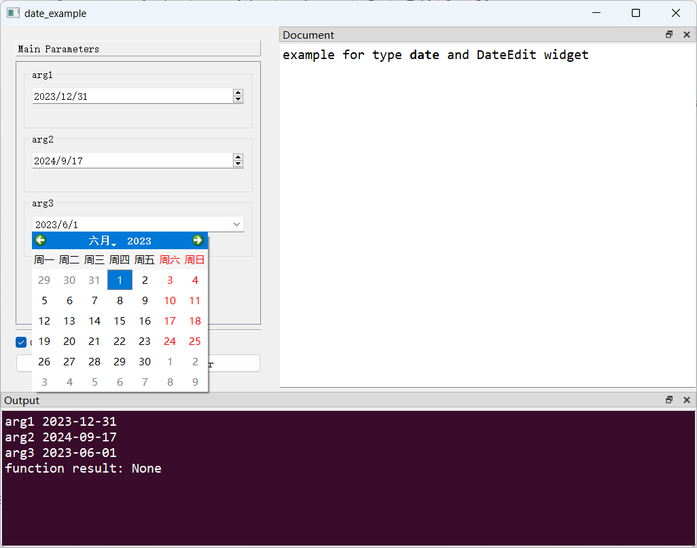

# `date`类型与`DateEdit`控件

## 一、控件类型：`DateEdit`

> 源码: [`pyguiadapter/widgets/extend/dateedit.py`]()

该控件用于输入日期，是python内置`datetime.date`类型参数的默认输入控件。


## 二、配置类型：`DateEditConfig`

> 源码: [`pyguiadapter/widgets/extend/dateedit.py`]()

```python
@dataclasses.dataclass(frozen=True)
class DateEditConfig(CommonParameterWidgetConfig):
    default_value: date | QDate | None = date.today()
    min_date: date | QDate | None = None
    max_date: date | QDate | None = None
    display_format: str | None = None
    time_spec: TimeSpec | None = None
    wrapping: bool = False
    frame: bool = True
    alignment: Alignment = Qt.AlignLeft | Qt.AlignVCenter
    button_symbols: ButtonSymbols | None = None
    correction_mode: CorrectionMode | None = None
    keyboard_tracking: bool = True
    accelerated: bool = False
    calendar_popup: bool = False

    @classmethod
    def target_widget_class(cls) -> Type["DateEdit"]:
        return DateEdit

```

|    配置项名称    |          类型           |              默认值               |                   说明                    |
| :--------------: | :---------------------: | :-------------------------------: | :---------------------------------------: |
| `default_value`  | `date \| QDate \| None` |          `date.today()`           |  控件的默认值，默认取运行时的当前日期。   |
|    `min_date`    | `date \| QDate \| None` |              `None`               |           控件接受的最小日期。            |
|    `max_date`    | `date \| QDate \| None` |              `None`               |           控件接受的最大日期。            |
| `display_format` |      `str \| None`      |              `None`               |              日期显示格式。               |
|   `time_spec`    |   `TimeSpec \| None`    |              `None`               |              设置当前时区。               |
|    `wrapping`    |         `bool`          |              `False`              |            设置是否允许循环。             |
|     `frame`      |         `bool`          |              `True`               |              是否绘制边框。               |
|   `alignment`    |       `Alignment`       | ` Qt.AlignLeft \|Qt.AlignVCenter` | 设置对齐方式，默认`水平居左`+`垂直居中`。 |
| `calendar_popup` |         `bool`          |              `False`              |        设置是否弹出日期选择窗口。         |

## 三、示例

> 源码：[examples/widgets/date_example.py]()

```python
from datetime import date

from pyguiadapter.adapter import GUIAdapter
from pyguiadapter.adapter.ucontext import uprint
from pyguiadapter.widgets import DateEditConfig


def date_example(arg1: date, arg2: date, arg3: date):
    """
    example for type **date** and DateEdit widget
    """
    uprint("arg1", arg1)
    uprint("arg2", arg2)
    uprint("arg3", arg3)


if __name__ == "__main__":
    arg1_conf = DateEditConfig(
        min_date=date(2023, 1, 1),
        max_date=date(2023, 12, 31),
    )
    arg3_conf = DateEditConfig(
        default_value=date(2023, 6, 1),
        min_date=date(2023, 1, 1),
        max_date=date(2023, 12, 31),
        calendar_popup=True,
    )
    adapter = GUIAdapter()
    adapter.add(
        date_example,
        widget_configs={
            "arg1": arg1_conf,
            "arg3": arg3_conf,
        },
    )
    adapter.run()
```



---

[参数数据类型及其对应控件](widgets/types_and_widgets.md)