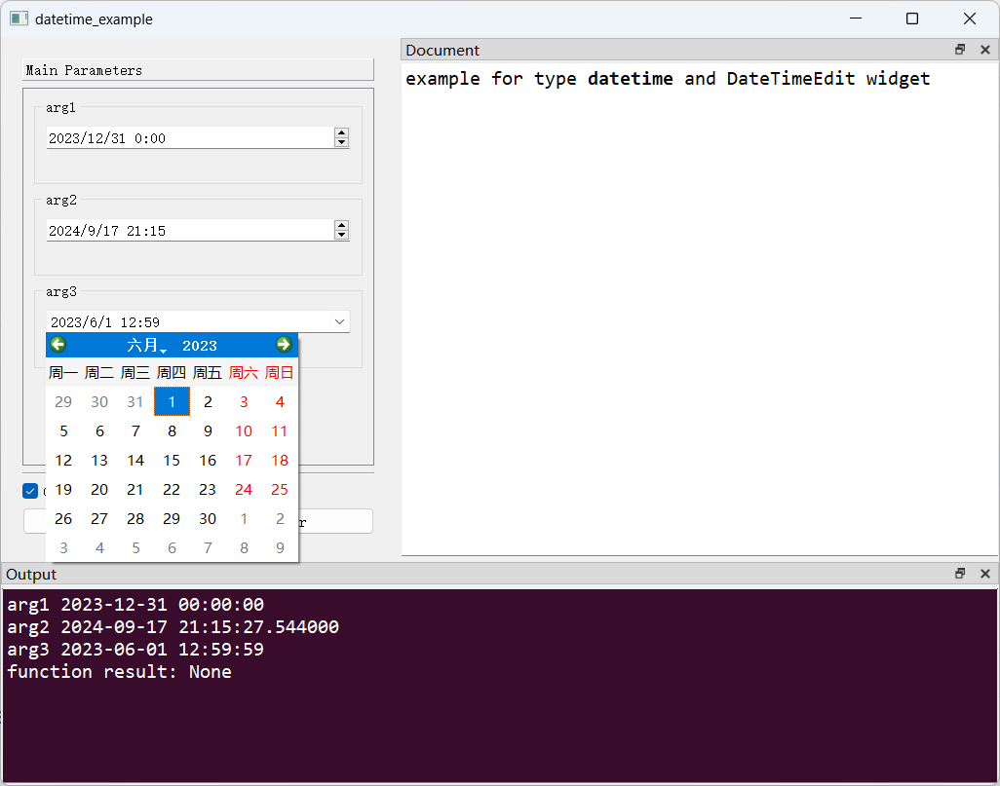

# `datetime`类型与`DateTimeEdit`控件

## 一、控件类型：`DateTimeEdit`

> 源码: [`pyguiadapter/widgets/extend/datetimeedit.py`]()

该控件用于输入日期时间，即python内置`datetime.datetime`类型对象。


## 二、配置类型：`DateTimeEditConfig`

> 源码: [`pyguiadapter/widgets/extend/datetimeedit.py`]()

```python
@dataclasses.dataclass(frozen=True)
class DateTimeEditConfig(CommonParameterWidgetConfig):
    default_value: datetime | QDateTime | None = dataclasses.field(
        default_factory=datetime.now
    )
    min_datetime: datetime | QDateTime | None = None
    max_datetime: datetime | QDateTime | None = None
    display_format: str | None = None
    time_spec: TimeSpec | None = None
    wrapping: bool = False
    frame: bool = True
    alignment: Alignment = Qt.AlignLeft | Qt.AlignVCenter
    button_symbols: ButtonSymbols | None = None
    correction_mode: CorrectionMode | None = None
    keyboard_tracking: bool = True
    accelerated: bool = False
    calendar_popup: bool = False

    @classmethod
    def target_widget_class(cls) -> Type["DateTimeEdit"]:
        return DateTimeEdit

```

|    配置项名称    |              类型               |              默认值               |                             说明                             |
| :--------------: | :-----------------------------: | :-------------------------------: | :----------------------------------------------------------: |
| `default_value`  | `datetime \| QDateTime \| None` |         `datetime.now()`          |            控件的默认值，默认取运行时的当前时间。            |
|  `min_datetime`  | `datetime \| QDateTime \| None` |              `None`               | 控件接受的最小日期时间。只能设置为有效的日期时间值，接受的最晚日期时间是公元 9999 年的结束时间，这也是此属性的默认值。 |
|  `max_datetime`  | `datetime \| QDateTime \| None` |              `None`               | 控件接受的最大日期时间。只能设置为有效的日期时间值，接受的最晚日期时间是公元 9999 年的结束时间，这也是此属性的默认值。 |
| `display_format` |          `str \| None`          |              `None`               | 日期时间的显示格式。如果年份设置为两位，在默认该年份是在运行时的那个世纪（即21世纪）。 |
|   `time_spec`    |       `TimeSpec \| None`        |              `None`               | 设置当前`时区`。如果正在使用的日期时间格式包括时区指示符（即 t、tt、ttt 或 tttt 等格式说明符），则在解析输入时，用户的输入都会以该时区重新表示，从而覆盖用户可能已指定的任何时区。（详见[官方文档](https://doc.qt.io/qtforpython-6/PySide6/QtWidgets/QDateTimeEdit.html#PySide6.QtWidgets.QDateTimeEdit.timeZone)） |
|    `wrapping`    |             `bool`              |              `False`              |   设置是否允许循环（即到达最大值后继续增加将回到最小值）。   |
|     `frame`      |             `bool`              |              `True`               |                        是否显示边框。                        |
|   `alignment`    |           `Alignment`           | ` Qt.AlignLeft \|Qt.AlignVCenter` |          设置对其方式，默认`水平居左`+`垂直居中`。           |
|  `accelerated`   |             `bool`              |              `False`              |         设置按上调/下调按钮时，是否加快步进的频率。          |
| `calendar_popup` |             `bool`              |              `False`              |                  设置是否弹出日期选择窗口。                  |


> 日期时间显示格式示例：对于`2nd of July 1969`这一日期，其在不同格式下将显示成：
>
> |    Format    |    Result    |
> | :----------: | :----------: |
> | `dd.MM.yyyy` | `02.07.1969` |
> |  `MMM d yy`  |  `Jul 2 69`  |
> | `MMMM d yy`  | `July 2 69`  |
>
> 详情请查看[官方文档](https://doc.qt.io/qtforpython-6/PySide6/QtWidgets/QDateTimeEdit.html#PySide6.QtWidgets.QDateTimeEdit.displayFormat)。


## 三、示例

> 源码：[examples/widgets/datetime_example.py]()

```python
from datetime import datetime

from pyguiadapter.adapter import GUIAdapter
from pyguiadapter.adapter.ucontext import uprint
from pyguiadapter.widgets import DateTimeEditConfig


def datetime_example(arg1: datetime, arg2: datetime, arg3: datetime):
    """
    example for type **datetime** and DateTimeEdit widget
    """
    uprint("arg1", arg1)
    uprint("arg2", arg2)
    uprint("arg3", arg3)


if __name__ == "__main__":
    arg1_conf = DateTimeEditConfig(
        min_datetime=datetime(2023, 1, 1),
        max_datetime=datetime(2023, 12, 31),
    )
    arg3_conf = DateTimeEditConfig(
        default_value=datetime(2023, 6, 1, 12, 59, 59),
        min_datetime=datetime(2023, 1, 1),
        max_datetime=datetime(2023, 12, 31),
        calendar_popup=True,
    )
    adapter = GUIAdapter()
    adapter.add(
        datetime_example,
        widget_configs={
            "arg1": arg1_conf,
            "arg3": arg3_conf,
        },
    )
    adapter.run()

```



---

[参数数据类型及其对应控件](widgets/types_and_widgets.md)