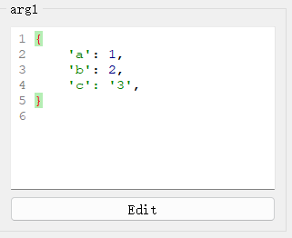

# `DictEdit`控件

## 一、控件类型：`DictEdit`

> 源码: [`pyguiadapter/widgets/basic/dictedit.py`]()


`DictEdit`是[`PyLiteralEdit`](widgets/any.md)的子类，主要用于Python字典类型数据的输入，是`dict`、`typing.Dict`、`Mapping`、`MutableMapping`等类型的函数参数的默认输入控件。

   

## 二、配置类型：`DictEditConfig`

> 源码: [`pyguiadapter/widgets/basic/dictedit.py`]()

```python
@dataclasses.dataclass(frozen=True)
class DictEditConfig(PyLiteralEditConfig):
    default_value: dict | None = dataclasses.field(default_factory=dict)
    initial_text: str = "{}"

    @classmethod
    def target_widget_class(cls) -> Type["DictEdit"]:
        return DictEdit

```

| 配置项名称      | 类型           | 默认值 |
| --------------- | -------------- | ------ |
| `default_value` | `dict \| None` | `""    |

`DictEditConfig`继承自[`PyLiteralEditConfig`](widgets/any.md)，其可配置项，可以参考：

- [`PyLiteralEditConfig`](widgets/any.md)
- [`BaseCodeEditConfig`](widgets/base_code_edit.md)


## 三、示例

> 源码：[examples/widgets/dict_example.py]()

```python
from typing import Dict, Mapping, MutableMapping, TypedDict

from pyguiadapter.adapter import GUIAdapter
from pyguiadapter.adapter.ucontext import uprint
from pyguiadapter.widgets import DictEditConfig


class User(TypedDict):
    name: str
    age: int
    address: str
    email: str


def dict_example(
    arg1: dict, arg2: Dict, arg3: Mapping, arg4: MutableMapping, arg5: User
):
    """
    example for **DictEdit** for **dict-like** types

    @params

    [arg1]
    default_value = {a=1,b=2,c="3"}

    [arg2]
    default_value = {"key1"="value1", "key2"="value2"}

    @end
    """
    print(id(arg1))
    arg1["new"] = "value"
    uprint("arg1: ", arg1)
    uprint("arg2: ", arg2)
    uprint("arg3: ", arg3)
    uprint("arg4: ", arg4)
    uprint("arg5: ", arg5)


if __name__ == "__main__":
    arg3_conf = DictEditConfig(
        default_value={"a": "A", "b": "B"},
    )

    arg4_conf = DictEditConfig(
        default_value={"c": "C", "d": "D"},
    )

    arg5_conf = DictEditConfig(
        default_value=User(
            name="John", age=30, address="123 Main St", email="john@example.com"
        ),
    )

    adapter = GUIAdapter()
    adapter.add(
        dict_example,
        widget_configs={
            "arg3": arg3_conf,
            "arg4": arg4_conf,
            "arg5": arg5_conf,
        },
    )
    adapter.run()

```


---

[参数数据类型及其对应控件](widgets/types_and_widgets.md)