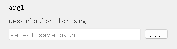
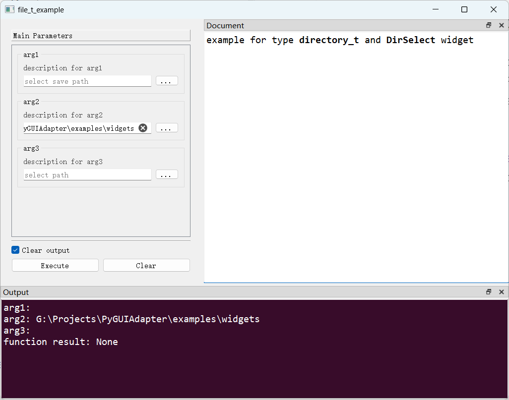

# `DirSelect`控件

## 一、控件类型：`DirSelect`

> 源码: [`pyguiadapter/widgets/extend/dirselect.py`]()



`directory_t`扩展自`str`，代表一个目录路径，`PyGUIAdapter`为该类型提供了一个文件选择对话框用于选择目录。

## 二、配置类型：`DirSelectConfig`

> 源码: [`pyguiadapter/widgets/extend/dirselect.py`]()

```python
@dataclasses.dataclass(frozen=True)
class DirSelectConfig(CommonParameterWidgetConfig):
    default_value: str = ""
    placeholder: str = ""
    dialog_title: str = ""
    start_dir: str = ""
    select_button_text: str = "..."
    clear_button: bool = False

    @classmethod
    def target_widget_class(cls) -> Type["DirSelect"]:
        return DirSelect

```

| 配置项名称           | 类型   | 默认值  | 说明                           |
| -------------------- | ------ | ------- | ------------------------------ |
| `default_value`      | `str`  | `""`    | 控件的默认值。                 |
| `placeholder`        | `str`  | `""`    | 没有输入值时显示的占位符文本。 |
| `dialog_title`       | `str`  | `""`    | 选择目录对话框的标题。         |
| `start_dir`          | `str`  | `""`    | 起始路径。                     |
| `select_button_text` | `str`  | `"..."` | 选择目录按钮。                 |
| `clear_button`       | `bool` | `False` | 是否显示输入框的清除按钮。     |

## 三、示例

> 源码：[examples/widgets/directory_t_example.py]()

```python
import os.path

from pyguiadapter.adapter import GUIAdapter
from pyguiadapter.adapter.ucontext import uprint
from pyguiadapter.extend_types import directory_t, dir_t
from pyguiadapter.widgets import DirSelectConfig


def directory_t_example(arg1: directory_t, arg2: directory_t, arg3: dir_t):
    """
    example for type **directory_t** and **DirSelect** widget

    @param arg1: description for arg1
    @param arg2: description for arg2
    @param arg3: description for arg3

    @params
    [arg3]
    placeholder = "select path"
    dialog_title = "Select Dir"
    @end

    """
    uprint("arg1:", arg1)
    uprint("arg2:", arg2)
    uprint("arg3:", arg3)


if __name__ == "__main__":
    arg1_conf = DirSelectConfig(
        placeholder="select save path",
        dialog_title="Select Save Path",
    )
    arg2_conf = DirSelectConfig(
        default_value=os.path.dirname(os.path.abspath(__file__)),
        start_dir=os.path.expanduser("~"),
        clear_button=True,
    )
    adapter = GUIAdapter()
    adapter.add(
        directory_t_example, widget_configs={"arg1": arg1_conf, "arg2": arg2_conf}
    )
    adapter.run()

```



---

[参数数据类型及其对应控件](widgets/types_and_widgets.md)