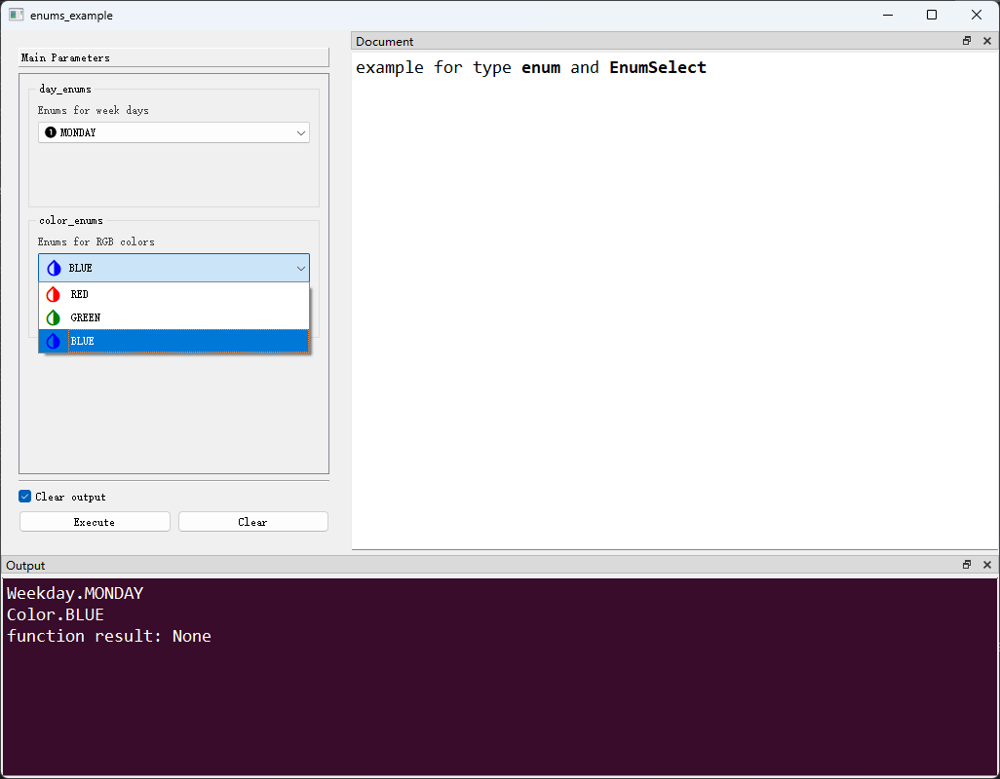

# # `Enum`类型及`EnumSelect`控件

## 一、控件类型：EnumSelect

> 源码：[pyguiadapter/widgets/basic/enumselect.py]()

用于选择枚举值，是`Enum`类型参数的默认控件。


## 二、配置类型：FloatSpinBoxConfig

> 源码：[pyguiadapter/widgets/basic/enumselect.py]()

```python
@dataclasses.dataclass(frozen=True)
class EnumSelectConfig(CommonParameterWidgetConfig):
    default_value: Enum | str | int | None = 0
    icons: Dict[Enum | str, utils.IconType] | None = None
    icon_size: Tuple[int, int] | QSize | None = None
    enum_class: Type[Enum] | None = None
```

|   配置项名称    |       类型       |  默认值   |                             说明                             |
| :-------------: | :--------------: | :-------: | :----------------------------------------------------------: |
| `default_value` |  `Enum \| str \| int \| None`  |  `0`  |                          控件默认值，默认为`0`，即默认为第一个选项的值。                          |
|     `icons`     | `Dict[Enum \| str, utils.IconType] \| None` | `None` |         各选项对应的图标，默认为`None`，即不使用图标。         |
|   `icon_size`   |     `Tuple[int, int] \| QSize \| None`      | `None` |     选项图标大小，默认为`None`，即由系统自动决定。     |
|  `enum_class`   |            `Type[Enum] \| None`             | `None` | 枚举类行，该选项一般不用指定，保持默认（`None`），`PyGUIAdapter`会自动探测函数中Enum类型参数的具体类型。 |


> 关于图标，请参考[这篇文章](widgets/types_and_widgets.md)。


## 三、示例

> 源码：[examples/widgets/enum_example.py]()


```python
from enum import Enum
from pyguiadapter.adapter import GUIAdapter
from pyguiadapter.adapter.ulogging import uprint
from pyguiadapter.widgets import EnumSelectConfig


class Weekday(Enum):
    MONDAY = 1
    TUESDAY = 2
    WEDNESDAY = 3
    THURSDAY = 4
    FRIDAY = 5
    SATURDAY = 6
    SUNDAY = 7


class Color(Enum):
    RED = 1
    GREEN = 2
    BLUE = 3


def enums_example(day_enums: Weekday, color_enums: Color = Color.GREEN):
    """
    example for type **enum** and **EnumSelect**
    @param day_enums: Enums for week days
    @param color_enums:  Enums for RGB colors
    @return:

    @params
    [day_enums]
    # this will override the default value defined in the function signature
    default_value = "MONDAY"
    icons = {"MONDAY"="mdi6.numeric-1-circle", "TUESDAY"="mdi6.numeric-2-circle"}

    @end

    """
    uprint(day_enums)
    uprint(color_enums)


if __name__ == "__main__":
    color_enums_conf = EnumSelectConfig(
        # this will override the default value defined in the function signature
        default_value=Color.BLUE,
        icons={
            "RED": ("mdi.invert-colors", {"color": "red"}),
            "GREEN": ("mdi.invert-colors", {"color": "green"}),
            "BLUE": ("mdi.invert-colors", {"color": "blue"}),
        },
        icon_size=(24, 24),
    )
    adapter = GUIAdapter()
    adapter.add(enums_example, widget_configs={"color_enums": color_enums_conf})
    adapter.run()
```




---

[参数数据类型及其对应控件](widgets/types_and_widgets.md)