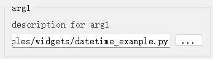
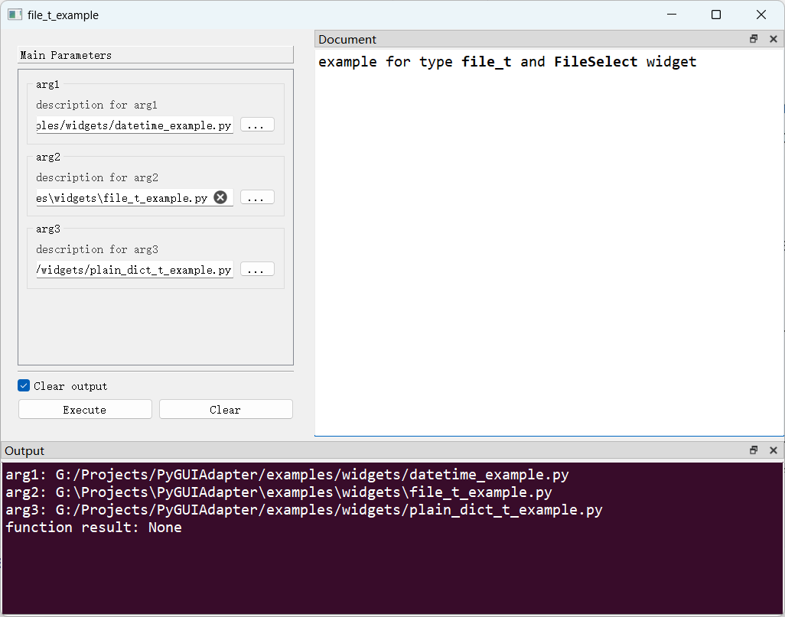

# `FileSelect`控件

## 一、控件类型：`FileSelect`

> 源码: [`pyguiadapter/widgets/extend/fileselect.py`]()



`file`扩展自`str`，代表一个文件路径，`PyGUIAdapter`为该类型提供了一个文件选择对话框用于选择文件。

## 二、配置类型：`FileSelectConfig`

> 源码: [`pyguiadapter/widgets/extend/fileselect.py`]()

```python
@dataclasses.dataclass(frozen=True)
class FileSelectConfig(CommonParameterWidgetConfig):
    default_value: str = ""
    placeholder: str = ""
    dialog_title: str = ""
    start_dir: str = ""
    filters: str = ""
    save_file: bool = False
    select_button_text: str = "..."
    clear_button: bool = False

    @classmethod
    def target_widget_class(cls) -> Type["FileSelect"]:
        return FileSelect

```

| 配置项名称           | 类型   | 默认值  | 说明                                |
| -------------------- | ------ | ------- | ----------------------------------- |
| `default_value`      | `str`  | `""`    | 控件的默认值。                      |
| `placeholder`        | `str`  | `""`    | 控件没有输入时的占位符文本。        |
| `dialog_title`       | `str`  | `""`    | 选择/保存文件对话框的标题。         |
| `start_dir`          | `str`  | `""`    | 选择/保存文件对话框的起始路径。     |
| `filters`            | `str`  | `""`    | 选择/保存文件对话框的文件名过滤器。 |
| `save_file`          | `bool` | `False` | 是否启用保持文件对话框              |
| `select_button_text` | `str`  | `"..."` | 选择文件按钮的文本。                |
| `clear_button`       | `bool` | `False` | 是否显示编辑框的清除按钮。          |

## 三、示例

> 源码：[examples/widgets/file_t_example.py]()

```python
import os.path

from pyguiadapter.adapter import GUIAdapter
from pyguiadapter.adapter.ucontext import uprint
from pyguiadapter.widgets import FileSelectConfig
from pyguiadapter.extend_types import file_t


def file_t_example(arg1: file_t, arg2: file_t, arg3: file_t):
    """
    example for type **file_t** and **FileSelect** widget

    @param arg1: description for arg1
    @param arg2: description for arg2
    @param arg3: description for arg3

    @params
    [arg3]
    placeholder = "input save path here"
    save_file = true
    dialog_title = "Save File"
    @end

    """
    uprint("arg1:", arg1)
    uprint("arg2:", arg2)
    uprint("arg3:", arg3)


if __name__ == "__main__":
    arg1_conf = FileSelectConfig(
        placeholder="input file path here",
        filters="Text files(*.txt);;All files(*.*)",
        dialog_title="Open File",
    )
    arg2_conf = FileSelectConfig(
        default_value=os.path.abspath(__file__),
        start_dir=os.path.expanduser("~"),
        clear_button=True,
    )
    adapter = GUIAdapter()
    adapter.add(file_t_example, widget_configs={"arg1": arg1_conf, "arg2": arg2_conf})
    adapter.run()

```



---

[参数数据类型及其对应控件](widgets/types_and_widgets.md)