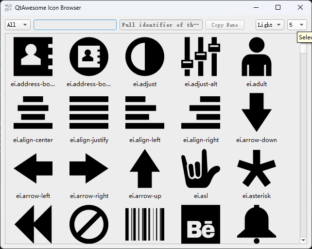

# 程序中的图标

在`PyGUIAdapter`中，很多地方都会用到图标，绝大多数需要提供图标的地方，都会要求开发者传入一个类型为`utils.IconType`的对象。 

实际上，`utils.IconType`是`str | tuple[str, list | dict] | QIcon | QPixmap | None`的别名。`PyGUIAdapter`则通过`utils.get_icon()`函数将开发者传入的值转化为QIcon对象。

这里有几个需要注意的地方：

一是为了方便开发者快速利用现有的开放图标库，`PyGUIAdapter`已经集成了[`qtawesome`](https://github.com/spyder-ide/qtawesome)库，当取值为`str`类型时，可以传入传入[`qtawesome`](https://github.com/spyder-ide/qtawesome)支持的图标名称。

> 如果开发者安装了[`qtawesome`](https://github.com/spyder-ide/qtawesome)，那么他应该可以通过[`qtawesome`](https://github.com/spyder-ide/qtawesome)提供的图标浏览工具来浏览图片，并复制选中的图片的名称。
>
> ```shell
> qta-browser
> ```
>
> 


而是，传入值为`Tuple[str, list|tuple]`类型时，第一个元素应当是[`qtawesome`](https://github.com/spyder-ide/qtawesome)支持的图标名称，第二个元素则是[`qtawesome.icon()`](https://qtawesome.readthedocs.io/en/latest/_generate/qtawesome.icon.html#qtawesome.icon)函数第一个参数后面的剩余参数。

例如：

```pytho
icon_options = {
	"color": "blue",
	"color_active": "orange"
}
my_icon = ("fa5s.music", icon_options)
```

`utils.get_icon()`将按照如下方式利用该参数：

```python
import qtawesome as qta

def get_icon(src: IconType, *args, **kwargs) -> QIcon | None:
 ...
 if isinstance(src, tuple):
     assert len(src) >= 2
     assert isinstance(src[0], str) and isinstance(src[1], (dict, list))
     if isinstance(src[1], dict):
         return qta.icon(src[0], **src[1])
     else:
         return qta.icon(src[0], *src[1])
 else:
     raise ValueError(f"invalid icon type: {type(src)}")
```


> `utils.get_icon()`的完整代码如下：
>
> ```python
>import qtawesome as qta
> 
>def get_icon(src: IconType, *args, **kwargs) -> QIcon | None:
>  if src is None:
>     return None
>  if isinstance(src, QIcon):
>      return src
>  if isinstance(src, QPixmap):
>      return QIcon(src)
>  if isinstance(src, str):
>      if os.path.isfile(src) or src.startswith(":/"):
>          return QIcon(src)
>     return qta.icon(src, *args, **kwargs)
>  if isinstance(src, tuple):
>     assert len(src) >= 2
>      assert isinstance(src[0], str) and isinstance(src[1], (dict, list))
>      if isinstance(src[1], dict):
>          return qta.icon(src[0], **src[1])
>      else:
>             return qta.icon(src[0], *src[1])
>     else:
>         raise ValueError(f"invalid icon type: {type(src)}")
>    ```
>    
>    
