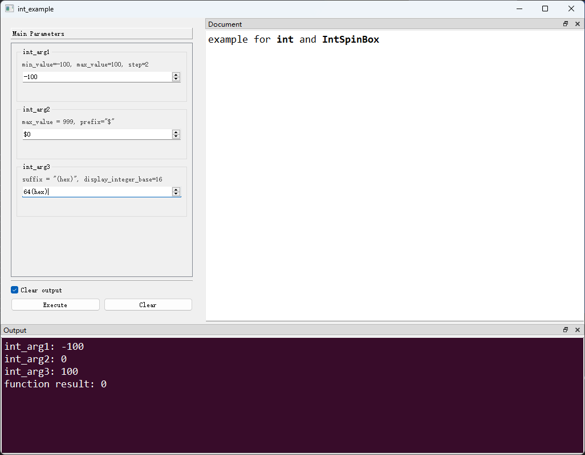

# `int`类型及`IntSpinBox`控件

## 一、控件类型：IntSpinBox

> 源码：[pyguiadapter/widgets/basic/intspin.py]()

用于`int`类型数据的输入，是`int`类型参数的默认控件。


## 二、配置类型：IntSpinBoxConfig

> 源码：[pyguiadapter/widgets/basic/intspin.py]() 

```py
@dataclasses.dataclass(frozen=True)
class IntSpinBoxConfig(CommonParameterWidgetConfig):
    default_value: int | None = 0
    min_value: int = -2147483648
    max_value: int = 2147483647
    step: int = 1
    prefix: str = ""
    suffix: str = ""
    display_integer_base: int = 10
    
```

|       配置项名称       |     类型      |    默认值     |                          说明                           |
| :--------------------: | :-----------: | :-----------: | :-----------------------------------------------------: |
|    `default_value`     | `int \| None` |      `0`      |                       控件默认值                        |
|      `min_value`       |     `int`     | `-2147483648` |                    控件接受的最大值                     |
|      `max_value`       |     `int`     | `2147483647`  |                    控件接受的最小值                     |
|         `step`         |     `int`     |      `1`      | 单次步进值。默认值为 1，设置为小于 0 不会执行任何操作。 |
|        `prefix`        |     `str`     |     `""`      |        显示在值之前的前缀，默认为空，即无前缀。         |
|        `suffix`        |     `str`     |     `""`      |        显示在值之后的后缀，默认为空，即无后缀。         |
| `display_integer_base` |     `int`     |     `10`      |               显示值的进制，默认十进制。                |


## 三、示例

> 源码：[examples/widgets/int_example.py]()


```python
from pyguiadapter.adapter import GUIAdapter
from pyguiadapter.adapter.ulogging import uprint


def int_example(int_arg1: int, int_arg2: int, int_arg3: int = 100) -> int:
    """
    example for **int** and **IntSpinBox**
    @param int_arg1: min_value=-100, max_value=100, step=2
    @param int_arg2: max_value = 999, prefix="$"
    @param int_arg3: suffix = "(hex)", display_integer_base=16
    @return:

    @params
    [int_arg1]
    default_value = -100
    min_value = -100
    max_value = 100

    [int_arg2]
    max_value = 999
    prefix = "$"

    @end

    """
    uprint("int_arg1:", int_arg1)
    uprint("int_arg2:", int_arg2)
    uprint("int_arg3:", int_arg3)
    return int_arg1 + int_arg2 + int_arg3


if __name__ == "__main__":
    adapter = GUIAdapter()
    adapter.add(
        int_example,
        widget_configs={
            "int_arg3": {
                "suffix": "(hex)",
                "display_integer_base": 16,
            }
        },
    )
    adapter.run()
```




---

[参数数据类型及其对应控件](widgets/types_and_widgets.md)