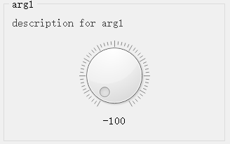
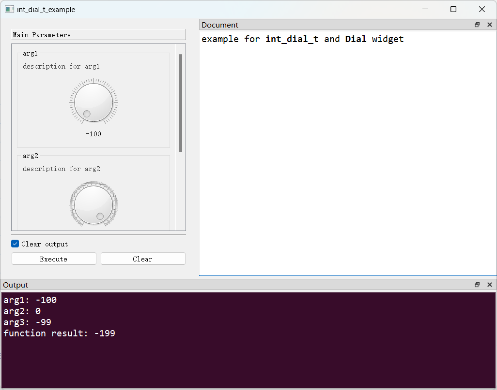

# `Dial`控件

## 一、控件类型：`Dial`

> 源码: [`pyguiadapter/widgets/extend/dial.py`]()



`int_dial_t`扩展自`int`，可以看作是`int`类型的别名。与其他`int`不同，`PyGUIAdapter`为该类型提供了刻度盘形式的输入控件。

## 二、配置类型：`DialConfig`

> 源码: [`pyguiadapter/widgets/extend/dial.py`]()

```python
@dataclasses.dataclass(frozen=True)
class DialConfig(CommonParameterWidgetConfig):
    default_value: int | None = 0
    min_value: int = 0
    max_value: int = 100
    notch_target: float | None = None
    notches_visible: bool = True
    wrapping: bool = False
    single_step: int = 1
    page_step: int | None = None
    tracking: bool = True
    inverted_controls: bool = False
    inverted_appearance: bool = False
    show_value_label: bool = True
    prefix: str = ""
    suffix: str = ""
    min_height: int = 120

    @classmethod
    def target_widget_class(cls) -> Type["Dial"]:
        return Dial

```

| 配置项名称            | 类型            | 默认值  | 说明                                                         |
| --------------------- | --------------- | ------- | ------------------------------------------------------------ |
| `default_value`       | `int \| None`   | `0`     | 控件的默认值，默认为`0`。                                    |
| `min_value`           | `int`           | `0`     | 控件最大值，默认为`0`。                                      |
| `max_value`           | `int`           | `100`   | 控件最小值，默认为`100。`                                    |
| `notch_target`        | `float \| None` | `None`  | 刻度线的目标设置值。当设置为`0`时，会尝试绘制足够宽的刻度线，使得前景和背景之间产生足够的对比度。当设置为非0的值时，将使用该值作为刻度线的宽度。通过调整该属性，开发者可以控制刻度线的显示方式和对比度，从而影响用户界面的一致性和可读性。 |
| `notches_visible`     | `bool`          | `True`  | 是否显示刻度线。                                             |
| `wrapping`            | `bool`          | `False` | 设置是否循环包裹。                                           |
| `single_step`         | `int`           | `1`     | 代表单步长，即当用户通过点击滑块或按左右方向键时，滑块移动的最小距离。这是用户进行细微调整时使用的步长。 |
| `page_step`           | `int \| None`   | `None`  | 代表按`Page Up`或`Page Down`键时滑块的变化值。这是用户在需要更大范围的调整时使用的步长。 |
| `tracking`            | `bool`          | `True`  | 是否实时追踪滑块拖动事件。                                   |
| `inverted_controls`   | `bool`          | `False` | 是否反转控件的滚轮和按键事件的处理方式。如果设置为`False`，向上滚动鼠标滚轮或使用`Page Up`等键会将值增加到最大值。如果设置为`True`，则向上滚动鼠标滚轮或使用`Page Up`等键会将值减小到最小值。这个属性主要影响用户与控件的交互方式，允许用户通过反转控制来适应不同的操作习惯或满足特定的功能需求。 |
| `inverted_appearance` | `bool`          | `False` | 是否以倒置的方式显示外观。如果设置为`True`，则最小值和最大值会出现在它们相反的位置，即最大值在最前面，最小值在最后面。这个属性主要用于控制控件的视觉表现，使得开发者可以根据需要调整控件的显示方式，以符合特定的用户界面设计或使用习惯。 |
| `show_value_label`    | `bool`          | `True`  | 是否显示在单独的标签中显示滑块的当前值，该标签一般在滑动条下方。 |
| `prefix`              | `str`           | `""`    | 在标签中显示的值的前缀。                                     |
| `suffix`              | `str`           | `""`    | 在标签中显示的值的后缀。                                     |
| `min_height`          | `int`           | `120`   | 控件最小高度。                                               |

## 三、示例

> 源码：[examples/widgets/int_dial_t_example.py]()

```python
from pyguiadapter.adapter import GUIAdapter
from pyguiadapter.adapter.uoutput import uprint
from pyguiadapter.types import int_dial_t
from pyguiadapter.widgets import DialConfig


def int_dial_t_example(
    arg1: int_dial_t, arg2: int_dial_t, arg3: int_dial_t = 100
) -> int:
    """
    example for **int_dial_t** and **Dial** widget

    @param arg1: description for arg1
    @param arg2: description for arg2
    @param arg3: description for arg3
    @return:

    @params
    [arg1]
    default_value = -100
    min_value = -100
    max_value = 100

    [arg2]
    max_value = 999
    single_step = 2
    tracking = false
    prefix = "count: "
    inverted_controls = true
    inverted_appearance = true

    @end

    """
    uprint("arg1:", arg1)
    uprint("arg2:", arg2)
    uprint("arg3:", arg3)
    return arg1 + arg2 + arg3


if __name__ == "__main__":

    arg3_conf = DialConfig(
        # this will override the default_value defined in the function signature
        default_value=-99,
        min_value=-100,
        max_value=100,
        suffix=" mv",
    )

    adapter = GUIAdapter()
    adapter.add(
        int_dial_t_example,
        widget_configs={"arg3": arg3_conf},
    )
    adapter.run()

```



---

[参数数据类型及其对应控件](widgets/types_and_widgets.md)