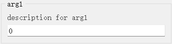

# `IntLineEdit`控件

## 一、控件类型：`IntLineEdit`

> 源码: [`pyguiadapter/widgets/extend/intedit.py`]()



`int_t`扩展自`int`，可以看作是`int`类型的别名。`PyGUIAdapter`为该类型提供了一个单行文本输入框样式的输入组件，但于与一般单行文本输入框标题，该类型的输入组件只允许用户输入整数文本。

## 二、配置类型：`IntLineEditConfig`

> 源码: [`pyguiadapter/widgets/extend/intedit.py`]()

```python
@dataclasses.dataclass(frozen=True)
class IntLineEditConfig(CommonParameterWidgetConfig):
    default_value: int | None = 0
    min_value: int = -2147483648
    max_value: int = 2147483647
    empty_value: int = 0

    @classmethod
    def target_widget_class(cls) -> Type["IntLineEdit"]:
        return IntLineEdit

```

| 配置项名称      | 类型          | 默认值        | 说明                                               |
| --------------- | ------------- | ------------- | -------------------------------------------------- |
| `default_value` | `int \| None` | `0`           | 控件都默认值，默认为0                              |
| `min_value`     | `int`         | `-2147483648` | 控件允许的最小值，默认为`-2147483648`，即` -2^32 ` |
| `max_value`     | `int`         | `2147483647`  | 控件允许的最大值，默认为`2147483647`，即`2^32 - 1` |
| `empty_value`   | `int`         | `0`           | 当输入框为空时所代表的值，默认为`0`                |


**注意:**设置`min_value`、`max_value`不能百分百保证阻止用户输入超出范围的值，如果程序确实对输入值的范围敏感，为确保绝对安全，仍然推荐开发者在函数中手动对输入值进行校验。 例如：

```python
MAX_VALUE = 100
def foo(arg: int_t):
    if arg > MAX_VALUE:
        raise ParameterError("arg", "input value is too big!!!")
    ...

```


## 三、示例

> 源码：[examples/widgets/int_t_example.py]()

```python
from pyguiadapter.adapter import GUIAdapter
from pyguiadapter.adapter.uoutput import uprint
from pyguiadapter.extend_types import int_t
from pyguiadapter.widgets import IntLineEditConfig


def int_t_example(arg1: int_t, arg2: int_t, arg3: int_t = 100) -> int:
    """
    example for **int_t** and **IntLineEdit**

    @param arg1: description for arg1
    @param arg2: description for arg2
    @param arg3: description for arg3
    @return:

    @params
    [arg1]
    default_value = -100
    min_value = -100
    max_value = 100

    [arg2]
    max_value = 999
    empty_value = -1

    @end

    """
    uprint("arg1:", arg1)
    uprint("arg2:", arg2)
    uprint("arg3:", arg3)
    return arg1 + arg2 + arg3


if __name__ == "__main__":
    arg3_conf = IntLineEditConfig(
        # this will override the default_value defined in the function signature
        default_value=-99,
        min_value=-100,
        max_value=100,
        empty_value=-1,
    )

    adapter = GUIAdapter()
    adapter.add(
        int_t_example,
        widget_configs={"arg3": arg3_conf},
    )
    adapter.run()

```


---

[参数数据类型及其对应控件](widgets/types_and_widgets.md)