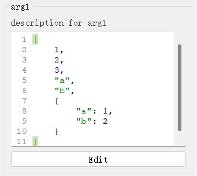
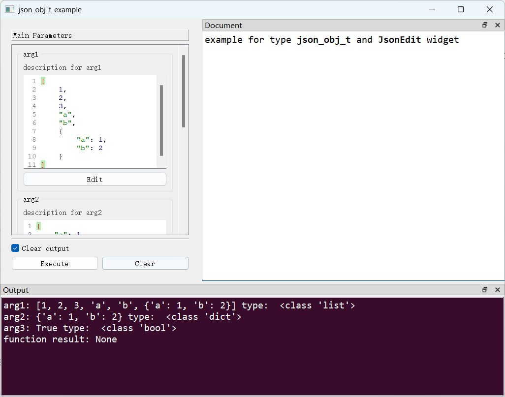

# `JsonEdit`控件

## 一、控件类型：`JsonEdit`

> 源码: [`pyguiadapter/widgets/extend/jsoneditor.py`]()



`json_obj_t`扩展自`object`，用于json类型数据的输入。用户在控件上输入的文本将通过`json.loads`转换为对应的Python对象。

## 二、配置类型：`JsonEditConfig`

> 源码: [`pyguiadapter/widgets/extend/jsoneditor.py`]()

```python
@dataclasses.dataclass(frozen=True)
class JsonEditConfig(BaseCodeEditConfig):
    default_value: Any = dataclasses.field(default_factory=dict)
    highlighter: Type[QJSONHighlighter] = QJSONHighlighter
    indent_size: int = INDENT_SIZE
    formatter: JsonFormatter = dataclasses.field(default_factory=JsonFormatter)
    file_filters: str = JSON_FILE_FILTERS

    @classmethod
    def target_widget_class(cls) -> Type["JsonEdit"]:
        return JsonEdit

```

| 配置项名称      | 类型  | 默认值 | 说明                    |
| --------------- | ----- | ------ | ----------------------- |
| `default_value` | `Any` | `{}`   | 控件默认值。            |
| `indent_size`   | `int` | `4`    | 缩进宽度，默认4个空格。 |

`DictEditConfig`继承自[`PyLiteralEditConfig`](widgets/any.md)，其可配置项，可以参考：

- [`BaseCodeEditConfig`](widgets/base_code_edit.md)


## 三、示例

> 源码：[examples/widgets/json_obj_t_example.py]()

```python
from pyguiadapter.adapter import GUIAdapter
from pyguiadapter.adapter.ucontext import uprint
from pyguiadapter.widgets import JsonEditConfig
from pyguiadapter.extend_types import json_obj_t


def json_obj_t_example(arg1: json_obj_t, arg2: json_obj_t, arg3: json_obj_t):
    """
    example for type **json_obj_t** and **JsonEdit** widget

    @param arg1: description for arg1
    @param arg2: description for arg2
    @param arg3: description for arg3

    @params
    [arg3]
    default_value = true

    @end

    """
    uprint("arg1:", arg1, "type: ", type(arg1))
    uprint("arg2:", arg2, "type: ", type(arg2))
    uprint("arg3:", arg3, "type: ", type(arg3))


if __name__ == "__main__":
    arg1_conf = JsonEditConfig(default_value=[1, 2, 3, "a", "b", {"a": 1, "b": 2}])
    arg2_conf = JsonEditConfig(default_value={"a": 1, "b": 2})
    adapter = GUIAdapter()
    adapter.add(
        json_obj_t_example, widget_configs={"arg1": arg1_conf, "arg2": arg2_conf}
    )
    adapter.run()

```



---

[参数数据类型及其对应控件](widgets/types_and_widgets.md)