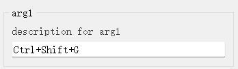
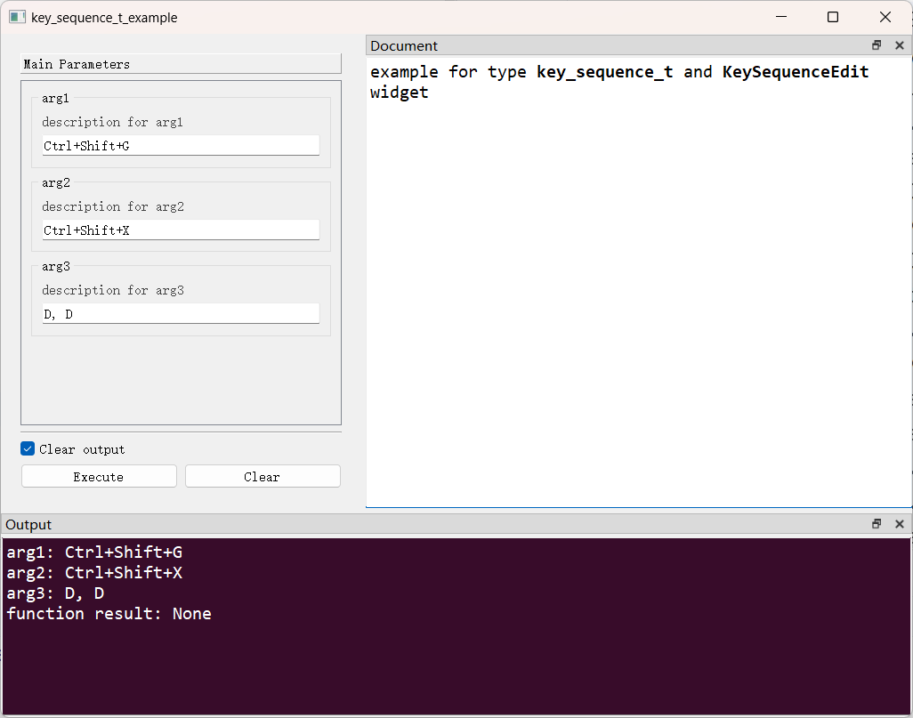

# `KeySequenceEdit`控件

## 一、控件类型：`KeySequenceEdit`

> 源码: [`pyguiadapter/widgets/extend/keysequenceedit.py`]()



`key_sequence_t`扩展自`str`，代表快捷键。

## 二、配置类型：`KeySequenceEditConfig`

> 源码: [`pyguiadapter/widgets/extend/keysequenceedit.py`]()

```python
@dataclasses.dataclass(frozen=True)
class KeySequenceEditConfig(CommonParameterWidgetConfig):
    default_value: str | QKeySequence | None = ""
    key_sequence_format: KeySequenceFormat = QKeySequence.PortableText

    @classmethod
    def target_widget_class(cls) -> Type["KeySequenceEdit"]:
        return KeySequenceEdit

```

| 配置项名称            | 类型                          | 默认值                      | 说明                                              |
| --------------------- | ----------------------------- | --------------------------- | ------------------------------------------------- |
| `default_value`       | `str \| QKeySequence \| None` | `""`                        | 控件的默认值。                                    |
| `key_sequence_format` | `KeySequenceFormat`           | `QKeySequence.PortableText` | 按键序列的格式，默认为`QKeySequence.PortableText` |

> 关于按键序列的格式，可以参考QT官方文档：[Synopsis - Qt for Python](https://doc.qt.io/qtforpython-6/PySide6/QtGui/QKeySequence.html#PySide6.QtGui.QKeySequence.SequenceFormat)


## 三、示例

> 源码：[examples/widgets/key_sequence_t_example.py]()

```python
from pyguiadapter.adapter import GUIAdapter
from pyguiadapter.adapter.ucontext import uprint
from pyguiadapter.types import key_sequence_t
from pyguiadapter.widgets import KeySequenceEditConfig, KeySequenceFormat


def key_sequence_t_example(
    arg1: key_sequence_t, arg2: key_sequence_t, arg3: key_sequence_t = "Ctrl+Q"
):
    """
    example for type **key_sequence_t** and **KeySequenceEdit** widget

    @param arg1: description for arg1
    @param arg2: description for arg2
    @param arg3: description for arg3

    @params
    [arg1]
    default_value = "Ctrl+Shift+V"

    @end
    """
    uprint("arg1:", arg1)
    uprint("arg2:", arg2)
    uprint("arg3:", arg3)


if __name__ == "__main__":
    arg2_conf = KeySequenceEditConfig(default_value="Ctrl+Alt+D")

    arg3_conf = KeySequenceEditConfig(
        default_value="Ctrl+Alt+D", key_sequence_format=KeySequenceFormat.NativeText
    )
    adapter = GUIAdapter()
    adapter.add(
        key_sequence_t_example,
        widget_configs={
            "arg2": arg2_conf,
            "arg3": arg3_conf,
        },
    )
    adapter.run()

```



---

[参数数据类型及其对应控件](widgets/types_and_widgets.md)