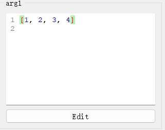

# `ListEdit`控件

## 一、控件类型：`ListEdit`

> 源码: [`pyguiadapter/widgets/basic/listedit.py`]()


`ListEdit`是[`PyLiteralEdit`](widgets/any.md)的子类，主要用于Python列表类型数据的输入，是`list`、`typing.List`等类型的函数参数的默认输入控件。

   

## 二、配置类型：`ListEditConfig`

> 源码: [`pyguiadapter/widgets/basic/listedit.py`]()

```python
@dataclasses.dataclass(frozen=True)
class ListEditConfig(PyLiteralEditConfig):
    default_value: list | None = dataclasses.field(default_factory=list)
    initial_text: str = "[]"

    @classmethod
    def target_widget_class(cls) -> Type["ListEdit"]:
        return ListEdit
```

| 配置项名称      | 类型           | 默认值 |
| --------------- | -------------- | ------ |
| `default_value` | `list \| None` | `[]`   |

`ListEditConfig`继承自[`PyLiteralEditConfig`](widgets/any.md)，其可配置项，可以参考：

- [`PyLiteralEditConfig`](widgets/any.md)
- [`BaseCodeEditConfig`](widgets/base_code_edit.md)


## 三、示例

> 源码：[examples/widgets/list_example.py]()

```python
from typing import List

from pyguiadapter.adapter import GUIAdapter
from pyguiadapter.adapter.ucontext import uprint


def list_example(arg1: list, arg2: List, arg3: list):
    """
    example for **ListEdit** for **list-like** types

    @params

    [arg1]
    default_value = [1,2,3,4]

    [arg2]
    default_value = ["a", "b", 3, "d"]

    @end
    """
    uprint("arg1: ", arg1)
    uprint("arg2: ", arg2)
    uprint("arg3: ", arg3)


if __name__ == "__main__":
    arg3_conf = {
        "default_value": [1, 2, 3, [1, 2, 3, 4]],
    }
    adapter = GUIAdapter()
    adapter.add(
        list_example,
        widget_configs={
            "arg3": arg3_conf,
        },
    )
    adapter.run()

```


---

[参数数据类型及其对应控件](widgets/types_and_widgets.md)