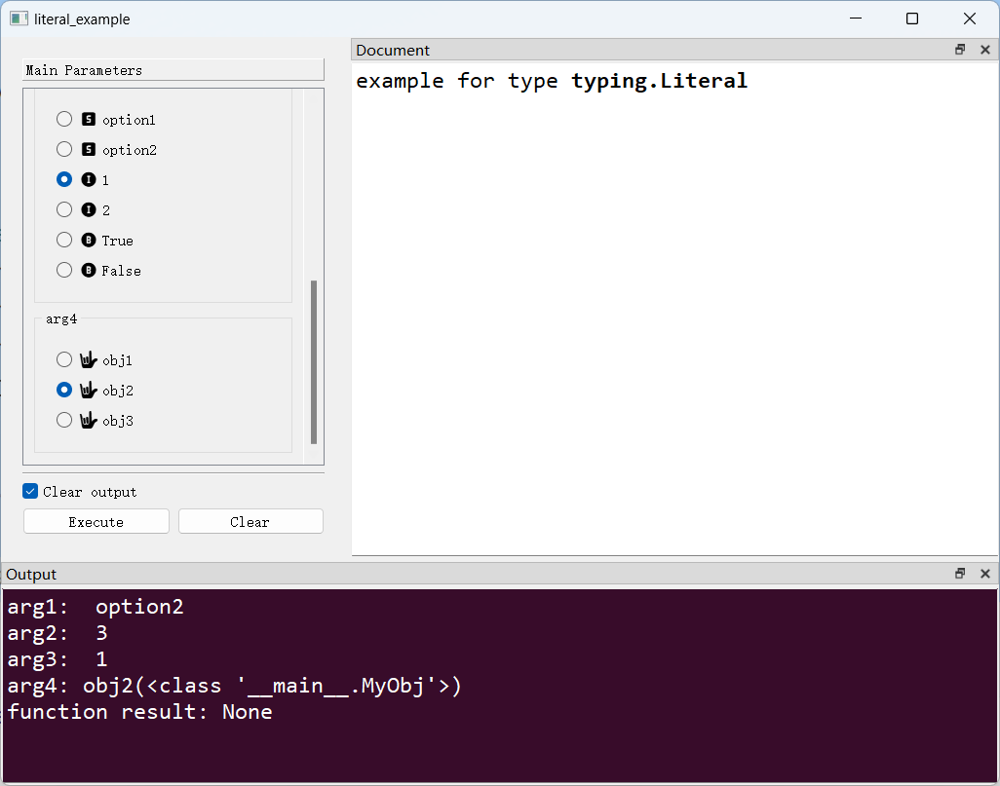

# `typing.Literal`类型及`ExclusiveChoiceBox`控件

## 一、控件类型：typing.Literal

> 源码：[pyguiadapter/widgets/extend/exclusivechoice.py]()

用于`typing.Literal`类型数据的输入，是`typing.Literal`类型参数的默认控件。用于从`typing.Literal`类型参数提供的一组选项中选择一个选项。

> 关于`typing.Literal`，可以参考官方文档中的说明：[typing — Support for type hints — Python 3.8.20 documentation](https://docs.python.org/3.8/library/typing.html#typing.Literal)


## 二、配置类型：ExclusiveChoiceBox

> 源码：[pyguiadapter/widgets/extend/exclusivechoice.py]() 

```python
@dataclasses.dataclass(frozen=True)
class ExclusiveChoiceBoxConfig(CommonParameterWidgetConfig):
    default_value: Any = _FIRST_OPTION
    choices: List[Any] | None = None
    columns: int = 1
    show_type_icon: bool = True
    int_icon: utils.IconType = "mdi6.alpha-i-circle"
    bool_icon: str = "mdi6.alpha-b-circle"
    str_icon: str = "mdi6.alpha-s-box"
    object_icon: str_icon = "mdi6.alpha-o-box"
    icon_size: Tuple[int, int] | int | QSize | None = None

```

|    配置项名称    |                   类型                    |         默认值          |                             说明                             |
| :--------------: | :---------------------------------------: | :---------------------: | :----------------------------------------------------------: |
| `default_value`  |                   `Any`                   |     `_FIRST_OPTION`     | 控件默认值，默认为`_FIRST_OPTION`，为`_FIRST_OPTION`是一个特殊对象，表示选择第一个选项。 |
|    `choices`     |            `List[Any] \| None`            |         `None`          | 可供选择的所有选项。如果将此控件用于`typing.Literal`类型的参数，则此选项应设置为`None`，此时`PyGUIAdapter`会自动获取所有给定的字面量，将其作为`choices`的值。默认`None`。 |
|    `columns`     |                   `int`                   |           `1`           | 指定每一行放置多少个选项，默认为`1`，即每行一个选项（或者说每个选项占一行）。 |
| `show_type_icon` |                  `bool`                   |         `True`          | 指定是否显示每个选项的数据类型对应的图标，默认为`True`。`show_type_icon`可以用于`choices`中混合了多种类型数据的值的场景。 |
|    `int_icon`    |             `utils.IconType`              | `"mdi6.alpha-i-circle"` | `int`类型选项的图标，默认为`"mdi6.alpha-i-circle"`  |
|   `bool_icon`    |             `utils.IconType`              | `"mdi6.alpha-b-circle"` | `bool`类型选项的图标，默认为`"mdi6.alpha-b-circle"`  |
|    `str_icon`    |             `utils.IconType`              |  `"mdi6.alpha-s-box"`   | `str`类型选项的图标，默认为`"mdi6.alpha-s-box"`  |
|  `object_icon`   |             `utils.IconType`              |  `"mdi6.alpha-o-box"`   | `int`、`bool`、`str`以外其他类型的选项的图标，默认为`"mdi6.alpha-o-box"`  |
|   `icon_size`    | `Tuple[int, int] \| int \| QSize \| None` |         `None`          |        图标的尺寸。默认为`None`，即保持系统默认大小。        |

> 注意：如果要将自定义对象作为`choices`，则该对象需要实现`__hash__()`和`__eq__()`两个方法，下面的示例将演示这一点

> 关于图标的使用，请参考[这篇文章](widgets/types_and_widgets.md)。

## 三、示例

> 源码：[examples/widgets/literal_example.py]()


```python
from typing import Literal

from pyguiadapter.adapter import GUIAdapter
from pyguiadapter.adapter.ucontext import uprint
from pyguiadapter.widgets import ExclusiveChoiceBoxConfig


class MyObj(object):
    def __init__(self, name: str):
        self._name = name

    def __str__(self):
        return self._name

    def __eq__(self, other):
        if isinstance(other, MyObj):
            return other._name == self._name
        return False

    def __hash__(self):
        return hash(self._name)


my_objects = [MyObj("obj1"), MyObj("obj2"), MyObj("obj3")]


def literal_example(
    arg1: Literal["option1", "option2", "option3"] = "option2",
    arg2: Literal[1, 2, 3, 4, 5] = 3,
    arg3: Literal["option1", "option2", 1, 2, True, False] = 1,
    arg4: MyObj = my_objects[0],
):
    """
    example for type **typing.Literal**
    """
    uprint("arg1: ", arg1)
    uprint("arg2: ", arg2)
    uprint("arg3: ", arg3)
    uprint(f"arg4: {arg4}({type(arg4)})")


if __name__ == "__main__":
    arg4_conf = ExclusiveChoiceBoxConfig(
        # this will override the default value defined in the function signature
        default_value=my_objects[1],
        choices=my_objects,
        object_icon="ei.asl",
    )
    adapter = GUIAdapter()
    adapter.add(literal_example, widget_configs={"arg4": arg4_conf})
    adapter.run()

```


下图展示了`ExclusiveChoiceBox`对于自定义对象选项的支持：



---

[参数数据类型及其对应控件](widgets/types_and_widgets.md)