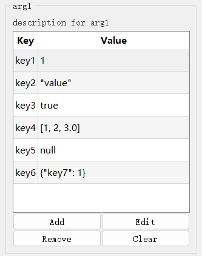
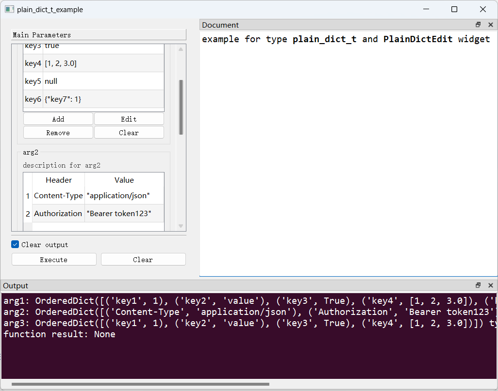

# `PlainDictEdit`控件

## 一、控件类型：`PlainDictEdit`

> 源码: [`pyguiadapter/widgets/extend/plaindict.py`]()



`plain_dict_t`类型扩展自`dict`，用于`Dict[key, int|bool|float|str|list|dict]`类型数据的输入。

## 二、配置类型：`PlainDictEditConfig`

> 源码: [`pyguiadapter/widgets/extend/plaindict.py`]()

```python
@dataclasses.dataclass(frozen=True)
class PlainDictEditConfig(CommonParameterWidgetConfig):
    default_value: Dict[str, Any] | None = dataclasses.field(default_factory=dict)
    edit_button_text: str = "Edit"
    add_button_text: str = "Add"
    remove_button_text: str = "Remove"
    clear_button_text: str = "Clear"
    key_header: str = "Key"
    value_header: str = "Value"
    show_grid: bool = True
    grid_style: GridStyle = GridStyle.SolidLine
    alternating_row_colors: bool = True
    text_elide_mode: TextElideMode = TextElideMode.ElideRight
    corner_button_enabled: bool = True
    vertical_header_visible: bool = False
    horizontal_header_visible: bool = True
    min_height: int = 260
    confirm_remove: bool = True
    warning_dialog_title: str = "Warning"
    no_item_message: str = "No item has been added!"
    no_selection_message: str = "No item selected!"
    confirm_dialog_title: str = "Confirm"
    remove_item_message: str = "Are you sure to remove the selected item(s)?"
    clear_items_message: str = "Are you sure to clear all items?"
    edit_item_title: str = "Edit - {}"
    add_item_title: str = "Add Item"
    editor_size: Tuple[int, int] = (500, 400)

    @classmethod
    def target_widget_class(cls) -> Type["PlainDictEdit"]:
        return PlainDictEdit

```

| 配置项名称                  | 类型                     | 默认值                                           | 说明                        |
| --------------------------- | ------------------------ | ------------------------------------------------ | --------------------------- |
| `default_value`             | `Dict[str, Any] \| None` | `{}`                                             | 控件的默认值。              |
| `edit_button_text`          | `str`                    | `"Edit"`                                         | 编辑按钮显示的文本。        |
| `add_button_text`           | `str`                    | `"Add"`                                          | 添加按钮显示的文本。        |
| `remove_button_text`        | `str`                    | `"Remove"`                                       | 移除按钮显示的文本。        |
| `clear_button_text`         | `str`                    | `"Clear"`                                        | 清除按钮显示的文本。        |
| `key_header`                | `str`                    | `"Key"`                                          | key列的表头名称。           |
| `value_header`              | `str`                    | `"Value"`                                        | value列的标题名称。         |
| `show_grid`                 | `bool`                   | `True`                                           | 是否显示网格线。            |
| `grid_style`                | `GridStyle`              | `GridStyle.SolidLine`                            | 网格线的样式。              |
| `alternating_row_colors`    | `bool`                   | `True`                                           | 是否交替显示行的颜色。      |
| `text_elide_mode`           | `TextElideMode`          | `TextElideMode.ElideRight`                       | 文本省略模式。              |
| `corner_button_enabled`     | `bool`                   | `True`                                           | 是否启用边角按钮。          |
| `vertical_header_visible`   | `bool`                   | `False`                                          | 是否显示垂直表头。          |
| `horizontal_header_visible` | `bool`                   | `True`                                           | 是否显示水平表头。          |
| `min_height`                | `int`                    | `260`                                            | 控件的最小高度。            |
| `confirm_remove`            | `bool`                   | `True`                                           | 在移除条目前是否再次确认。  |
| `warning_dialog_title`      | `str`                    | `"Warning"`                                      | 警告对话框的标题。          |
| `no_item_message`           | `str`                    | `"No item has been added!"`                      | 未添加条目时的警告信息。    |
| `no_selection_message`      | `str`                    | `"No item selected!"`                            | 未选中条目时的警告信息。    |
| `confirm_dialog_title`      | `str`                    | `"Confirm"`                                      | 确认对话框的标题。          |
| `remove_item_message`       | `str`                    | `"Are you sure to remove the selected item(s)?"` | 移除条目时的确认信息。      |
| `clear_items_message`       | `str`                    | `"Are you sure to clear all items?"`             | 清除条目时的确认信息。      |
| `edit_item_title`           | `str`                    | `"Edit - {}"`                                    | 编辑条目对话框的标题。      |
| `add_item_title`            | `str`                    | `"Add Item"`                                     | 添加条目对话框的标题。      |
| `editor_size`               | `Tuple[int, int]`        | `(500, 400)`                                     | 添加/编辑条目对话框的尺寸。 |

## 三、示例

> 源码：[examples/widgets/plain_dict_t_example.py]()

```python
from pyguiadapter.adapter import GUIAdapter
from pyguiadapter.adapter.ucontext import uprint
from pyguiadapter.widgets import PlainDictEditConfig
from pyguiadapter.types import plain_dict_t


def plain_dict_t_example(arg1: plain_dict_t, arg2: plain_dict_t, arg3: plain_dict_t):
    """
    example for type **plain_dict_t** and **PlainDictEdit** widget

    @param arg1: description for arg1
    @param arg2: description for arg2
    @param arg3: description for arg3

    @params
    [arg3]
    default_value = {key1=1,key2="value",key3=true,key4=[1,2,3.0]}
    @end

    """
    uprint("arg1:", arg1, "type: ", type(arg1))
    uprint("arg2:", arg2, "type: ", type(arg2))
    uprint("arg3:", arg3, "type: ", type(arg3))


if __name__ == "__main__":
    arg1_conf = PlainDictEditConfig(
        default_value={
            "key1": 1,
            "key2": "value",
            "key3": True,
            "key4": [1, 2, 3.0],
            "key5": None,
            "key6": {"key7": 1},
        }
    )
    arg2_conf = PlainDictEditConfig(
        default_value={
            "Content-Type": "application/json",
            "Authorization": "Bearer token123",
        },
        key_header="Header",
        value_header="Value",
        vertical_header_visible=True,
    )
    adapter = GUIAdapter()
    adapter.add(
        plain_dict_t_example, widget_configs={"arg1": arg1_conf, "arg2": arg2_conf}
    )
    adapter.run()

```



---

[参数数据类型及其对应控件](widgets/types_and_widgets.md)