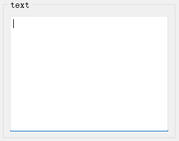
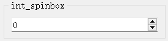
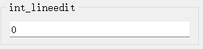
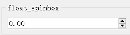
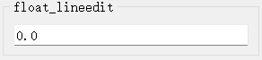
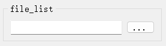
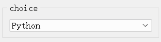
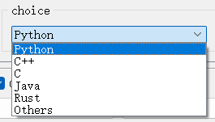
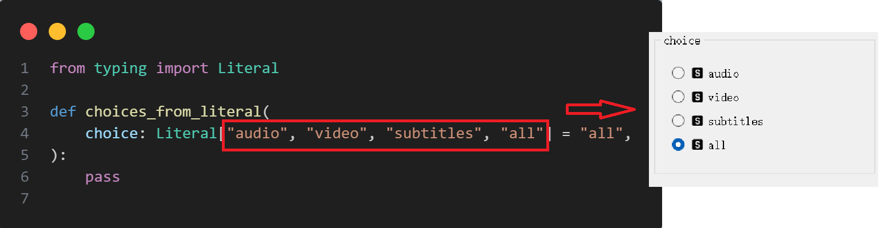
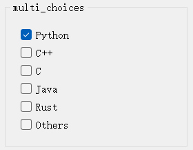

# 语义化类型

这里对一些常用的语义化类型做一个简要的介绍，更多的信息可以查看[`pyguiadapter.types`](../../pyguiadapter/types.py)模块。

## 一、text_t

该类型本质上是`str`类型的“别名”，但与`str`不同，`text_t`会为用户生成一个多行文本输入框，以支持输入长文本。

## 二、int_t

该类型本质上是`int`类型的“别名”。与`int`不同，`int`类型默认将生成一个类似SpinBox样式的控件，而`int_t`会生成一个类似单行文本输入框的控件，
但它限制了输入的格式，只允许输入整数。

`int`:

`int_t`:

## 三、float_t
该类型本质上是`float`类型的“别名”，但与`float`不同，`float_t`会生成一个类似SpinBox样式的控件，以支持输入浮点数，而`float_t`类型则会生成
一个被限制只能输入浮点数的单行文本输入框。

`float`:

`float_t`:

## 四、file_list_t
该类型本质上是一个list[str]，允许用户选择一个或多个文件，并将这些文件的路径添加到一个列表中

## 五、choice_t
该类型代表一组特定选项中的一个，该类型是对`object`的扩展，或者说对任意类型（Any）的扩展，因此，选项的类型可以是字符串、整数、浮点数或者是任何
实现了`__str__`方法的类型。

PyGUIAdapter会为`choice_t`类型生成一个下拉列表控件，用户需要额外提供一个列表（list[Any]）作为可供选择的选项， 其中各个选项所显示的名称
由str()方法得到。

### Tip: ExclusiveChoiceBox for typing.Literal
在PyGUIAdapter有一个类似的控件类型，该控件也被用于从一组选项中选择一个，名称为[`ExclusiveChoiceBox`](../../pyguiadapter/widgets/extend/exclusivechoice.py)，

不过，它所对应的是python中的`typing.Literal`，它巧妙地利用`Literal`中包含的选项信息，从而实现了无需用户额外提供选项列表。它的使用方式及效果
如下：

## 六、choices_t

是对`List[Any]`扩展，语义上表示从一组选项中选择多个已选项列表，当然，已选择的选项数量可以为0或者1，但无论选项数量如何，该控件最终都会返回一个`list`。
与`choice_t`类似，选项的类型可以是字符串、整数、浮点数或者是任何实现了`__str__`方法的类型。

