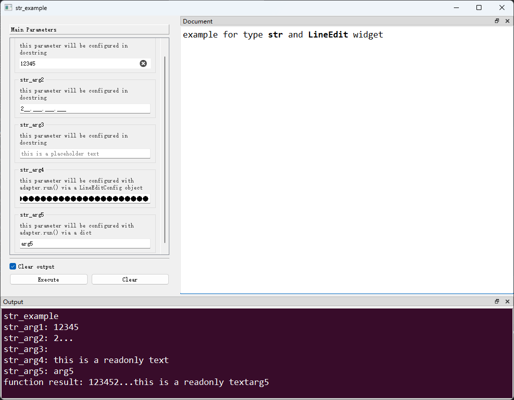
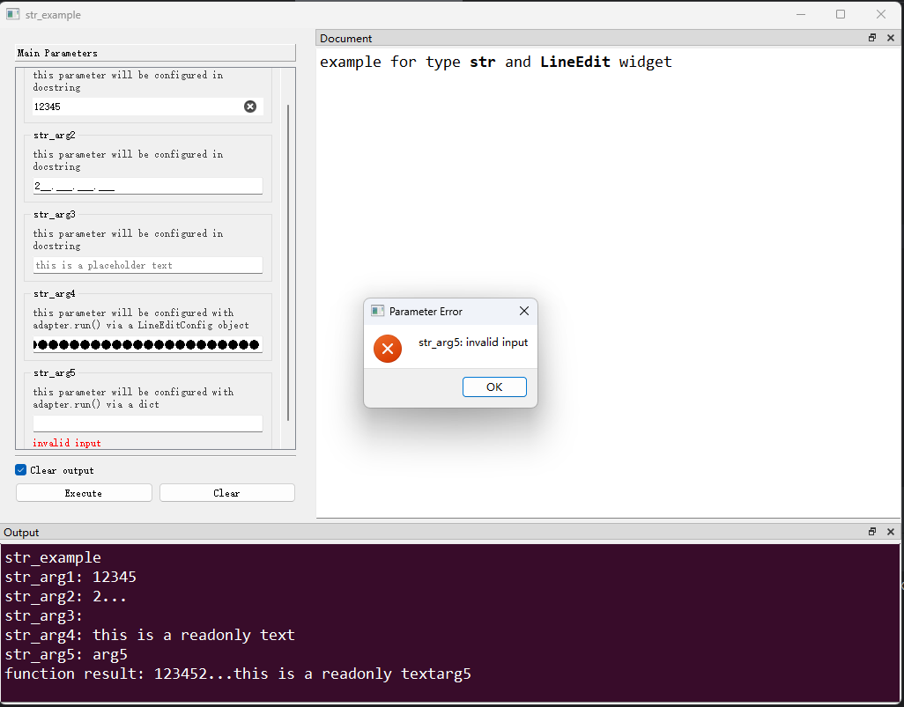

# `str`类型及`LineEdit`控件

## 一、控件类型：IntSpinBox

> 源码：[pyguiadapter/widgets/basic/lineedit.py]()

用于`str`类型数据的输入，是`str`类型参数的默认控件。


## 二、配置类型：IntSpinBoxConfig

> 源码：[pyguiadapter/widgets/basic/lineedit.py]() 

```python
EchoMode = QLineEdit.EchoMode
Alignment = Qt.Alignment


@dataclasses.dataclass(frozen=True)
class LineEditConfig(CommonParameterWidgetConfig):
    default_value: str | None = ""
    placeholder: str = ""
    clear_button_enabled: bool = False
    echo_mode: EchoMode | None = None
    alignment: Alignment | None = None
    input_mask: str | None = None
    max_length: int | None = None
    validator: QValidator | str | None = None
    drag_enabled: bool = True
    frame: bool = True
    readonly: bool = False
```


|       配置项名称       |            类型             | 默认值  |                             说明                             |
| :--------------------: | :-------------------------: | :-----: | :----------------------------------------------------------: |
|    `default_value`     |        `str \| None`        |  `""`   |                         控件默认值。                         |
|     `placeholder`      |            `str`            |  `""`   |               当输入框无内容时显示的占位文本。               |
| `clear_button_enabled` |           `bool`            | `False` |                     是否显示`清除`按钮。                     |
|      `echo_mode`       |     `EchoMode \| None`      | `None`  | 输入框的回显模式。回显模式决定如何向用户显示（或回显）在输入框中输入的文本。为`None`时使用系统默认值（Normal）。默认为`None`。更多回显模式参考：[回显模式](https://doc.qt.io/qtforpython-6/PySide6/QtWidgets/QLineEdit.html#PySide6.QtWidgets.QLineEdit.EchoMode)。 |
|      `alignment`       |     `Alignment \| None`     | `None`  | 输入框文本对齐方式。为`None`时使用系统默认值（`水平居左+垂直居中`），默认为`None`。更多对齐方式参考：[对齐方式](https://doc.qt.io/qtforpython-6/PySide6/QtWidgets/QLineEdit.html#PySide6.QtWidgets.QLineEdit.alignment)。 |
|      `input_mask`      |        `str \| None`        | `None`  | 输入掩码，可以使用该参数对用户可虽然的参数做限制。为`None`时，表示不使用输入掩码。默认为`None`。 |
|      `max_length`      |        `int \| None`        | `None`  | 允许的最大文本长度，如果文本太长，则会在限制处截断。如果发生截断，则将取消选择任何选定的文本，光标位置设置为 0，并显示字符串的第一部分。如果设置了输入掩码，则由输入掩码定义最大文本长度。为`None`使用系统默认值（32767），默认为`None`。 |
|      `validator`       | `QValidator \| str \| None` | `None`  | 输入文本的验证器，可以为`QValidator`，也可以为字符串。当设置为字符串时，该字符串为正则表达式。为`None`时表示不设置验证器。 |
|     `drag_enabled`     |           `bool`            | `True`  |               是否允许用户拖动当前选中的文本。               |
|        `frame`         |           `bool`            | `True`  |                 是否绘制文本输入框外围边框。                 |
|       `readonly`       |           `bool`            | `False` | 是否将输入框设置为只读模式。在只读模式下，用户仍可以将文本复制到剪贴板，或拖放文本，但不能对其进行编辑。只读模式下将不显示光标。 |

> 输入掩码（input_mask）是一个模板字符串，由三种字符组成：掩码字符（Mask Characters）、元字符（Meta Characters）和分隔符（Separators）。
>
> 一些输入掩码示例（来源[qt官方文档](https://doc.qt.io/qtforpython-6/PySide6/QtWidgets/QLineEdit.html#PySide6.QtWidgets.QLineEdit.inputMask))
>
> | Mask                               | Notes                                                        |
> | ---------------------------------- | ------------------------------------------------------------ |
> | `000.000.000.000;_`                | IP address; blanks are `_`.                                  |
> | `HH:HH:HH:HH:HH:HH;_`              | MAC address                                                  |
> | `0000-00-00`                       | ISO Date; blanks are `space`                                 |
> | `>AAAAA-AAAAA-AAAAA-AAAAA-AAAAA;#` | License number; blanks are `#` and all (alphabetic) characters are converted to |
>
> 关于输入掩码的更多细节，可以参考：[Synopsis - Qt for Python](https://doc.qt.io/qtforpython-6/PySide6/QtWidgets/QLineEdit.html#PySide6.QtWidgets.QLineEdit.inputMask)


## 三、示例

> 源码：[examples/widgets/str_example.py]()


```python

```




当输入值不符合设置的`validator`时，将引发`ParameterError`并提示用户：




---

[参数数据类型及其对应控件](widgets/types_and_widgets.md)