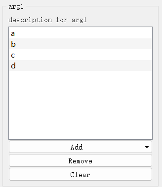
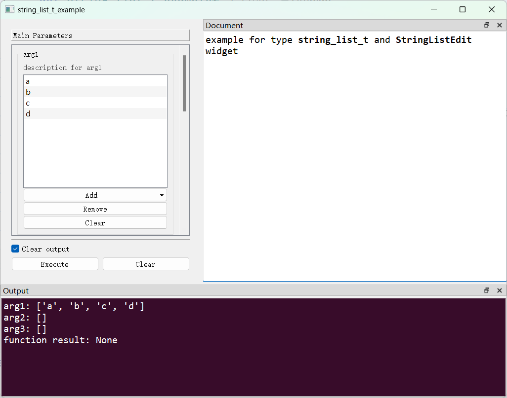

# `StringListEdit`控件

## 一、控件类型：`StringListEdit`

> 源码: [`pyguiadapter/widgets/extend/stringlist.py`]()



`string_list_t`扩展自`list`，用于`List[str]`类型数据的输入。

## 二、配置类型：`StringListEditConfig`

> 源码: [`pyguiadapter/widgets/extend/stringlist.py`]()

```python
@dataclasses.dataclass(frozen=True)
class StringListEditConfig(CommonParameterWidgetConfig):
    default_value: List[str] | None = dataclasses.field(default_factory=list)
    empty_string_strategy: Literal["keep_all", "keep_one", "remove_all"] = "remove_all"
    add_file: bool = True
    add_dir: bool = True
    file_filters: str = ""
    start_dir: str = ""
    normalize_path: bool = True
    add_button_text: str = "Add"
    remove_button_text: str = "Remove"
    clear_button_text: str = "Clear"
    add_string_hint: str = "Add Text"
    add_file_hint: str = "Add File"
    add_dir_hint: str = "Add Directory"
    file_dialog_title: str = "Select File"
    dir_dialog_title: str = "Select Directory"
    confirm_dialog_title: str = "Confirm"
    warning_dialog_title: str = "Warning"
    remove_confirm_message: str = "Are you sure to remove the selected item(s)?"
    clear_confirm_message: str = "Are you sure to clear all of the items?"
    no_selection_message: str = "No items are selected!"
    min_height: int = 230
    drag_enabled: bool = True
    wrapping: bool = False
    text_elide_mode: TextElideMode = TextElideMode.ElideLeft
    alternating_row_colors: bool = True
    confirm_remove: bool = True

    @classmethod
    def target_widget_class(cls) -> Type["StringListEdit"]:
        return StringListEdit

```

| 配置项名称               | 类型                                              | 默认值                                           | 说明                                |
| ------------------------ | ------------------------------------------------- | ------------------------------------------------ | ----------------------------------- |
| `default_value`          | `List[str] \| None`                               | `[]`                                             | 控件的默认值。                      |
| `empty_string_strategy`  | `Literal[('keep_all', 'keep_one', 'remove_all')]` | `"remove_all"`                                   | 指示如何处理列表中的空字符串。      |
| `add_file`               | `bool`                                            | `True`                                           | 是否启用添加文件路径功能。          |
| `add_dir`                | `bool`                                            | `True`                                           | 是否启用添加目录路径功能。          |
| `file_filters`           | `str`                                             | `""`                                             | 选择文件/目录对话框的文件名过滤器。 |
| `start_dir`              | `str`                                             | `""`                                             | 选择文件/目录对话框的起始路径。     |
| `normalize_path`         | `bool`                                            | `True`                                           | 是否正规化所选的路径。              |
| `add_button_text`        | `str`                                             | `"Add"`                                          | 添加条目按钮的文本。                |
| `remove_button_text`     | `str`                                             | `"Remove"`                                       | 移除条目按钮的文本。                |
| `clear_button_text`      | `str`                                             | `"Clear"`                                        | 清除条目按钮的文本。                |
| `add_string_hint`        | `str`                                             | `"Add Text"`                                     | 添加普通字符串的提示文本。          |
| `add_file_hint`          | `str`                                             | `"Add File"`                                     | 添加文件路径的提示文本。            |
| `add_dir_hint`           | `str`                                             | `"Add Directory"`                                | 添加目录路径的提示文本。            |
| `file_dialog_title`      | `str`                                             | `"Select File"`                                  | 选择文件对话框标题。                |
| `dir_dialog_title`       | `str`                                             | `"Select Directory"`                             | 选择路径对话框标题。                |
| `confirm_dialog_title`   | `str`                                             | `"Confirm"`                                      | 确认对话框的标题。                  |
| `warning_dialog_title`   | `str`                                             | `"Warning"`                                      | 警告对话的标题。                    |
| `remove_confirm_message` | `str`                                             | `"Are you sure to remove the selected item(s)?"` | 移除条目时的确认信息。              |
| `clear_confirm_message`  | `str`                                             | `"Are you sure to clear all of the items?"`      | 清除条目时的确认信息。              |
| `no_selection_message`   | `str`                                             | `"No items are selected!"`                       | 未选择条目时的警告信息。            |
| `min_height`             | `int`                                             | `230`                                            | 控件最小高度。                      |
| `drag_enabled`           | `bool`                                            | `True`                                           | 是否启用拖拽条目的功能。            |
| `wrapping`               | `bool`                                            | `False`                                          | 是否启用包裹模式。                  |
| `text_elide_mode`        | `TextElideMode`                                   | `0`                                              | 文本省略模式。                      |
| `alternating_row_colors` | `bool`                                            | `True`                                           | 是否交替显示行的颜色。              |
| `confirm_remove`         | `bool`                                            | `True`                                           | 在移除条目前是否进行确认。          |

## 三、示例

> 源码：[examples/widgets/string_list_t_example.py]()

```python
from pyguiadapter.adapter import GUIAdapter
from pyguiadapter.adapter.ucontext import uprint
from pyguiadapter.widgets import StringListEditConfig
from pyguiadapter.types import string_list_t


def string_list_t_example(
    arg1: string_list_t,
    arg2: string_list_t,
    arg3: string_list_t,
):
    """
    example for type **string_list_t** and **StringListEdit** widget

    @param arg1: description for arg1
    @param arg2: description for arg2
    @param arg3: description for arg3

    @params
    [arg1]
    default_value = ["a", "b", "c", "d"]
    add_file = true
    add_dir = false
    file_filters = "Python files(*.py);;Text files(*.txt)"

    @end

    """
    uprint("arg1:", arg1)
    uprint("arg2:", arg2)
    uprint("arg3:", arg3)


if __name__ == "__main__":
    arg2_conf = StringListEditConfig(add_file=False, add_dir=True)
    arg3_conf = StringListEditConfig(add_file=False, add_dir=False)
    adapter = GUIAdapter()
    adapter.add(
        string_list_t_example, widget_configs={"arg2": arg2_conf, "arg3": arg3_conf}
    )
    adapter.run()

```



---

[参数数据类型及其对应控件](widgets/types_and_widgets.md)